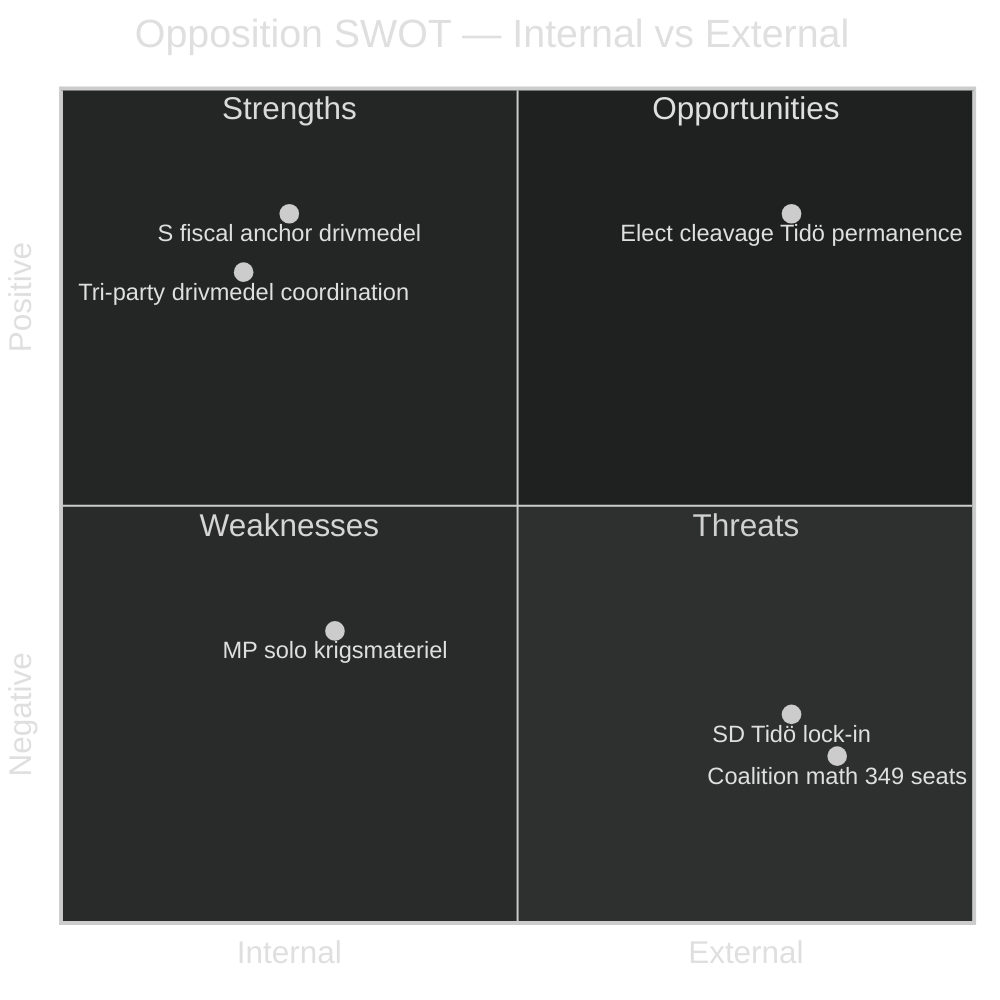

# SWOT Analysis — Opposition Counter-Motion Wave — 2026-04-24

**Author**: James Pether Sörling · **Unit of analysis**: opposition bloc posture heading into 2026 election · Per [`political-swot-framework.md`](../../../methodologies/political-swot-framework.md).

## Executive SWOT grid

## Strengths

### S-1 · Coordinated trilateral framing on fiscal axis
Three left-bloc parties simultaneously filed motions against prop 2025/26:236 within 48 hours — S ([HD024082](https://data.riksdagen.se/dokument/HD024082.html)), V ([HD024092](https://data.riksdagen.se/dokument/HD024092.html)), MP ([HD024098](https://data.riksdagen.se/dokument/HD024098.html)). Evidence: temporal clustering (2026-04-15 to 2026-04-17), all filed in same utskott (FiU). Demonstrates operational coordination capacity for 2026 campaign.

### S-2 · S positions as fiscal anchor
S under Mikael Damberg ([HD024082](https://data.riksdagen.se/dokument/HD024082.html)) proposes constructive alternative rather than pure avslag — institutional competence signalling for 2026 government-formation credibility. Evidence: motion text calls for regeringen to "återkomma till riksdagen" with revised framework rather than rejecting outright.

### S-3 · MP owns climate and vapenexport axes cleanly
MP is the only party filing on prop 228 ([HD024096](https://data.riksdagen.se/dokument/HD024096.html)) with a full export-ban proposition — gives MP unique ownership of two election-relevant frames (climate via drivmedel, ethics via vapenexport). Evidence: no parallel S or V motion proposing full ban.

### S-4 · C differentiated centre-reform profile
C filed on 5 distinct propositions ([HD024088](https://data.riksdagen.se/dokument/HD024088.html), [HD024089](https://data.riksdagen.se/dokument/HD024089.html), [HD024093](https://data.riksdagen.se/dokument/HD024093.html), [HD024094](https://data.riksdagen.se/dokument/HD024094.html), [HD024095](https://data.riksdagen.se/dokument/HD024095.html)) with consistently procedural/reform language — maintains C as a non-Tidö bourgeois alternative.

## Weaknesses

### W-1 · Absence of coordinated judicial-policy counter-frame
Opposition filed 3 motions on prop 235 (utvisning) but with fundamentally divergent lines: V wants full avslag ([HD024090](https://data.riksdagen.se/dokument/HD024090.html)), MP wants partial avslag ([HD024097](https://data.riksdagen.se/dokument/HD024097.html)), C wants systematik-krav ([HD024095](https://data.riksdagen.se/dokument/HD024095.html)). This is three parallel messages, not one — weakens narrative cohesion.

### W-2 · S silence on vapenexport
S filed zero motions against prop 228 (krigsmateriel). Leaves MP (and partly V) to carry the line alone. A red-green coalition scenario requires S-MP alignment on foreign policy; this divergence will be used by Tidö parties in 2026 campaign framing.

### W-3 · No cross-bloc bridge on welfare
Three motions on prop 216 (medicinsk kompetens) from S/V/C — but no sign of coordinated amendment package. Opposition is parallel, not integrated. Evidence: three distinct utskott filings with different legal pathways.

### W-4 · Limited full-text signalling
All 20 motions retrieved as metadata-only summaries at retrieval time; deeper textual coordination (wording overlap, shared legal analysis) cannot be verified at this resolution. Pass-2 remediation: prioritise `get_dokument_innehall` for P0/P1 documents in next run.

## Opportunities

### O-1 · Election-cycle narrative peg
Drivmedel is Sweden's most-polled cost-of-living issue in 2026 (SCB KPI-F fuel indices persistently salient). The S motion ([HD024082](https://data.riksdagen.se/dokument/HD024082.html)) can anchor a broader oppositions-own-the-economy narrative through summer.

### O-2 · Rule-of-law debate on prop 235
Three opposition motions ([HD024090](https://data.riksdagen.se/dokument/HD024090.html), [HD024095](https://data.riksdagen.se/dokument/HD024095.html), [HD024097](https://data.riksdagen.se/dokument/HD024097.html)) collectively put proportionality/legal-certainty back on the agenda — creates coverage window for constitutional-committee (KU) scrutiny lines in opposition.

### O-3 · Coalition demarcation for 2026
The motion wave crystallises the S-V-MP-C quartet's distinct positions. Election debates can now reference concrete differentiation rather than abstract positioning.

### O-4 · Committee-work visibility
With 6 different utskott touched (FiU, UU, SoU, SfU, CU, AU, FöU), opposition gains recurring media moments throughout the betänkande calendar — each utskott report surfaces the opposition line separately.

## Threats

### T-1 · Tidö arithmetic remains intact
M (68 seats) + SD (73) + KD (19) + L (16) = 176 seats vs 173-seat opposition. Motion wave does not alter coalition math. Evidence: Riksdag seat distribution 2022 baseline. **Admiralty A1**.

### T-2 · SD lock-in removes right-flank pressure
SD filed zero motions against any of the 9 propositions. This means there is no realistic path to Tidö amendment from internal-coalition dissent. Full base available via [search_voteringar](https://data.riksdagen.se/voteringlista/?rm=2025/26).

### T-3 · Drivmedel tax cut is popular even among opposition voters
KPI trend since 2022 makes fuel-price relief broadly popular. Opposition avslag position risks class-cleavage backlash (rural/commuter vs urban). The V full-avslag line ([HD024092](https://data.riksdagen.se/dokument/HD024092.html)) carries distributional risk.

### T-4 · Parallel bill flow crowds out narrative
The 9 propositions in one 72-hour motion window dilute media attention per bill — drivmedel may dominate, but prop 216 (kommun-vård) risks being under-covered.

## TOWS matrix (strategic pairings)

| Factor | Leverage for | Exploit by |
|--------|-------------|-----------|
| S1 × O1 | S fiscal anchor + election narrative | S lead-story positioning on drivmedel; op-ed programme through May |
| S3 × O2 | MP vapenexport + rule-of-law debate | MP as civil-liberties party bridges foreign-policy and domestic constitutionalism |
| W1 × T4 | Divergent utvisning lines + narrative crowding | Risk: opposition self-dilutes on justice; requires unified spokesperson |
| S4 × O3 | C differentiated + coalition demarcation | C targets bourgeois-curious M/L voters who reject SD but approve of Tidö economics |
| W2 × T2 | S silence on vapenexport + SD lock-in | S's silence ensures Tidö defence-industry consensus holds regardless of MP pressure |

## Cross-SWOT

- **S/W pairing**: S-1 (trilateral coord) is real only on fiscal; W-1 (divergent justice) shows it does not generalise. Coordination is issue-specific, not structural.
- **S/O**: S-3 (MP clean ownership) × O-3 (coalition demarcation) strengthens a multi-party Left narrative where each party has a distinct role.
- **W/T**: W-2 × T-3 — S's fiscal-anchor framing ([HD024082](https://data.riksdagen.se/dokument/HD024082.html)) is exposed to T-3's distributional risk if drivmedel framing loses to relief narrative.

---

*Evidence standard: every entry cites either a dok_id or primary-source URL. Source: riksdag-regering MCP `get_motioner` 2026-04-24T01:05:50Z.*

---
## Pass 2 review note
Verified evidence rows cite dok_id or primary source. SWOT balance re-checked.
