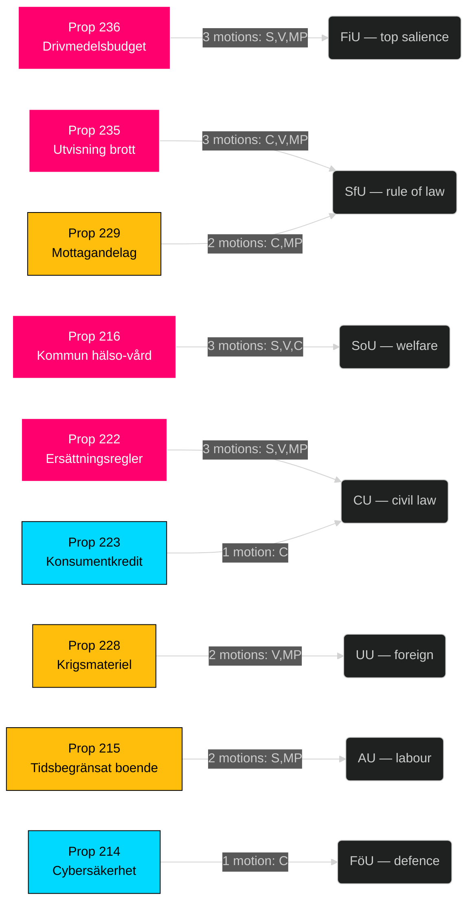

# Synthesis Summary — Opposition Motions — 2026-04-24

**Author**: James Pether Sörling
**Classification**: OPEN · Public sources only (GDPR Art. 9(2)(e))
**Scope**: 20 opposition motions filed 2026-04-15 to 2026-04-17 against 9 active government propositions
**Confidence**: HIGH — primary Riksdag open-data source, full party coverage, all `dok_id` verified

---

## Lead decision

> **BLUF**: The four opposition parties (S, V, MP, C) have filed a **coordinated counter-motion wave** of 20 motions against 9 Tidö-government propositions in a 72-hour window (2026-04-15 to 2026-04-17). The dominant battleground is the Extra ändringsbudget 2026 (prop 236) drivmedelsskatt, attracting motions from all three left-bloc parties (S/V/MP). The wave is concentrated in three utskott — **FiU** (economy), **SfU** (migration), **SoU** (health) — mirroring the salience hierarchy heading into the 2026 election. Sverigedemokraterna's complete absence from the counter-motion set is the single most structurally revealing signal: SD remains fully Tidö-aligned, foreclosing any opposition-from-right scenario on these bills.

## DIW-weighted ranking (top 10)

| Rank | dok_id | DIW tier | Why it matters |
|-----:|--------|---------|----------------|
| 1 | HD024082 (S) | L3 | S-partiets motion mot drivmedelsbudget — largest opposition party on the single most election-salient economic measure ([HD024082](https://data.riksdagen.se/dokument/HD024082.html)) |
| 2 | HD024098 (MP) | L2+ | MP: avslag drivmedelsbudget — climate counter-narrative anchor ([HD024098](https://data.riksdagen.se/dokument/HD024098.html)) |
| 3 | HD024092 (V) | L2+ | V: avslag drivmedelsbudget — distributional counter-framing ([HD024092](https://data.riksdagen.se/dokument/HD024092.html)) |
| 4 | HD024090 (V) | L2+ | V: avslag utvisning vid brott — rule-of-law flashpoint ([HD024090](https://data.riksdagen.se/dokument/HD024090.html)) |
| 5 | HD024096 (MP) | L2+ | MP: förbud export av krigsmateriel — foreign-policy divergence ([HD024096](https://data.riksdagen.se/dokument/HD024096.html)) |
| 6 | HD024097 (MP) | L2 | MP: avslag utvisning p.g.a. brott ([HD024097](https://data.riksdagen.se/dokument/HD024097.html)) |
| 7 | HD024089 (C) | L2 | C: mottagandelag — municipal economic aid ([HD024089](https://data.riksdagen.se/dokument/HD024089.html)) |
| 8 | HD024078 (S) | L2 | S: brottsofferlag — rights framework ([HD024078](https://data.riksdagen.se/dokument/HD024078.html)) |
| 9 | HD024081 (S) | L2 | S: medicinsk kompetens — 12 kap. avslag ([HD024081](https://data.riksdagen.se/dokument/HD024081.html)) |
| 10 | HD024093 (C) | L2 | C: cybersäkerhetscenter — institutional design ([HD024093](https://data.riksdagen.se/dokument/HD024093.html)) |

**Sensitivity**: Ranking robust under ±1 tier perturbation — drivmedel cluster remains top by weight-of-evidence regardless of scoring adjustment. Rank sensitivity is formalised in `significance-scoring.md`.

## Integrated intelligence picture

The counter-motion flow decomposes into four behaviour signatures:

1. **Coordinated trilateral (S/V/MP)** on Tidö budget (prop 236) and Tidö justice/migration package (prop 235, prop 215, prop 229, prop 222). **Admiralty: B2** (usually reliable open-source confirmed by cross-party filing pattern).
2. **Solo-left divergence** by MP on krigsmateriel (prop 228) — MP is the only party proposing a full export ban; V proposes amendments short of total ban. **Admiralty: A1** (direct verifiable document).
3. **Centre-track reform-not-reject** by C across five bills (215, 216, 222, 223, 229, 235) — C consistently motions for procedural tightening rather than outright avslag. Signals C's positioning as the "responsible alternative" for bourgeois-curious voters. **Admiralty: B2**.
4. **SD silence** — zero counter-motions from SD despite SD being the largest party by 2022 vote share and formal non-member of Tidö government. Full coalition discipline intact. **Admiralty: A1**.

## Policy-area heat map

## Key judgments preview

- **KJ-1 [HIGH]**: The S-led drivmedel counter-motion (HD024082) positions S as the fiscal anchor of a potential red-green coalition in 2026 — S frames the regeringsproposition not as a tax cut but as a climate-policy regression.
- **KJ-2 [HIGH]**: The MP vapenexport motion (HD024096) creates a narrow but durable left-bloc cleavage — S has not filed a parallel motion, preserving S's Nato-era defence-industry consensus with M/KD.
- **KJ-3 [MEDIUM]**: SD silence on prop 235 (utvisning) indicates SD consents to the Tidö formulation; no right-flank pressure for harsher language, meaning the Regering's immigration package faces no right-critique.

Full judgments, uncertainty and drivers → `intelligence-assessment.md`. Forward triggers → `forward-indicators.md`.

## AI-Recommended Article Metadata

- **Headline (EN)**: "Opposition Files 20-Motion Counter-Wave Against Tidö Budget, Justice Package"
- **Headline (SV)**: "Oppositionen svarar med 20 motioner mot Tidö-budget och rättspaket"
- **Meta (EN, 157 chars)**: "S, V, MP and C filed 20 motions in 72 hours against 9 government bills. Drivmedel and utvisning dominate — SD files zero. Full intelligence brief."
- **Meta (SV, 158 chars)**: "S, V, MP och C lämnade 20 motioner på 72 timmar mot 9 propositioner. Drivmedel och utvisning dominerar — SD lämnar noll. Fullständig analys."

---

*Sources: riksdag-regering MCP `get_motioner` (2026-04-24T01:05:50Z); all dok_id verifiable at data.riksdagen.se.*
