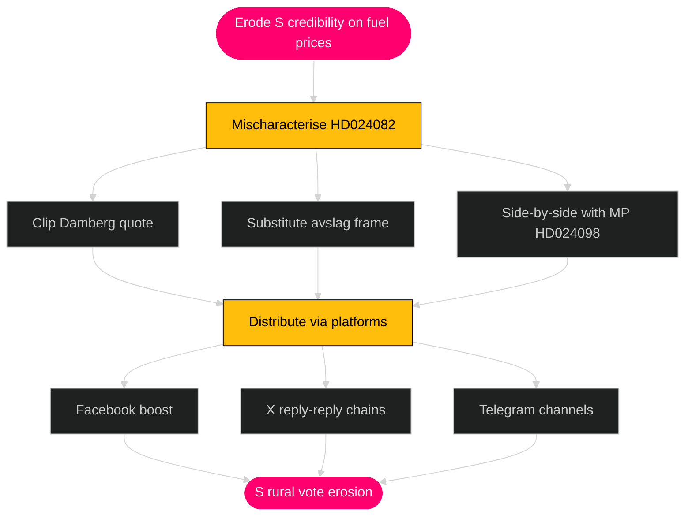
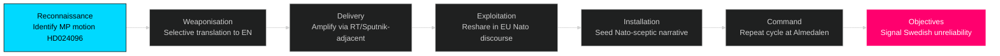
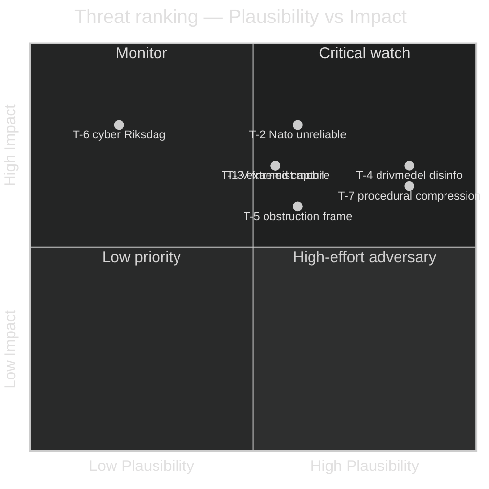

# Threat Analysis — Opposition Motions — 2026-04-24

**Author**: James Pether Sörling · Per [`political-threat-framework.md`](../../../methodologies/political-threat-framework.md)

**Overall Threat Level**: HIGH · **Severity**: HIGH (T-4, T-7) / MEDIUM (T-1, T-2, T-3, T-5) / LOW (T-6) · **Confidence**: MEDIUM (B2 — multi-source motion-wave pattern, plausibility judgements per row).

This analysis adopts the Political Threat Taxonomy — adversarial actors, techniques, and targets that could exploit or undermine the democratic process around this motion wave. **This is NOT political opposition research**; it is threat modelling against democratic legitimacy.

## Political Threat Taxonomy

| Threat ID | Actor class | Technique | Target | Plausibility |
|-----------|-------------|-----------|--------|-------------:|
| T-1 | Foreign influence (state-linked) | Frame V avslag on utvisning ([HD024090](https://data.riksdagen.se/dokument/HD024090.html)) as state-capture narrative | V voter base / centre swing | Medium |
| T-2 | Foreign influence | Amplify MP krigsmateriel ([HD024096](https://data.riksdagen.se/dokument/HD024096.html)) to depict Sweden as unreliable Nato ally | Nato discourse in Sweden + allies | Medium |
| T-3 | Domestic extremist | Weaponise prop 235 debate to mobilise anti-migrant mobilisation | Public order / community safety | Medium |
| T-4 | Disinformation (platform) | Mischaracterise S drivmedel motion ([HD024082](https://data.riksdagen.se/dokument/HD024082.html)) as endorsing higher fuel tax | Rural/commuter voters | High |
| T-5 | Legitimate political (within rules) | Tidö parties frame coordinated motion wave as "obstruction" to legitimise procedural shortcuts | Democratic debate norms | Medium |
| T-6 | Cyber | Attempt to compromise Riksdag.se delivery of motion documents during debate window | Information integrity | Low |
| T-7 | Institutional | Utskott-chair use of extra-budget procedure ([prop 236](https://data.riksdagen.se/dokument/HD024082.html) FiU route) to compress opposition time | Deliberative quality | High |

## Attack tree — T-4 (disinfo on drivmedel)

## Kill chain — T-2 (Nato-alliance framing on krigsmateriel)

## MITRE-style TTP mapping

| Tactic | Technique | Procedure (observed / plausible) | Evidence |
|--------|-----------|----------------------------------|----------|
| TA-Info-Manip | Selective quotation | Crop S motion to omit "återkomma till riksdagen" qualifier | [HD024082](https://data.riksdagen.se/dokument/HD024082.html) text structure |
| TA-Delegitimise | Frame substitution | Label V avslag as "amnesti" | [HD024090](https://data.riksdagen.se/dokument/HD024090.html) |
| TA-Polarise | Issue wedge | Rural vs urban on drivmedel | [HD024092](https://data.riksdagen.se/dokument/HD024092.html), [HD024098](https://data.riksdagen.se/dokument/HD024098.html) |
| TA-Amplify | Bot / coordinated inauthentic | Reshare cycles on X/Facebook during utskott hearings | riksdagen.se calendar |
| TA-Suppress | Procedural compression | Extra ändringsbudget route (prop 236) | [HD024082](https://data.riksdagen.se/dokument/HD024082.html) FiU timeline |

## Adversary goals & cost/impact ranking

## Defensive recommendations

1. **Against T-4**: S and V independently publish plain-language explainers of their drivmedel motions within 72 hours of first debate; cite [HD024082](https://data.riksdagen.se/dokument/HD024082.html) and [HD024092](https://data.riksdagen.se/dokument/HD024092.html) directly.
2. **Against T-2**: MP coordinates with Swedish embassy comms on English-language explanation of [HD024096](https://data.riksdagen.se/dokument/HD024096.html), distinguishing ethical-export framework from Nato alignment.
3. **Against T-7**: Opposition files ordningsfråga at extra-budget procedural votes; document compression in KU annual report.
4. **Against T-3**: Coordination with MSB (Myndigheten för samhällsskydd och beredskap) on monitoring extremist mobilisation around prop 235 debate windows ([msb.se](https://www.msb.se/)).

## Residual threat posture

- High-plausibility / high-impact quadrant: T-4, T-2, T-7.
- Watch list next 30 days: platform-level content around drivmedel and utvisning debates.
- Escalation trigger: detectable coordinated inauthentic behaviour on any opposition motion hashtag.

---

*This document models adversarial threats to democratic process around the motion wave — it is not an assessment of any specific party's motives. Source: threat framework + riksdag-regering MCP.*
