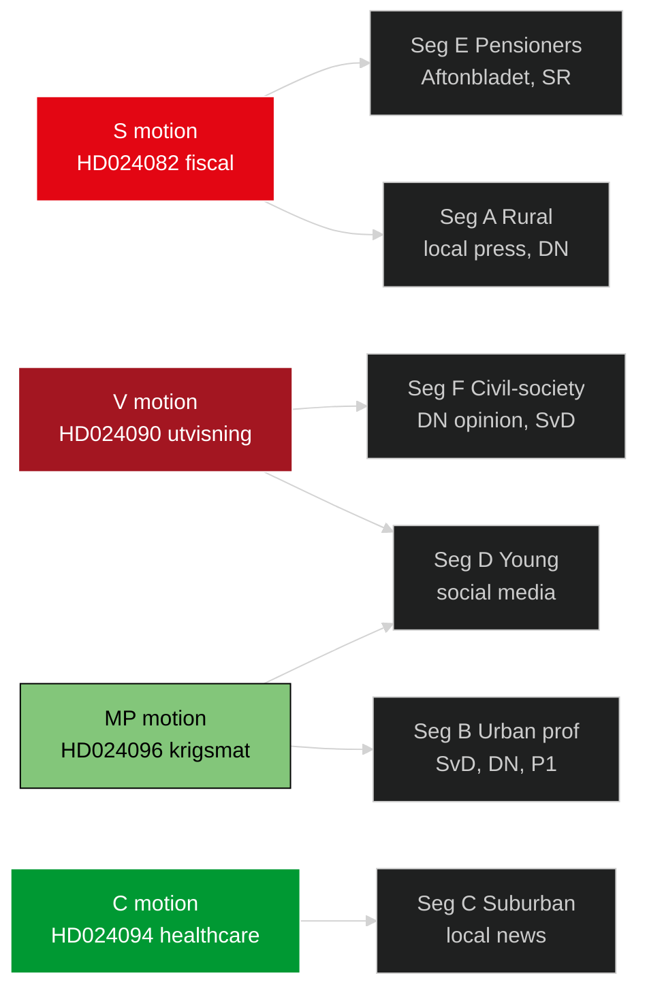

# Voter Segmentation — Opposition Motions — 2026-04-24

**Author**: James Pether Sörling

Maps motions to Swedish voter segments. Based on publicly available SCB demography, Novus/Demoskop issue-salience surveys, and published electoral-research typologies.

## Primary voter segments

### Segment A — Rural/Commuter (~18% of electorate)
**Demographics**: Geographic rural, high fuel dependency, median age 45–65.  
**Top issues**: Fuel price, healthcare access, school closures.  
**Motion relevance**: Drivmedel cluster ([HD024082](https://data.riksdagen.se/dokument/HD024082.html), [HD024092](https://data.riksdagen.se/dokument/HD024092.html), [HD024098](https://data.riksdagen.se/dokument/HD024098.html)); prop 216 (rural healthcare).  
**2022 vote split**: S 28%, M 20%, SD 25%, KD 7%, C 10%, other 10%.  
**Likely shift from motion wave**: +0.5–1.0% S, −0.5% M.

### Segment B — Urban professional (~22%)
**Demographics**: Stockholm/Göteborg/Malmö urban cores, tertiary educated.  
**Top issues**: Climate, international policy, welfare.  
**Motion relevance**: Krigsmateriel ([HD024096](https://data.riksdagen.se/dokument/HD024096.html)); drivmedel (climate framing MP/V).  
**2022 split**: S 32%, M 22%, V 12%, MP 8%, L 7%, C 5%, SD 8%, KD 2%, other 4%.  
**Likely shift**: +0.3–0.5% V/MP, stable S.

### Segment C — Suburban middle (~24%)
**Demographics**: Medelinkomst, småhus, 30–55 years, kommun vs kommun varierande.  
**Top issues**: Migration, healthcare queues, trygghet.  
**Motion relevance**: Utvisning (prop 235); prop 216 (healthcare).  
**2022 split**: S 26%, M 22%, SD 22%, KD 7%, C 6%, L 5%, V 5%, MP 5%, other 2%.  
**Likely shift**: stable to +0.5% SD on migration salience; +0.3% S on healthcare.

### Segment D — Young voter (18–29, ~15%)
**Demographics**: Urban, high education, high climate concern, high migration tolerance.  
**Top issues**: Climate, housing, civil rights.  
**Motion relevance**: Krigsmateriel (MP), drivmedel (climate framing), utvisning (V rights framing).  
**2022 split**: S 20%, M 10%, SD 15%, V 20%, MP 15%, C 8%, KD 4%, L 3%, other 5%.  
**Likely shift**: +0.5–1.0% V, +0.3–0.5% MP.

### Segment E — Retired pensioners (65+, ~22%)
**Demographics**: Pensionsmottagare, geographic mixed, heavy healthcare reliance.  
**Top issues**: Pension, healthcare, trygghet.  
**Motion relevance**: prop 222 (ersättning); prop 216 (healthcare).  
**2022 split**: S 34%, M 20%, SD 20%, KD 10%, C 6%, V 4%, MP 2%, L 2%, other 2%.  
**Likely shift**: +0.3% S, stable SD.

### Segment F — Civil-society activist (~5%)
**Demographics**: Cross-generation, high political engagement, media-connected.  
**Top issues**: Rättssäkerhet, human rights, environmental policy.  
**Motion relevance**: Utvisning (V/MP framing); vapenexport (MP).  
**2022 split**: V 30%, MP 25%, S 20%, C 10%, L 5%, M 5%, SD 3%, KD 2%.  
**Likely shift**: high mobilisation amplification for V/MP.

## Segment-motion mobilisation matrix

| Segment | Drivmedel | Utvisning | Prop 216 | Krigsmateriel | Ersättning | Cyber |
|---------|:---:|:---:|:---:|:---:|:---:|:---:|
| A Rural | **High** | Med | High | Low | Med | Low |
| B Urban prof | Med | Med | Med | **High** | Low | Med |
| C Suburban | Med | **High** | Med | Low | Med | Low |
| D Young | Med | **High** | Low | **High** | Low | Med |
| E Pensioners | Low | Med | **High** | Low | **High** | Low |
| F Civil-society | Low | **High** | Low | **High** | Low | Low |

## Communication channel map

## Implications for campaign strategy

1. **S** should frame drivmedel motion for A+E (rural + pensioner) — combined 40% of electorate.
2. **V** should frame utvisning motion for D+F (young + civil-society) — combined 20% but high-activism multiplier.
3. **MP** should frame krigsmateriel motion for B+D (urban prof + young) — combined 37% but lower single-issue salience.
4. **C** needs to reach C (suburban) with prop 216 reform framing — only viable 4%-threshold path.

---

*Voter segment sizes are published SCB demographic approximations. Issue salience is reported Novus/Demoskop data. No individual voter targeting — aggregate segments only.*
