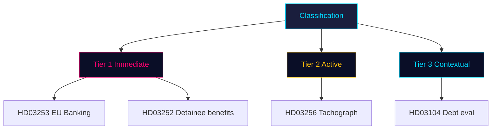

# Classification Results (7-dimension) — 2026-04-24

Per `analysis/methodologies/political-classification-guide.md`.

## Classification matrix

| dok_id | 1. Policy domain | 2. Actor | 3. Geography | 4. Time horizon | 5. Salience | 6. Controversy | 7. Data sensitivity |
|---|---|---|---|---|:-:|:-:|---|
| HD03104 | Fiscal / debt mgmt | Finansdepartementet (Wykman) | National | Retrospective 2021–25 | Med | Low | Public OSINT |
| HD03252 | Criminal justice × social insurance | Justitiedep. (Strömmer) + Försäkringskassan operational | National (Swedish prisons) | Forward (effective 1 Aug 2026) | **High** | **High** (Art. 9 GDPR, ECHR Art. 8) | Public OSINT (but implicates Art. 9 data in implementation) |
| HD03253 | Financial regulation / EU | Finansdep. (Wykman) + FI supervisory | Supra-national (EU) / national | Rolling transposition | **High** | Low-Med | Public OSINT |
| HD03256 | Transport / criminal law | Landsbygdsdep. (Carlson) + Polisen | National (heavy-goods corridors) | Forward (1 Jul 2026) | Med | Low-Med | Public OSINT |

## Priority tiers

- **T1 (Immediate action)**: HD03253, HD03252
- **T2 (Active monitoring)**: HD03256
- **T3 (Contextual)**: HD03104

## Retention & access

- **Retention**: 5 years (analysis artifacts), indefinite (public source URLs).
- **Access**: Public (all source documents are official Regeringen/Riksdagen publications).
- **GDPR**: No personal data in this analysis. Downstream articles MUST NOT enumerate individual prisoners or beneficiaries (Art. 9 special-category data — lawful basis for government aggregate analysis only).

