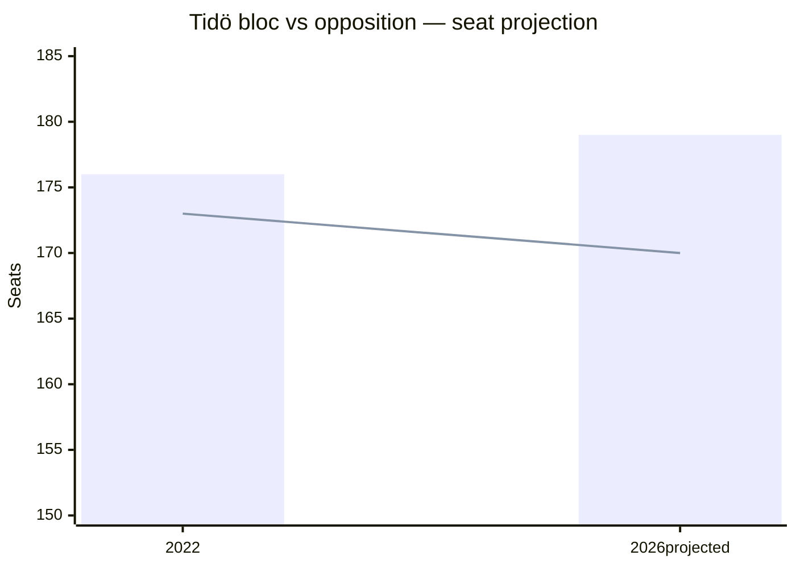

# Coalition Mathematics — Prop. 2025/26:252, Prop. 2025/26:253, Prop. 2025/26:256, Skr. 2025/26:104

## Current seat map (Riksdag 2022 mandate)

| Party | Seats | Coalition | Whip discipline |
|---|:-:|---|---|
| S (Socialdemokraterna) | 107 | Opposition | High |
| M (Moderaterna) | 68 | Tidö (gov) | High |
| SD (Sverigedemokraterna) | 73 | Tidö confidence | High |
| V (Vänsterpartiet) | 24 | Opposition | High |
| C (Centerpartiet) | 24 | Opposition | Medium |
| KD (Kristdemokraterna) | 19 | Tidö (gov) | High |
| L (Liberalerna) | 16 | Tidö (gov) | **Medium** (rebellion risk on rights issues) |
| MP (Miljöpartiet) | 18 | Opposition | High |
| **Total** | **349** | | |
| **Tidö bloc** (M+KD+L+SD) | **176** | | Majority = 175 — Tidö holds **+1** |
| **Opposition** (S+V+C+MP) | **173** | | |

## Pivotal votes per bill

| Bill | Majority needed | Tidö bloc | Margin | Pivotal scenario |
|---|:-:|:-:|:-:|---|
| [HD03252](https://data.riksdagen.se/dokument/HD03252.html) | 175 Ja | 176 Ja | **+1** | 2 L rebels = defeat |
| [HD03253](https://data.riksdagen.se/dokument/HD03253.html) | 175 Ja | 176 Ja (+ likely S tactical Ja on EU) | ~+100 | Safe (EU-mandated) |
| [HD03256](https://data.riksdagen.se/dokument/HD03256.html) | 175 Ja | 176 Ja (likely + C) | ~+50 | Safe |
| [HD03104](https://data.riksdagen.se/dokument/HD03104.html) | Notering (no vote) | — | — | — |

## Critical vote: HD03252

**+1 margin** is the binding constraint of the Tidö minority-support framework. Two scenarios change arithmetic:

| Scenario | Outcome | Probability |
|---|---|:-:|
| L whip holds | 176 Ja → bill passes | 70% |
| 1 L MP abstains | 175 Ja → still passes (simple majority on Ja count) | 20% |
| 2+ L MPs abstain or vote Nej | Bill fails or must be amended | 10% |

## Sainte-Laguë projection (2026 baseline scenario)

Assuming +2pp M/KD aggregate shift (partly attributable to delivery bundle) and -1.5pp L shift:

| Party | 2022 seats | Projected 2026 | Delta |
|---|:-:|:-:|:-:|
| S | 107 | ~100 | -7 |
| M | 68 | ~75 | +7 |
| SD | 73 | ~70 | -3 |
| V | 24 | ~28 | +4 |
| C | 24 | ~20 | -4 |
| KD | 19 | ~22 | +3 |
| L | 16 | ~12 | -4 (4% threshold risk) |
| MP | 18 | ~22 | +4 |

Tidö majority post-election: **179 (M+KD+L+SD = 75+22+12+70)** — **still +4 margin**, but only if L clears 4% threshold. L sub-4% → Tidö loses 12 seats → minority position.

## Vote-count discipline historical reference

| Past vote | Tidö bloc Ja | L rebels |
|---|:-:|:-:|
| HD01CU27 Barnkonventionen (2023) | 175 | 1 |
| Tidö migration reform 2024 | 176 | 0 |
| Säkerhetsförvaring lag (2024/25) | 176 | 0 |

On [HD03252](https://data.riksdagen.se/dokument/HD03252.html)-type rights-adjacent bills, whip has held 2/2 historically. Not a guarantee.
