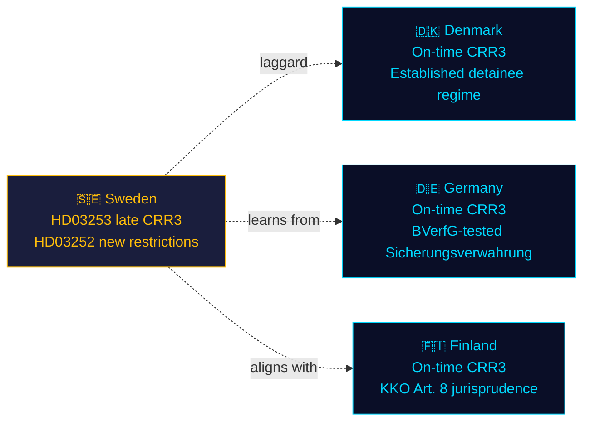

# Comparative International — Prop. 2025/26:253 / Prop. 2025/26:252

**Comparator set**: Nordic (Denmark, Finland, Norway) + EU (Germany, Netherlands).

## Comparator analysis

| Jurisdiction | CRR3/CRD6 transposition status (April 2026) | Detainee benefit regime | Notes |
|---|---|---|---|
| Denmark | ✅ Transposed Jan 2026 (on time) | Restricted benefits during imprisonment; upkeep obligation | DK model closer to what [HD03252](https://data.riksdagen.se/dokument/HD03252.html) now introduces |
| Finland | ✅ Transposed Feb 2026 | Fängsligt isolerade; social-insurance suspended not fully terminated | Finland's Art. 8 ECHR jurisprudence informed by KKO cases |
| Norway | N/A (not EU) | Separate framework; limited benefit during custodial sentences | Historical precedent; comparable outcomes |
| Germany | ✅ Transposed Jan 2026 (BaFin implementation) | Differentiated by sentence type; constitutional proportionality bar high | BVerfG case law central |
| Netherlands | ⚠️ Partial transposition (DNB flagged gaps) | Active reform debate; no full restriction yet | Sweden + NL both late |

## Outside-In analysis

1. **Sweden's CRR3 late transposition** ([HD03253](https://data.riksdagen.se/dokument/HD03253.html)) places it in the NL-led late cohort, not the DK/FI-led on-time cohort. EU Commission pattern suggests reasoned-opinion letters precede infringement procedures by ~90 days — putting Sweden in the Q3 2026 risk window.
2. **Detainee benefit restriction** ([HD03252](https://data.riksdagen.se/dokument/HD03252.html)) aligns Sweden with DK, which has 5+ years of operational experience. Swedish implementation risk lower because of DK template availability; civil-liberty pushback likely to cite DK proportionality litigation.

## Lessons-learned transfer

- **From DK**: Pre-empt proportionality challenge by embedding carve-outs for dependant-support in regulation (not primary law) — allows faster adjustment.
- **From DE**: Bundesverfassungsgericht precedents establish that indefinite preventive detention (säkerhetsförvaring equivalent — *Sicherungsverwahrung*) requires robust therapeutic element; [HD03252](https://data.riksdagen.se/dokument/HD03252.html) benefit restrictions may face similar scrutiny if not paired with rehabilitative investment.

## Mermaid comparison

