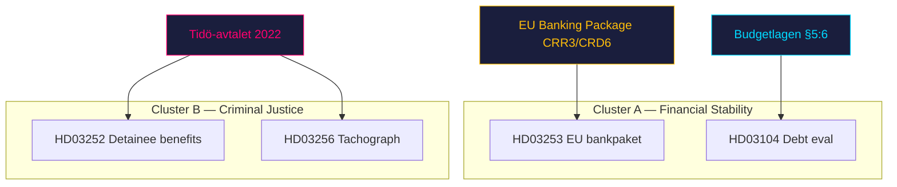

# Cross-Reference Map — 2026-04-24

## Policy clusters

### Cluster A: Financial stability & EU alignment
- [HD03253](https://data.riksdagen.se/dokument/HD03253.html) EU bankpaket (primary)
- [HD03104](https://data.riksdagen.se/dokument/HD03104.html) Statens skuldförvaltning (context)
- Linkage: Both Finansdepartementet; both position government on macro-financial credibility into 2026 election.

### Cluster B: Tidö criminal-justice operationalisation
- [HD03252](https://data.riksdagen.se/dokument/HD03252.html) Detainee benefit restriction (primary)
- [HD03256](https://data.riksdagen.se/dokument/HD03256.html) Tachograph enforcement (adjacent — expands search powers)
- Linkage: Both expand state coercive authority (HD03252 over benefits; HD03256 over search). Both carry 2026 effective dates.

## Legislative chains

| Parent reform | Today's document | Next step |
|---|---|---|
| Tidö-avtalet § straff & brott | [HD03252](https://data.riksdagen.se/dokument/HD03252.html) | SfU referral → committee report → Kammaren vote pre-recess |
| EU Banking Package CRR3/CRD6 (Brussels 2023) | [HD03253](https://data.riksdagen.se/dokument/HD03253.html) | FiU referral → hearings → vote before summer recess |
| EU Mobility Package II (2020) | [HD03256](https://data.riksdagen.se/dokument/HD03256.html) | TU referral → vote pre-1 July 2026 deadline |
| Budgetlagen §5:6 (quinquennial reporting) | [HD03104](https://data.riksdagen.se/dokument/HD03104.html) | FiU assesses; report to Kammaren |

## Coordinated-activity patterns

1. **Batch-day publication** — 4 bills same day suggests comms-coordinated release; dilutes per-bill scrutiny (documented pattern on high-agenda days at [riksdagen.se](https://data.riksdagen.se/dokument/HD03252.html)).
2. **Pre-recess enactment window** — effective dates (1 Jul HD03256, 1 Aug HD03252) require Kammaren votes by mid-June.
3. **Minister load balancing** — Wykman carries 2 (finance dossier strong); Strömmer 1 (justice high-salience); Carlson 1 (KD visibility on infra).

## Sibling-folder citations

- `analysis/daily/2026-04-23/propositions/` (if produced) — source day for 3 of 4 documents (lookback).
- `analysis/daily/2026-04-23/motions/` — check for opposition counter-motions.
- Weekly-review aggregator will consume this map to build the 2026-04-19..26 cluster view.

