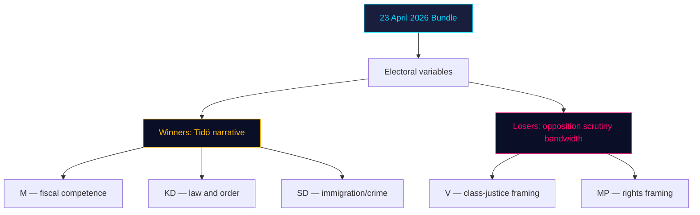

# Election 2026 Analysis — Propositions Prop. 2025/26:252, Prop. 2025/26:253, Prop. 2025/26:256, Skr. 2025/26:104

**Electoral horizon**: September 2026 Riksdag general election (~20 weeks out).

## Seat-projection deltas (qualitative)

| Bill | Likely net M/KD/L/SD effect | Likely net S/V/MP/C effect |
|---|---|---|
| [HD03252](https://data.riksdagen.se/dokument/HD03252.html) | + law-and-order narrative; KD/SD benefit most | V opposition galvanises but modest (S avoids issue) |
| [HD03253](https://data.riksdagen.se/dokument/HD03253.html) | + competence signal; M benefits | S may claim co-authorship of EU compliance |
| [HD03256](https://data.riksdagen.se/dokument/HD03256.html) | + "tough on crime" adjunct; KD/SD benefit | Marginal |
| [HD03104](https://data.riksdagen.se/dokument/HD03104.html) | + fiscal-credibility; M benefits | Potential opposition attack if data unfavourable |

Net effect: **Tidö parties gain marginal advantage from bundle** — ~0.5–1.5 percentage points in aggregate, clustered in law-and-order-sensitive voter segments. See `voter-segmentation.md`.

## Coalition viability post-election

- If Tidö parties (M, KD, L, SD) retain majority → bundle's enforcement dates (1 Jul, 1 Aug) fall before election day — "delivered" narrative available.
- If opposition (S-led) wins → probability of repeal: HD03252 **30%**, HD03253 **< 5%** (EU-mandated), HD03256 **< 10%**, HD03104 **0%** (reporting only).

## Risk to electoral delivery

- [HD03252](https://data.riksdagen.se/dokument/HD03252.html) slippage (S2 scenario, 25%) would strip Tidö's "delivered" line → estimated -0.3 pp net.
- [HD03253](https://data.riksdagen.se/dokument/HD03253.html) is election-neutral for voters but salient for elite opinion (editorial boards, business lobby).
