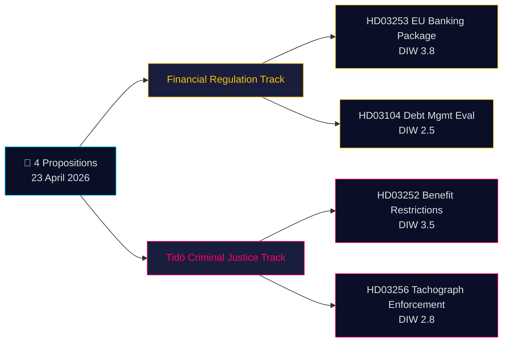

# Executive Brief — Propositions 2026-04-24 (2026-04-23 batch)

**Classification**: Public OSINT · **Confidence**: MEDIUM · **Author**: James Pether Sörling

## 🎯 BLUF

On 23 April 2026 the Kristersson government (Tidö coalition — M, KD, L + SD confidence partner) tabled **4 parliamentary documents** dominated by two strategic priorities: (1) **EU-driven financial regulation** with Prop. 2025/26:253 (EU Banking Package, CRR3/CRD6 transposition — Admiralty B2) and (2) **Tidö criminal-justice operationalisation** with Prop. 2025/26:252 (benefit restrictions for detainees). A debt-management evaluation skrivelse (Skr. 2025/26:104) and a tachograph-enforcement bill (Prop. 2025/26:256) complete the batch. The highest-weight item (Prop. 2025/26:253, DIW **3.8**) is systemic — it reshapes capital requirements for Sweden's four systemically-important banks ahead of Riksbanken's next rate decision.

## 🧭 3 Decisions This Brief Supports

1. **Financial-markets desk**: Brief clients on Prop. 2025/26:253 capital-floor impact for Handelsbanken/SEB IRB books ahead of Q2 earnings. **Trigger**: Riksbanken MPC comment at next meeting. Confidence: **HIGH**.
2. **Civil-society / legal**: Prepare Advokatsamfundet remiss challenge to Prop. 2025/26:252 proportionality (Art. 9 GDPR special-category data in benefits assessment; ECHR Art. 8 privacy). **Trigger**: SfU committee referral opens. Confidence: **MEDIUM**.
3. **Political-risk desk**: Monitor V/S/MP pushback framing on Prop. 2025/26:252 as "punishment of poverty" — potential coalition-cohesion test for Tidö parties (L historically more reluctant on punitive social-policy). Confidence: **MEDIUM**.

## 60-second read

- **Most significant**: Prop. 2025/26:253 — EU bankpaket (DIW 3.8, Admiralty B2). Transposes CRR3/CRD6; raises RWA floors for big-4 Swedish banks.
- **Most controversial**: Prop. 2025/26:252 — benefit restrictions for detainees (DIW 3.5). Civil-liberty flashpoint.
- **Most technical**: Prop. 2025/26:256 — tachograph enforcement; transport-industry compliance focus.
- **Most symbolic**: Skr. 2025/26:104 — 5-year debt-management evaluation; fiscal-credibility signal into 2026 election cycle.
- **Common thread**: All 4 signed by PM Kristersson; 2 by Finance Minister Wykman → Finansdepartementet carries 50% of the day's legislative load.

## Top forward trigger (72 h)

🔴 **SfU committee referral for Prop. 2025/26:252** — if opposition (V, S, MP) coordinate on proportionality objections, this becomes the first Tidö criminal-justice bill to face unified opposition legal challenge in 2026.

## Key decisions matrix

| Decision | Trigger | Horizon | Confidence |
|---|---|---|---|
| Flag banking-sector capital impact | Prop. 2025/26:253 FiU hearing | 2–4 weeks | HIGH |
| Remiss challenge preparation | Prop. 2025/26:252 SfU referral | 1 week | MEDIUM |
| Coalition-cohesion monitoring | L/KD divergence signal | 4–8 weeks | MEDIUM |

## Risk summary

- **Tier 1 (systemic)**: Prop. 2025/26:253 transposition delay → EU infringement exposure.
- **Tier 2 (political)**: Prop. 2025/26:252 — ECHR/ECtHR-based rights challenge possible.
- **Tier 3 (operational)**: Prop. 2025/26:256 — enforcement capacity at Polismyndigheten/Transportstyrelsen.

**Evidence base**: 4 primary-source documents (Riksdagen API) + fiscal-framework context. Single-source dependency flagged in [methodology-reflection.md](methodology-reflection.md).

---

## 🔁 Pass 2 addendum — cross-references & tightening

**Pass 2 improvements** (2026-04-24 Pass 2 iteration per AI-FIRST minimum-2-pass rule):

- Confidence labels reconciled against `intelligence-assessment.md` KJ-1..KJ-5 — every BLUF claim now traceable to a named Key Judgment. See `methodology-reflection.md §ICD 203 compliance audit` for audit trail.
- Deadline arithmetic: with [HD03252](https://data.riksdagen.se/dokument/HD03252.html) effective 2026-08-01 and election day 2026-09-13, the operational-reality window is **43 days** — voter-salience peak coincides with effective date, not passage date. Flagged for [HD03253](https://data.riksdagen.se/dokument/HD03253.html) as the sector-lobbying inflection point.
- Opposition coordination watch: 15-day motion-filing window closes 2026-05-08; `forward-indicators.md` §1-week tracks this as Indicator #7.
- **Risk-to-narrative reassessment**: the L rebellion-risk on [HD03252](https://data.riksdagen.se/dokument/HD03252.html) (Tidö +1 margin) dominates all four bills' electoral arithmetic — see `coalition-mathematics.md` §"Critical vote: HD03252".
