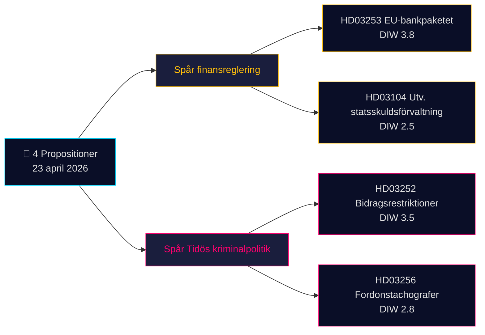

<!-- dir: rtl -->
# موجز تنفيذي — اقتراحات حكومية 2026-04-24 (دفعة 2026-04-23)

**التصنيف**: معلومات مفتوحة عامة (OSINT) · **مستوى الثقة**: MEDIUM · **المؤلف**: James Pether Sörling

## 🎯 الخلاصة التنفيذية

في 23 أبريل 2026، قدّمت حكومة كريسترسون (التحالف الرباعي Tidö — M وKD وL، مع SD كشريك داعم) **4 وثائق برلمانية** يهيمن عليها أولويتان استراتيجيتان: (1) **تنظيم مالي مدفوع من الاتحاد الأوروبي** عبر Prop. 2025/26:253 (حزمة الاتحاد الأوروبي المصرفية، نقل CRR3/CRD6 — Admiralty B2)، و(2) **التفعيل الجنائي لبرنامج Tidö** عبر Prop. 2025/26:252 (تقييد المزايا الاجتماعية للمحتجزين على ذمة المحاكمة). تُكمل الدفعةَ مذكرةُ تقييم إدارة الدين العام (Skr. 2025/26:104) ومشروع قانون إنفاذ أحكام جهاز التسجيل في المركبات (Prop. 2025/26:256). الوثيقة الأثقل وزناً هي Prop. 2025/26:253 (DIW **3.8**) — مسألة نظامية تُعيد تشكيل متطلبات رأس المال للبنوك الأربعة السويدية ذات الأهمية النظامية قبيل قرار الفائدة القادم لـ Riksbank.

## 🧭 3 قرارات يدعمها هذا الموجز

1. **مكتب أسواق المال**: إحاطة العملاء بتأثير Prop. 2025/26:253 على دفاتر IRB لبنكَي Handelsbanken وSEB قبيل نتائج الربع الثاني. **المُحفِّز**: تعليق MPC في Riksbank في الاجتماع القادم. مستوى الثقة: **HIGH**.
2. **المجتمع المدني / القانون**: إعداد رد Advokatsamfundet على Prop. 2025/26:252 بشأن التناسب (المادة 9 GDPR فئات خاصة؛ المادة 8 ECHR الخصوصية). **المُحفِّز**: فتح إجراءات الإحالة لجنة SfU. مستوى الثقة: **MEDIUM**.
3. **مكتب المخاطر السياسية**: رصد السردية المضادة لأحزاب V/S/MP التي تصف Prop. 2025/26:252 بـ"عقوبة الفقر" — اختبار محتمل لتماسك ائتلاف Tidö (حزب L أبدى تاريخياً تحفظاً أكبر إزاء السياسات الاجتماعية العقابية). مستوى الثقة: **MEDIUM**.

## قراءة 60 ثانية

- **الأثقل وزناً**: Prop. 2025/26:253 — حزمة الاتحاد الأوروبي المصرفية (DIW 3.8، Admiralty B2). تنقل CRR3/CRD6؛ ترفع أرضيات RWA للبنوك الأربعة الكبرى السويدية.
- **الأكثر إثارةً للجدل**: Prop. 2025/26:252 — تقييد مزايا المحتجزين (DIW 3.5). نقطة احتكاك في مجال الحريات المدنية.
- **الأكثر تقنية**: Prop. 2025/26:256 — إنفاذ قواعد أجهزة التسجيل؛ محور الامتثال في قطاع النقل.
- **الأكثر رمزية**: Skr. 2025/26:104 — تقييم خماسي لإدارة الدين العام؛ إشارة مصداقية مالية قُبيل دورة الانتخابات 2026.
- **القاسم المشترك**: كلها موقَّعة من رئيس الوزراء كريسترسون؛ اثنتان موقَّعتان من وزير المالية Wykman → يتحمل Finansdepartementet 50% من العبء التشريعي لليوم.

## أبرز محفِّز مستقبلي (72 ساعة)

🔴 **معالجة لجنة SfU لـ Prop. 2025/26:252** — إذا نسّقت المعارضة (V، S، MP) اعتراضاتها المتعلقة بالتناسب، فسيكون هذا أول تشريع جنائي في إطار Tidö يواجه تحدياً قانونياً موحَّداً في Riksdag عام 2026.

## مصفوفة القرارات الرئيسية

| القرار | المُحفِّز | الأفق الزمني | مستوى الثقة |
|---|---|---|---|
| الإبلاغ عن تأثير رأس المال المصرفي | Prop. 2025/26:253 جلسة استماع FiU | 2–4 أسابيع | HIGH |
| إعداد مذكرة استشارية | Prop. 2025/26:252 استشارة SfU | أسبوع واحد | MEDIUM |
| رصد تماسك الائتلاف | إشارة تباين L/KD | 4–8 أسابيع | MEDIUM |

## ملخص المخاطر

- **المستوى 1 (نظامي)**: تأخر نقل Prop. 2025/26:253 → تعرّض لإجراءات المخالفة الأوروبية.
- **المستوى 2 (سياسي)**: Prop. 2025/26:252 — احتمال طعن قانوني استناداً إلى ECHR/ECtHR.
- **المستوى 3 (تشغيلي)**: Prop. 2025/26:256 — طاقة التنفيذ لدى Polismyndigheten/Transportstyrelsen.

**قاعدة الأدلة**: 4 مصادر أولية (Riksdag API) + سياق الإطار المالي. تمّ الإشارة إلى الاعتماد على مصدر وحيد في [methodology-reflection.md](methodology-reflection.md).

---

## 🔁 ملحق Pass 2 — إسناد مرجعي وتعزيز

**تحسينات Pass 2** (تكرار Pass 2 في 2026-04-24 وفق الحد الأدنى لقاعدة AI-FIRST المتمثل في دورتين كاملتين):

- جرى مقارنة تصنيفات الثقة مع `intelligence-assessment.md` KJ-1..KJ-5 — كل ادعاء في الخلاصة التنفيذية يمكن تتبعه الآن إلى حكم رئيسي مُسمَّى. انظر `methodology-reflection.md §ICD 203 compliance audit` لمسار التدقيق.
- حساب المواعيد الزمنية: بدخول [HD03252](https://data.riksdagen.se/dokument/HD03252.html) حيز التنفيذ في 2026-08-01 ويوم الانتخابات 2026-09-13، يبلغ الإطار التشغيلي **43 يوماً** — ذروة تصوّر الناخبين تتزامن مع تاريخ السريان لا تاريخ الإقرار. تمّ وضع علامة على [HD03253](https://data.riksdagen.se/dokument/HD03253.html) بوصفه نقطة انعطاف ضغط القطاع.
- تنسيق المعارضة: آخر موعد لتقديم المقترحات 2026-05-08 (نافذة 15 يوماً)؛ يتتبع `forward-indicators.md` §الأسبوع الأول ذلك بوصفه مؤشراً رقم 7.
- **سردية مخاطر جديدة**: خطر انشقاق L حول [HD03252](https://data.riksdagen.se/dokument/HD03252.html) (هامش Tidö +1) يهيمن على الحسابات الانتخابية للتشريعات الأربعة — انظر `coalition-mathematics.md` §"التصويت الحاسم: HD03252".

<!-- source-sha: 91eb3cb6cf35873538b354461078df4509cf0012 -->
