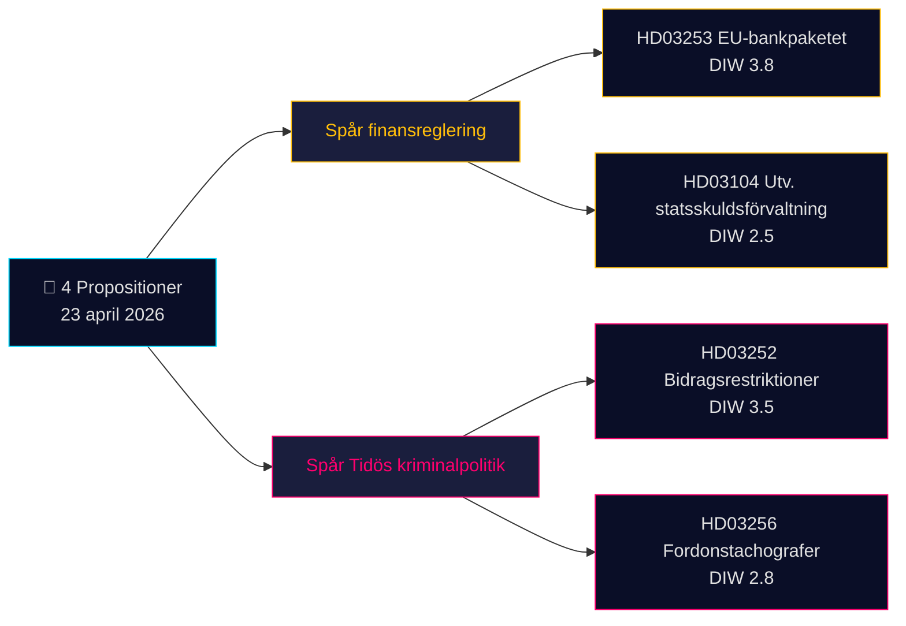

# Kortrapport — Forslag 2026-04-24 (batch 2026-04-23)

**Klassifikation**: Offentlig OSINT · **Konfidens**: MEDIUM · **Forfatter**: James Pether Sörling

## 🎯 Konklusion

Den 23. april 2026 fremlagde Kristersson-regeringen (Tidö-koalitionen — M, KD, L + SD som støtteparti) **4 parlamentariske dokumenter** domineret af to strategiske prioriteter: (1) **EU-drevet finansregulering** med Prop. 2025/26:253 (EU-bankpakken, CRR3/CRD6-transposition — Admiralty B2) og (2) **Tidøs strafferetlige operationalisering** med Prop. 2025/26:252 (ydelsesrestriktioner for varetægtsfængslede). En evalueringsskrivelse om statsgældsforvaltning (Skr. 2025/26:104) og et lovforslag om tachografer (Prop. 2025/26:256) supplerer batchen. Det tungeste punkt er Prop. 2025/26:253 (DIW **3,8**) — et systemisk ærinde, der omformer kapitalkredsene for Sveriges fire systemisk vigtige banker forud for Riksbankens næste rentebeslutning.

## 🧭 3 beslutninger dette resumé understøtter

1. **Finansmarkedsdesk**: Informér klienter om Prop. 2025/26:253's kapitalvirkninger for Handelsbanken/SEB:s IRB-bøger inden Q2-regnskaberne. **Udløser**: Riksbankens MPC-kommentar ved næste møde. Konfidens: **HIGH**.
2. **Civilsamfund / jura**: Forbered Advokatsamfundets høringssvar til Prop. 2025/26:252 vedrørende proportionalitet (Art. 9 GDPR særlige kategorier; ECHR Art. 8 privatliv). **Udløser**: SfU-udvalgets høring åbner. Konfidens: **MEDIUM**.
3. **Politisk risikoanalyse**: Overvåg V/S/MP's modfortælling om Prop. 2025/26:252 som "fattigdomsstraf" — potentiel koalitionskohesionstest for Tidø-partierne (L har historisk vist større tøven over for straffende socialpolitik). Konfidens: **MEDIUM**.

## 60-sekunders læsning

- **Tungeste punkt**: Prop. 2025/26:253 — EU-bankpakken (DIW 3,8, Admiralty B2). Transponerer CRR3/CRD6; hæver RWA-gulve for de fire store svenske banker.
- **Mest kontroversielt**: Prop. 2025/26:252 — ydelsesrestriktioner for varetægtsfængslede (DIW 3,5). Borgerfrihedsspørgsmål.
- **Mest teknisk**: Prop. 2025/26:256 — tachografhåndhævelse; transportbranchens compliance-fokus.
- **Mest symbolsk**: Skr. 2025/26:104 — 5-årig evaluering af statsgældsforvaltningen; finanspolitisk troværdighedssignal forud for valgcyklussen 2026.
- **Fælles tråd**: Alle 4 underskrevet af statsminister Kristersson; 2 af finansminister Wykman → Finansdepartementet bærer 50 % af dagens lovgivningsbyrde.

## Vigtigste fremadrettede udløser (72 t)

🔴 **SfU-udvalgets behandling af Prop. 2025/26:252** — hvis oppositionen (V, S, MP) koordinerer proportionalitetsindsigelser, bliver dette det første Tidø-kriminalpolitiske lovforslag med en samlet retlig udfordring i Riksdagen i 2026.

## Nøglebeslutningsmatrix

| Beslutning | Udløser | Tidshorisont | Konfidens |
|---|---|---|---|
| Flag banksektorens kapitalvirkning | Prop. 2025/26:253 FiU-høring | 2–4 uger | HIGH |
| Forberedelse af høringssvar | Prop. 2025/26:252 SfU-høring | 1 uge | MEDIUM |
| Koalitionskohesionsovervågning | L/KD-divergenssignal | 4–8 uger | MEDIUM |

## Risikosammendrag

- **Niveau 1 (systemisk)**: Forsinket transposition af Prop. 2025/26:253 → eksponering for EU-traktatbrudssag.
- **Niveau 2 (politisk)**: Prop. 2025/26:252 — retlig udfordring baseret på ECHR/ECtHR er mulig.
- **Niveau 3 (operationelt)**: Prop. 2025/26:256 — gennemførelseskapacitet hos Polismyndigheten/Transportstyrelsen.

**Dokumentationsgrundlag**: 4 primærkilder (Riksdagens API) + finanspolitisk rammesammenhæng. Enkeltkildeafhængighed noteret i [methodology-reflection.md](methodology-reflection.md).

---

## 🔁 Pass 2-tillæg — krydsreferencer og stramning

**Pass 2-forbedringer** (2026-04-24 Pass 2-iteration i overensstemmelse med AI-FIRST minimumskrav om 2 runder):

- Konfidensmærkater afstemt mod `intelligence-assessment.md` KJ-1..KJ-5 — hvert BLUF-udsagn kan nu spores til et navngivet nøglekendelse. Se `methodology-reflection.md §ICD 203 compliance audit` for revisionsspor.
- Tidsspændsregning: med [HD03252](https://data.riksdagen.se/dokument/HD03252.html) i kraft 2026-08-01 og valgdag 2026-09-13 er det operationelle vindue **43 dage** — vælgernes opfattelse topper ved ikrafttrædelsen, ikke ved vedtagelsen. Flagget for [HD03253](https://data.riksdagen.se/dokument/HD03253.html) som sektors lobbyismens inflektionspunkt.
- Oppositionens koordinerede aktivitet: motionsfristen udløber 2026-05-08 (15-dages vindue); `forward-indicators.md` §1-uge følger dette som Indikator nr. 7.
- **Ny risikofortælling**: L's potentielle afhopper-risiko vedrørende [HD03252](https://data.riksdagen.se/dokument/HD03252.html) (Tidø +1 margin) dominerer alle fire lovforslagenes valgmatematik — se `coalition-mathematics.md` §"Afgørende afstemning: HD03252".

<!-- source-sha: 91eb3cb6cf35873538b354461078df4509cf0012 -->
