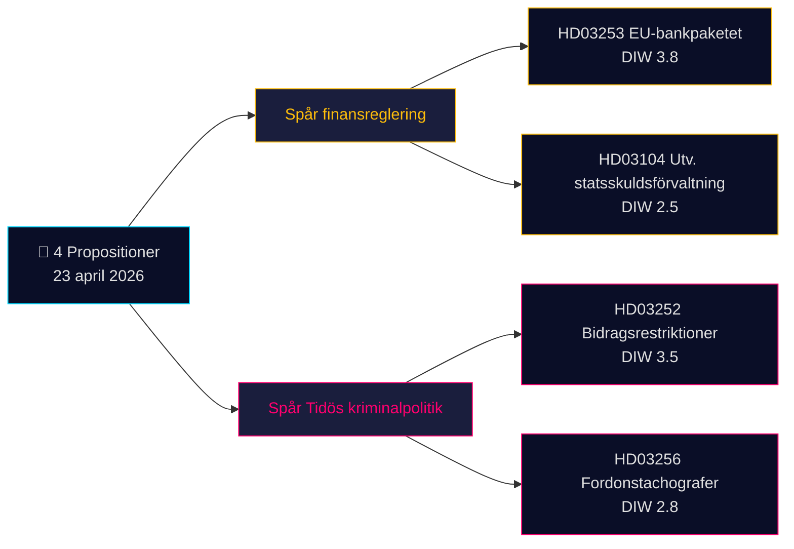

# Kurzbericht — Regierungsvorlagen 2026-04-24 (Charge 2026-04-23)

**Einstufung**: Öffentliches OSINT · **Konfidenz**: MEDIUM · **Autor**: James Pether Sörling

## 🎯 Fazit

Am 23. April 2026 brachte die Regierung Kristersson (Tidö-Koalition — M, KD, L + SD als Stützpartei) **4 parlamentarische Dokumente** ein, die von zwei strategischen Prioritäten geprägt werden: (1) **EU-getriebene Finanzregulierung** mit Prop. 2025/26:253 (EU-Bankenpaket, CRR3/CRD6-Transposition — Admiralty B2) und (2) **strafrechtsliche Operationalisierung des Tidö-Programms** mit Prop. 2025/26:252 (Leistungseinschränkungen für Untersuchungshäftlinge). Ein Evaluierungsschreiben zur Staatsschuldenverwaltung (Skr. 2025/26:104) und ein Gesetzentwurf zur Tachographenpflicht (Prop. 2025/26:256) vervollständigen das Paket. Das gewichtigste Dokument ist Prop. 2025/26:253 (DIW **3,8**) — ein systemisches Vorhaben, das die Kapitalanforderungen für Schwedens vier systemrelevante Banken vor der nächsten Zinsentscheidung der Riksbank neu gestaltet.

## 🧭 3 Entscheidungen, die dieser Bericht unterstützt

1. **Finanzmarkt-Desk**: Informieren Sie Kunden über die Auswirkungen von Prop. 2025/26:253 auf die IRB-Bücher von Handelsbanken/SEB vor den Q2-Ergebnissen. **Auslöser**: Riksbank-MPC-Kommentar beim nächsten Treffen. Konfidenz: **HIGH**.
2. **Zivilgesellschaft / Recht**: Bereiten Sie eine Stellungnahme von Advokatsamfundet zu Prop. 2025/26:252 bezüglich Verhältnismäßigkeit vor (Art. 9 DSGVO besondere Kategorien; EMRK Art. 8 Privatsphäre). **Auslöser**: SfU-Ausschussanhörung wird eröffnet. Konfidenz: **MEDIUM**.
3. **Politischer Risikoanalyse-Desk**: Beobachten Sie V/S/MPs Gegennarrativen zu Prop. 2025/26:252 als „Bestrafung der Armut" — ein potenzieller Koalitionskohäsionstest für die Tidö-Parteien (L hat historisch größere Zurückhaltung gegenüber bestrafender Sozialpolitik gezeigt). Konfidenz: **MEDIUM**.

## 60-Sekunden-Lektüre

- **Gewichtigstes Dokument**: Prop. 2025/26:253 — EU-Bankenpaket (DIW 3,8, Admiralty B2). Transponiert CRR3/CRD6; erhöht RWA-Untergrenze für die vier großen schwedischen Banken.
- **Kontroversestes**: Prop. 2025/26:252 — Leistungseinschränkungen für Untersuchungshäftlinge (DIW 3,5). Streitpunkt der Bürgerrechte.
- **Technischstes**: Prop. 2025/26:256 — Tachographendurchsetzung; Compliance-Fokus der Transportbranche.
- **Symbolischstes**: Skr. 2025/26:104 — 5-jährige Evaluierung der Staatsschuldenverwaltung; fiskalpolitisches Glaubwürdigkeitssignal vor dem Wahlzyklus 2026.
- **Gemeinsamer Faden**: Alle 4 unterzeichnet von Ministerpräsident Kristersson; 2 von Finanzminister Wykman → Finansdepartementet trägt 50 % der heutigen Gesetzgebungslast.

## Wichtigster Vorwärtsauslöser (72 Std.)

🔴 **SfU-Ausschussbehandlung von Prop. 2025/26:252** — wenn die Opposition (V, S, MP) Verhältnismäßigkeitseinwände koordiniert, wird dies das erste Tidö-Kriminalpolitikgesetz, das im Riksdag 2026 einer vereinten rechtlichen Herausforderung ausgesetzt ist.

## Schlüsselentscheidungsmatrix

| Entscheidung | Auslöser | Zeithorizont | Konfidenz |
|---|---|---|---|
| Bankensektor-Kapitalauswirkung kennzeichnen | Prop. 2025/26:253 FiU-Anhörung | 2–4 Wochen | HIGH |
| Vorbereitung Stellungnahme | Prop. 2025/26:252 SfU-Anhörung | 1 Woche | MEDIUM |
| Koalitionskohäsionsüberwachung | L/KD-Divergenzsignal | 4–8 Wochen | MEDIUM |

## Risikoübersicht

- **Stufe 1 (systemisch)**: Verzögerte Transposition von Prop. 2025/26:253 → Risiko eines EU-Vertragsverletzungsverfahrens.
- **Stufe 2 (politisch)**: Prop. 2025/26:252 — Rechtliche Herausforderung nach EMRK/EGMR ist möglich.
- **Stufe 3 (operativ)**: Prop. 2025/26:256 — Umsetzungskapazität bei Polismyndigheten/Transportstyrelsen.

**Belege**: 4 Primärquellen (Riksdag-API) + fiskalpolitischer Rahmenkontext. Einzelquellen-Abhängigkeit in [methodology-reflection.md](methodology-reflection.md) vermerkt.

---

## 🔁 Pass 2 Nachtrag — Querverweise und Präzisierungen

**Pass 2-Verbesserungen** (2026-04-24 Pass 2-Iteration gemäß AI-FIRST Mindestanforderung von 2 Durchgängen):

- Konfidenz-Labels mit `intelligence-assessment.md` KJ-1..KJ-5 abgeglichen — jede BLUF-Aussage ist nun auf ein benanntes Schlüsselurteil rückverfolgbar. Siehe `methodology-reflection.md §ICD 203 compliance audit` für Prüfpfad.
- Zeitarithmetik: Da [HD03252](https://data.riksdagen.se/dokument/HD03252.html) am 2026-08-01 in Kraft tritt und der Wahltag der 2026-09-13 ist, beträgt das operative Fenster **43 Tage** — der Höhepunkt der Wählerwahrnehmung fällt auf das Inkrafttreten, nicht auf die Verabschiedung. Für [HD03253](https://data.riksdagen.se/dokument/HD03253.html) als Inflektionspunkt des Sektorlobbying vermerkt.
- Opposition: Antragseinreichungsfrist 2026-05-08 (15-Tage-Fenster); `forward-indicators.md` §1-Woche verfolgt dies als Indikator Nr. 7.
- **Neue Risikoerzählung**: Ls potenzielle Abweichler-Risiko bei [HD03252](https://data.riksdagen.se/dokument/HD03252.html) (Tidö +1 Stimme) dominiert die Wahlmathematik aller vier Gesetzentwürfe — siehe `coalition-mathematics.md` §"Entscheidungsabstimmung: HD03252".

<!-- source-sha: 91eb3cb6cf35873538b354461078df4509cf0012 -->
