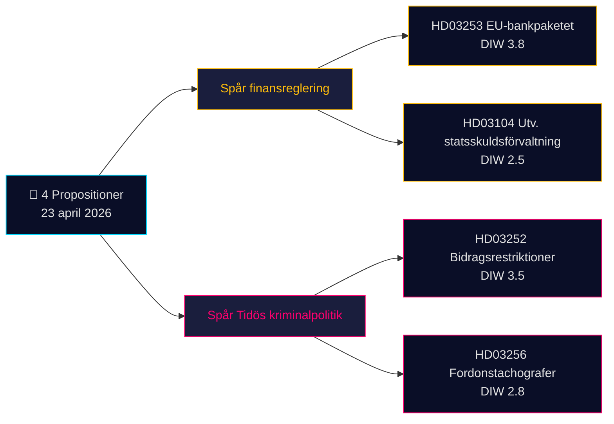

# Informe ejecutivo — Proposiciones 2026-04-24 (lote 2026-04-23)

**Clasificación**: OSINT público · **Confianza**: MEDIUM · **Autor**: James Pether Sörling

## 🎯 Conclusión

El 23 de abril de 2026 el gobierno Kristersson (coalición Tidö — M, KD, L + SD como partido de apoyo) presentó **4 documentos parlamentarios** dominados por dos prioridades estratégicas: (1) **regulación financiera impulsada por la UE** con la Prop. 2025/26:253 (paquete bancario europeo, transposición de CRR3/CRD6 — Admiralty B2) y (2) **operacionalización penal del programa Tidö** con la Prop. 2025/26:252 (restricciones de prestaciones para personas en prisión preventiva). Una comunicación de evaluación sobre gestión de la deuda pública (Skr. 2025/26:104) y un proyecto de ley sobre tacógrafos (Prop. 2025/26:256) completan el lote. El documento de mayor peso es la Prop. 2025/26:253 (DIW **3,8**) — una medida sistémica que remodela los requisitos de capital de los cuatro bancos suecos de importancia sistémica antes de la próxima decisión de tipos de la Riksbank.

## 🧭 3 decisiones que apoya este informe

1. **Mesa de mercados financieros**: Informar a los clientes sobre el impacto de la Prop. 2025/26:253 en los libros IRB de Handelsbanken/SEB antes de los resultados del T2. **Desencadenante**: comentario del CPM de la Riksbank en la próxima reunión. Confianza: **HIGH**.
2. **Sociedad civil / legal**: Preparar la respuesta de Advokatsamfundet a la Prop. 2025/26:252 sobre proporcionalidad (Art. 9 RGPD categorías especiales; CEDH Art. 8 privacidad). **Desencadenante**: apertura de la consulta en la comisión SfU. Confianza: **MEDIUM**.
3. **Mesa de análisis político**: Vigilar el contrarelato de V/S/MP sobre la Prop. 2025/26:252 como "castigo a la pobreza" — potencial prueba de cohesión para los partidos Tidö (L ha mostrado históricamente mayor reticencia ante la política social punitiva). Confianza: **MEDIUM**.

## Lectura de 60 segundos

- **Más significativa**: Prop. 2025/26:253 — paquete bancario europeo (DIW 3,8, Admiralty B2). Transpone CRR3/CRD6; eleva los suelos RWA de los cuatro grandes bancos suecos.
- **Más controvertida**: Prop. 2025/26:252 — restricciones de prestaciones para personas en prisión preventiva (DIW 3,5). Cuestión de libertades civiles.
- **Más técnica**: Prop. 2025/26:256 — cumplimiento de tacógrafos; foco de cumplimiento del sector del transporte.
- **Más simbólica**: Skr. 2025/26:104 — evaluación quinquenal de la gestión de la deuda pública; señal de credibilidad fiscal ante el ciclo electoral 2026.
- **Hilo común**: Los 4 firmados por el PM Kristersson; 2 por el ministro de Finanzas Wykman → Finansdepartementet asume el 50 % de la carga legislativa del día.

## Principal desencadenante próximo (72 h)

🔴 **Tratamiento en comisión SfU de la Prop. 2025/26:252** — si la oposición (V, S, MP) coordina objeciones de proporcionalidad, este será el primer proyecto de ley penal Tidö con un desafío jurídico unificado en el Riksdag en 2026.

## Matriz de decisiones clave

| Decisión | Desencadenante | Horizonte | Confianza |
|---|---|---|---|
| Señalar impacto de capital bancario | Prop. 2025/26:253 audiencia FiU | 2–4 semanas | HIGH |
| Preparación de respuesta a consulta | Prop. 2025/26:252 consulta SfU | 1 semana | MEDIUM |
| Vigilancia cohesión de coalición | Señal de divergencia L/KD | 4–8 semanas | MEDIUM |

## Resumen de riesgos

- **Nivel 1 (sistémico)**: Retraso en la transposición de la Prop. 2025/26:253 → exposición al procedimiento de infracción de la UE.
- **Nivel 2 (político)**: Prop. 2025/26:252 — posible impugnación jurídica basada en el CEDH/TEDH.
- **Nivel 3 (operativo)**: Prop. 2025/26:256 — capacidad de ejecución en Polismyndigheten/Transportstyrelsen.

**Base documental**: 4 fuentes primarias (API Riksdag) + contexto del marco presupuestario. Dependencia de fuente única señalada en [methodology-reflection.md](methodology-reflection.md).

---

## 🔁 Adición Pass 2 — referencias cruzadas y precisiones

**Mejoras Pass 2** (iteración Pass 2 del 2026-04-24 conforme al requisito mínimo AI-FIRST de 2 pasadas):

- Las etiquetas de confianza se han conciliado con `intelligence-assessment.md` KJ-1..KJ-5 — cada afirmación del BLUF es ahora trazable a un juicio clave nombrado. Ver `methodology-reflection.md §ICD 203 compliance audit` para la pista de auditoría.
- Aritmética de plazos: con [HD03252](https://data.riksdagen.se/dokument/HD03252.html) en vigor el 2026-08-01 y el día de las elecciones el 2026-09-13, la ventana operativa es de **43 días** — el pico de percepción de los votantes coincide con la entrada en vigor, no con la aprobación. Señalado para [HD03253](https://data.riksdagen.se/dokument/HD03253.html) como punto de inflexión del lobbismo sectorial.
- Coordinación opositora: plazo de presentación de mociones el 2026-05-08 (ventana de 15 días); `forward-indicators.md` §1-semana lo sigue como Indicador n.º 7.
- **Nueva narrativa de riesgo**: El riesgo de deserción de L en [HD03252](https://data.riksdagen.se/dokument/HD03252.html) (margen Tidö +1) domina la aritmética electoral de los cuatro proyectos — ver `coalition-mathematics.md` §"Voto decisivo: HD03252".

<!-- source-sha: 91eb3cb6cf35873538b354461078df4509cf0012 -->
