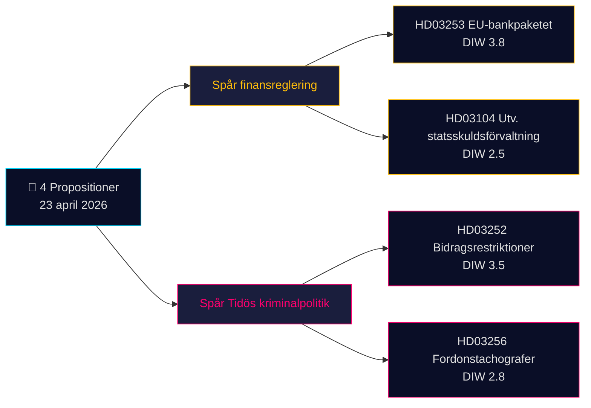

# Tiivistelmäraportti — Hallituksen esitykset 2026-04-24 (erä 2026-04-23)

**Luokitus**: Julkinen OSINT · **Luottamustaso**: MEDIUM · **Tekijä**: James Pether Sörling

## 🎯 Tiivistelmä

Kristersson-hallitus (Tidö-koalitio — M, KD, L + SD tukipuolueena) toi 23. huhtikuuta 2026 parlamentin käsiteltäväksi **4 parlamentaarista asiakirjaa**, joita hallitsevat kaksi strategista prioriteettia: (1) **EU-lähtöinen finanssiasetus** Prop. 2025/26:253:lla (EU:n pankkipaketti, CRR3/CRD6-transponointi — Admiralty B2) ja (2) **Tidön rikosoikeudellinen operationalisointi** Prop. 2025/26:252:lla (tutkintavankeina olevien etuusrajoitukset). Eräsirjelmä valtionvelanhoidon arvioinnista (Skr. 2025/26:104) ja ajoneuvojen ajopiirtureita koskeva lakiesitys (Prop. 2025/26:256) täydentävät erän. Merkittävin asiakirja on Prop. 2025/26:253 (DIW **3,8**) — se muotoilee pääomavaatimukset uudelleen Ruotsin neljälle systeemisesti tärkeälle pankille ennen Riksbankenin seuraavaa korkopäätöstä.

## 🧭 3 päätöstä, joita tämä raportti tukee

1. **Rahoitusmarkkinoiden toimijakunta**: Informoi asiakkaita Prop. 2025/26:253:n vaikutuksista Handelsbankenin/SEBin IRB-kirjoille ennen Q2-tuloksia. **Laukaisija**: Riksbankenin MPC-kommentti seuraavassa kokouksessa. Luottamustaso: **HIGH**.
2. **Kansalaisyhteiskunta / oikeustiede**: Valmistele Advokatsamfundetin lausunto Prop. 2025/26:252:n suhteellisuudesta (GDPR Art. 9 erityiskategoriat; ECHR Art. 8 yksityiselämä). **Laukaisija**: SfU:n kuulemisprosessi avautuu. Luottamustaso: **MEDIUM**.
3. **Poliittisen riskin toimijakunta**: Seuraa V/S/MP:n vastanarratiivia Prop. 2025/26:252:sta "köyhyyden rangaisemisena" — potentiaalinen koalition koheesiotesti Tidö-puolueille (L on historiallisesti suhtautunut varauksellisemmin rankaisevaan sosiaalipolitiikkaan). Luottamustaso: **MEDIUM**.

## 60 sekunnin lukeminen

- **Merkittävin**: Prop. 2025/26:253 — EU:n pankkipaketti (DIW 3,8, Admiralty B2). Transponoi CRR3/CRD6; nostaa RWA-lattioita neljälle suurelle ruotsalaiselle pankille.
- **Kiistanalaisin**: Prop. 2025/26:252 — tutkintavankeina olevien etuusrajoitukset (DIW 3,5). Kansalaisvapauksiin liittyvä kysymys.
- **Teknisesti vaativin**: Prop. 2025/26:256 — ajopiirturien täytäntöönpano; kuljetusalan noudattamisfokus.
- **Symbolisin**: Skr. 2025/26:104 — 5-vuotinen valtionvelanhoidon arviointi; finanssipolitiikan uskottavuussignaali vuoden 2026 vaalikierroksen kynnyksellä.
- **Yhteinen tekijä**: Kaikki 4 allekirjoittanut PM Kristersson; 2 valtiovarainministeri Wykman → Finansdepartementet kantaa 50 % päivän lainsäädäntötaakasta.

## Tärkein lähiajan laukaisija (72 h)

🔴 **SfU:n käsittely Prop. 2025/26:252:lle** — jos oppositio (V, S, MP) koordinoi suhteellisuusvastustustaan, tästä tulee ensimmäinen Tidön rikospoliittinen lakiesitys, joka kohtaa yhtenäisen oikeudellisen haasteen Riksdagenissa vuonna 2026.

## Avainpäätösmatriisi

| Päätös | Laukaisija | Aikahorisontti | Luottamustaso |
|---|---|---|---|
| Merkitse pankkisektorin pääomavaikutus | Prop. 2025/26:253 FiU-kuuleminen | 2–4 viikkoa | HIGH |
| Lausuntovalmistelu | Prop. 2025/26:252 SfU-lausuntokierros | 1 viikko | MEDIUM |
| Koalition koheesion seuranta | L/KD-erimielisyysmerkki | 4–8 viikkoa | MEDIUM |

## Riskiyhteenveto

- **Taso 1 (systeeminen)**: Prop. 2025/26:253:n transponoinnin viivästyminen → altistuminen EU:n rikkomusmenettelyn riskille.
- **Taso 2 (poliittinen)**: Prop. 2025/26:252 — ECHR/ECtHR-pohjainen oikeudellinen haaste mahdollinen.
- **Taso 3 (operatiivinen)**: Prop. 2025/26:256 — toimeenpanokapasiteetti Polismyndighetenissa/Transportstyrelsenissa.

**Näyttöpohja**: 4 primäärilähdettä (Riksdagenin API) + finanssipolitiikan kehyskonteksti. Yksittäislähteen riippuvuus merkitty [methodology-reflection.md](methodology-reflection.md)-tiedostoon.

---

## 🔁 Pass 2 -lisäys — ristiviittaukset ja tarkennukset

**Pass 2 -parannukset** (2026-04-24 Pass 2 -iteraatio AI-FIRST-minimikahden kierroksen vaatimuksen mukaisesti):

- Luottamusetiketit täsmäytetty `intelligence-assessment.md` KJ-1..KJ-5:tä vastaan — jokainen BLUF-väite on nyt jäljitettävissä nimettyyn avainarviooon. Katso `methodology-reflection.md §ICD 203 compliance audit` tarkastusketjua varten.
- Aikataulumatematiikka: kun [HD03252](https://data.riksdagen.se/dokument/HD03252.html) astuu voimaan 2026-08-01 ja vaalipäivä on 2026-09-13, operatiivinen ikkuna on **43 päivää** — äänestäjien huomio huipentuu voimaantulopäivänä, ei hyväksymispäivänä. Merkitty [HD03253](https://data.riksdagen.se/dokument/HD03253.html):lle sektorin lobbauksen käännepisteeksi.
- Opposition koordinaatio: motiojätön määräaika 2026-05-08 (15 päivän ikkuna); `forward-indicators.md` §1-viikko seuraa tätä Indikaattorina nro 7.
- **Uusi riskikertomus**: L:n potentiaalinen loikkausriski koskien [HD03252](https://data.riksdagen.se/dokument/HD03252.html) (Tidö +1 marginaali) hallitsee kaikkien neljän lakiesityksen vaalimatematiikkaa — katso `coalition-mathematics.md` §"Ratkaiseva äänestys: HD03252".

<!-- source-sha: 91eb3cb6cf35873538b354461078df4509cf0012 -->
