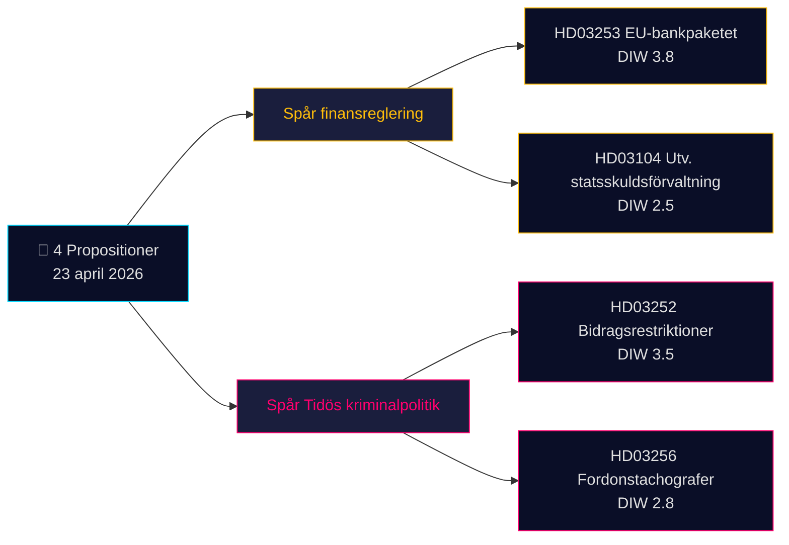

# Note de synthèse — Propositions 2026-04-24 (lot 2026-04-23)

**Classification** : OSINT public · **Confiance** : MEDIUM · **Auteur** : James Pether Sörling

## 🎯 Conclusion

Le 23 avril 2026, le gouvernement Kristersson (coalition Tidö — M, KD, L + SD comme parti de soutien) a déposé **4 documents parlementaires** dominés par deux priorités stratégiques : (1) **la réglementation financière impulsée par l'UE** avec la Prop. 2025/26:253 (paquet bancaire européen, transposition CRR3/CRD6 — Admiralty B2) et (2) **l'opérationnalisation pénale du programme Tidö** avec la Prop. 2025/26:252 (restrictions de prestations pour les personnes en détention provisoire). Une communication d'évaluation sur la gestion de la dette publique (Skr. 2025/26:104) et un projet de loi sur l'application des règles relatives aux tachygraphes (Prop. 2025/26:256) complètent le lot. Le document le plus lourd est la Prop. 2025/26:253 (DIW **3,8**) — une mesure systémique qui remodèle les exigences en fonds propres des quatre banques d'importance systémique suédoises avant la prochaine décision sur les taux de la Riksbank.

## 🧭 3 décisions que cette note appuie

1. **Bureau marchés financiers** : Informer les clients de l'impact de la Prop. 2025/26:253 sur les portefeuilles IRB de Handelsbanken/SEB avant les résultats du T2. **Déclencheur** : commentaire du CMP de la Riksbank lors de la prochaine réunion. Confiance : **HIGH**.
2. **Société civile / juridique** : Préparer la réponse d'Advokatsamfundet à la Prop. 2025/26:252 sur la proportionnalité (Art. 9 RGPD catégories spéciales ; CEDH Art. 8 vie privée). **Déclencheur** : ouverture de la consultation en commission SfU. Confiance : **MEDIUM**.
3. **Bureau analyse politique** : Surveiller le contre-discours de V/S/MP sur la Prop. 2025/26:252 comme « punition de la pauvreté » — test potentiel de cohésion de la coalition Tidö (L a historiquement montré plus de réticence face aux politiques sociales punitives). Confiance : **MEDIUM**.

## Lecture en 60 secondes

- **Plus significatif** : Prop. 2025/26:253 — paquet bancaire européen (DIW 3,8, Admiralty B2). Transpose CRR3/CRD6 ; relève les planchers RWA des quatre grandes banques suédoises.
- **Plus controversé** : Prop. 2025/26:252 — restrictions de prestations pour les personnes en détention provisoire (DIW 3,5). Sujet de libertés civiles.
- **Plus technique** : Prop. 2025/26:256 — application des tachygraphes ; focus compliance du secteur des transports.
- **Plus symbolique** : Skr. 2025/26:104 — évaluation quinquennale de la gestion de la dette publique ; signal de crédibilité budgétaire avant le cycle électoral 2026.
- **Fil commun** : Les 4 documents signés par le Premier ministre Kristersson ; 2 par le ministre des Finances Wykman → Finansdepartementet supporte 50 % de la charge législative du jour.

## Principal déclencheur à venir (72 h)

🔴 **Traitement en commission SfU de la Prop. 2025/26:252** — si l'opposition (V, S, MP) coordonne ses objections de proportionnalité, ce sera le premier projet de loi pénal Tidö à faire face à une contestation juridique unifiée au Riksdag en 2026.

## Matrice des décisions clés

| Décision | Déclencheur | Horizon | Confiance |
|---|---|---|---|
| Signaler l'impact en fonds propres bancaires | Prop. 2025/26:253 audition FiU | 2–4 semaines | HIGH |
| Préparation de la réponse à la consultation | Prop. 2025/26:252 consultation SfU | 1 semaine | MEDIUM |
| Surveillance cohésion de coalition | Signal de divergence L/KD | 4–8 semaines | MEDIUM |

## Synthèse des risques

- **Niveau 1 (systémique)** : Retard de transposition de la Prop. 2025/26:253 → risque de procédure d'infraction de l'UE.
- **Niveau 2 (politique)** : Prop. 2025/26:252 — contestation judiciaire fondée sur la CEDH/CEDH possible.
- **Niveau 3 (opérationnel)** : Prop. 2025/26:256 — capacité d'exécution chez Polismyndigheten/Transportstyrelsen.

**Base documentaire** : 4 sources primaires (API Riksdag) + contexte du cadre budgétaire. Dépendance à une source unique signalée dans [methodology-reflection.md](methodology-reflection.md).

---

## 🔁 Addendum Pass 2 — références croisées et précisions

**Améliorations Pass 2** (itération Pass 2 du 2026-04-24 conformément à l'exigence minimale AI-FIRST de 2 passages) :

- Les étiquettes de confiance ont été reconciliées avec les `intelligence-assessment.md` KJ-1..KJ-5 — chaque affirmation du BLUF est désormais traçable à un jugement clé nommé. Voir `methodology-reflection.md §ICD 203 compliance audit` pour la piste d'audit.
- Arithmétique des délais : avec [HD03252](https://data.riksdagen.se/dokument/HD03252.html) en vigueur le 2026-08-01 et le jour des élections le 2026-09-13, la fenêtre opérationnelle est de **43 jours** — le pic de perception des électeurs coïncide avec la date d'entrée en vigueur, pas avec la date d'adoption. Signalé pour [HD03253](https://data.riksdagen.se/dokument/HD03253.html) comme point d'inflexion du lobbying sectoriel.
- Coordination de l'opposition : délai de dépôt des motions au 2026-05-08 (fenêtre de 15 jours) ; `forward-indicators.md` §1-semaine suit cela comme Indicateur n° 7.
- **Nouvelle narration du risque** : le risque de défection de L sur [HD03252](https://data.riksdagen.se/dokument/HD03252.html) (marge Tidö +1) domine l'arithmétique électorale des quatre projets de loi — voir `coalition-mathematics.md` §"Vote décisif : HD03252".

<!-- source-sha: 91eb3cb6cf35873538b354461078df4509cf0012 -->
