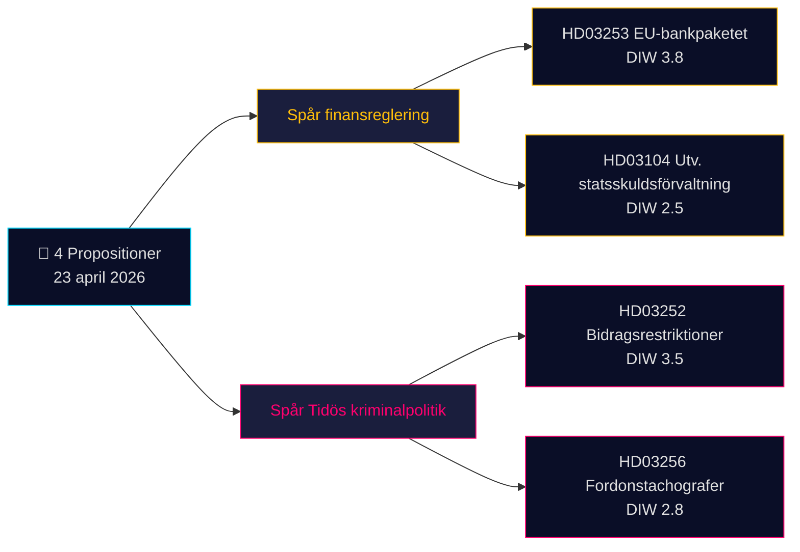

<!-- dir: rtl -->
# סיכום מנהלים — הצעות חוק 2026-04-24 (אצווה 2026-04-23)

**סיווג**: OSINT ציבורי · **רמת אמון**: MEDIUM · **מחבר**: James Pether Sörling

## 🎯 מסקנה עיקרית

ב-23 באפריל 2026 הגישה ממשלת קריסטרסון (קואליציית Tidö — M, KD, L עם SD כשותף תומך) **4 מסמכים פרלמנטריים** שנשלטים על ידי שתי עדיפויות אסטרטגיות: (1) **רגולציה פיננסית מונעת-אירופה** עם Prop. 2025/26:253 (חבילה בנקאית אירופית, שידור CRR3/CRD6 — Admiralty B2) ו-(2) **הפעלה פלילית של תוכנית Tidö** עם Prop. 2025/26:252 (הגבלות גמלה לעצורים בטרם משפט). כתב הערכה על ניהול החוב הממשלתי (Skr. 2025/26:104) והצעת חוק לאכיפת מד-סיבובים (Prop. 2025/26:256) משלימים את האצווה. המסמך הכבד ביותר הוא Prop. 2025/26:253 (DIW **3.8**) — עניין מערכתי המעצב מחדש דרישות הון לארבעת הבנקים הסיסטמיים של שוודיה לפני החלטת הריבית הבאה של Riksbank.

## 🧭 3 החלטות שמסמך זה תומך בהן

1. **שולחן שוקי ההון**: להודיע ​​ללקוחות על השפעת Prop. 2025/26:253 על ספרי ה-IRB של Handelsbanken/SEB לפני תוצאות הרבעון השני. **גורם מפעיל**: תגובת MPC של Riksbank בישיבה הבאה. רמת אמון: **HIGH**.
2. **חברה אזרחית / משפט**: הכנת תגובת Advokatsamfundet ל-Prop. 2025/26:252 בנושא מידתיות (סעיף 9 GDPR קטגוריות מיוחדות; סעיף 8 ECHR פרטיות). **גורם מפעיל**: פתיחת שימוע ועדת SfU. רמת אמון: **MEDIUM**.
3. **שולחן ניתוח סיכונים פוליטי**: מעקב אחר נרטיב הנגד של V/S/MP על Prop. 2025/26:252 כ"ענישת עוני" — מבחן מתמשך לסולידריות קואליציית Tidö (L הראה היסטורית סייג גדול יותר כלפי מדיניות סוציאלית עונשית). רמת אמון: **MEDIUM**.

## קריאה של 60 שניות

- **המשמעותי ביותר**: Prop. 2025/26:253 — החבילה הבנקאית האירופית (DIW 3.8, Admiralty B2). מעביר CRR3/CRD6; מעלה רצפות RWA לארבעת הבנקים הגדולים בשוודיה.
- **השנוי ביותר במחלוקת**: Prop. 2025/26:252 — הגבלות גמלה לעצורים (DIW 3.5). נושא חירויות אזרחיות.
- **הטכני ביותר**: Prop. 2025/26:256 — אכיפת מד-סיבובים; מוקד ציות של ענף התחבורה.
- **הסמלי ביותר**: Skr. 2025/26:104 — הערכה חמש-שנתית של ניהול החוב; אות אמינות תקציבית לקראת מחזור הבחירות 2026.
- **חוט משותף**: כל 4 חתומים על ידי ראש הממשלה קריסטרסון; 2 על ידי שר האוצר Wykman → Finansdepartementet נושא 50% מהעומס החקיקתי של היום.

## הגורם המפעיל הקדמי החשוב ביותר (72 שעות)

🔴 **טיפול ועדת SfU ב-Prop. 2025/26:252** — אם האופוזיציה (V, S, MP) מתאמת את ההתנגדויות המידתיות, יהיה זה הצעת חוק הפלילי הראשונה של Tidö שתעמוד בפני אתגר משפטי מאוחד ב-Riksdag ב-2026.

## מטריצת ההחלטות המרכזיות

| החלטה | גורם מפעיל | אופק זמן | רמת אמון |
|---|---|---|---|
| סימון השפעת הון הבנקאות | Prop. 2025/26:253 שימוע FiU | 2–4 שבועות | HIGH |
| הכנת תגובה להתייעצות | Prop. 2025/26:252 התייעצות SfU | שבוע אחד | MEDIUM |
| ניטור לכידות הקואליציה | אות סטייה L/KD | 4–8 שבועות | MEDIUM |

## סיכום סיכונים

- **רמה 1 (מערכתית)**: עיכוב בהעברת Prop. 2025/26:253 → חשיפה להליכי הפרת חוק האיחוד האירופי.
- **רמה 2 (פוליטית)**: Prop. 2025/26:252 — עתירה משפטית מבוססת ECHR/ECtHR אפשרית.
- **רמה 3 (תפעולית)**: Prop. 2025/26:256 — קיבולת ביצוע אצל Polismyndigheten/Transportstyrelsen.

**בסיס ראייתי**: 4 מקורות ראשיים (Riksdag API) + הקשר מסגרת תקציבית. תלות במקור יחיד צוינה ב-[methodology-reflection.md](methodology-reflection.md).

---

## 🔁 תוספת Pass 2 — הפניות צולבות והידוק

**שיפורי Pass 2** (איטרציית Pass 2 של 2026-04-24 בהתאם לדרישת המינימום של AI-FIRST לשתי סיבובים מלאים):

- תוויות האמון הותאמו מול `intelligence-assessment.md` KJ-1..KJ-5 — כל טענת BLUF ניתנת כעת לאיתור עד לפסק דין מרכזי שמוּ. ראה `methodology-reflection.md §ICD 203 compliance audit` למסלול הביקורת.
- חישוב לוחות זמנים: עם [HD03252](https://data.riksdagen.se/dokument/HD03252.html) בתוקף מ-2026-08-01 ויום הבחירות 2026-09-13, החלון התפעולי הוא **43 ימים** — שיא תפישת הבוחרים מתחברת לתאריך הכניסה לתוקף, לא לתאריך האישור. סומן עבור [HD03253](https://data.riksdagen.se/dokument/HD03253.html) כנקודת פיתול הלובינג הסקטוריאלי.
- תיאום אופוזיציה: מועד הגשת הצעות חוק 2026-05-08 (חלון 15 ימים); `forward-indicators.md` §שבוע 1 עוקב אחר זה כמדד מס' 7.
- **נרטיב סיכון חדש**: סיכון עריקת L לגבי [HD03252](https://data.riksdagen.se/dokument/HD03252.html) (מרווח Tidö +1) שולט בחשבון הבחירות של כל ארבעת הצעות החוק — ראה `coalition-mathematics.md` §"הצבעה מכרעת: HD03252".

<!-- source-sha: 91eb3cb6cf35873538b354461078df4509cf0012 -->
