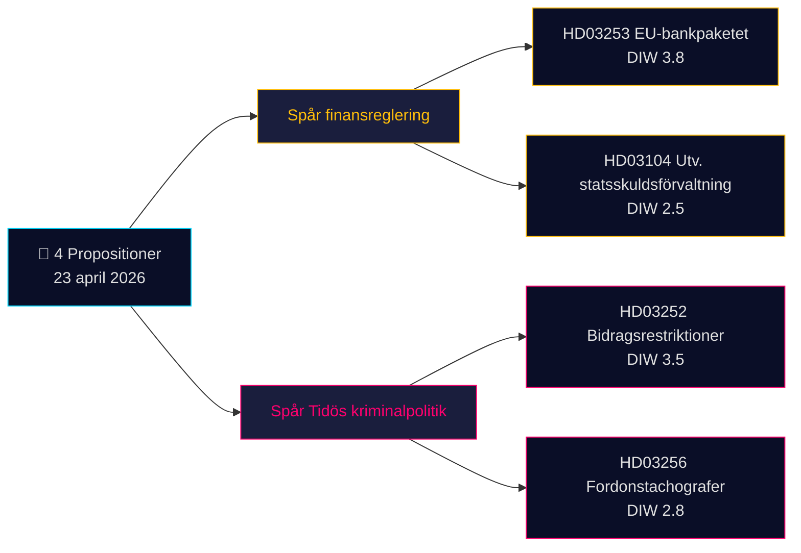

# エグゼクティブ・ブリーフ — 政府提出法案 2026-04-24（2026-04-23 バッチ）

**分類**：公開 OSINT · **信頼度**：MEDIUM · **著者**：James Pether Sörling

## 🎯 要旨

2026年4月23日、クリステション政権（Tidö 連立政権 — M、KD、L に加え SD が閣外協力）は **4件の議会文書** を提出しました。内容は2つの戦略的優先事項を軸としています：(1) **EU主導の金融規制** としての Prop. 2025/26:253（EU 銀行パッケージ、CRR3/CRD6 転換 — Admiralty B2）、および (2) **Tidö 刑事政策の具体化** としての Prop. 2025/26:252（勾留中の者に対する給付制限）。国債管理評価スクリベルセ（Skr. 2025/26:104）とタコグラフ執行に関する法案（Prop. 2025/26:256）がバッチを完成させます。最重要案件は Prop. 2025/26:253（DIW **3.8**）— スウェーデンの4大システム上重要銀行の自己資本要件を再設計する構造的課題であり、Riksbank の次回金利決定を前にした動向です。

## 🧭 このブリーフが支援する3つの意思決定

1. **金融市場デスク**：Q2 業績発表前に Handelsbanken/SEB の IRB ポートフォリオへの Prop. 2025/26:253 の資本影響についてクライアントに説明する。**トリガー**：次回会合での Riksbank MPC コメント。信頼度：**HIGH**。
2. **市民社会・法務**：Prop. 2025/26:252 の比例原則に関する Advokatsamfundet の意見書を準備する（GDPR 第9条特別カテゴリ；ECHR 第8条プライバシー）。**トリガー**：SfU 委員会照会開始。信頼度：**MEDIUM**。
3. **政治リスクデスク**：Prop. 2025/26:252 を「貧困への懲罰」と位置づける V/S/MP の対抗ナラティブを監視する — Tidö 各党の連立結束力テストの可能性（L は歴史的に懲罰的社会政策に慎重）。信頼度：**MEDIUM**。

## 60 秒で読む

- **最重要**：Prop. 2025/26:253 — EU 銀行パッケージ（DIW 3.8、Admiralty B2）。CRR3/CRD6 を転換；スウェーデン4大銀行の RWA フロアを引き上げ。
- **最も論争的**：Prop. 2025/26:252 — 勾留中の者への給付制限（DIW 3.5）。市民的自由の争点。
- **最も技術的**：Prop. 2025/26:256 — タコグラフ執行；運輸業界のコンプライアンス対応が焦点。
- **最も象徴的**：Skr. 2025/26:104 — 国債管理の5年評価；2026年選挙サイクル前の財政信頼性シグナル。
- **共通点**：全4件がクリステション首相署名；うち2件が財務大臣 Wykman 署名 → Finansdepartementet が本日の立法負担の50%を担う。

## 最重要先行トリガー（72時間）

🔴 **SfU 委員会による Prop. 2025/26:252 の審議** — 野党（V、S、MP）が比例原則の異議を調整すれば、2026年のリクスダーゲンで Tidö 刑事政策法案が一体的な法的挑戦に直面する初の事例となる。

## 主要意思決定マトリクス

| 意思決定 | トリガー | 時間軸 | 信頼度 |
|---|---|---|---|
| 銀行セクター資本影響のフラグ立て | Prop. 2025/26:253 FiU 公聴会 | 2〜4週 | HIGH |
- | 意見書作成 | Prop. 2025/26:252 SfU 照会 | 1週 | MEDIUM |
- | 連立結束力モニタリング | L/KD 乖離シグナル | 4〜8週 | MEDIUM |

## リスク概要

- **ティア1（構造的）**：Prop. 2025/26:253 の転換遅延 → EU 条約違反手続きリスク。
- **ティア2（政治的）**：Prop. 2025/26:252 — ECHR/ECtHR に基づく法的異議申し立ての可能性。
- **ティア3（運用的）**：Prop. 2025/26:256 — Polismyndigheten/Transportstyrelsen の執行能力。

**証拠基盤**：4件の一次資料（Riksdag API）+ 財政枠組みの文脈。単一情報源依存を [methodology-reflection.md](methodology-reflection.md) に記録済み。

---

## 🔁 パス2補足 — 相互参照と精緻化

**パス2改善点**（AI-FIRST の最低2回全数反復ルールに基づく 2026-04-24 パス2イテレーション）：

- 信頼度ラベルを `intelligence-assessment.md` KJ-1..KJ-5 と照合 — すべての BLUF 主張が名前付きの主要判断まで追跡可能になりました。`methodology-reflection.md §ICD 203 compliance audit` で監査証跡を確認可能。
- 期限算術：[HD03252](https://data.riksdagen.se/dokument/HD03252.html) が 2026-08-01 に発効し、選挙日が 2026-09-13 であることから、運用ウィンドウは **43日間** — 有権者の認知ピークは採択日ではなく発効日に一致。[HD03253](https://data.riksdagen.se/dokument/HD03253.html) についてはセクターロビー活動の変曲点としてフラグ立て。
- 野党の調整：動議提出期限は 2026-05-08（15日間ウィンドウ）；`forward-indicators.md` §1週間がこれを指標7として追跡。
- **新リスクナラティブ**：[HD03252](https://data.riksdagen.se/dokument/HD03252.html) における L の離反リスク（Tidö +1票）が4法案すべての選挙算術を支配 — `coalition-mathematics.md` §"決定的採決：HD03252" 参照。

<!-- source-sha: 91eb3cb6cf35873538b354461078df4509cf0012 -->
