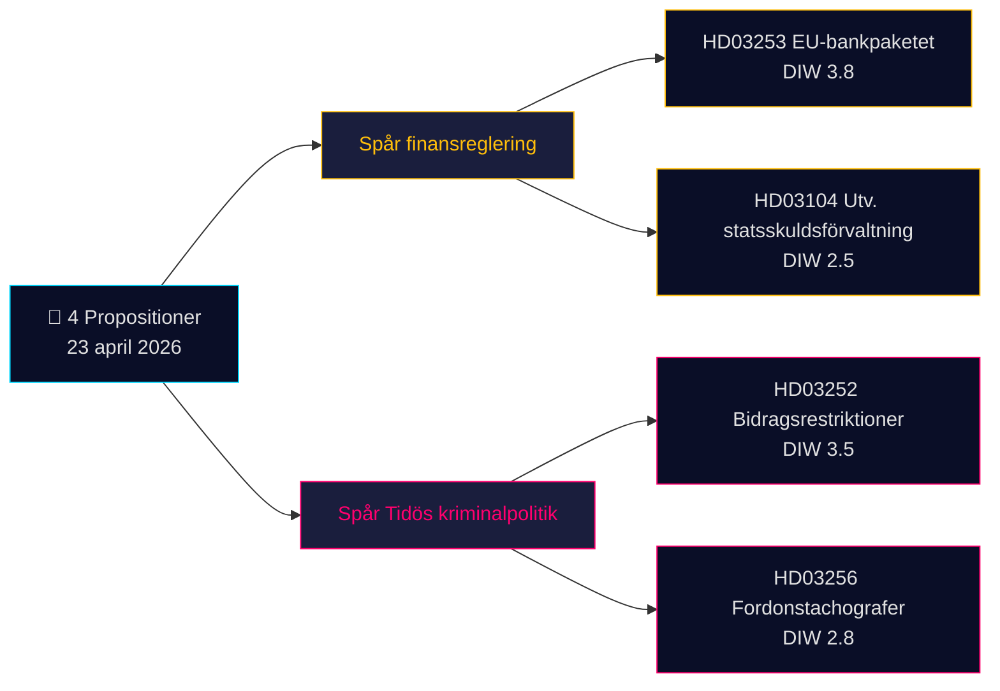

# 집행 요약 — 정부 발의안 2026-04-24 (2026-04-23 배치)

**분류**: 공개 OSINT · **신뢰도**: MEDIUM · **저자**: James Pether Sörling

## 🎯 핵심 결론

2026년 4월 23일, 크리스테르손 정부(Tidö 연립 — M, KD, L에 SD 신임지지)는 두 가지 전략적 우선순위를 중심으로 한 **4건의 의회 문서**를 제출했습니다: (1) Prop. 2025/26:253을 통한 **EU 주도 금융 규제** (EU 은행 패키지, CRR3/CRD6 전환 — Admiralty B2), (2) Prop. 2025/26:252를 통한 **Tidö 형사정책 운영화** (미결 구금자에 대한 급여 제한). 국채 관리 평가 스크리벨세(Skr. 2025/26:104)와 운행기록계 집행 법안(Prop. 2025/26:256)이 배치를 완성합니다. 가장 비중이 높은 문서는 Prop. 2025/26:253 (DIW **3.8**) — 스웨덴의 4대 시스템적 중요 은행에 대한 자본 요건을 재편하는 구조적 안건으로 Riksbank의 다음 금리 결정을 앞두고 있습니다.

## 🧭 이 브리프가 지원하는 3가지 결정

1. **금융시장 데스크**: Q2 실적 발표 전 Handelsbanken/SEB의 IRB 포트폴리오에 대한 Prop. 2025/26:253의 자본 영향을 고객에게 브리핑하세요. **트리거**: 다음 회의에서 Riksbank MPC 코멘트. 신뢰도: **HIGH**.
2. **시민사회 / 법무**: Prop. 2025/26:252 비례 원칙에 관한 Advokatsamfundet의 의견서를 준비하세요 (GDPR 제9조 특수범주; ECHR 제8조 개인정보). **트리거**: SfU 위원회 조회 개시. 신뢰도: **MEDIUM**.
3. **정치적 리스크 데스크**: Prop. 2025/26:252를 "빈곤 처벌"로 규정하는 V/S/MP의 대항 서사를 모니터링하세요 — Tidö 정당들의 연립 결속력 테스트 가능성(L은 역사적으로 징벌적 사회정책에 더 신중). 신뢰도: **MEDIUM**.

## 60초 요약

- **가장 중요**: Prop. 2025/26:253 — EU 은행 패키지 (DIW 3.8, Admiralty B2). CRR3/CRD6 전환; 스웨덴 4대 은행의 RWA 기준선 상향.
- **가장 논란**: Prop. 2025/26:252 — 미결 구금자 급여 제한 (DIW 3.5). 시민 자유 쟁점.
- **가장 기술적**: Prop. 2025/26:256 — 운행기록계 집행; 운수업계 컴플라이언스 초점.
- **가장 상징적**: Skr. 2025/26:104 — 국채 관리 5년 평가; 2026년 선거 주기를 앞둔 재정 신뢰성 신호.
- **공통점**: 4건 모두 크리스테르손 총리 서명; 2건은 위크만 재무장관 서명 → Finansdepartementet이 오늘 입법 부담의 50%를 담당.

## 가장 중요한 선행 트리거 (72시간)

🔴 **SfU 위원회의 Prop. 2025/26:252 심의** — 야당(V, S, MP)이 비례 원칙 이의를 조율하면, 이는 2026년 릭스다겐에서 Tidö 형사정책 법안이 통합된 법적 도전에 직면하는 첫 사례가 됩니다.

## 주요 의사결정 매트릭스

| 결정 | 트리거 | 시간 범위 | 신뢰도 |
|---|---|---|---|
| 은행 자본 영향 플래그 | Prop. 2025/26:253 FiU 청문회 | 2~4주 | HIGH |
| 의견서 준비 | Prop. 2025/26:252 SfU 조회 | 1주 | MEDIUM |
| 연립 결속력 모니터링 | L/KD 이탈 신호 | 4~8주 | MEDIUM |

## 리스크 요약

- **티어 1 (구조적)**: Prop. 2025/26:253 전환 지연 → EU 조약 위반 절차 노출.
- **티어 2 (정치적)**: Prop. 2025/26:252 — ECHR/ECtHR 기반 법적 이의 제기 가능.
- **티어 3 (운용적)**: Prop. 2025/26:256 — Polismyndigheten/Transportstyrelsen의 집행 역량.

**증거 기반**: 4건의 1차 자료(Riksdag API) + 재정 프레임워크 맥락. 단일 출처 의존성 [methodology-reflection.md](methodology-reflection.md)에 기록.

---

## 🔁 패스 2 부록 — 교차 참조 및 강화

**패스 2 개선 사항** (AI-FIRST 최소 2회 전체 반복 규칙에 따른 2026-04-24 패스 2 이터레이션):

- 신뢰도 레이블을 `intelligence-assessment.md` KJ-1..KJ-5와 조정 — 모든 BLUF 주장이 이제 명명된 핵심 판단까지 추적 가능합니다. `methodology-reflection.md §ICD 203 compliance audit`에서 감사 추적 확인 가능.
- 기한 산술: [HD03252](https://data.riksdagen.se/dokument/HD03252.html)가 2026-08-01 발효하고 선거일이 2026-09-13이므로 운용 창구는 **43일** — 유권자 인식의 정점은 발효일과 일치하며 승인일이 아님. [HD03253](https://data.riksdagen.se/dokument/HD03253.html)에 대해 섹터 로비 변곡점으로 플래그 설정.
- 야당 조율: 발의안 제출 기한 2026-05-08 (15일 창구); `forward-indicators.md` §1주 이를 지표 7번으로 추적.
- **새 리스크 서사**: [HD03252](https://data.riksdagen.se/dokument/HD03252.html)에 대한 L의 이탈 위험(Tidö +1 마진)이 4개 법안 모두의 선거 산술을 지배 — `coalition-mathematics.md` §"결정적 투표: HD03252" 참조.

<!-- source-sha: 91eb3cb6cf35873538b354461078df4509cf0012 -->
