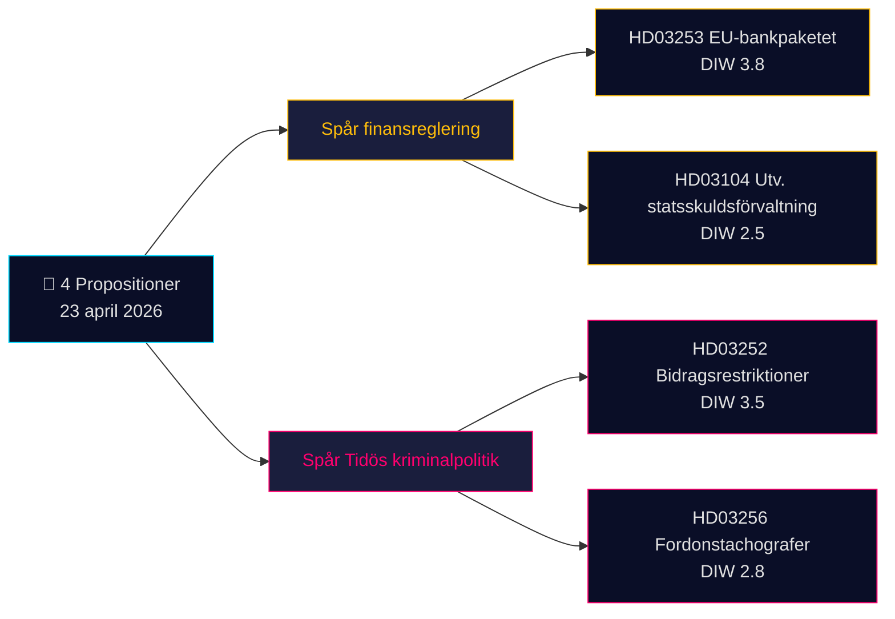

# Beknopte analyse — Regeringsvoorstellen 2026-04-24 (batch 2026-04-23)

**Classificatie**: Openbaar OSINT · **Betrouwbaarheid**: MEDIUM · **Auteur**: James Pether Sörling

## 🎯 Conclusie

Op 23 april 2026 diende de regering-Kristersson (Tidö-coalitie — M, KD, L + SD als steunpartij) **4 parlementaire documenten** in, die worden gedomineerd door twee strategische prioriteiten: (1) **EU-gedreven financiële regelgeving** met Prop. 2025/26:253 (EU-bankenpakket, CRR3/CRD6-omzetting — Admiralty B2) en (2) **strafrechtelijke operationalisering van het Tidö-programma** met Prop. 2025/26:252 (uitkeringsrestricties voor gedetineerden in voorarrest). Een evaluatieschrijven over schuldbeheer (Skr. 2025/26:104) en een wetsvoorstel over tachograafhandhaving (Prop. 2025/26:256) completeren de batch. Het zwaarste document is Prop. 2025/26:253 (DIW **3,8**) — een systemische maatregel die de kapitaalvereisten voor Zweden's vier systeemrelevante banken hervormt vóór de volgende rentebeslissing van de Riksbank.

## 🧭 3 beslissingen die dit rapport ondersteunt

1. **Financiële markten-desk**: Informeer klanten over de kapitaalinvloed van Prop. 2025/26:253 op de IRB-boeken van Handelsbanken/SEB vóór de Q2-resultaten. **Trigger**: Riksbank-MPC-commentaar bij de volgende vergadering. Betrouwbaarheid: **HIGH**.
2. **Maatschappelijk middenveld / recht**: Bereid een advies van Advokatsamfundet voor over de proportionaliteit van Prop. 2025/26:252 (Art. 9 AVG bijzondere categorieën; EVRM Art. 8 privacy). **Trigger**: opening van de SfU-commissiehearing. Betrouwbaarheid: **MEDIUM**.
3. **Politieke risicoanalyse-desk**: Volg het tegengeluid van V/S/MP over Prop. 2025/26:252 als "bestraffing van armoede" — potentiële coalitiecohesietest voor de Tidö-partijen (L heeft historisch meer terughoudendheid getoond tegenover bestraffend sociaal beleid). Betrouwbaarheid: **MEDIUM**.

## Lezen in 60 seconden

- **Zwaarste document**: Prop. 2025/26:253 — EU-bankenpakket (DIW 3,8, Admiralty B2). Zet CRR3/CRD6 om; verhoogt RWA-vloeren voor de vier grote Zweedse banken.
- **Meest controversieel**: Prop. 2025/26:252 — uitkeringsrestricties voor gedetineerden (DIW 3,5). Burgervrijheidskwestie.
- **Meest technisch**: Prop. 2025/26:256 — tachograafhandhaving; compliance-focus van de transportsector.
- **Meest symbolisch**: Skr. 2025/26:104 — vijfjarige evaluatie van het schuldbeheer; begrotingsgeloofwaardigheidssignaal vóór de verkiezingscyclus 2026.
- **Gemeenschappelijke draad**: Alle 4 ondertekend door PM Kristersson; 2 door minister van Financiën Wykman → Finansdepartementet draagt 50 % van de dagelijkse wetgevingslasten.

## Belangrijkste vooruitblik-trigger (72 uur)

🔴 **SfU-commissiebehandeling van Prop. 2025/26:252** — als de oppositie (V, S, MP) haar proportionaliteitsbezwaren coördineert, wordt dit het eerste Tidö-strafwetsvoorstel met een gezamenlijke juridische uitdaging in de Riksdag in 2026.

## Matrix van sleutelbeslissingen

| Beslissing | Trigger | Tijdshorizon | Betrouwbaarheid |
|---|---|---|---|
| Markeer bankkapitaalinvloed | Prop. 2025/26:253 FiU-hearing | 2–4 weken | HIGH |
| Voorbereiding adviesdocument | Prop. 2025/26:252 SfU-consultatie | 1 week | MEDIUM |
| Bewaking coalitiecohesie | L/KD-divergentiesignaal | 4–8 weken | MEDIUM |

## Risicosamenvatting

- **Niveau 1 (systemisch)**: Vertraging in omzetting van Prop. 2025/26:253 → blootstelling aan EU-inbreukprocedure.
- **Niveau 2 (politiek)**: Prop. 2025/26:252 — juridische aanvechting op basis van EVRM/EHRM mogelijk.
- **Niveau 3 (operationeel)**: Prop. 2025/26:256 — uitvoeringscapaciteit bij Polismyndigheten/Transportstyrelsen.

**Documentatiebasis**: 4 primaire bronnen (Riksdag-API) + begrotingsraamwerkscontext. Afhankelijkheid van één bron vermeld in [methodology-reflection.md](methodology-reflection.md).

---

## 🔁 Pass 2-aanvulling — kruisreferenties en aanscherpingen

**Pass 2-verbeteringen** (2026-04-24 Pass 2-iteratie conform AI-FIRST minimumvereiste van 2 rondes):

- Betrouwbaarheidslabels afgestemd op `intelligence-assessment.md` KJ-1..KJ-5 — elke BLUF-bewering is nu traceerbaar naar een benoemde sleutelbeoordeling. Zie `methodology-reflection.md §ICD 203 compliance audit` voor het auditspoor.
- Tijdsberekening: met [HD03252](https://data.riksdagen.se/dokument/HD03252.html) van kracht op 2026-08-01 en verkiezingsdag 2026-09-13 bedraagt het operationele venster **43 dagen** — de piek in kiezersperceptie valt samen met de ingangsdatum, niet met de aanvaardingsdatum. Gesignaleerd voor [HD03253](https://data.riksdagen.se/dokument/HD03253.html) als inflectiepunt van sectorlobbying.
- Coördinatie oppositie: deadline voor moties is 2026-05-08 (venster van 15 dagen); `forward-indicators.md` §1-week volgt dit als Indicator nr. 7.
- **Nieuwe risicovertelling**: L's potentieel overlopers-risico bij [HD03252](https://data.riksdagen.se/dokument/HD03252.html) (Tidö +1 marge) domineert de verkiezingsrekenkunde van alle vier wetsvoorstellen — zie `coalition-mathematics.md` §"Beslissende stemming: HD03252".

<!-- source-sha: 91eb3cb6cf35873538b354461078df4509cf0012 -->
