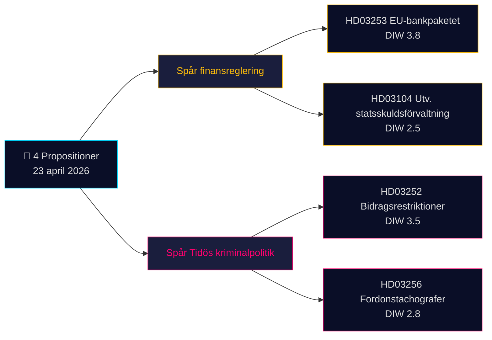

# Kortrapport — Forslag 2026-04-24 (parti 2026-04-23)

**Klassifikasjon**: Offentlig OSINT · **Konfidens**: MEDIUM · **Forfatter**: James Pether Sörling

## 🎯 Konklusjon

Den 23. april 2026 la Kristersson-regjeringen (Tidö-koalisjonen — M, KD, L + SD som støtteparti) frem **4 parlamentariske dokumenter** dominert av to strategiske prioriteringer: (1) **EU-drevet finansregulering** med Prop. 2025/26:253 (EU-bankpakken, CRR3/CRD6-transposisjon — Admiralty B2) og (2) **Tidøs strafferetlige operasjonalisering** med Prop. 2025/26:252 (ytelsesrestriksjoner for varetektsfengslede). Et evalueringsskriv om statsgjeldforvaltning (Skr. 2025/26:104) og et lovforslag om tachografer (Prop. 2025/26:256) kompletterer batchen. Tyngst vekt bærer Prop. 2025/26:253 (DIW **3,8**) — et systemisk anliggende som omformer kapitalkravene for Sveriges fire systemviktige banker foran Riksbankens neste rentebeslutning.

## 🧭 3 beslutninger dette resuméet støtter

1. **Finansmarkedsdesk**: Informer klienter om kapitalvirkningene av Prop. 2025/26:253 for Handelsbanken/SEBs IRB-bøker foran Q2-regnskapene. **Utløser**: Riksbankens MPC-kommentar ved neste møte. Konfidens: **HIGH**.
2. **Sivilsamfunn / jus**: Forbered Advokatsamfundets høringsuttalelse til Prop. 2025/26:252 om proporsjonalitet (Art. 9 GDPR spesialkategorier; ECHR Art. 8 privatliv). **Utløser**: SfU-komiteens høring åpner. Konfidens: **MEDIUM**.
3. **Politisk risikoanalyse**: Følg V/S/MPs motfortelling om Prop. 2025/26:252 som "fattigdomsstraff" — potensiell koalisjonskohesjonstest for Tidø-partiene (L har historisk vist større nøling overfor straffende sosialpolitikk). Konfidens: **MEDIUM**.

## 60-sekunders lesning

- **Tyngst vekt**: Prop. 2025/26:253 — EU-bankpakken (DIW 3,8, Admiralty B2). Transponerer CRR3/CRD6; hever RWA-gulv for de fire store svenske bankene.
- **Mest kontroversielt**: Prop. 2025/26:252 — ytelsesrestriksjoner for varetektsfengslede (DIW 3,5). Borgerfrihets­spørsmål.
- **Mest teknisk**: Prop. 2025/26:256 — tachografhåndhevelse; transportbransjens compliance-fokus.
- **Mest symbolsk**: Skr. 2025/26:104 — 5-årig evaluering av statsgjeldforvaltningen; finanspolitisk troverdighets­signal foran valgyklusen 2026.
- **Felles tråd**: Alle 4 undertegnet av statsminister Kristersson; 2 av finansminister Wykman → Finansdepartementet bærer 50 % av dagens lovgivningsbyrde.

## Viktigste fremtidige utløser (72 t)

🔴 **SfU-komiteens behandling av Prop. 2025/26:252** — hvis opposisjonen (V, S, MP) koordinerer proporsjonalitets­innsigelser, blir dette det første Tidø-kriminalpolitiske lovforslaget med et samlet rettslig utfordringsangrep i Riksdagen i 2026.

## Nøkkelbeslutningsmatrise

| Beslutning | Utløser | Tidshorisont | Konfidens |
|---|---|---|---|
| Flagg banksektorens kapitalvirkning | Prop. 2025/26:253 FiU-høring | 2–4 uker | HIGH |
| Forberedelse av høringsuttalelse | Prop. 2025/26:252 SfU-høring | 1 uke | MEDIUM |
| Koalisjonskohesjonsovervåking | L/KD-divergenssignal | 4–8 uker | MEDIUM |

## Risikosammendrag

- **Nivå 1 (systemisk)**: Forsinket transposisjon av Prop. 2025/26:253 → eksponering for EU-traktatsbruddssak.
- **Nivå 2 (politisk)**: Prop. 2025/26:252 — rettslig utfordring basert på ECHR/ECtHR er mulig.
- **Nivå 3 (operasjonelt)**: Prop. 2025/26:256 — gjennomføringskapasitet hos Polismyndigheten/Transportstyrelsen.

**Dokumentasjonsgrunnlag**: 4 primærkilder (Riksdagens API) + finanspolitisk rammesammenheng. Enkildesavhengighet notert i [methodology-reflection.md](methodology-reflection.md).

---

## 🔁 Pass 2-tillegg — kryssreferanser og stramning

**Pass 2-forbedringer** (2026-04-24 Pass 2-iterasjon i henhold til AI-FIRST minimumskrav om 2 runder):

- Konfidensmerker avstemt mot `intelligence-assessment.md` KJ-1..KJ-5 — hvert BLUF-utsagn er nå sporbart til et navngitt nøkkelanslag. Se `methodology-reflection.md §ICD 203 compliance audit` for revisjonsspor.
- Tidsregning: med [HD03252](https://data.riksdagen.se/dokument/HD03252.html) i kraft 2026-08-01 og valgdag 2026-09-13 er det operative vinduet **43 dager** — velgernes oppfattelse topper ved ikrafttredelsen, ikke ved vedtakelsen. Flagget for [HD03253](https://data.riksdagen.se/dokument/HD03253.html) som sektorlobbyi­ingsmens infleksjonspunkt.
- Opposisjonens koordinerte aktivitet: motionsfristen utløper 2026-05-08 (15-dagersvindus); `forward-indicators.md` §1-uke følger dette som Indikator nr. 7.
- **Ny risikofortelling**: Ls potensielle avhopperrisiko vedrørende [HD03252](https://data.riksdagen.se/dokument/HD03252.html) (Tidø +1 margin) dominerer alle fire lovforslagenes valgmatematikk — se `coalition-mathematics.md` §"Avgjørende avstemning: HD03252".

<!-- source-sha: 91eb3cb6cf35873538b354461078df4509cf0012 -->
