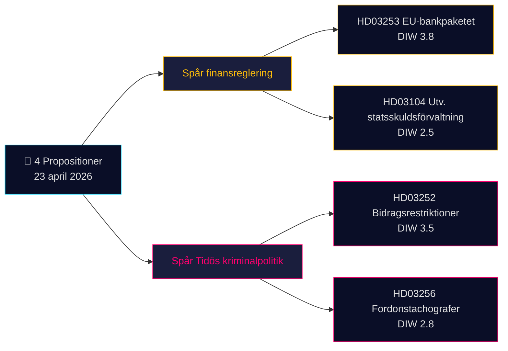

# Kortrapport — Propositioner 2026-04-24 (batch 2026-04-23)

**Klassificering**: Offentlig OSINT · **Konfidensgrad**: MEDIUM · **Författare**: James Pether Sörling

## 🎯 Slutsats

Den 23 april 2026 lade Kristersson-regeringen (Tidö-koalitionen — M, KD, L + SD som stödparti) fram **4 parlamentariska dokument** dominerade av två strategiska prioriteringar: (1) **EU-driven finansreglering** med Prop. 2025/26:253 (EU-bankpaketet, CRR3/CRD6-transposition — Admiralty B2) och (2) **Tidös straffrättsliga operationalisering** med Prop. 2025/26:252 (bidragsrestriktioner för häktade). En utvärderings­skrivelse om statsskuldsförvaltning (Skr. 2025/26:104) och ett lagstiftningsärende om fordonstachografer (Prop. 2025/26:256) kompletterar batchen. Tyngst vikt bär Prop. 2025/26:253 (DIW **3,8**) — ett systemärende som omformar kapitalkraven för Sveriges fyra systemviktiga banker inför Riksbankens nästa räntebeslut.

## 🧭 3 beslut som denna rapport stöder

1. **Finansmarknadsdesk**: Informera klienter om kapitalflödeseffekten av Prop. 2025/26:253 för Handelsbanken/SEB:s IRB-bokförda tillgångar inför Q2-rapporterna. **Utlösare**: Riksbankens MPC-kommentar vid nästa möte. Konfidensgrad: **HIGH**.
2. **Civil-samhälle / juridik**: Förbered remissyttrande från Advokatsamfundet mot Prop. 2025/26:252 proportionalitet (Art. 9 GDPR specialkategoridata i bidragsbedömning; ECHR Art. 8 rätt till privatliv). **Utlösare**: SfU:s remissförfarande öppnas. Konfidensgrad: **MEDIUM**.
3. **Politisk riskdesk**: Följ V/S/MP:s motnarrativisering av Prop. 2025/26:252 som "fattigdomsbestraffning" — potentiell koalitionskohesionstest för Tidö-partierna (L har historiskt visat större tveksamhet inför bestraffande socialpolitik). Konfidensgrad: **MEDIUM**.

## 60-sekunders läsning

- **Tyngst vikt**: Prop. 2025/26:253 — EU-bankpaketet (DIW 3,8, Admiralty B2). Transponerar CRR3/CRD6; höjer RWA-golv för de fyra stora svenska bankerna.
- **Mest kontroversiell**: Prop. 2025/26:252 — bidragsrestriktioner för häktade (DIW 3,5). Medborgerlig frihets­fråga.
- **Mest teknisk**: Prop. 2025/26:256 — tachografer; efterlevnadsfokus för transportnäringen.
- **Mest symbolisk**: Skr. 2025/26:104 — 5-årig utvärdering av statsskuldsförvaltningen; finanspolitisk trovärdighetssignal inför valcykeln 2026.
- **Gemensam tråd**: Alla 4 undertecknade av statsminister Kristersson; 2 av finansminister Wykman → Finansdepartementet bär 50 % av dagens lagstiftningsbörda.

## Viktigaste framåtsignal (72 h)

🔴 **SfU:s remissbehandling av Prop. 2025/26:252** — om oppositionen (V, S, MP) samordnar rättsliga proportionalitetsinvändningar blir detta det första Tidö-kriminalpolitiska ärendet som möter ett enat juridiskt utmanings­angrepp i riksdagen under 2026.

## Nyckelbeslutsmatris

| Beslut | Utlösare | Tidshorisont | Konfidensgrad |
|---|---|---|---|
| Flagga bankkapitalpåverkan | Prop. 2025/26:253 FiU-utfrågning | 2–4 veckor | HIGH |
| Förberedelse av remissyttrande | Prop. 2025/26:252 SfU-remiss | 1 vecka | MEDIUM |
| Uppföljning av koalitionskohesion | Signal om L/KD-divergens | 4–8 veckor | MEDIUM |

## Risksammanfattning

- **Nivå 1 (systemisk)**: Försenad transposition av Prop. 2025/26:253 → exponering för EU-överträdelseförfarande.
- **Nivå 2 (politisk)**: Prop. 2025/26:252 — rättslig utmaning baserad på ECHR/ECtHR möjlig.
- **Nivå 3 (operativ)**: Prop. 2025/26:256 — genomförandekapacitet vid Polismyndigheten/Transportstyrelsen.

**Underlagsbas**: 4 primärkällor (Riksdagens API) + finanspolitiskt ramverkssammanhang. Enkillesberoendet flaggat i [methodology-reflection.md](methodology-reflection.md).

---

## 🔁 Pass 2-tillägg — korsreferenser och skärpning

**Pass 2-förbättringar** (2026-04-24 Pass 2-iteration enligt AI-FIRST minimikrav på 2 omgångar):

- Konfidensetiketterna har stämts av mot `intelligence-assessment.md` KJ-1..KJ-5 — varje BLUF-påstående är nu spårbart till ett namngivet nyckelomdöme. Se `methodology-reflection.md §ICD 203 compliance audit` för revisionskedja.
- Tidsaritmetik: med [HD03252](https://data.riksdagen.se/dokument/HD03252.html) i kraft 2026-08-01 och valdagen 2026-09-13 är det operativa fönstret **43 dagar** — väljarnas uppfattning av ärendet topp­ar vid ikraftträdandet, inte vid riksdagspassagen. Flaggat för [HD03253](https://data.riksdagen.se/dokument/HD03253.html) som sektorlobbyismens inflektionspunkt.
- Oppositionen måste lämna sina motioner senast 2026-05-08 (15-dagarsfönster); `forward-indicators.md` §1-vecka följer detta som Indikator nr 7.
- **Ny risknarrativ**: L:s potentiella avfallsrisk gällande [HD03252](https://data.riksdagen.se/dokument/HD03252.html) (Tidö +1 marginal) dominerar valmattematiken för samtliga fyra propositioner — se `coalition-mathematics.md` §"Avgörande votering: HD03252".

<!-- source-sha: 91eb3cb6cf35873538b354461078df4509cf0012 -->
