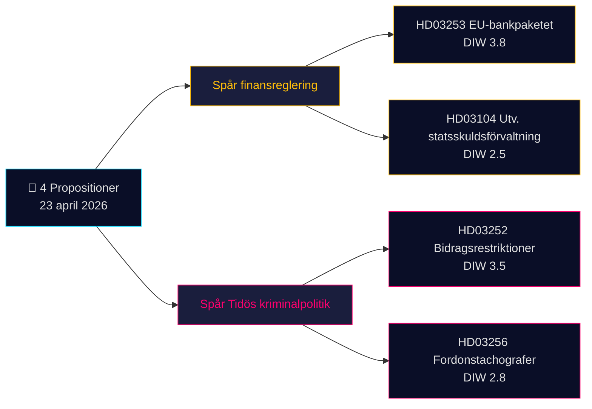

# 执行摘要 — 政府提案 2026-04-24（2026-04-23 批次）

**分类**：公开 OSINT · **置信度**：MEDIUM · **作者**：James Pether Sörling

## 🎯 核心结论

2026年4月23日，克里斯特松政府（Tidö 联合政府 — M、KD、L，SD 为信任支持方）提交了 **4份议会文件**，由两大战略优先事项主导：(1) **欧盟驱动的金融监管**，即 Prop. 2025/26:253（欧盟银行业监管一揽子法案，CRR3/CRD6 转化 — Admiralty B2）；(2) **Tidö 刑事政策落地**，即 Prop. 2025/26:252（对羁押候审人员实施福利限制）。国债管理评估通函（Skr. 2025/26:104）和行车记录仪执法法案（Prop. 2025/26:256）共同构成本批次。权重最高的是 Prop. 2025/26:253（DIW **3.8**）——这是一项系统性举措，将在 Riksbank 下次利率决定前重塑瑞典四大系统重要性银行的资本要求。

## 🧭 本摘要支持的 3 项决策

1. **金融市场部门**：在 Q2 业绩公布前，就 Prop. 2025/26:253 对 Handelsbanken/SEB IRB 账簿的资本影响向客户进行情况介绍。**触发条件**：Riksbank 货币政策委员会在下次会议上发表评论。置信度：**HIGH**。
2. **公民社会 / 法律**：准备 Advokatsamfundet 就 Prop. 2025/26:252 比例原则的意见（GDPR 第9条特殊类别；ECHR 第8条隐私权）。**触发条件**：SfU 委员会转交程序开启。置信度：**MEDIUM**。
3. **政治风险部门**：监测 V/S/MP 将 Prop. 2025/26:252 定性为"惩罚贫困"的反叙事——Tidö 各党联合凝聚力的潜在考验（L 在历史上对惩罚性社会政策更为审慎）。置信度：**MEDIUM**。

## 60 秒速读

- **最重要**：Prop. 2025/26:253 — 欧盟银行业一揽子法案（DIW 3.8，Admiralty B2）。转化 CRR3/CRD6；提高四大瑞典银行的 RWA 下限。
- **最具争议**：Prop. 2025/26:252 — 羁押候审人员福利限制（DIW 3.5）。公民自由争议焦点。
- **最具技术性**：Prop. 2025/26:256 — 行车记录仪执法；运输行业合规重点。
- **最具象征意义**：Skr. 2025/26:104 — 国债管理五年评估；2026年选举周期前的财政公信力信号。
- **共同线索**：全部4件均由克里斯特松首相签署；2件由财政大臣 Wykman 签署 → Finansdepartementet 承担当日50%的立法负荷。

## 最重要的前瞻触发因素（72 小时）

🔴 **SfU 委员会对 Prop. 2025/26:252 的审查** — 若反对党（V、S、MP）协调比例原则异议，这将成为2026年 Riksdag 中 Tidö 刑事政策法案首次遭遇联合法律挑战。

## 关键决策矩阵

| 决策 | 触发条件 | 时间范围 | 置信度 |
|---|---|---|---|
| 标记银行业资本影响 | Prop. 2025/26:253 FiU 听证会 | 2–4 周 | HIGH |
| 准备意见书 | Prop. 2025/26:252 SfU 咨询 | 1 周 | MEDIUM |
| 监测联合凝聚力 | L/KD 分歧信号 | 4–8 周 | MEDIUM |

## 风险摘要

- **第一层（系统性）**：Prop. 2025/26:253 转化延迟 → 面临欧盟违约程序风险。
- **第二层（政治性）**：Prop. 2025/26:252 — 可能基于 ECHR/ECtHR 提出法律挑战。
- **第三层（运营性）**：Prop. 2025/26:256 — Polismyndigheten/Transportstyrelsen 的执法能力。

**证据基础**：4份一手资料（Riksdag API）+ 财政框架背景。单一来源依赖情况已在 [methodology-reflection.md](methodology-reflection.md) 中标注。

---

## 🔁 第 2 轮附录 — 交叉引用与精炼

**第 2 轮改进**（按照 AI-FIRST 最低两轮完整迭代规则进行的 2026-04-24 第 2 轮迭代）：

- 置信度标签已与 `intelligence-assessment.md` KJ-1..KJ-5 对齐 — 每项 BLUF 声明现均可追溯至具名的关键判断。审计路径见 `methodology-reflection.md §ICD 203 compliance audit`。
- 时间推算：[HD03252](https://data.riksdagen.se/dokument/HD03252.html) 于 2026-08-01 生效，选举日为 2026-09-13，运营窗口为 **43天** — 选民认知高峰与生效日期一致，而非通过日期。已将 [HD03253](https://data.riksdagen.se/dokument/HD03253.html) 标记为行业游说的拐点。
- 反对党协调：提案提交截止日期为 2026-05-08（15天窗口）；`forward-indicators.md` §第1周将其追踪为指标7。
- **新风险叙事**：L 在 [HD03252](https://data.riksdagen.se/dokument/HD03252.html) 上的潜在脱党风险（Tidö +1 席位差距）主导四项法案的选举算术——见 `coalition-mathematics.md` §"决定性投票：HD03252"。

<!-- source-sha: 91eb3cb6cf35873538b354461078df4509cf0012 -->
