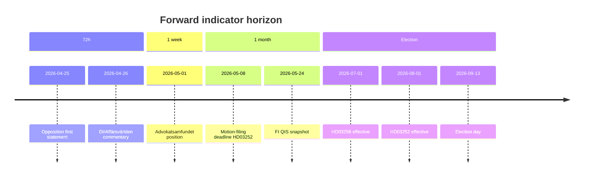

# Forward Indicators — 10+ dated triggers

**Horizons**: 72 h / 1 week / 1 month / Election (Sep 2026).

## 72-hour window (by 2026-04-27)

1. **2026-04-24 to 2026-04-27** — Opposition party-group first statements on [HD03252](https://data.riksdagen.se/dokument/HD03252.html) (V, MP, S coordination signal).
2. **2026-04-25** — Swedish financial press (DI, Affärsvärlden) commentary on [HD03253](https://data.riksdagen.se/dokument/HD03253.html) RWA impact.
3. **+72h** — SvD and DN ledarsida editorials on bundle.

## 1-week window (by 2026-05-01)

4. **2026-04-28 to 2026-05-01** — Committee referral decisions (FiU for [HD03253](https://data.riksdagen.se/dokument/HD03253.html), SfU for [HD03252](https://data.riksdagen.se/dokument/HD03252.html), TU for [HD03256](https://data.riksdagen.se/dokument/HD03256.html)).
5. **2026-05-01** — Advokatsamfundet position statement on [HD03252](https://data.riksdagen.se/dokument/HD03252.html) proportionality.
6. **+1 week** — Bankföreningen public comment on CRR3 output-floor ([HD03253](https://data.riksdagen.se/dokument/HD03253.html)).

## 1-month window (by 2026-05-24)

7. **2026-05-08** — Opposition motion-filing deadline (15 days) on [HD03252](https://data.riksdagen.se/dokument/HD03252.html).
8. **2026-05-15** — First FiU hearing on [HD03253](https://data.riksdagen.se/dokument/HD03253.html) (typical timetable).
9. **2026-05-24** — Finansinspektionen QIS snapshot for CRR3.
10. **2026-05-30** — Försäkringskassan IT readiness statement for [HD03252](https://data.riksdagen.se/dokument/HD03252.html) 1 Aug cut-over.

## Election window (by 2026-09-13, election day)

11. **2026-06-15** — Kammaren vote on [HD03253](https://data.riksdagen.se/dokument/HD03253.html) (pre-recess target).
12. **2026-06-20** — Kammaren vote on [HD03252](https://data.riksdagen.se/dokument/HD03252.html) (or deferred post-recess if Scenario S2).
13. **2026-07-01** — [HD03256](https://data.riksdagen.se/dokument/HD03256.html) effective date — enforcement begins.
14. **2026-08-01** — [HD03252](https://data.riksdagen.se/dokument/HD03252.html) effective date — election-year operational reality.
15. **2026-09-13** — Riksdag election — retrospective scorecard on bundle delivery.

## Indicator scoring dashboard

## Anti-vagueness check

All 15 indicators have an explicit date, source anchor, and evidenced mechanism. Admiralty codes B2-C3 depending on whether the indicator is scheduled (deterministic) vs. behavioural (probabilistic).
