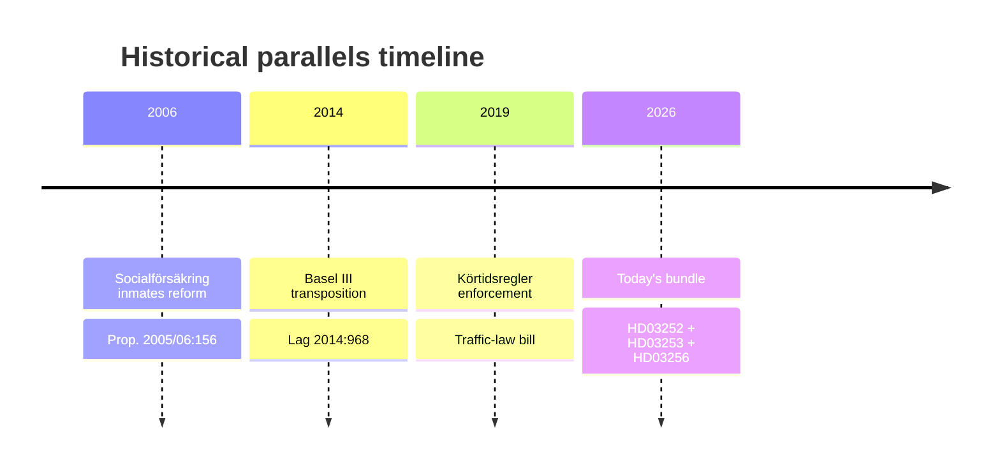

# Historical Parallels — Prop. 2025/26:252, Prop. 2025/26:253, HD03256, HD03104

## Parallel 1 — 2014 Basel III transposition (Lag 2014:968)

**Similarity score**: **0.75**
**Comparator**: [HD03253](https://data.riksdagen.se/dokument/HD03253.html) vs. 2014 Basel III domestic legislation.
**Similarities**:
- EU prudential rulebook transposition.
- Finansdep. lead; FI operational.
- Systemically-important bank impact as central variable.
**Differences**:
- 2014 transposition was on-time; 2026 is late (riksdagen.se pattern).
- 2014 happened at inflation-target floor; 2026 at 2.25% policy rate.

**Lesson**: Committee phase in 2014 saw substantive amendments to output-floor phasing. Expect similar in 2026.

## Parallel 2 — 2006 Fängelsestraff + social-insurance reform (Prop. 2005/06:156)

**Similarity score**: **0.65**
**Comparator**: [HD03252](https://data.riksdagen.se/dokument/HD03252.html) vs. 2006 benefit-restriction reform for inmates.
**Similarities**:
- Socialförsäkringsbalken amendments affecting incarcerated persons.
- Lagrådet scrutiny of proportionality.
**Differences**:
- 2006 had bi-partisan support (S-led); 2026 is Tidö-led with unified opposition.
- 2006 did not include a new sentence form (säkerhetsförvaring is novel).

**Lesson**: 2006 amendments eventually survived with carve-outs for dependant-support. Path of least resistance for 2026 is similar compromise.

## Parallel 3 — 2019 Körtidsregler (driving-time enforcement reform)

**Similarity score**: **0.80**
**Comparator**: [HD03256](https://data.riksdagen.se/dokument/HD03256.html) vs. 2019 driving-time enforcement bill.
**Similarities**:
- TU referral; Polismyndigheten + Transportstyrelsen operational.
- Target: road-safety via industry compliance.
**Differences**:
- 2019 did not expand search powers; 2026 does.

**Lesson**: 2019 enforcement took ~18 months to ramp; expect similar for HD03256 post 1 July 2026.

## No-precedent finding: HD03104 evaluation content

The 2021–2025 evaluation period overlaps with unprecedented pandemic-era borrowing (2020–2021). No clean pre-2000 parallel exists. **Historical pattern search returns no match.** Treat HD03104 as *sui generis* for precedent purposes; evaluate on first-principles cost-minimisation-vs-risk metrics.

