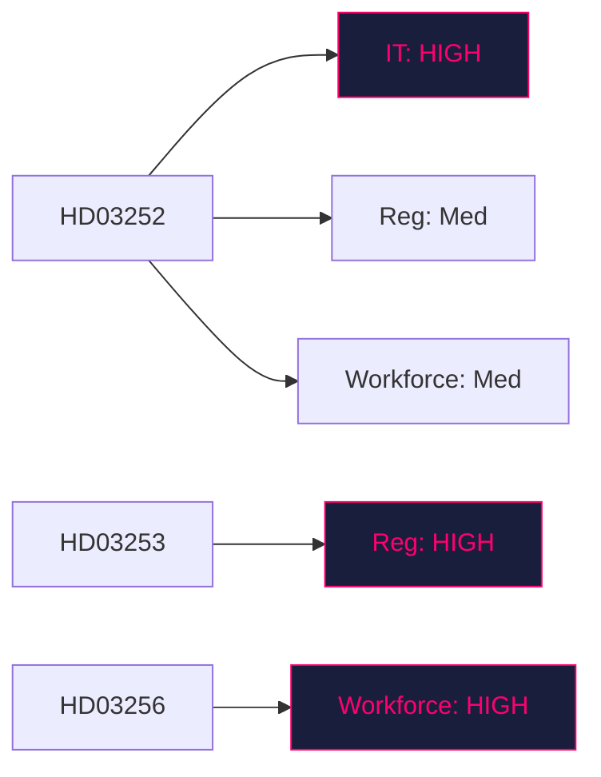

# Implementation Feasibility — Prop. 2025/26:252, Prop. 2025/26:253, Prop. 2025/26:256, Skr. 2025/26:104

## Delivery-risk register (four lenses per bill)

### HD03252 — Detainee benefits restriction

| Lens | Risk level | Notes |
|---|:-:|---|
| Budget | Low | §7 konsekvenser of [HD03252](https://data.riksdagen.se/dokument/HD03252.html) estimates modest savings — not a budget stress point |
| IT | **HIGH** | Försäkringskassan must update benefit-eligibility rules engine by 1 Aug 2026 — ~3 months from passage |
| Regulatory | Medium | Lagrådet proportionality feedback (Bilaga 5) may force implementing-regulation language changes |
| Workforce | Medium | Kriminalvården + Försäkringskassan case-worker retraining |

### HD03253 — EU Banking Package

| Lens | Risk level | Notes |
|---|:-:|---|
| Budget | Low | Regulatory-compliance burden falls on banks, not state |
| IT | Medium | FI supervisory data-ingestion updates for CRR3 disclosures |
| Regulatory | **HIGH** | Interplay with existing Swedish systemic-risk buffers; Basel III endgame complexity |
| Workforce | Low | FI hiring plan already in motion from 2023 QIS work |

### HD03256 — Tachograph enforcement

| Lens | Risk level | Notes |
|---|:-:|---|
| Budget | Medium | Training Polismyndigheten + bilinspektörer on new search protocols |
| IT | Low | Existing tachograph database sufficient |
| Regulatory | Low | Clear EU framework |
| Workforce | **HIGH** | Bilinspektör role expansion requires cert program; 1 July 2026 deadline tight |

### HD03104 — Debt-mgmt evaluation

Reporting only — no implementation risk.

## Backlog audit

| Adjacent pending reform | Interaction with today's bundle |
|---|---|
| Pending revision of arbetslöshetsförsäkring | Administrative overlap with Försäkringskassan IT workload |
| FI AI-risk supervisory framework | CRR3 disclosure co-dependencies |
| Transport planning bill 2026 | Tachograph enforcement sync |

## Mermaid — delivery-risk heat map

