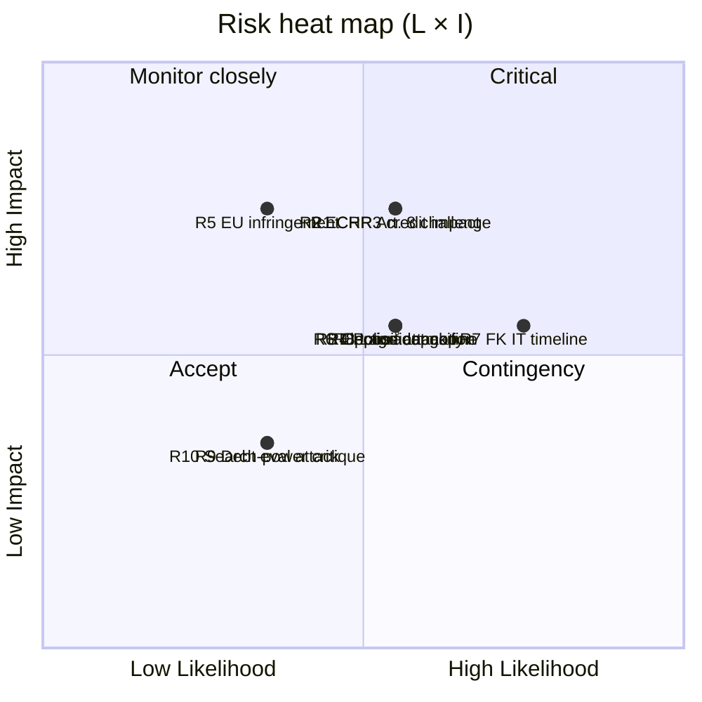

# Risk Assessment (5-dimension register) — 2026-04-24

**Framework**: per `analysis/methodologies/political-risk-methodology.md` — dimensions: Political, Institutional, Economic, Social/Rights, Operational.

## Risk register

| # | Dimension | Risk | L (1–5) | I (1–5) | Score | dok_id anchor | Mitigation |
|---|---|---|:-:|:-:|:-:|---|---|
| R1 | Economic | Output-floor adoption causes procyclical credit contraction at Handelsbanken/SEB | 3 | 4 | 12 | [HD03253](https://data.riksdagen.se/dokument/HD03253.html) | Phased transition, FI/Riksbanken coordination |
| R2 | Social/Rights | Benefit restriction disproportionately impacts detainees with dependants → ECHR Art. 8 | 3 | 4 | 12 | [HD03252](https://data.riksdagen.se/dokument/HD03252.html) | Lagrådet review; proportionality clause in beredning |
| R3 | Political | Opposition (V/S/MP) unified motion against HD03252 during committee stage | 3 | 3 | 9 | [HD03252](https://data.riksdagen.se/dokument/HD03252.html) | M/KD/L/SD whip discipline |
| R4 | Institutional | Polismyndigheten/Transportstyrelsen lacks capacity to operationalise search powers | 3 | 3 | 9 | [HD03256](https://data.riksdagen.se/dokument/HD03256.html) | Budget allocation in höstbudget; training ramp |
| R5 | Economic | Late CRR3 transposition → EU Commission infringement procedure | 2 | 4 | 8 | [HD03253](https://data.riksdagen.se/dokument/HD03253.html) | Accelerated FiU timetable |
| R6 | Political | HD03252 becomes 2026 election attack vector against Tidö | 3 | 3 | 9 | [HD03252](https://data.riksdagen.se/dokument/HD03252.html) | Messaging discipline; frame as "fair responsibility" |
| R7 | Operational | Försäkringskassan IT changes to implement benefit-restriction logic by 1 Aug 2026 | 4 | 3 | 12 | [HD03252](https://data.riksdagen.se/dokument/HD03252.html) | §7 konsekvenser in proposition — implementation timeline flagged |
| R8 | Institutional | Lagrådet's existing yttrande on HD03252 contains proportionality critique not yet fully addressed | 3 | 3 | 9 | [HD03252](https://data.riksdagen.se/dokument/HD03252.html) Bilaga 5 | SfU redrafts during committee |
| R9 | Economic | Debt-management evaluation (HD03104) exposes opposition attack lines on pandemic-era borrowing | 2 | 2 | 4 | [HD03104](https://data.riksdagen.se/dokument/HD03104.html) | Government narrative preparation |
| R10 | Social/Rights | Expanded search powers (HD03256) criticised by Advokatsamfundet | 2 | 2 | 4 | [HD03256](https://data.riksdagen.se/dokument/HD03256.html) | Proportionality safeguards in §5.2 |

## Heat map (L × I)

## Cascading chains

1. **R7 → R2 → R3 → R6**: Försäkringskassan IT slippage delays [HD03252](https://data.riksdagen.se/dokument/HD03252.html) implementation, opening the door for rights-based critique, enabling opposition motion, escalating to 2026 election attack.
2. **R5 → R1**: Late CRR3 transposition → accelerated FiU timetable → insufficient industry consultation → harsher-than-necessary capital impact on Swedish banks.

## Bayesian posterior notes

- **Prior (P(Tidö delivers HD03252 on schedule))**: 0.7 (based on Tidö's 2023–25 legislative track record).
- **Posterior given Lagrådet yttrande exists but with proportionality comments**: 0.55 — reduced by the signal that legal review flagged issues.
- **Posterior given FK 3-month IT runway**: 0.45 — operational timing is the binding constraint.

**Sources**: All risks anchored to document text at [riksdagen.se](https://data.riksdagen.se/dokument/HD03253.html) and [riksdagen.se](https://data.riksdagen.se/dokument/HD03252.html). Admiralty code B2 (usually reliable source, probably true — government proposition text).
