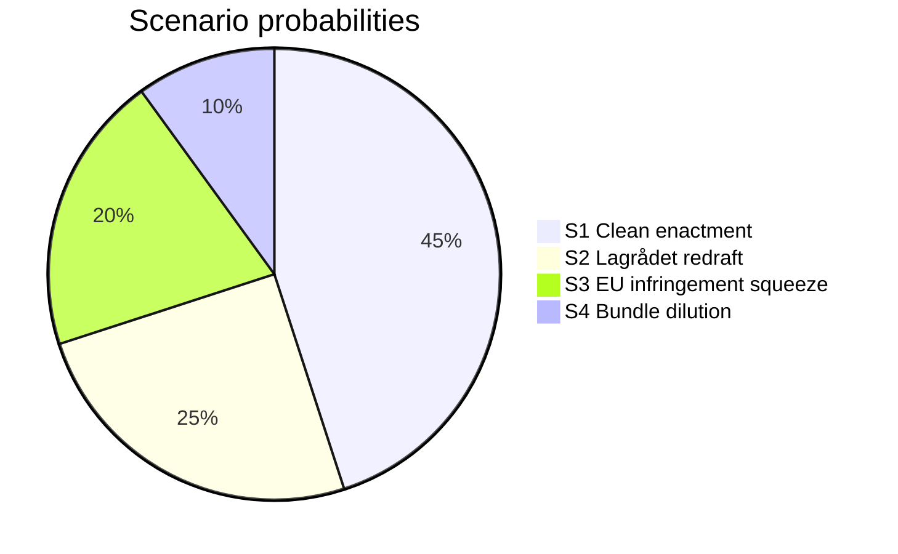

# Scenario Analysis — Propositions batch Prop. 2025/26:252, Prop. 2025/26:253, Prop. 2025/26:256, Skr. 2025/26:104

**Horizon**: Riksdag summer recess (June 2026) → September 2026 election → first post-election cycle.

## Scenario 1 — "Clean enactment" (probability 45%)

**Narrative**: All 4 bills enacted on schedule. HD03256 effective 1 July, HD03252 effective 1 August, HD03253 in force per EU timetable, HD03104 noted. Tidö framing succeeds: "law and order + sound money."

**Leading indicator**: FiU committee report on [HD03253](https://data.riksdagen.se/dokument/HD03253.html) published without amendments by mid-June 2026.

## Scenario 2 — "Lagrådet-forced redraft of HD03252" (probability 25%)

**Narrative**: Lagrådet yttrande critique on proportionality (visible in Bilaga 5 of [HD03252](https://data.riksdagen.se/dokument/HD03252.html)) prompts SfU to amend. Effective date slips to 1 Oct 2026 — post-election. Electoral "delivered" message weakens.

**Leading indicator**: SfU schedules ≥ 2 hearings with rights-focused remissinstanser in May 2026.

## Scenario 3 — "EU infringement squeeze on HD03253" (probability 20%)

**Narrative**: EU Commission issues reasoned opinion on late CRR3 transposition before Swedish enactment. Government accelerates FiU timetable. Industry consultation short-circuited → harsher-than-necessary output-floor calibration for Handelsbanken/SEB.

**Leading indicator**: DG FISMA communication to Stockholm in May; press leak to Financial Times.

## Scenario 4 — "Bundle dilution success" (probability 10%)

**Narrative**: 4-bill bundle strategy works: media attention fragmented; opposition coordination fails. All enacted without significant amendment.

**Leading indicator**: Major dailies (DN, SvD, Aftonbladet) devote < 500 words combined to [HD03252](https://data.riksdagen.se/dokument/HD03252.html) in first 72 h.

**Total: 100%**

## Scenario-specific forward indicators

| Scenario | 72-h indicator | 1-week indicator | 1-month indicator |
|---|---|---|---|
| S1 | No opposition joint motion filed | FiU hearing calendar published | Committee report drafted |
| S2 | Lagrådet media commentary | ≥ 3 rights-focused op-eds | SfU amendment proposal |
| S3 | EU Commission statement | Bankföreningen public position | Revised FiU timetable |
| S4 | < 500 words press coverage | Opposition fragmented on [HD03252](https://data.riksdagen.se/dokument/HD03252.html) | All 4 in summer recess schedule |
