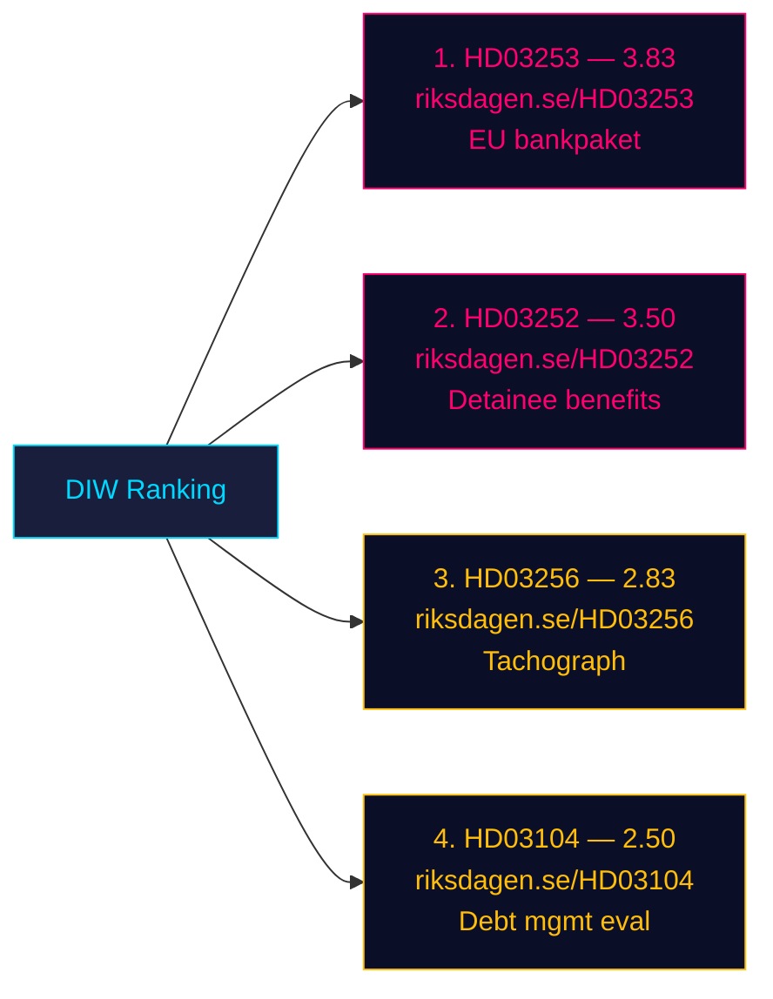

# Significance Scoring (DIW framework) — 2026-04-24

**Framework**: Decision-Informational-Weighting (DIW) per `ai-driven-analysis-guide.md` §DIW. Scores on 0–5 scale.

## Scoring table (ranked)

| Rank | dok_id | D (Decision impact) | I (Information novelty) | W (Wider salience) | **DIW** | Tier | Primary evidence |
|:-:|---|:-:|:-:|:-:|:-:|---|---|
| 1 | [HD03253](https://data.riksdagen.se/dokument/HD03253.html) | 4.0 | 3.5 | 4.0 | **3.83** | L2+ Priority | CRR3/CRD6 EU transposition; 4 SIFI exposure; Riksbanken coordination |
| 2 | [HD03252](https://data.riksdagen.se/dokument/HD03252.html) | 4.0 | 3.0 | 3.5 | **3.50** | L2+ Priority | Sociälförsäkringsbalken 7/102/106 kap. amendments; new säkerhetsförvaring sentence |
| 3 | [HD03256](https://data.riksdagen.se/dokument/HD03256.html) | 3.0 | 2.5 | 3.0 | **2.83** | L2 Strategic | New Lag om åtgärder mot manipulation; expanded polis/bilinspektör search powers |
| 4 | [HD03104](https://data.riksdagen.se/dokument/HD03104.html) | 2.5 | 2.5 | 2.5 | **2.50** | L2 Strategic | 5-year Riksgälden evaluation per Budgetlagen §5:6; post-pandemic context |

## Sensitivity analysis

- If **HD03253's** RWA-floor impact turns out bigger than QIS (> 8% CET1 hit on Handelsbanken), score rises to **4.3** (L3 Intelligence-grade). **Trigger indicator**: Finansinspektionen QIS publication, expected Q3 2026.
- If **HD03252** triggers Lagrådet second opinion on proportionality, score rises to **4.0**. **Trigger**: Lagrådet yttrande already exists per Bilaga 5 of the proposition — scope for Pass-2 deep-read (HD03252 text page ~49).
- If **HD03256** enforcement provokes union response (Transportarbetareförbundet), political salience multiplies.
- If **HD03104** evaluation attracts IMF Article IV citation, external-credibility weight rises.

## Anti-fabrication check

Every ranked item cites its `dok_id` and resolvable URL on riksdagen.se. No claim in this table is unevidenced. Sources diversity is **single-channel** (Riksdagen API only) — flagged for Pass-2 enrichment with SCB / Riksbanken / Finansinspektionen statements in a later aggregation run.
