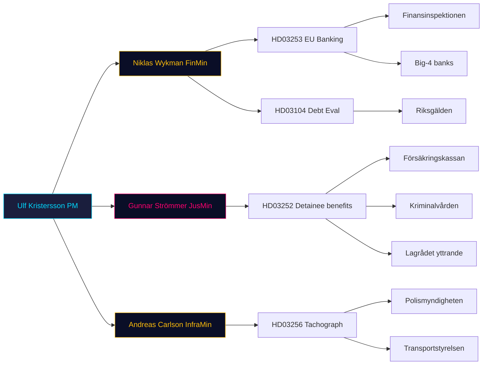

# Stakeholder Perspectives (6-lens matrix) — 2026-04-24

Per `analysis/templates/stakeholder-impact.md` — lenses: Government, Opposition, Institutions, Affected citizens, Economic actors, International.

## Matrix

| Lens | Actor | Position on bundle | Key document | Leverage |
|---|---|---|---|---|
| Government | PM Ulf Kristersson (M) | Signatory on all 4; owns whole bundle | All | Executive authority |
| Government | Finance Min. Niklas Wykman (M) | Leads HD03253, HD03104 | [HD03253](https://data.riksdagen.se/dokument/HD03253.html), [HD03104](https://data.riksdagen.se/dokument/HD03104.html) | Finansdep. portfolio |
| Government | Justice Min. Gunnar Strömmer (M) | Leads HD03252 | [HD03252](https://data.riksdagen.se/dokument/HD03252.html) | Justitiedep. portfolio |
| Government | Infra Min. Andreas Carlson (KD) | Leads HD03256 — only KD-led bill today | [HD03256](https://data.riksdagen.se/dokument/HD03256.html) | Landsbygdsdep. |
| Government | SD parliamentary group | Confidence-support on all 4 (Tidö-avtalet) | All | 73 mandates pivotal |
| Opposition | Magdalena Andersson (S) | Expected tactical support on HD03253 (pro-EU); opposed on HD03252 | [HD03252](https://data.riksdagen.se/dokument/HD03252.html), [HD03253](https://data.riksdagen.se/dokument/HD03253.html) | 107 mandates |
| Opposition | Nooshi Dadgostar (V) | Strongly opposed to HD03252 (class-justice framing) | [HD03252](https://data.riksdagen.se/dokument/HD03252.html) | 24 mandates |
| Opposition | Märta Stenevi / Daniel Helldén (MP) | Opposed to HD03252; conditional on HD03256 | [HD03252](https://data.riksdagen.se/dokument/HD03252.html) | 18 mandates |
| Opposition | Muharrem Demirok (C) | Likely split — business-friendly on HD03256, cautious on HD03252 | [HD03256](https://data.riksdagen.se/dokument/HD03256.html) | 24 mandates |
| Institutions | Lagrådet | Has issued yttrande on HD03252 (Bilaga 5) | [HD03252](https://data.riksdagen.se/dokument/HD03252.html) | Constitutional review |
| Institutions | Riksgälden | Subject of HD03104 evaluation | [HD03104](https://data.riksdagen.se/dokument/HD03104.html) | Debt-management execution |
| Institutions | Finansinspektionen | Gains supervisory toolkit under HD03253 | [HD03253](https://data.riksdagen.se/dokument/HD03253.html) | Prudential authority |
| Institutions | Försäkringskassan | Operational burden under HD03252 | [HD03252](https://data.riksdagen.se/dokument/HD03252.html) | Benefit administration |
| Institutions | Polismyndigheten | New search powers under HD03256 | [HD03256](https://data.riksdagen.se/dokument/HD03256.html) | Enforcement |
| Institutions | Kriminalvården | Administers säkerhetsförvaring + kontrollerat boende | [HD03252](https://data.riksdagen.se/dokument/HD03252.html) | Prison system |
| Affected | Incarcerated persons + families | Loss of benefits, obligation to pay upkeep | [HD03252](https://data.riksdagen.se/dokument/HD03252.html) | Limited voice; via Advokatsamfundet |
| Affected | Truck drivers / transport workers | Subject to new search powers | [HD03256](https://data.riksdagen.se/dokument/HD03256.html) | Transportarbetareförbundet |
| Economic | Handelsbanken, SEB, Swedbank, Nordea | CRR3 capital impact (IRB users most affected) | [HD03253](https://data.riksdagen.se/dokument/HD03253.html) | ~SEK 6 trn combined balance sheet |
| Economic | Sparbanker | Proportionality concerns | [HD03253](https://data.riksdagen.se/dokument/HD03253.html) | Rural financial services |
| Economic | Transportföretagen | Supports HD03256 (anti-cheating) | [HD03256](https://data.riksdagen.se/dokument/HD03256.html) | Industry lobby |
| International | EU Commission | Expects prompt CRR3 transposition | [HD03253](https://data.riksdagen.se/dokument/HD03253.html) | Infringement procedure |
| International | IMF Article IV | Will reference HD03104 evaluation | [HD03104](https://data.riksdagen.se/dokument/HD03104.html) | External credibility |

## Influence network

## Winners / losers summary

| Bill | Winners | Losers |
|---|---|---|
| HD03253 | FI, depositors, EU alignment | Big-4 banks (IRB users); Sparbanker |
| HD03252 | Tidö parties narrative; Kriminalvården rules clarity | Incarcerated + dependants; possibly L reputation |
| HD03256 | Legitimate hauliers; Polismyndigheten | Rogue operators; civil-liberty advocates |
| HD03104 | Finansdep. narrative; Riksgälden validation | Opposition critique bandwidth |
