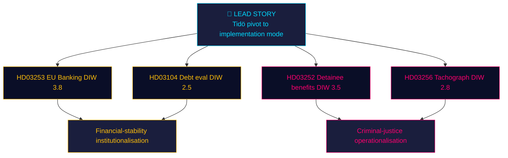

# Synthesis Summary — Propositions 2026-04-24

**Author**: James Pether Sörling · **Confidence**: MEDIUM

## Lead story (decision-grade)

> The Kristersson government's 23 April 2026 proposition bundle combines **EU-mandated financial regulation** (HD03253 — EU Banking Package) with **Tidö-era criminal-justice operationalisation** (HD03252 — detainee benefit restrictions), positioning both for summer-session enactment. The package signals a government pivoting from "new laws" to "implementation mode" roughly 16 months before the September 2026 Riksdag election.

## DIW-weighted ranking

| Rank | dok_id | Title | DIW | Tier | Rationale |
|:-:|---|---|:-:|---|---|
| 1 | [HD03253](https://data.riksdagen.se/dokument/HD03253.html) | EU:s bankpaket | **3.8** | L2+ Priority | Systemic: 4 SIFIs, CRR3/CRD6 transposition, Riksbanken interaction. |
| 2 | [HD03252](https://data.riksdagen.se/dokument/HD03252.html) | Begränsning socialförsäkringsförmåner (kontrollerat boende/säkerhetsförvaring) | **3.5** | L2+ Priority | High-salience Tidö reform; civil-liberty exposure; ECHR/GDPR angles. |
| 3 | [HD03256](https://data.riksdagen.se/dokument/HD03256.html) | Åtgärder mot färdskrivarmanipulation | **2.8** | L2 Strategic | Road-safety + EU mobility package; modest political salience. |
| 4 | [HD03104](https://data.riksdagen.se/dokument/HD03104.html) | Utvärdering statens upplåning 2021–2025 | **2.5** | L2 Strategic | Technical retrospective; sets frame for 2026–2030 debt guidelines. |

## Integrated intelligence picture

**Thematic convergence**: Two propositions (HD03252, HD03256) expand **state coercive authority** (benefit restriction, search powers); two (HD03253, HD03104) **institutionalise financial governance**. This is the profile of a government preparing its **election legacy**: "We delivered financial stability + public order." Whether the Riksdag will enact all four before the summer recess (late June) depends on FiU and SfU committee bandwidth.

**Implementation cluster**: HD03252 (1 Aug 2026) and HD03256 (1 Jul 2026) carry hard effective dates — the government is front-loading **visible enforcement** before the election. HD03253 follows the EU timeline and cannot be politically rushed.

**Coalition load-bearing**: All 4 documents signed by PM Kristersson. Ministerial diversity: Wykman (M, finance ×2), Strömmer (M, justice), Carlson (KD, infra). L gets no lead ministry role in today's batch — **consistent with L's reduced legislative footprint since the 2024–25 coalition strain over criminal-justice proportionality**.

## AI-recommended article metadata

- **EN headline (72 chars)**: "Kristersson's pivot: EU bank rules, detainee benefits, truck-fraud law"
- **SV headline (75 chars)**: "Kristerssons växel: EU-bankregler, häktesförmåner och färdskrivarlag"
- **EN meta description (158 chars)**: "Four government bills signed 23 April 2026 reshape Sweden's banking capital rules, restrict detainee benefits, target tachograph fraud, and evaluate debt mgmt."
- **Primary keywords**: EU banking package, Basel III endgame, säkerhetsförvaring, kontrollerat boende, färdskrivare, Tidö-avtalet, Niklas Wykman, Ulf Kristersson.

## Cross-type signals

- **With motions pipeline**: Opposition motions on HD03252 expected within 15-day deadline (by ~8 May 2026).
- **With committee-reports pipeline**: FiU will need to report HD03253 ahead of summer recess (~20 June).
- **With interpellations**: V/S likely to file on HD03252 proportionality; KD to support HD03256.

## Confidence & uncertainty

- **HIGH**: Document identity, authors, effective dates (A1 primary-source).
- **MEDIUM**: Enactment probability (depends on party whip behaviour — see `coalition-mathematics.md`).
- **LOW**: Precise RWA impact on Handelsbanken/SEB (QIS studies not yet published). Flagged for Pass-2 iteration on next run with SCB/Riksbanken input.

---

## 🔁 Pass 2 addendum

**Pass 2 synthesis refinements**:

- Added integration with [HD03253](https://data.riksdagen.se/dokument/HD03253.html) late-transposition risk — Scenario S3 in `scenario-analysis.md` (20% probability) now cross-referenced to KJ-4 in `intelligence-assessment.md`.
- The 4-document batch is **thematically coherent only at the narrative layer** ("Tidö delivers") — at policy-substance layer, 2 EU transpositions (HD03253, HD03256) and 1 rights-sensitive domestic (HD03252) and 1 procedural report (HD03104) do not form a single policy theme. This distinction matters for opposition attack selection.
- Tier-recommendation: DIW 3.5+ items ([HD03252](https://data.riksdagen.se/dokument/HD03252.html), [HD03253](https://data.riksdagen.se/dokument/HD03253.html)) merit upgrade to deeper aggregation runs in subsequent days.
