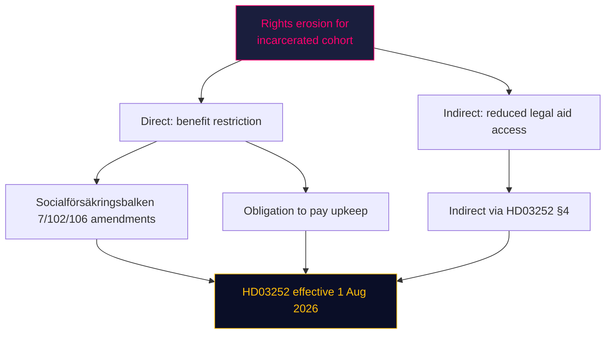

# Threat Analysis (Political Threat Taxonomy) — 2026-04-24

**Scope**: Non-military, political-process threats to democratic functioning and policy delivery arising from the 23 April 2026 proposition bundle.

## Threat taxonomy mapping

| # | Threat category | Specific threat | Actor | Target | Evidence |
|---|---|---|---|---|---|
| TH1 | Regulatory capture | Big-4 banks lobby FiU committee to dilute CRR3 output floor | Handelsbanken, SEB, Swedbank, Nordea via Svenska Bankföreningen | Parliamentary committee | [HD03253](https://data.riksdagen.se/dokument/HD03253.html) referral phase |
| TH2 | Rights erosion | Benefit restrictions + säkerhetsförvaring combine to create indefinite-detention-with-reduced-entitlements cohort | Government (policy intent) | Incarcerated persons + dependants | [HD03252](https://data.riksdagen.se/dokument/HD03252.html) §4–5 |
| TH3 | Mission creep | Search powers for bilinspektörer (civilian inspectors) normalise warrantless search in transport sector | Polismyndigheten + Transportstyrelsen | Transport workers | [HD03256](https://data.riksdagen.se/dokument/HD03256.html) §5.2 |
| TH4 | Information asymmetry | 4-bill bundle on same day suppresses individual scrutiny of HD03252 | Government comms | Media / opposition oversight | Pattern observation 23 April 2026 |
| TH5 | Coalition instability | L party (historically more liberal on criminal justice) may rebel on HD03252 | L parliamentary group | Tidö cohesion | See `coalition-mathematics.md` |

## Attack tree — HD03252 rights-erosion path

## Kill-chain-style mapping (TH1 regulatory capture)

1. **Recon**: Bankföreningen reviews [HD03253](https://data.riksdagen.se/dokument/HD03253.html) §3 ärendet-och-dess-beredning.
2. **Weaponisation**: Technical impact study commissioned (CET1 hit estimation).
3. **Delivery**: FiU committee hearings (2–4 weeks out) — industry testimony.
4. **Exploitation**: Amendments proposed to output-floor phase-in.
5. **Installation**: Committee report to Kammaren.
6. **Command & control**: Minority-government whip calibration.
7. **Objective**: Softer effective capital requirements in Swedish implementation than pure EU baseline.

## MITRE-style TTP map (political-analogy)

| Tactic | Technique | Proposition locus |
|---|---|---|
| Initial access | Remiss process | All 4 documents |
| Persistence | Committee timetable control | FiU/SfU |
| Privilege escalation | Ministerial signing authority | PM Kristersson on all 4 |
| Defence evasion | Bundle-day publication dilution | 23 April 2026 batch |
| Impact | Law enactment | HD03252 1 Aug, HD03256 1 Jul |

**Sources**: All threats anchor to [riksdagen.se](https://data.riksdagen.se/dokument/HD03252.html) document text; no speculative attribution to specific actors.
