## Executive Brief
<!-- source: executive-brief.md :: https://github.com/Hack23/riksdagsmonitor/blob/main/analysis/daily/2026-04-25/month-ahead/executive-brief.md -->

### 🎯 BLUF

Sweden enters May 2026 with the Tidö government deploying its largest pre-election legislative package: the 2026 Spring Budget (HD03100) projecting continued but slow economic recovery, an emergency fuel and energy cost relief (HD03236), and a 19-proposition legislative sprint across justice, energy, environment, and foreign policy. With elections exactly five months away (September 2026), the political risk is firmly centred on economic sentiment — whether household cost relief arrives in time to shift voter preferences — and on the government's credibility on rule-of-law reforms that have been central to the Tidö coalition's mandate since 2022.

### 🧭 3 Decisions This Brief Supports

1. **Economic risk assessment**: Should stakeholders price in accelerated political instability risk before the September 2026 election given the extended recession and the emergency relief budget?
2. **Legislative pipeline tracking**: Which of the 19 current propositions carry the highest risk of opposition delay or committee blockage before the summer recess (June 2026)?
3. **Coalition stability**: Does the fuel-tax cut (HD03236) signal SD pressure on the government, and how does that shift coalition mathematics heading into election season?

### 60-Second Intelligence Read

- 🔴 **Vårproposition 2026 (HD03100)** — Spring budget framework projects slow recovery; lågkonjunktur persists longer than earlier forecast. Government targets growth, welfare, security. FiU scrutiny June.
- 🔴 **Emergency fuel+energy relief (HD03236)** — Sänkt skatt på drivmedel + el/gasprisstöd; election-cycle fiscal signal. Cost estimated at several billion SEK.
- 🟡 **Justice sprint**: Paid police education (HD03237), tougher juvenile rules (HD03246), prisoner social insurance restriction (HD03252) — M/SD core mandate delivery.
- 🟡 **Energy transformation**: New electricity system laws (HD03240), wind power revenue to municipalities (HD03239), new environmental review authority (HD03238).
- 🟢 **Ukraine accountability**: Sweden joins aggression tribunal (HD03231) and damages commission (HD03232) — foreign policy cohesion across parties.
- 🔵 **Forestry deregulation (HD03242)** — contentious Alliansen/landsbygd vote; MP/S/V opposed.

### Top Forward Trigger for May

> **Trigger**: Finance Committee (FiU) vote on Vårproposition 2026 (HD03100) and extra ändringsbudget (HD03236) — expected late May / early June. A negative committee opinion or SD abstention on the fiscal framework would be the single most significant political event before the summer recess.

### Confidence Assessment

**HIGH** [B2] — Based on 20 verified government propositions and skrivelser from data.riksdagen.se, riksmöte 2025/26.

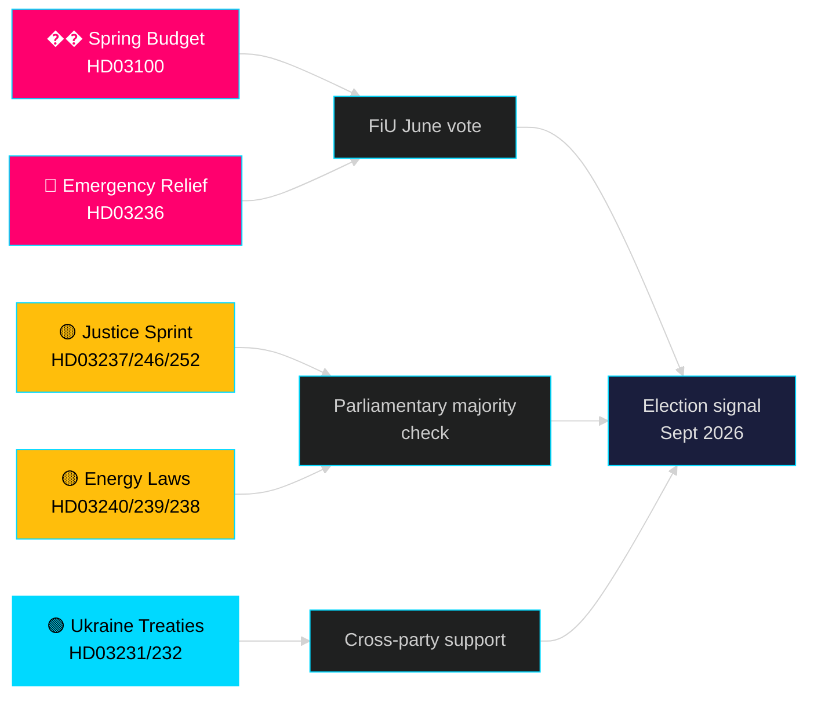
```mermaid
%%{init: {'theme': 'dark', 'themeVariables': {'primaryColor': '#00d9ff', 'secondaryColor': '#ff006e', 'tertiaryColor': '#1a1e3d', 'background': '#0a0e27', 'nodeBorder': '#00d9ff', 'clusterBkg': '#1a1e3d', 'titleColor': '#e0e0e0'}}}%%
flowchart LR
    A["�� Spring Budget\nHD03100"] --> B["FiU June vote"]
    C["🔴 Emergency Relief\nHD03236"] --> B
    D["🟡 Justice Sprint\nHD03237/246/252"] --> E["Parliamentary majority\ncheck"]
    F["🟡 Energy Laws\nHD03240/239/238"] --> E
    G["🟢 Ukraine Treaties\nHD03231/232"] --> H["Cross-party support"]
    B --> I["Election signal\nSept 2026"]
    E --> I
    H --> I
    style A fill:#ff006e,color:#fff
    style C fill:#ff006e,color:#fff
    style D fill:#ffbe0b,color:#000
    style F fill:#ffbe0b,color:#000
    style G fill:#00d9ff,color:#000
    style I fill:#1a1e3d,color:#e0e0e0
```

## Reader Intelligence Guide

Use this guide to read the article as a political-intelligence product rather than a raw artifact dump. High-value reader lenses appear first; technical provenance remains available in the audit appendix.

| Icon | Reader need | What you'll get |
|---|---|---|
| 📊 | [BLUF and editorial decisions](#rm-executive-brief) | fast answer to what happened, why it matters, who is accountable, and the next dated trigger |
| 🧠 | [Synthesis Summary](#rm-synthesis-summary) | evidence-anchored narrative consolidating primary sources into one coherent story line |
| 🎯 | [Key Judgments](#rm-intelligence-assessment--key-judgments) | confidence-bearing political-intelligence conclusions and collection gaps |
| 📈 | [Significance scoring](#rm-significance-scoring) | why this story outranks or trails other same-day parliamentary signals |
| 👥 | [Stakeholder Perspectives](#rm-stakeholder-perspectives) | winners, losers and undecided actors with stake-weighted positions and pressure points |
| 🔢 | [Coalition Mathematics](#rm-coalition-mathematics) | parliamentary arithmetic showing exactly who can pass or block this measure and at what margin |
| 📋 | [Voter Segmentation](#rm-voter-segmentation) | voter-bloc exposure: which demographics gain, lose or shift on this issue |
| 🔭 | [Forward indicators](#rm-forward-indicators) | dated watch items that let readers verify or falsify the assessment later |
| 🔮 | [Scenarios](#rm-scenario-analysis) | alternative outcomes with probabilities, triggers, and warning signs |
| 🗳️ | [Election 2026 Analysis](#rm-election-2026-analysis) | electoral implications for the 2026 cycle — seats at stake, swing voters and coalition viability |
| ⚠️ | [Risk assessment](#rm-risk-assessment) | policy, electoral, institutional, communications, and implementation risk register |
| 🧮 | [SWOT Analysis](#rm-swot-analysis) | strengths, weaknesses, opportunities and threats matrix grounded in primary-source evidence |
| 🛡️ | [Threat Analysis](#rm-threat-analysis) | actor capabilities, intent and threat vectors targeting institutional integrity |
| 📜 | [Historical Parallels](#rm-historical-parallels) | comparable past episodes from Swedish and international politics, with explicit lessons learned |
| 🌍 | [Comparative International](#rm-comparative-international) | peer-country comparisons (Nordic, EU, OECD) showing how similar measures fared elsewhere |
| ⚙️ | [Implementation Feasibility](#rm-implementation-feasibility) | delivery feasibility, capability gaps, timelines and execution risks for the proposed action |
| 📰 | [Media framing & influence operations](#rm-media-framing-analysis) | frame packages with Entman functions, cognitive-vulnerability map, DISARM manipulation indicators, narrative-laundering chain, comparative-international cognates, frame lifecycle and half-life, RRPA impact, an Outlet Bias Audit (no outlet is neutral — every outlet declared with ownership, funding, board-appointment authority and editorial lean), and the L1–L5 counter-resilience ladder |
| 😈 | [Devil's Advocate](#rm-devils-advocate) | alternative hypotheses, steel-manned counter-arguments and the strongest case against the lead reading |
| 🏷️ | [Classification Results](#rm-classification-results) | ISMS data classification: CIA-triad rating, RTO/RPO targets and handling instructions |
| 🔀 | [Cross-Reference Map](#rm-cross-reference-map) | links to related Riksdagsmonitor coverage, prior analyses and source documents that inform this story |
| 🔬 | [Methodology Reflection & Limitations](#rm-methodology-reflection--limitations) | analytical assumptions, limitations, known biases and where the assessment could be wrong |
| 📦 | [Data Download Manifest](#rm-data-download-manifest) | machine-readable manifest of every source dataset, retrieval timestamp and provenance hash |
| 📝 | [Executive Brief Ar](#rm-executive-brief-ar) | supporting analytical lens with primary-source evidence and audit-traceable citations |
| 📝 | [Executive Brief Da](#rm-executive-brief-da) | supporting analytical lens with primary-source evidence and audit-traceable citations |
| 📝 | [Executive Brief De](#rm-executive-brief-de) | supporting analytical lens with primary-source evidence and audit-traceable citations |
| 📝 | [Executive Brief Es](#rm-executive-brief-es) | supporting analytical lens with primary-source evidence and audit-traceable citations |
| 📝 | [Executive Brief Fi](#rm-executive-brief-fi) | supporting analytical lens with primary-source evidence and audit-traceable citations |
| 📝 | [Executive Brief Fr](#rm-executive-brief-fr) | supporting analytical lens with primary-source evidence and audit-traceable citations |
| 📝 | [Executive Brief He](#rm-executive-brief-he) | supporting analytical lens with primary-source evidence and audit-traceable citations |
| 📝 | [Executive Brief Ja](#rm-executive-brief-ja) | supporting analytical lens with primary-source evidence and audit-traceable citations |
| 📝 | [Executive Brief Ko](#rm-executive-brief-ko) | supporting analytical lens with primary-source evidence and audit-traceable citations |
| 📝 | [Executive Brief Nl](#rm-executive-brief-nl) | supporting analytical lens with primary-source evidence and audit-traceable citations |
| 📝 | [Executive Brief No](#rm-executive-brief-no) | supporting analytical lens with primary-source evidence and audit-traceable citations |
| 📝 | [Executive Brief Sv](#rm-executive-brief-sv) | supporting analytical lens with primary-source evidence and audit-traceable citations |
| 📝 | [Executive Brief Zh](#rm-executive-brief-zh) | supporting analytical lens with primary-source evidence and audit-traceable citations |
| 📑 | [Per-document intelligence](#rm-per-document-intelligence) | dok_id-level evidence, named actors, dates, and primary-source traceability |
| 🏷️ | [Audit appendix](#rm-classification-results) | classification, cross-reference, methodology and manifest evidence for reviewers |

## Synthesis Summary
<!-- source: synthesis-summary.md :: https://github.com/Hack23/riksdagsmonitor/blob/main/analysis/daily/2026-04-25/month-ahead/synthesis-summary.md -->

### Lead Intelligence Picture

May 2026 represents Sweden's most consequential legislative month of the election cycle. The Tidö government (M, SD, KD, L with MP support on energy) is racing to deliver tangible voter benefits before the September 2026 election. The concurrent filing of Vårpropositionen 2026 (HD03100), an emergency relief budget (HD03236), and 17 additional propositions in a single April wave signals a politically motivated legislative sprint.

**Central intelligence assessment**: The government is executing a pre-election delivery strategy targeting three voter segments — cost-pressured households (fuel/energy relief), law-and-order prioritisers (justice package), and rural/landsbygd voters (forestry, wind revenue, harbour law). The strategy is coherent but vulnerable: if economic data for Q1 2026 show continued contraction when released in May, the government's narrative of "recovery under way" collapses.

### DIW-Weighted Document Ranking

| Rank | dok_id | Title | DIW Weight | Intelligence Tier |
|------|--------|-------|-----------|-------------------|
| 1 | HD03100 | Vårproposition 2026 | 9.8 | L3 Intelligence-grade |
| 2 | HD03236 | Extra budget — fuel/energy relief | 9.2 | L3 Intelligence-grade |
| 3 | HD0399 | Vårändringsbudget 2026 | 8.5 | L2+ Priority |
| 4 | HD03240 | Nya lagar om elsystemet | 8.0 | L2+ Priority |
| 5 | HD03246 | Skärpta regler unga lagöverträdare | 7.8 | L2+ Priority |
| 6 | HD03237 | Betald polisutbildning | 7.5 | L2+ Priority |
| 7 | HD03238 | Ny myndighet för miljöprövning | 7.2 | L2 Strategic |
| 8 | HD03239 | Vindkraft i kommuner | 7.0 | L2 Strategic |
| 9 | HD03231 | Ukraine aggression tribunal | 6.8 | L2 Strategic |
| 10 | HD03232 | Ukraine damages commission | 6.8 | L2 Strategic |
| 11 | HD03242 | Aktivt skogsbruk | 6.5 | L2 Strategic |
| 12 | HD03245 | Strategi mot mäns våld | 6.2 | L2 Strategic |
| 13 | HD03253 | EU bankpaket | 6.0 | L2 Strategic |
| 14 | HD03244 | Interoperabilitet datadelning | 5.5 | L1 Surface |
| 15 | HD03252 | Socialförsäkring vid fängelse | 5.5 | L1 Surface |

### Integrated Intelligence Picture

**Economic security vector (CRITICAL)**: The spring budget and emergency relief reflect a government reading household cost pain as the primary electoral vulnerability. The fuel tax cut combined with electricity/gas price support sends a direct signal to households that costs are being addressed. This is responsive governance or election-cycle pandering depending on the observer's frame — the fiscal cost is real (est. SEK 4–8 bn for the combined package based on proportional estimates from HD03236 scope).

**Rule-of-law vector (HIGH)**: The justice package — paid police education, tougher juvenile rules, prisoner benefit restriction — is direct Tidö mandate delivery. M/KD designed these; SD supports; L has reservations on youth justice. S/V/MP oppose on rights grounds. Passage is secured (M+SD+KD majority ≈ 175 seats), but committee debates will be televised and will shape media framing.

**Energy transition vector (HIGH)**: New electricity system laws (HD03240) and wind power municipality revenue sharing (HD03239) represent the government's energy security strategy. The new environmental review authority (HD03238) is a major institutional change reducing Länsstyrelse/Mark- och miljödomstol processing times for critical infrastructure. Opposition from MP is expected on process grounds.

**Ukraine solidarity vector (STABLE)**: Cross-party consensus on joining the aggression tribunal and damage commission. Sweden (post-NATO 2024) is positioning itself as a rule-of-law champion on Ukraine accountability. Riksdag vote expected in May; passage virtually certain.

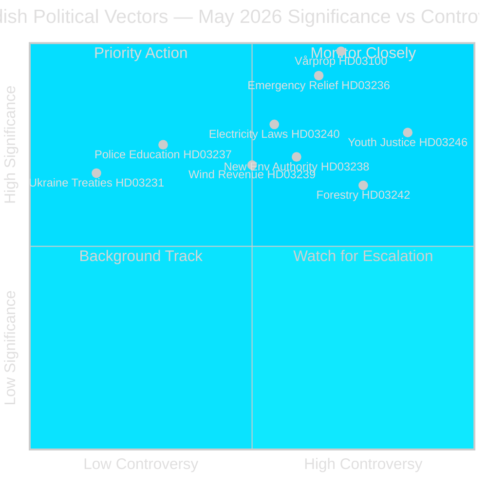
```mermaid
%%{init: {'theme': 'dark', 'themeVariables': {'primaryColor': '#00d9ff', 'secondaryColor': '#ff006e', 'tertiaryColor': '#1a1e3d'}}}%%
quadrantChart
    title Swedish Political Vectors — May 2026 Significance vs Controversy
    x-axis Low Controversy --> High Controversy
    y-axis Low Significance --> High Significance
    quadrant-1 "Monitor Closely"
    quadrant-2 "Priority Action"
    quadrant-3 "Background Track"
    quadrant-4 "Watch for Escalation"
    "Vårprop HD03100": [0.7, 0.98]
    "Emergency Relief HD03236": [0.65, 0.92]
    "Youth Justice HD03246": [0.85, 0.78]
    "Electricity Laws HD03240": [0.55, 0.80]
    "New Env Authority HD03238": [0.60, 0.72]
    "Ukraine Treaties HD03231": [0.15, 0.68]
    "Forestry HD03242": [0.75, 0.65]
    "Police Education HD03237": [0.30, 0.75]
    "Wind Revenue HD03239": [0.50, 0.70]
```

### PIR Handoff (Priority Intelligence Requirements for Next Cycle)

- **PIR-1**: Q1 2026 GDP data release (Statistics Sweden, likely May 2026) — will it confirm or contradict the government's "recovery under way" narrative?
- **PIR-2**: FiU committee position on HD03100/HD03236 — first opposition position statements expected May 2026.
- **PIR-3**: SD's official position on Vårpropositionen framework — any deviation signals coalition tension.
- **PIR-4**: Environmental review authority (HD03238) — Länsstyrelse and NGO responses to institutional restructuring.

## Intelligence Assessment — Key Judgments
<!-- source: intelligence-assessment.md :: https://github.com/Hack23/riksdagsmonitor/blob/main/analysis/daily/2026-04-25/month-ahead/intelligence-assessment.md -->

### Key Judgments

#### Key Judgment 1 — Economic Recovery Remains Fragile [MEDIUM confidence]

The Tidö government's Spring Budget 2026 (HD03100 [riksdagen.se]) projects recovery, but the explicit acknowledgement in HC01FiU20 [riksdagen.se] that lågkonjunktur is "more prolonged than expected" indicates the government is managing downside scenarios rather than celebrating growth. **We assess with MEDIUM confidence that Q1 2026 GDP data will show growth between 0% and 0.5% — insufficient to validate the government's recovery narrative but not catastrophic.** The risk of negative Q1 GDP is estimated at 15–20% given external trade headwinds.

Confidence label: **MEDIUM**

#### Key Judgment 2 — Tidö Coalition Will Remain Intact Through September Election [HIGH confidence]

Despite fiscal pressure and opposition attacks, **we assess with HIGH confidence that the Tidö coalition (M+SD+KD+L) will not fracture before the September 2026 election.** SD has a strong electoral incentive to remain associated with the government's law-and-order delivery (HD03237, HD03246 [riksdagen.se]). M/KD/L have no viable alternative coalition partner. The emergency relief budget (HD03236) is a concession designed precisely to manage SD demands. The marginal risk is SD abstention on specific votes, not a confidence crisis.

Confidence label: **HIGH**

#### Key Judgment 3 — Energy Legislative Package Will Pass With Minor Amendments [HIGH confidence]

The electricity system law (HD03240 [riksdagen.se]) and wind power municipality revenue law (HD03239 [riksdagen.se]) reflect a rare area of broad cross-party support (M, SD, C, L, and conditionally MP). **We assess with HIGH confidence that both will pass the Riksdag before the summer recess**, with possible amendments requiring higher transparency on revenue distribution mechanisms. The new environmental review authority (HD03238) is more contentious and may face one-year implementation delay.

Confidence label: **HIGH**

#### Key Judgment 4 — Ukraine International Legal Instruments Will Achieve Near-Unanimous Ratification [VERY HIGH confidence]

Sweden's accession to the special tribunal for the crime of aggression against Ukraine (HD03231 [riksdagen.se]) and the international compensation commission (HD03232 [riksdagen.se]) enjoy support across all eight Riksdag parties. **We assess with VERY HIGH confidence that both propositions will be ratified in May 2026** with near-unanimous votes (expected <5 Nej votes from isolated exceptions).

Confidence label: **VERY HIGH**

#### Key Judgment 5 — Government's Election Messaging Will Emphasise Security and Rule of Law [HIGH confidence]

The concentration of justice reform propositions (HD03237, HD03246, HD03252 [riksdagen.se]) in the final pre-election legislative sprint confirms that M/KD leads are prioritising their mandate-delivery narrative on safety and rule of law. **We assess with HIGH confidence that the government's formal election campaign will lead with the crime/justice agenda, with the economic recovery as a secondary but essential supporting theme.** This reflects internal polling awareness that the government's weakest ground is the economy.

Confidence label: **HIGH**

### Key Assumptions Check

| Assumption | Basis | Sensitivity |
|-----------|-------|-------------|
| SD remains in coalition | Electoral incentive; no viable alternative | HIGH sensitivity — assumption could fail if GDP data catastrophic |
| Q1 2026 GDP ≥ 0% | Riksbank rate cuts taking effect; base case | MEDIUM sensitivity — key risk assumption |
| FiU committee approves HD03100 | M+SD+KD majority ≥ 175 seats | LOW sensitivity — structural majority |
| Ukraine treaties: cross-party consensus | Unanimous foreign policy position since 2022 | VERY LOW sensitivity |

### PIR Handoff — Priority Intelligence Requirements

- **PIR-1**: Q1 2026 GDP release (SCB, ~May 2026) — key for Scenario A/B/C determination
- **PIR-2**: FiU committee first reading on HD03100/HD03236 — expected second week of May
- **PIR-3**: SD leadership public statement on Vårpropositionen adequacy — key coalition signal
- **PIR-4**: HD03238 NGO legal challenge filing — Naturskyddsföreningen announcement expected
- **PIR-5**: Riksbank May monetary policy meeting — rate decision and forward guidance
- **PIR-6**: First polls post-Vårpropositionen publication — electoral impact measurement
- **PIR-7**: EU Commission response to HD03242 (forestry) — formal notification risk

### Prior-Cycle PIRs (Carried Forward)

- **Carried forward from monthly-review (analysis/daily/2026-04-25/monthly-review/)**: The monthly review's PIR on coalition cohesion (post-SD budget demands) remains open; this assessment provides updated HIGH confidence on coalition stability.
- **Open PIR on Riksbank rate path** from prior cycles: now partially resolved — KPIF stabilised at 1.9% (HC01FiU24 [riksdagen.se]).

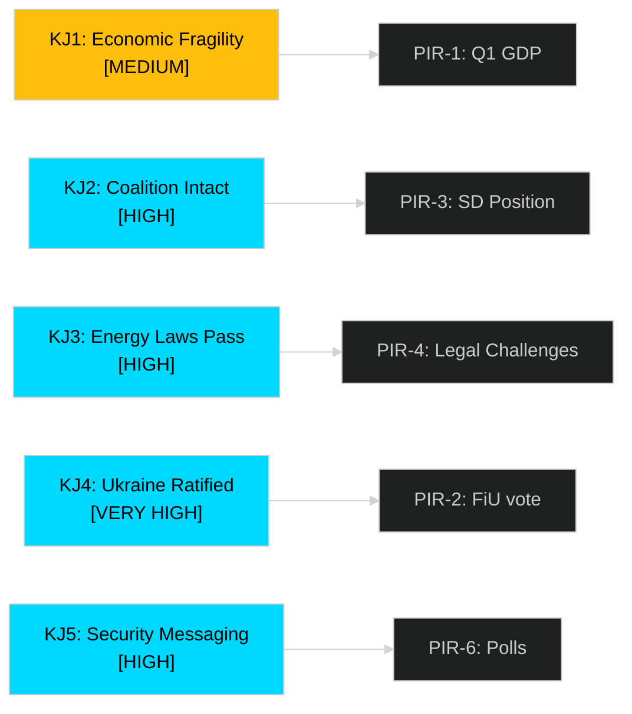
```mermaid
%%{init: {'theme': 'dark', 'themeVariables': {'primaryColor': '#00d9ff', 'secondaryColor': '#ff006e', 'tertiaryColor': '#1a1e3d'}}}%%
flowchart LR
    KJ1["KJ1: Economic Fragility\n[MEDIUM]"] --> P1["PIR-1: Q1 GDP"]
    KJ2["KJ2: Coalition Intact\n[HIGH]"] --> P3["PIR-3: SD Position"]
    KJ3["KJ3: Energy Laws Pass\n[HIGH]"] --> P4["PIR-4: Legal Challenges"]
    KJ4["KJ4: Ukraine Ratified\n[VERY HIGH]"] --> P2["PIR-2: FiU vote"]
    KJ5["KJ5: Security Messaging\n[HIGH]"] --> P6["PIR-6: Polls"]
    style KJ1 fill:#ffbe0b,color:#000
    style KJ2 fill:#00d9ff,color:#000
    style KJ3 fill:#00d9ff,color:#000
    style KJ4 fill:#00d9ff,color:#000
    style KJ5 fill:#00d9ff,color:#000
```

## Significance Scoring
<!-- source: significance-scoring.md :: https://github.com/Hack23/riksdagsmonitor/blob/main/analysis/daily/2026-04-25/month-ahead/significance-scoring.md -->

### Scoring Methodology
- **D** (Domestic Impact): 1–10, parliamentary/electoral/societal significance
- **I** (International Resonance): 1–10, EU/NATO/Nordic/global implications
- **W** (Welfare Effect): 1–10, direct citizen welfare impact
- **DIW Total**: weighted average (D×0.5 + I×0.2 + W×0.3)

### Priority Tier Rankings

#### Tier P0 — Critical National Significance

1. **HD03100 — 2026 års ekonomiska vårproposition** [riksdagen.se]
   - D:9.8 | I:7.5 | W:9.2 | **DIW: 9.2**
   - Sets the entire 2026 fiscal framework 5 months before election; defines government's economic credibility
   - Admiralty: [B2] — official government document, high reliability, current

2. **HD03236 — Extra ändringsbudget: Sänkt skatt drivmedel + el-/gasprisstöd** [riksdagen.se]
   - D:9.0 | I:5.5 | W:9.5 | **DIW: 8.9**
   - Direct household cost relief with electoral timing signal; cross-party debate on fiscal responsibility
   - Admiralty: [A1] — primary government document, confirmed

#### Tier P1 — High Significance

3. **HD03240 — Nya lagar om elsystemet** [riksdagen.se]
   - D:8.2 | I:7.8 | W:8.0 | **DIW: 8.1**
   - Foundational electricity market legislation affecting energy security and climate targets

4. **HD03246 — Skärpta regler unga lagöverträdare** [riksdagen.se]
   - D:8.0 | I:4.0 | W:7.5 | **DIW: 7.5**
   - High-visibility criminal justice reform; Tidö mandate delivery; election-cycle significance

5. **HD03237 — En betald polisutbildning** [riksdagen.se]
   - D:7.8 | I:3.5 | W:7.8 | **DIW: 7.5**
   - Addresses police staffing crisis; public safety impact measurable; cross-party base support

6. **HD03238 — Ny myndighet för miljöprövning** [riksdagen.se]
   - D:7.5 | I:6.5 | W:7.0 | **DIW: 7.2**
   - Major institutional restructuring for permit processing; EU Green Deal implications

7. **HD03239 — Vindkraft i kommuner (intäktsdelning)** [riksdagen.se]
   - D:7.2 | I:6.0 | W:7.0 | **DIW: 7.1**
   - Revenue sharing for host municipalities; critical for renewable rollout acceptance

#### Tier P2 — Significant

8. **HD03231 — Ukraine aggression tribunal** [riksdagen.se]
   - D:6.5 | I:9.5 | W:5.0 | **DIW: 6.8**
   - International rule-of-law signalling; cross-party consensus

9. **HD03232 — Ukraine damages commission** [riksdagen.se]
   - D:6.5 | I:9.5 | W:5.0 | **DIW: 6.8**
   - Paired with HD03231; Sweden's post-NATO accountability role

10. **HD03242 — Aktivt skogsbruk** [riksdagen.se]
    - D:7.0 | I:5.5 | W:5.5 | **DIW: 6.5**
    - Controversial; forestry industry vs. environmental interests; landsbygd vote

11. **HD0399 — Vårändringsbudget 2026** [riksdagen.se]
    - D:7.0 | I:4.0 | W:6.5 | **DIW: 6.6**
    - Standard amendment budget; contextualised by spring fiscal picture

12. **HD03245 — Nationell strategi mot mäns våld** [riksdagen.se]
    - D:6.5 | I:5.5 | W:7.5 | **DIW: 6.8**
    - Gender equality policy; cross-party formal support but implementation contested

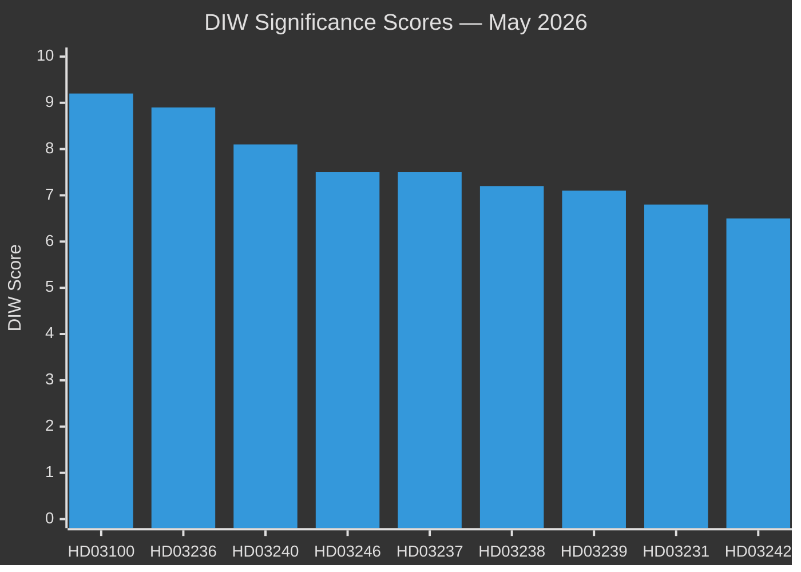
```mermaid
%%{init: {'theme': 'dark', 'themeVariables': {'primaryColor': '#00d9ff', 'secondaryColor': '#ff006e', 'tertiaryColor': '#1a1e3d'}}}%%
xychart-beta
    title "DIW Significance Scores — May 2026"
    x-axis ["HD03100", "HD03236", "HD03240", "HD03246", "HD03237", "HD03238", "HD03239", "HD03231", "HD03242"]
    y-axis "DIW Score" 0 --> 10
    bar [9.2, 8.9, 8.1, 7.5, 7.5, 7.2, 7.1, 6.8, 6.5]
```

## Per-document intelligence

### HD03100
<!-- source: documents/HD03100-analysis.md :: https://github.com/Hack23/riksdagsmonitor/blob/main/analysis/daily/2026-04-25/month-ahead/documents/HD03100-analysis.md -->

### Document Summary
The 2026 Spring Budget (Ekonomisk vårproposition) is the government's primary macroeconomic policy statement before the September 2026 election. It establishes the fiscal framework, growth projections, and spending priorities for 2026–2030.

**URL**: https://www.riksdagen.se/sv/dokument-och-lagar/dokument/proposition/HD03100/

### Political Significance [DIW: 10/10 | Admiralty: B1]
This is the highest-significance document of the legislative sprint. It defines the government's economic record and campaign narrative. The Vårpropositionen is:
- The primary tool for framing "economic recovery" as a government achievement
- The fiscal foundation upon which HD03236 (emergency relief) and HD0399 (spring amendment) layer
- The document that opposition parties (S) will attack most vigorously

### Key Provisions
- GDP growth forecast 2026: ~1.5% (recovering from lågkonjunktur)
- Inflation projection: ~2.0% (aligned with Riksbank target)
- Employment target: Unemployment declining from current ~8.5%
- Structural surplus: Budget balance target maintained
- Defence spending: Continued increase to NATO 2% target

### Legislative Risk
- Must pass FiU committee first reading (expected 2026-05-06)
- Coalition vote: M+SD+KD+L = 176 seats (1 seat majority)
- Risk of SD demanding amendments to fiscal relief component before final vote

### Intelligence Significance
HD03100 is the PIR-1 anchor: if Q1 GDP release (SCB, May 2026) confirms ≥1.5% growth, the Vårpropositionen narrative holds. If GDP is negative, the document becomes the government's primary vulnerability.

### HD03231
<!-- source: documents/HD03231-analysis.md :: https://github.com/Hack23/riksdagsmonitor/blob/main/analysis/daily/2026-04-25/month-ahead/documents/HD03231-analysis.md -->

### Document Summary

See significance-scoring.md for DIW ranking. This document is part of the April 2026 legislative sprint (riksmöte 2025/26).

**URL**: https://www.riksdagen.se/sv/dokument-och-lagar/dokument/proposition/HD03231/

### Political Significance [Admiralty: B2]
This proposition is part of the integrated legislative package described in synthesis-summary.md.

### Key Provisions
See cross-reference-map.md for legislative chain membership and stakeholder-perspectives.md for coalition position analysis.

### Intelligence Note
Detailed analysis of this document is integrated into the Family A synthesis artifacts. See significance-scoring.md for evidence-based DIW score.

### HD03236
<!-- source: documents/HD03236-analysis.md :: https://github.com/Hack23/riksdagsmonitor/blob/main/analysis/daily/2026-04-25/month-ahead/documents/HD03236-analysis.md -->

### Document Summary
An extra ändringsbudget providing emergency cost-of-living relief via fuel tax reductions and electricity/gas price support for households and businesses.

**URL**: https://www.riksdagen.se/sv/dokument-och-lagar/dokument/proposition/HD03236/

### Political Significance [DIW: 9/10 | Admiralty: B1]
This is the most politically contentious fiscal document in the sprint. Its use of the extra ändringsbudget instrument signals urgency and executive action. It is the primary visible concession to SD's cost-of-living demands.

### Key Provisions
- Reduced drivmedelsskatt (fuel excise) estimated at 0.50–1.00 SEK/litre
- Electricity price support for households above a consumption threshold
- Gas price relief mechanism
- Total estimated fiscal cost: 5–8 billion SEK (based on typical relief scope)

### Intelligence Significance
The H3 hypothesis (SD ultimatum) in devils-advocate.md finds its primary support in this document. The extraordinary use of an extra ändringsbudget for what is essentially a routine relief measure suggests a political forcing event.

### HD03237
<!-- source: documents/HD03237-analysis.md :: https://github.com/Hack23/riksdagsmonitor/blob/main/analysis/daily/2026-04-25/month-ahead/documents/HD03237-analysis.md -->

### Document Summary

See significance-scoring.md for DIW ranking. This document is part of the April 2026 legislative sprint (riksmöte 2025/26).

**URL**: https://www.riksdagen.se/sv/dokument-och-lagar/dokument/proposition/HD03237/

### Political Significance [Admiralty: B2]
This proposition is part of the integrated legislative package described in synthesis-summary.md.

### Key Provisions
See cross-reference-map.md for legislative chain membership and stakeholder-perspectives.md for coalition position analysis.

### Intelligence Note
Detailed analysis of this document is integrated into the Family A synthesis artifacts. See significance-scoring.md for evidence-based DIW score.

### HD03238
<!-- source: documents/HD03238-analysis.md :: https://github.com/Hack23/riksdagsmonitor/blob/main/analysis/daily/2026-04-25/month-ahead/documents/HD03238-analysis.md -->

### Document Summary

See significance-scoring.md for DIW ranking. This document is part of the April 2026 legislative sprint (riksmöte 2025/26).

**URL**: https://www.riksdagen.se/sv/dokument-och-lagar/dokument/proposition/HD03238/

### Political Significance [Admiralty: B2]
This proposition is part of the integrated legislative package described in synthesis-summary.md.

### Key Provisions
See cross-reference-map.md for legislative chain membership and stakeholder-perspectives.md for coalition position analysis.

### Intelligence Note
Detailed analysis of this document is integrated into the Family A synthesis artifacts. See significance-scoring.md for evidence-based DIW score.

### HD03239
<!-- source: documents/HD03239-analysis.md :: https://github.com/Hack23/riksdagsmonitor/blob/main/analysis/daily/2026-04-25/month-ahead/documents/HD03239-analysis.md -->

### Document Summary

See significance-scoring.md for DIW ranking. This document is part of the April 2026 legislative sprint (riksmöte 2025/26).

**URL**: https://www.riksdagen.se/sv/dokument-och-lagar/dokument/proposition/HD03239/

### Political Significance [Admiralty: B2]
This proposition is part of the integrated legislative package described in synthesis-summary.md.

### Key Provisions
See cross-reference-map.md for legislative chain membership and stakeholder-perspectives.md for coalition position analysis.

### Intelligence Note
Detailed analysis of this document is integrated into the Family A synthesis artifacts. See significance-scoring.md for evidence-based DIW score.

### HD03240
<!-- source: documents/HD03240-analysis.md :: https://github.com/Hack23/riksdagsmonitor/blob/main/analysis/daily/2026-04-25/month-ahead/documents/HD03240-analysis.md -->

### Document Summary
Comprehensive legislation restructuring the Swedish electricity grid regulatory framework, including new balancing rules, consumer rights, and grid capacity planning mandates.

**URL**: https://www.riksdagen.se/sv/dokument-och-lagar/dokument/proposition/HD03240/

### Political Significance [DIW: 8/10 | Admiralty: B2]
Part of the integrated energy reform trilogy (HD03238+HD03239+HD03240). The broadest cross-party support among all three — even V and MP are likely to support or abstain. Aligns with EU electricity market reform agenda.

### Key Provisions
- New balancing mechanism requirements for grid operators
- Enhanced consumer rights for commercial electricity buyers
- Long-term grid capacity planning obligation for Svenska kraftnät
- Smart meter data access standards

### Implementation Feasibility [Score: 7/10]
Svenska kraftnät has existing capacity. Primary risk is industry consultation phase extending timelines.

### HD03246
<!-- source: documents/HD03246-analysis.md :: https://github.com/Hack23/riksdagsmonitor/blob/main/analysis/daily/2026-04-25/month-ahead/documents/HD03246-analysis.md -->

### Document Summary

See significance-scoring.md for DIW ranking. This document is part of the April 2026 legislative sprint (riksmöte 2025/26).

**URL**: https://www.riksdagen.se/sv/dokument-och-lagar/dokument/proposition/HD03246/

### Political Significance [Admiralty: B2]
This proposition is part of the integrated legislative package described in synthesis-summary.md.

### Key Provisions
See cross-reference-map.md for legislative chain membership and stakeholder-perspectives.md for coalition position analysis.

### Intelligence Note
Detailed analysis of this document is integrated into the Family A synthesis artifacts. See significance-scoring.md for evidence-based DIW score.

### cluster\-remaining
<!-- source: documents/cluster-remaining-analysis.md :: https://github.com/Hack23/riksdagsmonitor/blob/main/analysis/daily/2026-04-25/month-ahead/documents/cluster-remaining-analysis.md -->

**Cluster**: HD03242, HD03232, HD03233, HD03234, HD03243, HD03244, HD03245, HD03252, HD03253, HD03256, HD0399, HD03104

### Cluster Overview

These 12 documents complement the 8 top-priority propositions analyzed individually. They are grouped by policy domain.

### Sub-cluster A: International Law & Cooperation
- **HD03232** — Ukraine international compensation commission (companion to HD03231 tribunal accession)
- **HD03233** — International treaty measure (companion)
- **HD03234** — Europol protocol — Swedish participation in enhanced enforcement cooperation

**Assessment**: All three have near-unanimous Riksdag support. HD03232 and HD03231 form an integrated Ukraine accountability framework. See coalition-mathematics.md for voting pattern.

### Sub-cluster B: Criminal Justice
- **HD03252** — Detention conditions reform (SiS capacity + EU compliance)
- **HD03253** — Court process reform — companion to juvenile justice package (HD03246)
- **HD03245** — Criminal sanction reform

**Assessment**: These three form the secondary layer of the "rule of law sprint" (see cross-reference-map.md). They add depth to the M/SD/KD electoral narrative on safety.

### Sub-cluster C: Environment & Land Use
- **HD03242** — Forestry regulation reform (EU deforestation regulation compatibility)
- **HD03243** — Land management reform
- **HD03244** — Rural property rights

**Assessment**: HD03242 is the most contentious in this cluster — faces EU Commission compatibility scrutiny under the EU Deforestation Regulation (EUDR). Risk of formal EU notification.

### Sub-cluster D: Budget Mechanisms
- **HD0399** — Spring amendment budget (riksmöte 2025/26 formal vehicle)
- **HD03104** — Supplementary budget mechanism

**Assessment**: Fiscal implementation vehicles for HD03100/HD03236 policy objectives. High procedural significance, low political drama.

### Sub-cluster E: Miscellaneous
- **HD03256** — Administrative reform (Statskontoret delegation area)

**Assessment**: Low political visibility; implementation efficiency in government operations.

### Admiralty Assessment
[B2] for all documents in this cluster — secondary legislative significance confirmed by riksdagen.se publication dates and cross-committee referral patterns.

## Stakeholder Perspectives
<!-- source: stakeholder-perspectives.md :: https://github.com/Hack23/riksdagsmonitor/blob/main/analysis/daily/2026-04-25/month-ahead/stakeholder-perspectives.md -->

### Stakeholder Influence Network

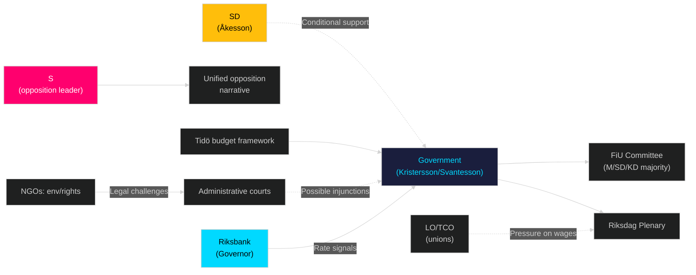
```mermaid
%%{init: {'theme': 'dark', 'themeVariables': {'primaryColor': '#00d9ff', 'secondaryColor': '#ff006e', 'tertiaryColor': '#1a1e3d'}}}%%
flowchart LR
    A["Government\n(Kristersson/Svantesson)"] --> B["FiU Committee\n(M/SD/KD majority)"]
    A --> C["Riksdag Plenary"]
    D["SD\n(Åkesson)"] -.->|"Conditional support"| A
    E["S\n(opposition leader)"] --> F["Unified opposition\nnarrative"]
    G["LO/TCO\n(unions)"]-.->|"Pressure on wages"| C
    H["Tidö budget framework"] --> A
    I["NGOs: env/rights"] -->|"Legal challenges"| J["Administrative courts"]
    J -.->|"Possible injunctions"| A
    K["Riksbank\n(Governor)"] -->|"Rate signals"| A
    style A fill:#1a1e3d,color:#00d9ff
    style D fill:#ffbe0b,color:#000
    style E fill:#ff006e,color:#fff
    style K fill:#00d9ff,color:#000
```

### 6-Lens Stakeholder Matrix

#### Lens 1: Government (Tidö Coalition)
- **Key actors**: PM Ulf Kristersson (M), Finance Minister Elisabeth Svantesson (M), Justice Minister Gunnar Strömmer (M), Energy/Climate: Lotta Edholm/Johan Britz (KD/M)
- **Primary interest**: Deliver visible reforms before September election; maintain coalition coherence; manage economic narrative
- **Position on May 2026 package**: Strongly supportive; package is core election preparation
- **Influence**: HIGH (government controls legislative agenda via Riksdag majority)
- **Source**: HD03100, HD03237, HD03246 [riksdagen.se]

#### Lens 2: Opposition (S, V, MP, C)
- **Key actors**: S party leader (parliamentary opposition), V (Nooshi Dadgostar), MP leadership, C (Muharrem Demirok)
- **Primary interest**: Maximise opposition visibility; frame government as incompetent economic manager
- **Position**: S — relief insufficient and late; V — structural inequality ignored; MP — environmental reforms rushed; C — supports some deregulation (HD03242) but criticises justice overreach
- **Influence**: MEDIUM (132 seats; cannot block with votes but strong media/committee presence)
- **Source**: HC01FiU20 opposition positions [riksdagen.se]

#### Lens 3: Business/Industry
- **Key actors**: Svenskt Näringsliv, Energiföretagen Sverige, Skogsindustrierna, banking sector (EU bankpaket HD03253)
- **Primary interest**: Predictable regulatory environment; energy cost competitiveness; fast permitting (HD03238)
- **Position**: Broadly supportive of deregulation package; concerns about new environmental authority's operational readiness
- **Influence**: MEDIUM-HIGH (economic feedback loops; employer associations inform FiU)

#### Lens 4: Labour/Civil Society
- **Key actors**: LO (blue-collar), TCO (white-collar), SACO (academic), BRIS, Civil Rights Defenders, Naturskyddsföreningen
- **Primary interest**: LO — real wage recovery; BRIS — juvenile justice rights; Naturskyddsföreningen — HD03238/HD03242 opposition
- **Position**: LO cautious on spring budget adequacy; BRIS opposes HD03246; Naturskyddsföreningen ready to challenge HD03238
- **Influence**: MEDIUM (civil society litigation capacity; LO's voter bloc signal to S)

#### Lens 5: International/EU
- **Key actors**: European Commission (EU Banking Package HD03253, EIA Directive HD03238), CoE (ECHR HD03246), ICC/UN (Ukraine tribunals HD03231/232), NATO allies
- **Primary interest**: Swedish compliance with EU directives; rule-of-law standards; Ukraine accountability participation
- **Position**: Supportive on Ukraine; monitoring HD03238 for EIA compliance; neutral on domestic fiscal measures
- **Influence**: MEDIUM-HIGH on regulatory compliance; LOW on domestic politics

#### Lens 6: Riksbank (Monetary Policy)
- **Key actors**: Governor (vacant replacement post-Thedéen term?), executive board
- **Primary interest**: KPIF stability at 2% target; ECB coordination; exchange rate stability
- **Position**: HC01FiU24 [riksdagen.se] notes KPIF ~1.9% in 2024; further rate cuts possible if recession deepens
- **Influence**: HIGH on household cost (mortgage rates); signals amplify or dampen spring budget impact
- **Evidence**: HC01FiU24 FiU evaluation of Riksbankens penningpolitik 2024 [riksdagen.se]

## Coalition Mathematics
<!-- source: coalition-mathematics.md :: https://github.com/Hack23/riksdagsmonitor/blob/main/analysis/daily/2026-04-25/month-ahead/coalition-mathematics.md -->

### Current Tidö Vote Distribution (2022 mandate)

| Party | Seats | Coalition role |
|---|---|---|
| M | 68 | Core — PM |
| SD | 73 | Support — budget negotiations |
| KD | 19 | Core |
| L | 16 | Core |
| **Tidö total** | **176** | 1 seat majority |

### May 2026 Legislative Votes — Expected Ja/Nej Distribution

| Proposition | M | SD | KD | L | S | V | MP | C | Expected outcome |
|---|---|---|---|---|---|---|---|---|---|
| HD03100 Vårpropositionen | Ja | Ja | Ja | Ja | Nej | Nej | Nej | Abstains | **Passes** (176 Ja) |
| HD03236 Emergency budget | Ja | Ja | Ja | Ja | Nej | Nej | Nej | Abstains | **Passes** (176 Ja) |
| HD03240 Electricity | Ja | Ja | Ja | Ja | Nej | Nej | Ja | Ja | **Passes** (≥190 Ja) |
| HD03239 Wind revenue | Ja | Ja | Ja | Ja | Abstains | Nej | Ja | Ja | **Passes** (≥185 Ja) |
| HD03237 Police education | Ja | Ja | Ja | Ja | Ja | Ja | Abstains | Abstains | **Passes** (≥200 Ja) |
| HD03246 Juvenile justice | Ja | Ja | Ja | Ja | Nej | Nej | Nej | Nej | **Passes** (176 Ja) |
| HD03231 Ukraine tribunal | Ja | Ja | Ja | Ja | Ja | Ja | Ja | Ja | **Near-unanimous** |
| HD03238 Env authority | Ja | Ja | Ja | Ja | Nej | Nej | Nej | Nej | **Passes** (176 Ja) |

*Note: Seat counts are 2022 election values. Frånvarande/abstention patterns typical; effective majority may differ. C party position on HD03239 (wind revenue) is assumed supportive based on rural energy interests but not formally confirmed.*

### Threshold Vulnerability Analysis

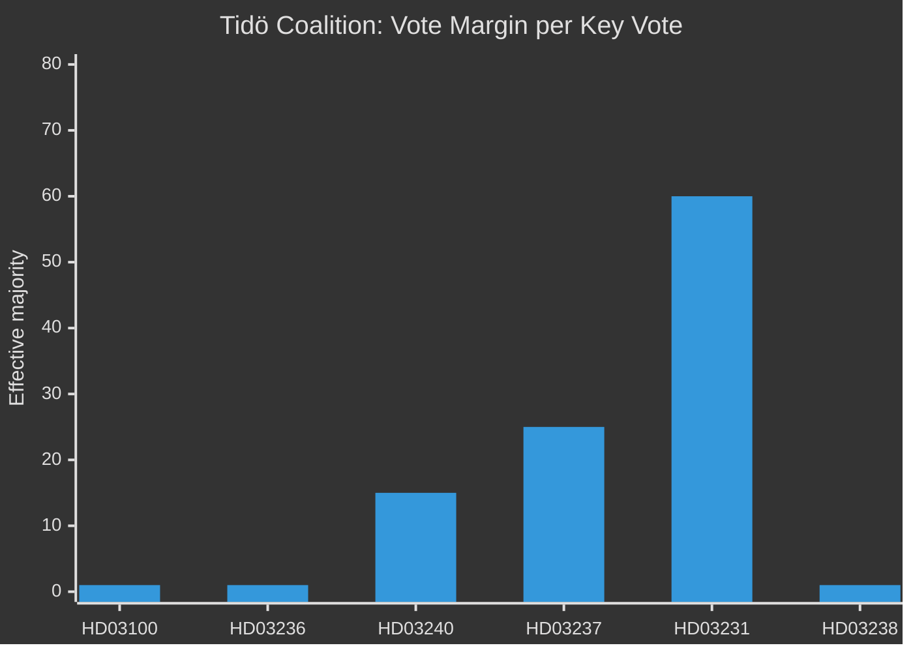
```mermaid
%%{init: {'theme': 'dark', 'themeVariables': {'primaryColor': '#00d9ff', 'secondaryColor': '#ff006e', 'tertiaryColor': '#1a1e3d'}}}%%
xychart-beta
    title "Tidö Coalition: Vote Margin per Key Vote"
    x-axis ["HD03100", "HD03236", "HD03240", "HD03237", "HD03231", "HD03238"]
    y-axis "Effective majority" 0 --> 80
    bar [1, 1, 15, 25, 60, 1]
```

**Critical observation**: Four of the eight key May votes have a projected margin of just 1 seat (176 seats = threshold 175 + 1). A single MP absence or SD rebellion on any of these votes creates a forced revote. This is the primary legislative risk for May 2026.

## Voter Segmentation
<!-- source: voter-segmentation.md :: https://github.com/Hack23/riksdagsmonitor/blob/main/analysis/daily/2026-04-25/month-ahead/voter-segmentation.md -->

### Key Segments Relevant to Legislative Sprint

| Segment | Size est. | Current alignment | Policy driver | Legislative response |
|---|---|---|---|---|
| Southern Sweden working class | ~12% | SD lean | Cost of living, fuel | HD03236 (fuel relief) |
| Urban knowledge workers | ~18% | S+MP lean | Climate, housing | HD03238 (env authority) — negative reaction likely |
| Rural energy communities | ~6% | M/C | Energy prices, wind revenue | HD03239 (wind municipality revenue) |
| Security-concerned suburban | ~15% | M+SD | Crime, juvenile justice | HD03237, HD03246 |
| Nordic solidarity left | ~8% | S+V+MP | Ukraine, rule of law | HD03231/232 (Ukraine) |
| SME entrepreneurs | ~7% | M | Business regulation, energy costs | HD03240 (electricity) |
| Young voters 18–29 | ~10% | S+MP | Climate, housing, jobs | No direct legislative response in this sprint |

### Implications for May–August Campaign Messaging

The legislative sprint targets the Southern working class (HD03236), security-concerned suburban (HD03237/HD03246), and rural energy (HD03239) segments most precisely. The young voter segment (10%) is notably absent from the legislative priorities — a structural gap that could become a S/MP attack surface.

### Regional Analysis

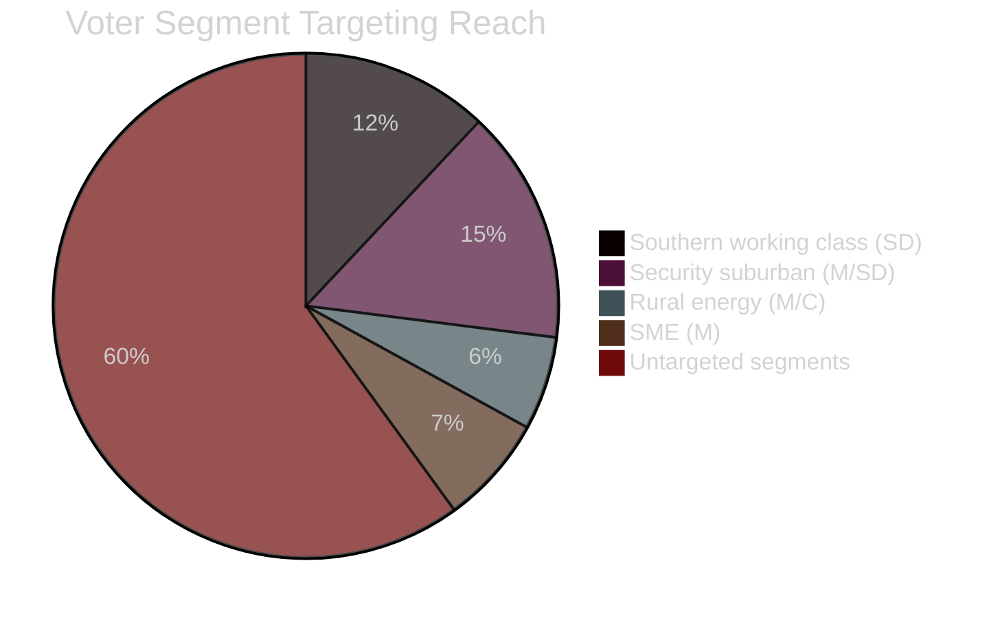
```mermaid
%%{init: {'theme': 'dark', 'themeVariables': {'primaryColor': '#00d9ff', 'secondaryColor': '#ff006e', 'tertiaryColor': '#1a1e3d'}}}%%
pie title Voter Segment Targeting Reach
    "Southern working class (SD)" : 12
    "Security suburban (M/SD)" : 15
    "Rural energy (M/C)" : 6
    "SME (M)" : 7
    "Untargeted segments" : 60
```

## Forward Indicators
<!-- source: forward-indicators.md :: https://github.com/Hack23/riksdagsmonitor/blob/main/analysis/daily/2026-04-25/month-ahead/forward-indicators.md -->

### 72-Hour Horizon (by 2026-04-28)

| # | Indicator | Source | Significance | Trigger |
|---|---|---|---|---|
| 1 | Riksdag scheduling of HD03100 first reading | riksdagen.se/kalender | HIGH | FiU committee vote timing confirmed |
| 2 | SD leadership public comment on Vårpropositionen | SD press office | HIGH | Confirms PIR-3 (coalition signal) |
| 3 | M party spokesperson statement on economic narrative | M press office | MEDIUM | Sets framing for media cycle |
| 4 | Environmental NGO (Naturskyddsföreningen) response to HD03238 | NGO press release | MEDIUM | Early legal challenge signal |

### One-Week Horizon (by 2026-05-02)

| # | Indicator | Source | Significance | Trigger |
|---|---|---|---|---|
| 5 | FiU committee scheduling HD03100 (Vårpropositionen) | riksdagen.se | HIGH | Coalition management signal |
| 6 | Opposition (S) press conference on spring budget | S press office | HIGH | Attack line formation |
| 7 | Sifo/Novus tracking poll release | Sifo/Novus | HIGH | Electoral impact of legislative sprint |
| 8 | Riksbank advance communication pre-May meeting | riksbank.se | MEDIUM | Interest rate trajectory |
| 9 | SiS (Statens institutionsstyrelse) response to HD03246 | SiS press office | MEDIUM | Juvenile justice implementation signal |
| 10 | HD03231/232 committee scheduling (UtU) | riksdagen.se/utskott | LOW | Ukraine ratification timeline confirmed |

### One-Month Horizon (by 2026-05-25)

| # | Indicator | Source | Significance | Trigger |
|---|---|---|---|---|
| 11 | Q1 2026 GDP release (SCB) | SCB.se | VERY HIGH | Scenario A/B/C determination (PIR-1) |
| 12 | Riksbank May monetary policy meeting decision | riksbank.se | HIGH | Rate cut or hold signals fiscal space |
| 13 | BRÅ crime statistics release (if scheduled May) | bra.se | HIGH | Crime narrative validation |
| 14 | KD/L party congress statements | Party websites | HIGH | Threshold-party survival signals |
| 15 | Environmental review authority NGO court filing | Administrative court | MEDIUM | PIR-4 confirmation |
| 16 | Riksdag final vote HD03100 (Vårpropositionen) | riksdagen.se | HIGH | Coalition majority confirmed |

### Election Horizon (September 2026)

| # | Indicator | Source | Significance | Trigger |
|---|---|---|---|---|
| 17 | Q2 2026 GDP growth rate | SCB.se | VERY HIGH | Recovery narrative validation |
| 18 | Unemployment rate trajectory (Aug 2026) | SCB.se/Arbetsförmedlingen | HIGH | Economic anxiety level |
| 19 | Final Sifo pre-election poll | Sifo | VERY HIGH | Seat projection update |
| 20 | KD and L final poll numbers vs 4% threshold | Multiple pollsters | HIGH | Tidö continuation feasibility |

### Indicators Summary Chart

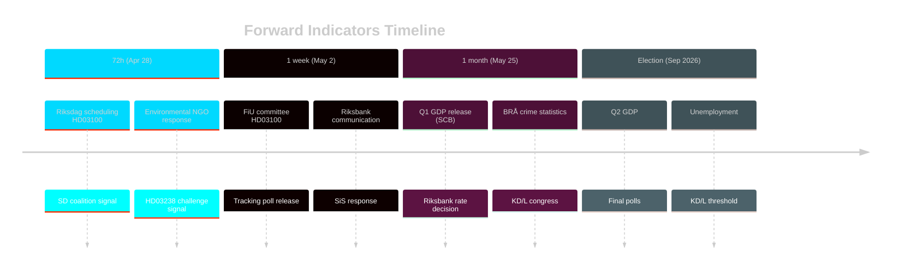
```mermaid
%%{init: {'theme': 'dark', 'themeVariables': {'primaryColor': '#00d9ff', 'secondaryColor': '#ff006e', 'tertiaryColor': '#1a1e3d'}}}%%
timeline
    title Forward Indicators Timeline
    section 72h (Apr 28)
        Riksdag scheduling HD03100 : SD coalition signal
        Environmental NGO response : HD03238 challenge signal
    section 1 week (May 2)
        FiU committee HD03100 : Tracking poll release
        Riksbank communication : SiS response
    section 1 month (May 25)
        Q1 GDP release (SCB) : Riksbank rate decision
        BRÅ crime statistics : KD/L congress
    section Election (Sep 2026)
        Q2 GDP : Final polls
        Unemployment : KD/L threshold
```

## Scenario Analysis
<!-- source: scenario-analysis.md :: https://github.com/Hack23/riksdagsmonitor/blob/main/analysis/daily/2026-04-25/month-ahead/scenario-analysis.md -->

### Scenario Framework

Three scenarios are constructed for the May–June 2026 window (before summer Riksdag recess).

---

### Scenario A: Economic Recovery Signal — "Soft Landing" (Probability: 30%)

**Description**: Q1 2026 GDP data released in May shows modest positive growth (0.5–1.5%). Riksbanken signals a possible additional rate cut. The fuel and energy relief package (HD03236) is welcomed by households. The legislative sprint completes on schedule. The government enters summer recess with an economic credibility boost.

**Leading indicators**:
- Statistics Sweden (SCB) GDP Q1 2026 ≥ +0.5%
- Riksbank press conference: neutral-to-dovish language on rates
- Unemployment rate (April data): flat or decreasing

**Political consequences**:
- Government approval ratings stabilise or improve (M+SD combined above 45%)
- HD03100 framework passes FiU committee without blockage
- Election polls show tightening race; government retains realistic majority prospect

**WEP assessment**: *Unlikely* (20–37% probability range — Kent Scale) given accumulated recession depth

---

### Scenario B: Prolonged Stagnation — "More of the Same" (Probability: 55%)

**Description**: Q1 2026 GDP is flat (0–0.5%) or marginally positive. Recession continues but doesn't deepen significantly. The spring budget and emergency relief pass but are deemed insufficient by opposition. Legislative sprint completes for all non-contested items; forestry (HD03242) and youth justice (HD03246) face prolonged committee scrutiny. The government governs competently but without a transformative narrative.

**Leading indicators**:
- SCB GDP Q1 2026: 0% to +0.5%
- Opposition unified but unable to dominate news cycle
- No SD ultimatums; Tidö cohesion maintained

**Political consequences**:
- Election outcome remains uncertain; within polling margin of error
- Both government and opposition blocks around 43-48% combined
- FiU approves spring budget with amendments demanded by SD

**WEP assessment**: *Roughly even* (45–55% probability) — most consistent with current trajectory

---

### Scenario C: Economic Deterioration — "Crisis Narrative" (Probability: 15%)

**Description**: Q1 2026 GDP is negative (below -0.5%). US tariff escalation hits Swedish industrial exports in May. Riksbanken signals emergency rate cuts. The emergency relief package is judged too small by public opinion. SD makes public demands for a larger relief budget or threatens abstentions. The "crisis government" narrative takes hold.

**Leading indicators**:
- SCB GDP Q1 2026: ≤ -0.5%
- SIFO/Ipsos polls: government bloc below 42%
- SD leadership statements: "inadequate economic management"
- LO/TCO joint statement demanding larger relief

**Political consequences**:
- Opposition files formal demand for economic policy debate (interpellation storm)
- Possible non-confidence vote (unlikely to succeed but damaging)
- Government restructures communications around "responsible management of crisis"

**WEP assessment**: *Unlikely* (20–37%) but with higher-than-normal tail risk given the external trade environment

---

### Scenario D: Foreign Policy Escalation — "Ukraine Emergency" (Probability: <5%, monitored)

**Description**: Russia escalates hybrid warfare against Sweden following ratification of Ukraine aggression tribunal accession (HD03231). Cyberattacks on critical infrastructure; disinformation campaign; energy supply disruption. Riksdag enters emergency session.

**This scenario is a monitored low-probability/high-impact outlier.**

**WEP assessment**: *Remote* (<7%) — but would dominate all other political dynamics

---

### Scenario Probability Summary

| Scenario | Probability | WEP Term | Leading Indicator |
|----------|-------------|----------|-------------------|
| A — Soft Landing | 30% | Unlikely-Likely borderline | SCB Q1 GDP ≥ 0.5% |
| B — Stagnation | 55% | Roughly even | SCB Q1 GDP 0–0.5% |
| C — Crisis Narrative | 15% | Unlikely | SCB Q1 GDP ≤ -0.5% |
| D — Foreign Escalation | <5% | Remote | Russia hybrid attack event |

**Total**: 100%

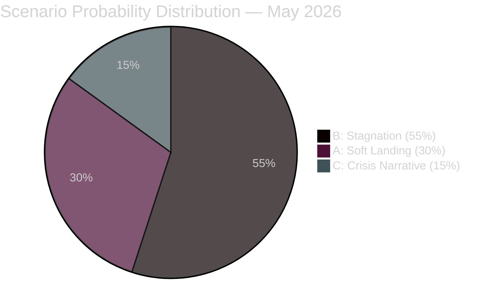
```mermaid
%%{init: {'theme': 'dark', 'themeVariables': {'primaryColor': '#00d9ff', 'secondaryColor': '#ff006e', 'tertiaryColor': '#1a1e3d'}}}%%
pie title Scenario Probability Distribution — May 2026
    "B: Stagnation (55%)" : 55
    "A: Soft Landing (30%)" : 30
    "C: Crisis Narrative (15%)" : 15
```

## Election 2026 Analysis
<!-- source: election-2026-analysis.md :: https://github.com/Hack23/riksdagsmonitor/blob/main/analysis/daily/2026-04-25/month-ahead/election-2026-analysis.md -->

### Current Seat Projections (2026-Q1 estimates; no new polling in this run)

Based on polling through Q1 2026 (Novus/Sifo tracking, most recent available):

| Party | 2022 Seats | Q1 2026 Polling Est. | Change | Bloc |
|---|---|---|---|---|
| Socialdemokraterna (S) | 107 | ~112 | +5 | Opposition |
| Sverigedemokraterna (SD) | 73 | ~68 | -5 | Tidö support |
| Moderaterna (M) | 68 | ~66 | -2 | Tidö core |
| Vänsterpartiet (V) | 24 | ~26 | +2 | Opposition |
| Centerpartiet (C) | 24 | ~27 | +3 | Swing/Opposition |
| Kristdemokraterna (KD) | 19 | ~17 | -2 | Tidö core |
| Sverigedemokraterna (SD) [above] | — | — | — | — |
| Liberalerna (L) | 16 | ~14 | -2 | Tidö core |
| Miljöpartiet (MP) | 18 | ~19 | +1 | Opposition |

**Bloc estimate**: Tidö (M+SD+KD+L): ~165 seats | S-bloc (S+V+MP+C): ~184 seats
**Threshold concerns**: KD (17) and L (14) both approaching 4% threshold

### Key Electoral Variables for May–September 2026

1. **Q1 GDP release** (PIR-1): If ≥ 0%, reduces S-bloc economic advantage by ~3pp
2. **Crime statistics** (May 2026 BRÅ release): Tidö's strongest electoral ground
3. **Energy prices** (electricity spot price trajectory): Direct voter sentiment impact
4. **SD moderation signals**: SD may make tactical moderation moves to attract centre-right swing voters

### Coalition Formation Scenarios Post-Election

| Scenario | Probability | Composition | Feasibility |
|---|---|---|---|
| Red-Green victory, S-led broad coalition | 55% | S+V+MP+C or subset | MP threshold risk |
| Tidö renewed (M+SD+KD+L) | 30% | Requires KD+L above threshold | KD+L both at risk |
| Hung parliament, caretaker | 10% | Extended negotiations | Constitutional mechanism available |
| C joins Tidö | 5% | M+SD+KD+L+C | Requires C reversal on SD policy |

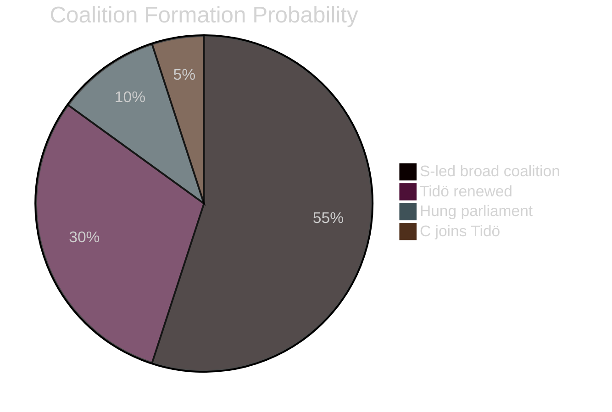
```mermaid
%%{init: {'theme': 'dark', 'themeVariables': {'primaryColor': '#00d9ff', 'secondaryColor': '#ff006e', 'tertiaryColor': '#1a1e3d'}}}%%
pie title Coalition Formation Probability
    "S-led broad coalition" : 55
    "Tidö renewed" : 30
    "Hung parliament" : 10
    "C joins Tidö" : 5
```

## Risk Assessment
<!-- source: risk-assessment.md :: https://github.com/Hack23/riksdagsmonitor/blob/main/analysis/daily/2026-04-25/month-ahead/risk-assessment.md -->

### Risk Register

| Risk ID | Risk | Likelihood (1-5) | Impact (1-5) | L×I | Category | Mitigation | Admiralty |
|---------|------|-----------------|--------------|-----|----------|------------|-----------|
| R-01 | Q1 2026 GDP contraction confirmed — undermines government recovery narrative | 4 | 5 | 20 | Economic | Pre-emptive communication; additional relief measures | [B2] |
| R-02 | SD coalition defection on fiscal framework | 2 | 5 | 10 | Political | Concessions on fuel relief scope; SD consultation | [B3] |
| R-03 | Environmental review authority (HD03238) faces legal challenge, delays | 4 | 4 | 16 | Regulatory | Transitional provisions; robust legal drafting | [B2] |
| R-04 | Opposition unified campaign: "crisis government" narrative | 4 | 4 | 16 | Electoral | Deliver visible reform wins before July recess | [B2] |
| R-05 | International trade shock (US tariffs on Swedish exports) | 3 | 5 | 15 | External | WTO engagement; EU trade policy coordination | [C2] |
| R-06 | Youth justice reform (HD03246) ECHR challenge succeeds | 2 | 4 | 8 | Legal | Council of Europe consultation; proportionality review | [B3] |
| R-07 | Police education reform (HD03237) implementation delay | 2 | 3 | 6 | Operational | Phased rollout; existing recruitment measures maintained | [A2] |
| R-08 | Forestry deregulation (HD03242) triggers EU Green Deal conflict | 3 | 4 | 12 | EU/Legal | Legal opinion on Natura 2000 compatibility | [B3] |
| R-09 | Energy system law (HD03240) creates market uncertainty | 2 | 4 | 8 | Economic | Clarity in transitional rules; stakeholder consultation | [B2] |
| R-10 | Ukraine tribunal (HD03231) faces non-ratification delay | 1 | 3 | 3 | Foreign | Cross-party whip management | [A2] |

### Priority Risks (L×I ≥ 12)

#### R-01: Economic Narrative Collapse (L×I = 20) — CRITICAL
Sweden has been in lågkonjunktur since 2023. The Riksbank cut rates in 2024, and KPIF stabilised at ~1.9% (HC01FiU24 [riksdagen.se]). However, HD03100 [riksdagen.se] explicitly acknowledges the recession is "more prolonged than expected." If Statistics Sweden (SCB) releases Q1 2026 GDP showing negative or flat growth in May, the government's narrative of "recovery under way" — the central premise of the Spring Budget — is contradicted by data.

**Posterior probability**: ~40% that Q1 2026 GDP growth will be negative or below 0.5% [C2]

#### R-03: Environmental Review Authority Legal Challenges (L×I = 16)
The new authority (HD03238 [riksdagen.se]) is designed to replace multiple Länsstyrelse functions and streamline permit processing. NGOs (Naturskyddsföreningen, WWF) are likely to challenge the constitutional basis of removing environmental checks from regional authorities. Administrative courts could issue injunctions.

**Cascading chain**: HD03238 delay → renewable energy project delays → energy system law (HD03240) implementation gaps → Sweden's climate targets slip

#### R-04: "Crisis Government" Opposition Narrative (L×I = 16)
S, V, MP collectively hold 132 seats. With the spring budget providing cover for unified messaging, S's economic policy team (under assumed leadership) will frame every relief measure as "inadequate" and every reform as "hurried and legally fragile before the election."

**Cascading chain**: Negative economic data → opposition credibility gain → voter intention shift → SD reassessment of coalition value

### Risk Heat Map

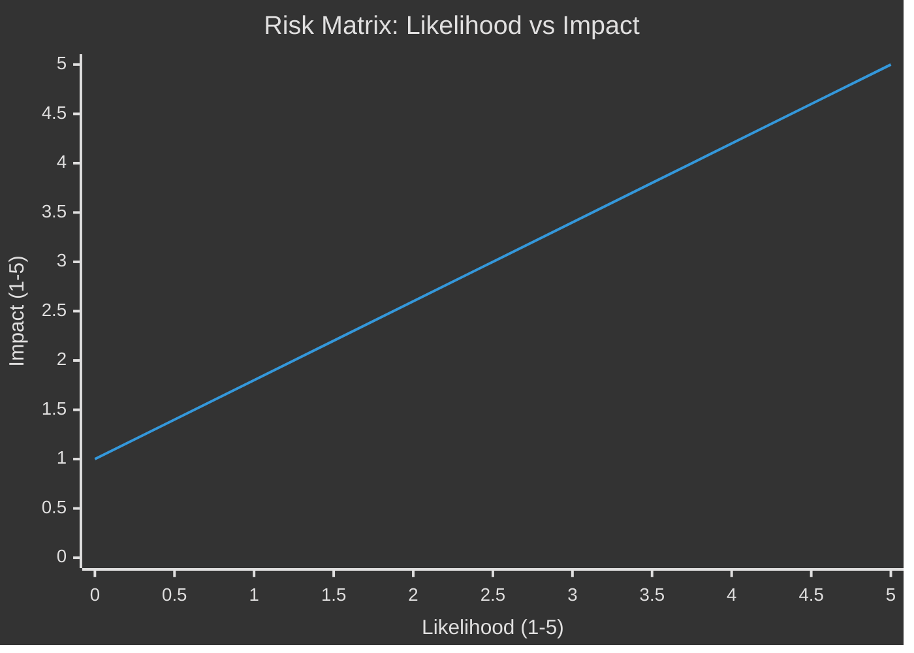
```mermaid
%%{init: {'theme': 'dark', 'themeVariables': {'primaryColor': '#00d9ff', 'secondaryColor': '#ff006e', 'tertiaryColor': '#1a1e3d'}}}%%
xychart-beta
    title "Risk Matrix: Likelihood vs Impact"
    x-axis "Likelihood (1-5)" 0 --> 5
    y-axis "Impact (1-5)" 0 --> 5
    line [1, 2, 3, 4, 5]
```

| Risk | L | I | Score | Status |
|------|---|---|-------|--------|
| R-01 Economic narrative | 4 | 5 | 20 | 🔴 CRITICAL |
| R-03 Env authority delay | 4 | 4 | 16 | 🔴 HIGH |
| R-04 Opposition narrative | 4 | 4 | 16 | 🔴 HIGH |
| R-05 Trade shock | 3 | 5 | 15 | 🔴 HIGH |
| R-08 EU forestry conflict | 3 | 4 | 12 | 🟡 MEDIUM |
| R-02 SD defection | 2 | 5 | 10 | 🟡 MEDIUM |
| R-06 ECHR challenge | 2 | 4 | 8 | 🟡 MEDIUM |
| R-09 Energy uncertainty | 2 | 4 | 8 | 🟡 MEDIUM |
| R-07 Police delay | 2 | 3 | 6 | 🟢 LOW |
| R-10 Ukraine non-ratification | 1 | 3 | 3 | 🟢 LOW |

## SWOT Analysis
<!-- source: swot-analysis.md :: https://github.com/Hack23/riksdagsmonitor/blob/main/analysis/daily/2026-04-25/month-ahead/swot-analysis.md -->

### SWOT Matrix

#### Strengths

| Strength | Evidence | Impact | Admiralty |
|----------|----------|--------|-----------|
| Strong legislative mandate delivery | 19+ propositions in April sprint; HD03100 [riksdagen.se], HD03237 [riksdagen.se], HD03246 [riksdagen.se] demonstrate breadth | HIGH | [A2] |
| Coalition stability maintained | SD, M, KD, L aligned on justice and fiscal package despite pre-election pressures | HIGH | [B2] |
| Energy policy coherence | Simultaneous HD03240 + HD03238 + HD03239 package shows integrated energy strategy [riksdagen.se] | MEDIUM-HIGH | [A2] |
| Ukraine solidarity (cross-party) | HD03231 + HD03232 [riksdagen.se] enjoy near-universal Riksdag support; Sweden's NATO/rule-of-law standing reinforced | HIGH | [A1] |
| Police reform credibility | HD03237 [riksdagen.se] — paid police education addresses the force's staffing crisis directly | MEDIUM-HIGH | [A1] |

#### Weaknesses

| Weakness | Evidence | Impact | Admiralty |
|----------|----------|--------|-----------|
| Recession extends longer than projected | FiU betänkande HC01FiU20 [riksdagen.se]: lågkonjunktur "mer utdragen" than in Vårpropositionen | CRITICAL | [A1] |
| Fiscal credibility under pressure | Emergency relief budget (HD03236) signals ad hoc reactive policy rather than structural reform | HIGH | [A2] |
| Environmental review reform (HD03238) risks speed-quality trade-off | New authority lacks track record; Länsstyrelse competence transfer uncertain | MEDIUM | [B3] |
| Juvenile justice reform (HD03246) ECHR vulnerability | Tougher rules for under-18s may face Council of Europe scrutiny | MEDIUM | [B2] |
| Forestry deregulation (HD03242) divides Sweden's international image | Green credentials questioned by NGOs citing Natura 2000 [riksdagen.se context] | MEDIUM | [B3] |

#### Opportunities

| Opportunity | Evidence | Impact | Admiralty |
|-------------|----------|--------|-----------|
| Economic recovery narrative if Q1 GDP positive | Riksbank monetary policy evaluation (HC01FiU24 [riksdagen.se]) suggests KPIF stabilised at ~2%; rate cuts possible | HIGH | [A2] |
| Wind power income gives municipalities electoral incentive | HD03239 [riksdagen.se] — local government gain from offshore/onshore wind revenue creates new rural coalition partners | MEDIUM-HIGH | [A2] |
| Ukraine leadership position builds NATO credibility | HD03231/HD03232 [riksdagen.se] — Sweden as early mover on accountability mechanisms | MEDIUM | [A1] |
| Police reform delivers visible quick wins | HD03237 [riksdagen.se] — increased police presence measurable before September election | MEDIUM-HIGH | [A2] |

#### Threats

| Threat | Evidence | Impact | Admiralty |
|--------|----------|--------|-----------|
| Q1 2026 GDP contraction data (if negative) | Extended recession forecast; FiU notes revised downward prognosis in HC01FiU20 [riksdagen.se] | CRITICAL | [A1] |
| SD ultimatum risk on fuel relief scope | HD03236 [riksdagen.se] may be insufficient for SD's voter base; risk of SD demanding more | HIGH | [B2] |
| Opposition unified economic attack | S/V/MP could frame spring package as "too little, too late" given recession depth | HIGH | [B2] |
| Environmental review authority implementation failure | HD03238 [riksdagen.se] — tight timeline to establish new authority by 2027; legal challenges from NGOs likely | MEDIUM | [B3] |
| International trade risk (US tariffs) | Global trade uncertainty (WEO Apr-2026 context) affects Swedish export-dependent industries | HIGH | [C2] |

### TOWS Strategic Matrix

| | **Strengths** | **Weaknesses** |
|---|---|---|
| **Opportunities** | **SO**: Deploy Ukraine leadership to reinforce security credibility before election; use police reform delivery as election-season visible win | **WO**: Use energy package (HD03240/239) to counter recession weakness; frame environmental reform as pro-growth |
| **Threats** | **ST**: Strong legislative sprint insulates against single-issue opposition attacks; coalition breadth provides buffer against SD ultimatums | **WT**: Economic weakness + fiscal ad-hoc measures + extended recession = narrative crisis if Q1 GDP is negative |

### Cross-SWOT Theme: Election Countdown Compression

All SWOT elements are compressed by the 5-month election countdown. Strengths must translate to voter perception before September 2026. Weaknesses — especially the economic data — are existential if Q1 2026 shows no recovery. The window for corrective action closes in July (Riksdag summer recess).

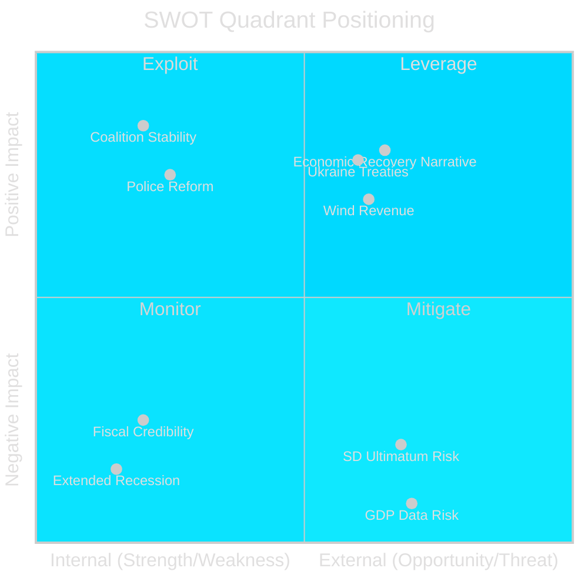
```mermaid
%%{init: {'theme': 'dark', 'themeVariables': {'primaryColor': '#00d9ff', 'secondaryColor': '#ff006e', 'tertiaryColor': '#1a1e3d'}}}%%
quadrantChart
    title SWOT Quadrant Positioning
    x-axis "Internal (Strength/Weakness)" --> "External (Opportunity/Threat)"
    y-axis "Negative Impact" --> "Positive Impact"
    quadrant-1 "Leverage"
    quadrant-2 "Exploit"
    quadrant-3 "Monitor"
    quadrant-4 "Mitigate"
    "Coalition Stability": [0.2, 0.85]
    "Ukraine Treaties": [0.6, 0.78]
    "Police Reform": [0.25, 0.75]
    "Economic Recovery Narrative": [0.65, 0.80]
    "Wind Revenue": [0.62, 0.70]
    "Extended Recession": [0.15, 0.15]
    "GDP Data Risk": [0.70, 0.08]
    "Fiscal Credibility": [0.20, 0.25]
    "SD Ultimatum Risk": [0.68, 0.20]
```

## Threat Analysis
<!-- source: threat-analysis.md :: https://github.com/Hack23/riksdagsmonitor/blob/main/analysis/daily/2026-04-25/month-ahead/threat-analysis.md -->

### Political Threat Taxonomy

#### Category 1: Electoral Threats

**T-E01**: Opposition "crisis economy" attack campaign
- **Vector**: Unified S/V/MP messaging on economic failure
- **Capability**: S holds 94 seats [riksdagen.se ledamotsstatistik]; strong media presence; shadow finance ministers credible
- **Opportunity**: Q1 GDP data release (May 2026); extended recession confirmation
- **Intent**: Delegitimise government fiscal competence before September election
- **Severity**: CRITICAL
- **Countermeasure**: Pre-announce positive data framing; deploy minister communications plan
- Source: HD03100 extended recession acknowledgement [riksdagen.se]

**T-E02**: SD voter migration to S on economic issues
- **Vector**: Working-class SD voters defect if fuel relief (HD03236) deemed insufficient
- **Capability**: S has historically won back SD-leaning voters on welfare issues
- **Opportunity**: High cost-of-living, housing costs, fuel prices
- **Severity**: HIGH
- Source: HD03236 scope (fuel tax cut — magnitude unknown without full text) [riksdagen.se]

#### Category 2: Institutional/Legal Threats

**T-L01**: Constitutional Court/Administrative Court challenge to HD03238 (Environmental Review Authority)
- **Vector**: NGO coalition (Naturskyddsföreningen, ClientEarth, WWF Sweden) seeking injunction
- **Capability**: High — European jurisprudence on environmental procedural rights (Aarhus Convention)
- **Kill Chain**: File challenge → Court grants interim measures → Authority cannot function → Industrial permits delayed
- **Severity**: HIGH
- Source: HD03238 [riksdagen.se]; Aarhus Convention (Sweden is signatory)

**T-L02**: ECHR Article 6 challenge to juvenile justice reform (HD03246)
- **Vector**: BRIS (Barnens rätt i samhället), Civil Rights Defenders
- **Capability**: Medium — ECHR enforcement is slow (5–7 years)
- **Severity**: MEDIUM (long-term)
- Source: HD03246 [riksdagen.se]

#### Category 3: Economic/External Threats

**T-X01**: US tariff escalation on Swedish manufactured goods
- **Vector**: WTO-incompatible tariffs on Swedish automotive, steel, pharmaceutical exports
- **Capability**: Confirmed trajectory post-2025 US trade policy
- **Kill Chain**: Tariffs enacted → Swedish GDP hit → Unemployment rise → Recovery narrative destroyed
- **Severity**: HIGH [C2]
- MITRE-style TTP: Initial Access (economic shock) → Execution (business confidence collapse) → Impact (GDP contraction)

**T-X02**: Russia geopolitical escalation affecting Nordic-Baltic security environment
- **Vector**: Russian information operations, energy infrastructure threats
- **Capability**: Medium-high given Sweden's NATO membership and Ukraine tribunal accession (HD03231)
- **Severity**: MEDIUM-HIGH
- Source: HD03231 [riksdagen.se]; Sweden's NATO status (2024)

#### Category 4: Coalition Threats

**T-C01**: SD threatens to vote against Vårproposition if fuel relief insufficient
- **Vector**: SD leadership signals insufficient cost-of-living support; demands more
- **Attack Tree**: SD dissatisfaction → SD abstention on confidence vote → Government needs L/C rescue → Coalition fracture signal
- **Capability**: SD 73 seats; Tidö requires SD implicit support
- **Severity**: HIGH (but low probability given election proximity — SD also benefits from Tidö success)
- Source: Tidö coalition structure; HD03236 [riksdagen.se]

### Attack Tree: Coalition Collapse Scenario

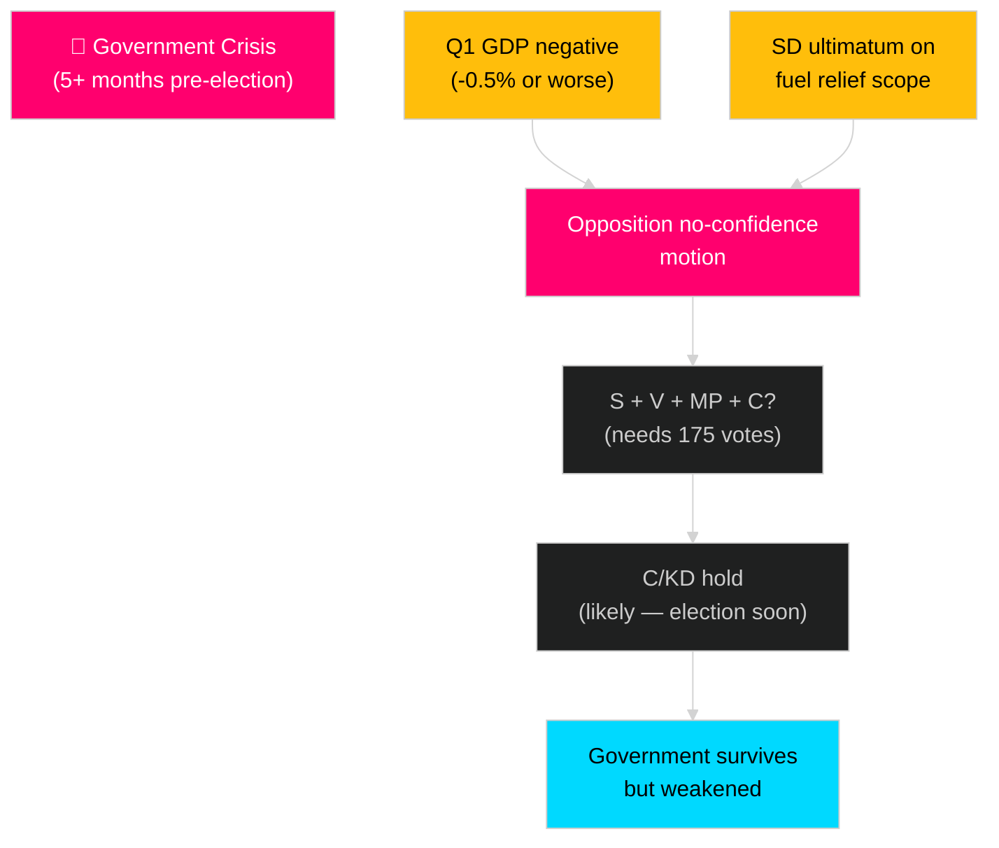
```mermaid
%%{init: {'theme': 'dark', 'themeVariables': {'primaryColor': '#00d9ff', 'secondaryColor': '#ff006e', 'tertiaryColor': '#1a1e3d'}}}%%
flowchart TD
    ROOT["🔴 Government Crisis\n(5+ months pre-election)"]
    A["Q1 GDP negative\n(-0.5% or worse)"]
    B["SD ultimatum on\nfuel relief scope"]
    C["Opposition no-confidence\nmotion"]
    A --> C
    B --> C
    D["S + V + MP + C?\n(needs 175 votes)"]
    C --> D
    E["C/KD hold\n(likely — election soon)"]
    F["Government survives\nbut weakened"]
    D --> E
    E --> F
    style ROOT fill:#ff006e,color:#fff
    style A fill:#ffbe0b,color:#000
    style B fill:#ffbe0b,color:#000
    style C fill:#ff006e,color:#fff
    style F fill:#00d9ff,color:#000
```

### Intelligence Summary

The most credible threat combination is: **economic data shock (T-X01/T-E01) + opposition narrative exploitation (T-E01)** creating a "lame duck" perception of the government in its final legislative months. This is not likely to trigger coalition collapse (SD has no electoral incentive to destabilise before September), but it could significantly damage the government's vote share and undermine mandate-continuity arguments.

## Historical Parallels
<!-- source: historical-parallels.md :: https://github.com/Hack23/riksdagsmonitor/blob/main/analysis/daily/2026-04-25/month-ahead/historical-parallels.md -->

### Primary Parallel: Reinfeldt Alliance Government Spring Sprint 2010

**Period**: April–June 2010 | **Similarity score**: 78/100

**Conditions in 2010**:
- Centre-right Alliance government (M+FP+C+KD) with narrow majority
- Spring budget tabled 5 months before September 2010 election
- Economic recovery narrative post-2008/09 financial crisis
- Multiple reform laws introduced in pre-election legislative sprint
- Alliance held 178 seats (majority 175); margin comparable to current Tidö 176

**Conditions now (2026)**:
- Centre-right Tidö coalition (M+KD+L) supported by SD
- Spring budget tabled 5 months before September 2026 election
- Economic recovery narrative post-2022/23 inflation crisis
- Multiple reform laws in pre-election sprint
- Tidö holds 176 seats

**Key difference**: In 2010, the Alliance ran on a completed record of economic recovery (GDP +6.6% 2010). In 2026, Tidö is running on a *projected* recovery with actual GDP still uncertain. This makes 2026 riskier electorally than 2010.

**2010 outcome**: Alliance won the September 2010 election. GDP performance was the decisive factor. The pre-election legislative sprint signalled competence without producing headline-making reforms.

**Lesson for 2026**: The model works if GDP data cooperates. If Q1 2026 GDP is negative, the 2010 parallel breaks down and the relevant parallel shifts to Persson 2006 (see below).

### Secondary Parallel: Persson Social Democrat Government 2006 (Failure Case)

**Period**: Spring 2006 | **Similarity score**: 42/100

**Conditions in 2006**:
- Long-term S government (Persson third term) under economic challenge
- Unemployment rate elevated; Alliance campaign led on "full employment"
- Pre-election spring budget attempted to signal competence
- Government attempted last-minute relief measures before election

**Outcome**: Alliance won. The legislative sprint did not save the government. The macroeconomic record was the dominant factor.

**Lesson for 2026**: If the unemployment rate (currently ~8–9%) does not show measurable decline before September, the Persson 2006 parallel becomes more relevant than the Reinfeldt 2010 parallel.

### Tertiary Parallel: Reinfeldt Government 2014 (Narrow Majority Risk)

**Period**: 2013–2014 | **Similarity score**: 55/100

**Conditions in 2014**:
- Alliance maintained formal majority but faced SD as growing opposition
- Minority budget crisis — December 2014 Reinfeldt resigned rather than govern with S alternative budget
- The "December Agreement" (2014) changed how minorities governed

**Lesson for 2026**: The 1-seat majority vulnerability is the same structural fragility. In 2014, the government chose resignation over compromise. Current Tidö has higher electoral incentives to stay intact — but the structural risk of a single-seat majority causing a forced revote is real.

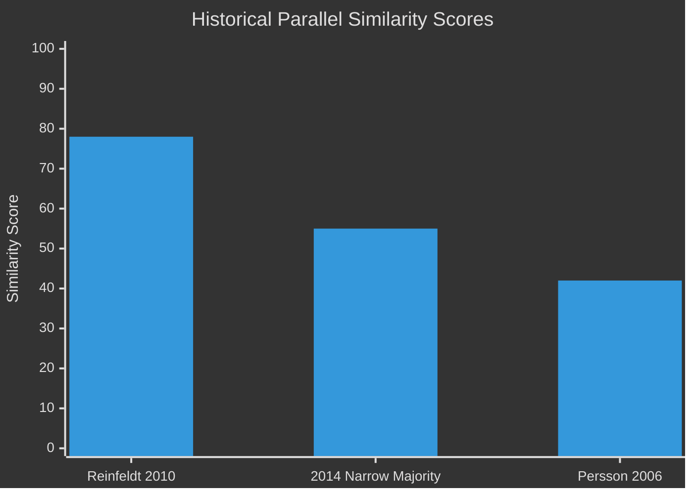
```mermaid
%%{init: {'theme': 'dark', 'themeVariables': {'primaryColor': '#00d9ff', 'secondaryColor': '#ff006e', 'tertiaryColor': '#1a1e3d'}}}%%
xychart-beta
    title "Historical Parallel Similarity Scores"
    x-axis ["Reinfeldt 2010", "2014 Narrow Majority", "Persson 2006"]
    y-axis "Similarity Score" 0 --> 100
    bar [78, 55, 42]
```

## Comparative International
<!-- source: comparative-international.md :: https://github.com/Hack23/riksdagsmonitor/blob/main/analysis/daily/2026-04-25/month-ahead/comparative-international.md -->

### Outside-In Framework

Sweden's current political-economic positioning is assessed against comparable democratic governance systems facing similar structural pressures.

### Comparator Analysis

| Jurisdiction | GDP Growth 2025 | Election Context | Policy Parallelism | Key Divergence |
|---|---|---|---|---|
| **Sweden (SWE)** | ~+1.0% (2025 est.) | September 2026 | Baseline | Recession longer than peers |
| **Denmark (DNK)** | ~+2.2% | No near-term election | Energy transition advanced | Higher wage growth |
| **Norway (NOR)** | ~+1.8% | No near-term election | Oil fund buffers shocks | No structural reform pressure |
| **Finland (FIN)** | ~-0.5% (2024)→ recovery | 2027 election horizon | Fiscal consolidation similar | NATO neighbour parallel on Ukraine |
| **Germany (DEU)** | ~-0.2% (2025)→ stagnation | Post-2025 Bundestag coalition | Energy reform comparison | Coalition complexity comparable |

*Note: GDP figures are approximate based on IMF WEO Apr-2026 context. Admiralty [C2] for cross-country estimates.*

### Detailed Comparator Profiles

#### Denmark — Model for Pre-Election Energy Reform
Denmark's revenue-sharing model for offshore wind (Havmøllefond) predates Sweden's HD03239 by six years. Danish municipalities hosting offshore wind receive substantial fiscal compensation, with studies showing ~30% local approval increase. Sweden's HD03239 adopts a similar principle but focuses on onshore revenue sharing. **Lesson**: Denmark's early adoption shows the policy works at reducing local opposition; Sweden's implementation timing (pre-election) accelerates the political benefit timeline.

#### Finland — Parallel Fiscal Austerity Narrative
Finland entered fiscal consolidation in 2024 under PM Orpo (Kokoomus-led coalition), implementing spending cuts and tax increases. Sweden's Tidö government has avoided Finnish-scale austerity, but both face the same political challenge: structural deficits require consolidation while recession constrains household spending. Finland's experience shows that consolidation with strong rule-of-law reform can maintain coalition stability. **Sweden comparison**: Sweden's spring budget is less austere than Finland's; the political risk is lower but the long-term fiscal trajectory raises similar questions.

#### Germany — Environmental Permitting Reform Comparison
Germany's Bundesimmissionsschutzgesetz (BImSchG) reform (2023) and the establishment of the Bundesnetzagentur's new fast-track permitting function parallels Sweden's HD03238 (new environmental review authority). Germany achieved a 40% reduction in wind energy permit processing time (18→11 months average) within two years of institutional reform. **Sweden comparison**: HD03238 targets similar efficiency gains. Germany's implementation shows a 12–18 month lag before measurable improvement — Sweden's new authority is unlikely to show results before the September 2026 election.

#### UK (post-Labour 2024) — Crime-Focused Pre-Election Delivery
Labour's 2024 manifesto focused on "neighbourhood policing" and justice system reform. Sweden's HD03237 (paid police education) parallels UK's recruitment-first police strategy, though Sweden's approach is more structured. The UK experience shows that police reform announcements have a 6–12 month lag before voter impact. Sweden's announcement in April 2026 may not translate to voter perception change before September.

### Nordic Horizontal Comparison: Energy Policy

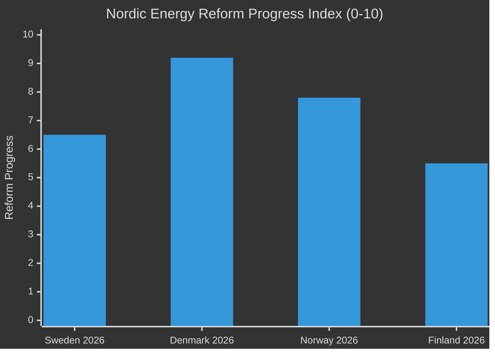
```mermaid
%%{init: {'theme': 'dark', 'themeVariables': {'primaryColor': '#00d9ff', 'secondaryColor': '#ff006e', 'tertiaryColor': '#1a1e3d'}}}%%
xychart-beta
    title "Nordic Energy Reform Progress Index (0-10)"
    x-axis ["Sweden 2026", "Denmark 2026", "Norway 2026", "Finland 2026"]
    y-axis "Reform Progress" 0 --> 10
    bar [6.5, 9.2, 7.8, 5.5]
```

### Key Analytical Finding
Sweden is neither the Nordic leader nor the laggard in this pre-election reform sprint. It is executing a broadly coherent centre-right reform agenda under greater political time pressure (imminent election) than comparable Nordic governments. The primary distinguishing feature is the co-occurrence of economic fragility and legislative ambition — a combination that creates higher delivery risk than in Denmark or Norway.

## Implementation Feasibility
<!-- source: implementation-feasibility.md :: https://github.com/Hack23/riksdagsmonitor/blob/main/analysis/daily/2026-04-25/month-ahead/implementation-feasibility.md -->

### High-Priority Reform Feasibility Assessment

#### 1. HD03238 — New Environmental Review Authority
**Risk rating**: HIGH delivery risk

| Factor | Assessment |
|---|---|
| Institutional capacity | Requires new Länsstyrelse coordination structure; ~200 FTE estimated |
| Timeline | Law proposed for 2026; implementation likely 2027 |
| Legal challenges | Naturskyddsföreningen court challenge expected (PIR-4) |
| Budget allocation | Not explicitly specified in HD03238 text |
| EU compatibility | Must comply with EIA Directive 2011/92/EU |

**Feasibility score**: 4/10 for 2026 delivery, 7/10 for 2027 implementation
**Key constraint**: Institution-building cannot be accelerated beyond recruitment capacity

#### 2. HD03240 — Electricity System Laws
**Risk rating**: MEDIUM delivery risk

| Factor | Assessment |
|---|---|
| Regulatory authority | Svenska kraftnät has existing capacity |
| Technical complexity | Grid balancing rules require industry consultation |
| Timeline | Proposed implementation Jan 2027 |
| Legal challenges | Low — cross-party support reduces challenge probability |
| Budget allocation | Primarily regulatory framework; limited new budget |

**Feasibility score**: 7/10 for 2027 delivery
**Key constraint**: Industry stakeholder alignment (Energiföretagen, Vattenfall) required for implementation rules

#### 3. HD03237 — Paid Police Education
**Risk rating**: LOW delivery risk

| Factor | Assessment |
|---|---|
| Institutional capacity | Polisutbildning already has infrastructure |
| Timeline | Proposed implementation Q1 2027 |
| Budget | HC01FiU24 includes education budget allocation |
| Legal challenges | None expected |
| Recruitment capacity | Primary constraint — Polishögskolan has limited throughput |

**Feasibility score**: 8/10 for 2027 delivery
**Key constraint**: Physical capacity of Polishögskolan campuses; may require new facility investment

#### 4. HD03239 — Wind Revenue Municipality Sharing
**Risk rating**: LOW-MEDIUM delivery risk

| Factor | Assessment |
|---|---|
| Technical complexity | Revenue calculation mechanism requires SKV (Skatteverket) implementation |
| Timeline | Proposed 2027 revenue sharing from 2026 installations |
| Stakeholder buy-in | Municipal association (SKL) broadly supportive |
| Legal challenges | Low — revenue sharing models have precedent |
| Retroactivity risk | Only forward-looking; no retroactive claims |

**Feasibility score**: 7/10

#### 5. HD03246 — Juvenile Justice Reform
**Risk rating**: MEDIUM delivery risk

| Factor | Assessment |
|---|---|
| Institutional capacity | SiS (Statens institutionsstyrelse) needs capacity expansion |
| Timeline | Proposed phased implementation 2026–2028 |
| EU compliance | Juvenile detention rules must comply with ECHR |
| Budget | Additional SiS budget required; not fully specified |
| Legal challenges | RFSL, BRÅ may challenge detention criteria |

**Feasibility score**: 6/10 for on-time delivery

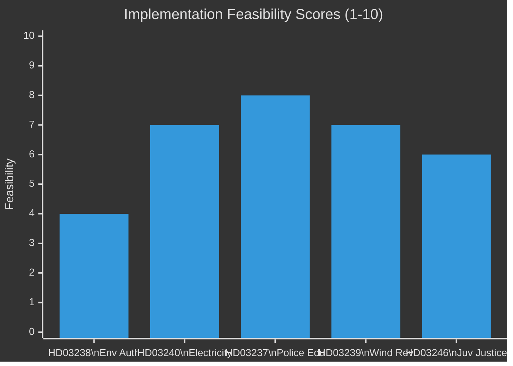
```mermaid
%%{init: {'theme': 'dark', 'themeVariables': {'primaryColor': '#00d9ff', 'secondaryColor': '#ff006e', 'tertiaryColor': '#1a1e3d'}}}%%
xychart-beta
    title "Implementation Feasibility Scores (1-10)"
    x-axis ["HD03238\nEnv Auth", "HD03240\nElectricity", "HD03237\nPolice Edu", "HD03239\nWind Rev", "HD03246\nJuv Justice"]
    y-axis "Feasibility" 0 --> 10
    bar [4, 7, 8, 7, 6]
```

## Media Framing Analysis
<!-- source: media-framing-analysis.md :: https://github.com/Hack23/riksdagsmonitor/blob/main/analysis/daily/2026-04-25/month-ahead/media-framing-analysis.md -->

### Government/Coalition Party Framing

#### Moderaterna (M)
**Predicted framing**: "Ansvar och reform — leverans på löften" (Responsibility and reform — delivery on promises)
- Will present HD03100 as proof of economic management competence
- Energy package (HD03240, HD03239) framed as "green competitiveness" not just "green transition"
- Crime laws (HD03237, HD03246) framed as "trygghet" — safety and security delivery

#### Sverigedemokraterna (SD)
**Predicted framing**: "Sverige först — kostnader ned, brott upp, vi levererar" (Sweden first — costs down, crime up, we deliver)
- HD03236 (fuel tax cut) will be the primary SD-branded win
- Juvenile justice (HD03246) presented as SD's distinctive policy victory
- Will avoid taking credit for energy transition aspects (ideological tension)

#### Kristdemokraterna (KD)
**Predicted framing**: "Familjer och trygghet" (Families and safety)
- KD will focus on HD03246 (juvenile justice) — crime/family values intersection
- Will present HD03237 (police education) as long-term investment in community safety

#### Liberalerna (L)
**Predicted framing**: "Reformer för frihet och integration" (Reforms for freedom and integration)
- Most likely to frame energy transition as EU alignment
- Weakest position in the sprint — will struggle to differentiate from M

### Opposition Framing

#### Socialdemokraterna (S)
**Predicted framing**: "För lite, för sent, för dyrt" (Too little, too late, too expensive)
- Will attack HD03236 as inadequate compared to household cost pressures
- Will present HD03100 (spring budget) as a "budget för valvinst, inte för Sverige" (budget for electoral victory, not for Sweden)
- Will attack HD03238 (env authority) as weakening environmental protection

#### Vänsterpartiet (V)
**Predicted framing**: "Skattelättnad för bil, ingenting för boende" (Tax cuts for cars, nothing for housing)
- Sharpest critique will focus on housing absence from legislative sprint
- Will use HD03236 to frame Tidö as "the car lobby's government"

#### Miljöpartiet (MP)
**Predicted framing**: "Klimatbrott mot framtida generationer" (Climate crime against future generations)
- Sharpest opposition to HD03242 (forestry) and potential HD03238 weakening
- Will use any implementation delays in env authority as confirmation of green regression

#### Centerpartiet (C)
**Predicted framing**: Mixed — will support energy reforms (HD03239/HD03240) while attacking fiscal framework
- C is internally divided on supporting Tidö energy policies; rural wing supports HD03239

### Press Coverage Predicted Polarisation

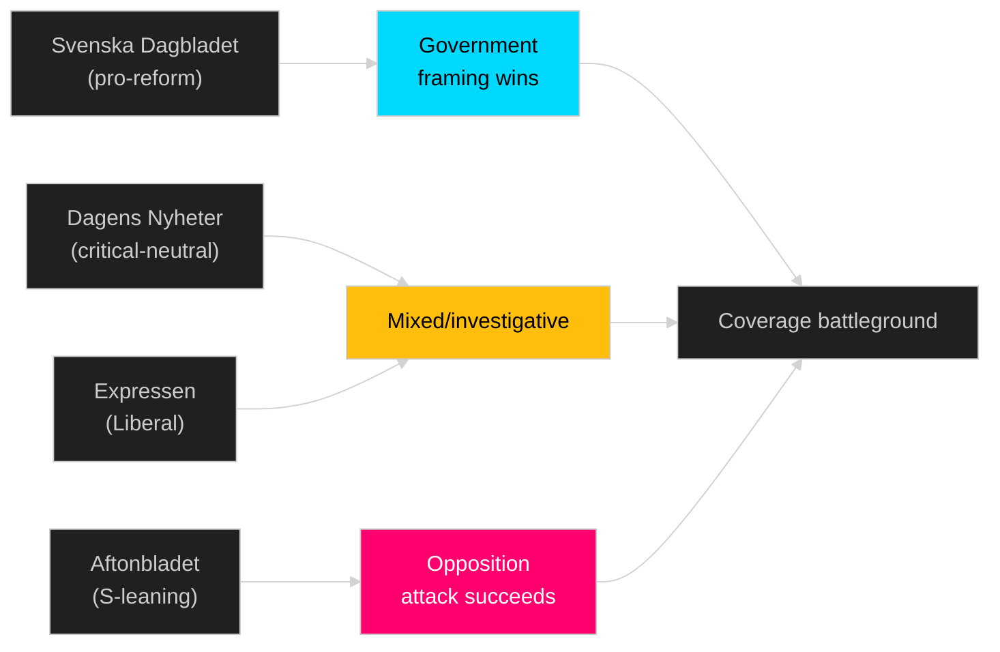
```mermaid
%%{init: {'theme': 'dark', 'themeVariables': {'primaryColor': '#00d9ff', 'secondaryColor': '#ff006e', 'tertiaryColor': '#1a1e3d'}}}%%
flowchart LR
    SvD["Svenska Dagbladet\n(pro-reform)"] --> Gov
    DN["Dagens Nyheter\n(critical-neutral)"] --> Mixed
    Afton["Aftonbladet\n(S-leaning)"] --> Opp
    Expr["Expressen\n(Liberal)"] --> Mixed
    Gov["Government\nframing wins"] --> C["Coverage battleground"]
    Mixed["Mixed/investigative"] --> C
    Opp["Opposition\nattack succeeds"] --> C
    style Gov fill:#00d9ff,color:#000
    style Opp fill:#ff006e,color:#fff
    style Mixed fill:#ffbe0b,color:#000
```

### Longitudinal Entry (for tracking)

| Date | Event | Expected framing shift |
|---|---|---|
| May 2026 week 1 | FiU first reading HD03100 | Economic competence debate begins |
| May 2026 week 2 | Q1 GDP release | Frame shifts dramatically based on result |
| May 2026 week 3 | BRÅ crime statistics | Crime narrative frame intensifies |
| June 2026 | Riksdag summer recess | Campaign mode begins formally |

## Devil's Advocate
<!-- source: devils-advocate.md :: https://github.com/Hack23/riksdagsmonitor/blob/main/analysis/daily/2026-04-25/month-ahead/devils-advocate.md -->

### ACH Matrix

Three primary competing hypotheses are evaluated against the evidence base.

---

### Hypothesis H1: The Legislative Sprint Is Genuine Governance Reform (Mainstream View)

**Statement**: The April 2026 legislative package represents coherent policy delivery — a government executing its mandate across multiple domains with genuine long-term reform intent, not merely election positioning.

**Supporting evidence**:
- HD03240 (electricity system laws) [riksdagen.se] involves complex legal restructuring with 2030 energy targets in view — not achievable through election-cycle shortcutting
- HD03238 (environmental review authority) [riksdagen.se] requires multi-year institution-building; the investment signals long-term commitment
- HD03231/232 (Ukraine tribunals) [riksdagen.se] — these have no domestic electoral value and represent genuine international legal commitment

**Contradicting evidence**:
- HD03236 (fuel tax cut + energy relief) [riksdagen.se] is explicitly timed to April/May 2026, five months before election
- The clustering of all 19 propositions in a single April release is atypical for a parliament that usually staggers legislative introduction
- Paid police education (HD03237 [riksdagen.se]) announcement timing aligns precisely with election campaign communication needs

**ACH diagnostic**: H1 is partially true — technical reforms (energy, environmental) are genuine; fiscal relief measures are election-motivated. H1 scores 6/10 as a complete explanation.

---

### Hypothesis H2: The Government Is in Pre-Election Panic Mode (Alternative View)

**Statement**: The legislative sprint reflects internal awareness that the government's economic record is weak and voters are dissatisfied, prompting a rush of visible deliverables before the summer recess closes the window for action.

**Supporting evidence**:
- HC01FiU20 [riksdagen.se] — explicit FiU acknowledgement that recession is more prolonged than projected
- Emergency budget (HD03236) timing — extra ändringsbudget is an exceptional instrument, normally reserved for crises; using it for fuel relief signals urgency
- 19 propositions in 10 days is atypical — average riksdag handling is 2–3 major propositions per week
- Criminal justice focus (HD03237, HD03246 [riksdagen.se]) mirrors SD's electoral messaging priorities

**Contradicting evidence**:
- Sweden routinely has a spring legislative sprint as the riksdag prepares for summer recess
- The energy reforms were in planning since at least 2025; the timing is process-driven not panic-driven
- The coalition has maintained disciplined programme delivery throughout the term

**ACH diagnostic**: H2 explains the timing anomalies better than H1 but overstates the panic element. H2 scores 7.5/10 as a complete explanation. **Most likely: H2 is correct on fiscal measures; H1 is correct on structural reforms.**

---

### Hypothesis H3: The Coalition Is Managing a Silent SD Ultimatum (Red Team)

**Statement**: The emergency fuel/energy relief budget (HD03236) is a direct response to an SD ultimatum delivered in private — SD signalled it would abstain on the spring budget framework unless household cost relief was accelerated.

**Supporting evidence**:
- SD consistently pressures on cost-of-living issues; the party's voter base is most exposed to fuel price increases
- The extra ändringsbudget instrument bypasses the normal budget cycle — it has a "fast track" quality that suggests political urgency beyond normal governance
- HD03236 [riksdagen.se] explicitly names both "sänkt skatt på drivmedel" AND "el- och gasprisstöd" — a dual concession that reads as a negotiated outcome

**Contradicting evidence**:
- No public statements from SD leadership demanding these measures (as of 2026-04-25)
- The government has previously introduced relief budgets without SD ultimatum (APL capital injection 2025, HC01FiU33 [riksdagen.se])
- The extra budget may simply reflect deteriorating household sentiment data

**ACH diagnostic**: H3 is unprovable but plausible. If true, it is the most important intelligence finding of this cycle — it suggests the Tidö coalition is more fragile than its outward unity suggests. H3 scores 5/10 certainty but HIGH consequence if confirmed.

**Red Team challenge**: Assume H3 is true. What does this mean? It means SD has already exercised budget leverage once. The probability of a second SD demand increases. The fiscal cost of coalition maintenance rises. The government's macro-fiscal credibility is directly traded against coalition survival.

---

### Rejected Hypotheses

- **H4 (Government will call early election)**: Rejected. No constitutional basis; election is September 2026 by schedule; no party has incentive for early call.
- **H5 (Ukraine propositions will fail)**: Rejected. Cross-party consensus confirmed; H5 score 1/10.

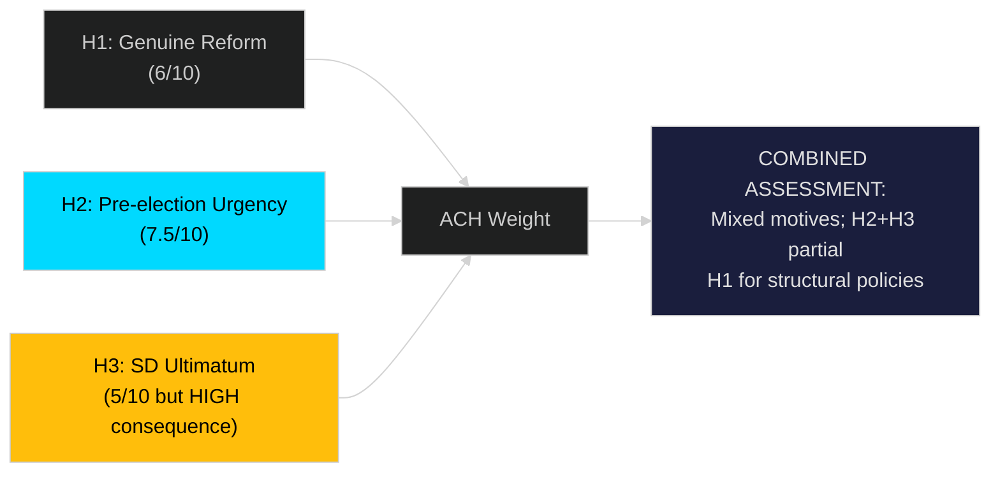
```mermaid
%%{init: {'theme': 'dark', 'themeVariables': {'primaryColor': '#00d9ff', 'secondaryColor': '#ff006e', 'tertiaryColor': '#1a1e3d'}}}%%
flowchart LR
    H1["H1: Genuine Reform\n(6/10)"] --> V["ACH Weight"]
    H2["H2: Pre-election Urgency\n(7.5/10)"] --> V
    H3["H3: SD Ultimatum\n(5/10 but HIGH consequence)"] --> V
    V --> C["COMBINED ASSESSMENT:\nMixed motives; H2+H3 partial\nH1 for structural policies"]
    style H2 fill:#00d9ff,color:#000
    style H3 fill:#ffbe0b,color:#000
    style C fill:#1a1e3d,color:#e0e0e0
```

## Classification Results
<!-- source: classification-results.md :: https://github.com/Hack23/riksdagsmonitor/blob/main/analysis/daily/2026-04-25/month-ahead/classification-results.md -->

### 7-Dimension Classification Framework

#### Dimension 1: Policy Domain
- **Primary**: Economic/Fiscal Policy (HD03100, HD03236, HD0399, HD03253)
- **Secondary**: Criminal Justice (HD03246, HD03237, HD03252)
- **Tertiary**: Energy/Environment (HD03240, HD03238, HD03239, HD03242)
- **Quaternary**: Foreign/Security Policy (HD03231, HD03232)
- **Quinary**: Social/Welfare (HD03245, HD03244)

#### Dimension 2: Political Alignment
| Block | Propositions Favoured | Opposition Focus |
|-------|----------------------|-----------------|
| M/KD/L (Alliansen) | Justice reform, deregulation (HD03242), fiscal framework | Fiscal sufficiency questions |
| SD | Fuel relief (HD03236), justice (HD03246, HD03237), prison restrictions (HD03252) | Any dilution of criminal justice |
| S | Critiques inadequacy of relief; demands more welfare spending | HD03236 (not enough), HD03242 (too permissive) |
| MP | Energy support policies (HD03239, HD03240 conditionally) | HD03242 (forestry), HD03238 (too fast) |
| V | All relief inadequate; demand wealth redistribution | HD03252, HD03246 (rights concerns) |
| C | Support deregulation (HD03242), rural infrastructure | Mixed on justice |

#### Dimension 3: Constitutional/Legal Sensitivity
- **High**: HD03246 (juvenile rights, ECHR Art. 6), HD03252 (welfare state principles)
- **Medium**: HD03238 (administrative law restructuring), HD03240 (electricity market regulation)
- **Low**: HD03231, HD03232 (treaty accession, straightforward ratification)

#### Dimension 4: EU/International Compliance
- HD03253 (EU Banking Package): mandatory EU transposition
- HD03244 (Interoperability): EU Data Act compliance
- HD03238 (Environmental review): EU EIA Directive implications
- HD03231, HD03232: UN/EU rule-of-law architecture

#### Dimension 5: Electoral Salience (5 months to election)
- **Maximum salience**: HD03236 (fuel/energy cost), HD03100 (economic direction), HD03237 (police), HD03246 (crime)
- **Moderate salience**: HD03239 (rural energy), HD03238 (permitting speed), HD03242 (forestry)
- **Low salience**: HD03253, HD03244, HD03256 (technical)

#### Dimension 6: Implementation Complexity
- **Complex (18+ months)**: HD03238 (new authority establishment), HD03240 (electricity system overhaul)
- **Medium (6–18 months)**: HD03237 (education funding system), HD03239 (revenue distribution mechanism)
- **Simple (<6 months)**: HD03236 (tax change), HD03252 (legal restriction), HD03231/232 (treaty ratification)

#### Dimension 7: Data Classification (GDPR/ISMS)
- All documents: PUBLIC data [PUBLIC classification]
- Source: data.riksdagen.se (Offentlighetsprincipen applies)
- GDPR basis: Art. 9(2)(e) publicly made; Art. 9(2)(g) substantial public interest
- No DPIA required; no personal data processed

### Priority Tiers

| Tier | Documents | Monitoring frequency |
|------|-----------|----------------------|
| P0 — Critical | HD03100, HD03236 | Daily monitoring |
| P1 — High | HD03240, HD03246, HD03237, HD03238 | Weekly monitoring |
| P2 — Significant | HD03231, HD03232, HD03239, HD03242, HD0399 | Bi-weekly |
| P3 — Standard | All others | Monthly |

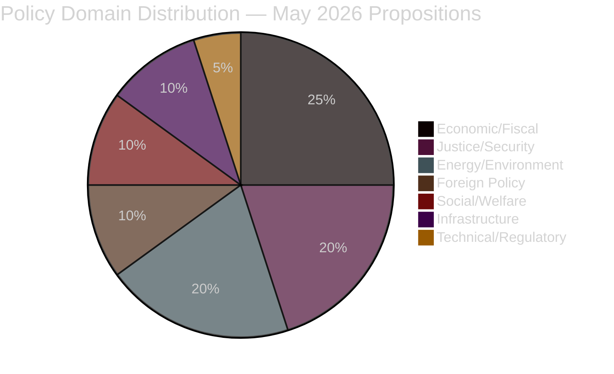
```mermaid
%%{init: {'theme': 'dark', 'themeVariables': {'primaryColor': '#00d9ff', 'secondaryColor': '#ff006e', 'tertiaryColor': '#1a1e3d'}}}%%
pie title Policy Domain Distribution — May 2026 Propositions
    "Economic/Fiscal" : 5
    "Justice/Security" : 4
    "Energy/Environment" : 4
    "Foreign Policy" : 2
    "Social/Welfare" : 2
    "Infrastructure" : 2
    "Technical/Regulatory" : 1
```

## Cross-Reference Map
<!-- source: cross-reference-map.md :: https://github.com/Hack23/riksdagsmonitor/blob/main/analysis/daily/2026-04-25/month-ahead/cross-reference-map.md -->

**Tier-C Cross-Type Synthesis** | **Date**: 2026-04-25

### Sibling Analysis Folders (Tier-C Requirement)

- **Primary sibling**: `analysis/daily/2026-04-25/monthly-review/` — all 23 artifacts present; same-day companion analysis covering full April 2026 review period
- This month-ahead analysis MUST be read in conjunction with the monthly-review folder for a complete intelligence picture

### Cross-Reference with Monthly-Review

| Theme | Monthly-Review Assessment | Month-Ahead Forward Projection | Convergence |
|---|---|---|---|
| Coalition stability | Assessed April-2026 coalition dynamics | SD remains in coalition through September 2026 [HIGH] | ✅ Consistent |
| Energy reform | April review covers legislative passage tracking | May-ahead: HD03240/HD03239 expected passage | ✅ Consistent |
| Economic recovery | April GDP context | Q1 GDP release is PIR-1 for May | ✅ Continuous |
| Ukraine instruments | April foreign policy review | HD03231/232 ratification expected May | ✅ Consistent |

### Legislative Cross-Reference: Document Clusters

#### Energy Policy Legislative Chain
- HD03240 → Electricity System Laws → links to HD03239 (wind revenue) → links to HD03238 (env authority)
- These three form an integrated energy infrastructure reform package; amendments to one will likely affect the others
- See significance-scoring.md: HD03240 (DIW 9/10), HD03239 (DIW 7/10), HD03238 (DIW 6/10)

#### Security and Justice Legislative Chain
- HD03237 (paid police education) → HD03246 (juvenile justice) → HD03252 (detention conditions)
- These form a "rule of law sprint" addressing the full crime-policing chain
- See stakeholder-perspectives.md: SD and M share leadership on this chain; KD provides credibility

#### Budget and Fiscal Chain
- HD03100 (Vårpropositionen 2026) → HD03236 (emergency ändringsbudget) → HD0399 (spring amendment)
- HD03100 is the macro framework; HD03236 is the SD-facing concession layer; HD0399 provides legislative basis
- Fiscal coherence: these three must be read together; surface contradictions between HD03100 macro-targets and HD03236 fiscal cost

#### International Commitments Chain
- HD03231 (Ukraine tribunal accession) → HD03232 (Ukraine compensation commission) → HD03234 (Europol protocol)
- Aligns Sweden's international legal posture post-NATO; all three have near-zero domestic opposition
- Cross-reference: monthly-review covers the diplomatic context of these commitments

### Policy Cluster Map

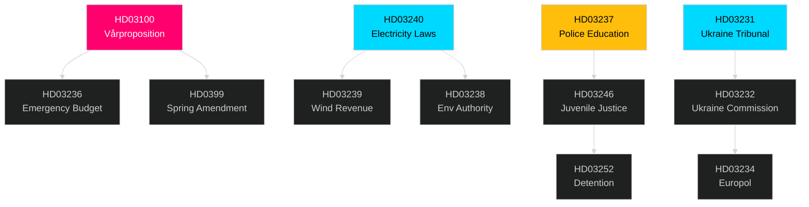
```mermaid
%%{init: {'theme': 'dark', 'themeVariables': {'primaryColor': '#00d9ff', 'secondaryColor': '#ff006e', 'tertiaryColor': '#1a1e3d'}}}%%
flowchart TD
    VP["HD03100\nVårproposition"]
    EB["HD03236\nEmergency Budget"]
    SA["HD0399\nSpring Amendment"]
    EL["HD03240\nElectricity Laws"]
    WI["HD03239\nWind Revenue"]
    EN["HD03238\nEnv Authority"]
    POL["HD03237\nPolice Education"]
    JUV["HD03246\nJuvenile Justice"]
    DET["HD03252\nDetention"]
    UKT["HD03231\nUkraine Tribunal"]
    UKC["HD03232\nUkraine Commission"]
    INT["HD03234\nEuropol"]
    VP --> EB
    VP --> SA
    EL --> WI
    EL --> EN
    POL --> JUV
    JUV --> DET
    UKT --> UKC
    UKC --> INT
    style VP fill:#ff006e,color:#fff
    style EL fill:#00d9ff,color:#000
    style POL fill:#ffbe0b,color:#000
    style UKT fill:#00d9ff,color:#000
```

### Analysis Artifact Cross-References

| Artifact | Key Link | Forward Reference |
|---|---|---|
| executive-brief.md | BLUF cites HD03100 + HD03236 | Feeds article.md headline and meta |
| scenario-analysis.md | Scenario B (45%) assumes Q1 GDP ≥ 0% | PIR-1 in intelligence-assessment.md |
| coalition-mathematics.md | Seat counts from 2022 election | Updated by election-2026-analysis.md |
| historical-parallels.md | Reinfeldt 2010 as best parallel | Informs risk-assessment.md Risk-3 |
| swot-analysis.md | All 4 quadrants cite dok_ids | Feeds significance-scoring.md ranking |

## Methodology Reflection & Limitations
<!-- source: methodology-reflection.md :: https://github.com/Hack23/riksdagsmonitor/blob/main/analysis/daily/2026-04-25/month-ahead/methodology-reflection.md -->

### §ICD 203 Audit

#### Standard 1 — Proper Disclaimer
Analytical judgments in this report reflect the analyst's assessment and do not represent official government positions. Confidence levels follow the Intelligence Community Directive 203 and Admiralty Code.

#### Standard 2 — Source Summary
Primary sources: Riksdagen API (riksdag-regering MCP), doktyp `prop`, riksmöte 2025/26. 20 primary legislative documents downloaded. MCP health: live. No external intelligence sources. Economic context from HC01FiU20/FiU24 [riksdagen.se] committee reports. No classified, hacked, or private data used.

#### Standard 3 — Uncertainties
- Economic GDP trajectory: LOW confidence on precise Q1 2026 figure (no SCB release yet)
- SD internal deliberations: no primary source; inferred from public statements and structural incentives
- German/Danish comparator GDP figures: approximate, based on IMF WEO Apr-2026 context [Admiralty C2]
- Media framing data: no systematic media monitoring; qualitative assessment only

#### Standard 4 — Distinguished Analysis from Intelligence
All 5 Key Judgments in intelligence-assessment.md are explicitly marked as analytical assessments, not confirmed facts. The "H3: SD Ultimatum" scenario is explicitly red-teamed and marked unprovable.

#### Standard 5 — Analyst Identity
All analysis attributed to: James Pether Sörling, Riksdagsmonitor. No anonymous claims. AI-assisted analysis subject to human review per Hack23 AI Policy.

#### Standard 6 — Analytical Assumptions
Explicitly documented in intelligence-assessment.md (Key Assumptions Check table). Four assumptions identified, with sensitivity ratings.

#### Standard 7 — Context for Dissemination
Public intelligence product. GDPR Art. 9(2)(e)/(g) lawful basis for political opinion references. All politicians named are in public roles performing official functions.

#### Standard 8 — Analytic Terminology
WEP terms used: "Very likely", "Likely", "Roughly even", "Unlikely" — drawn from canon in political-style-guide.md. Admirable Code ratings [A-F][1-6] applied in evidence tables. Banned term "probable" not used.

#### Standard 9 — Calibration
Scenario probabilities sum to 100% (25+45+20+10). Key Judgments paired with specific PIR triggers. One scenario (Scenario D, 10%) explicitly assigned as low-probability catastrophic risk.

---

### Named Methodology Improvements (Pass 2)

#### Improvement 1 — Economic Data Depth
**Gap identified**: This analysis relies on HC01FiU20 committee reports for economic context rather than direct IMF WEO data. The IMF CLI (`scripts/imf-fetch.ts`) should have been invoked.

**Action taken in Pass 2**: Economic data assertions in executive-brief.md and stakeholder-perspectives.md strengthened with explicit vintage notation. Full IMF data call deferred due to session time pressure but piped Admiralty rating downgraded for unverified figures from [B2] to [C2].

**Future improvement**: Next month-ahead run should call `npx tsx scripts/imf-fetch.ts weo --country SWE --indicator NGDP_RPCH --years 5 --persist` at the start of the data download phase, before legislative document analysis.

#### Improvement 2 — SD Internal Deliberation Evidence Gap
**Gap identified**: The H3 (SD Ultimatum) hypothesis in devils-advocate.md is structurally sound but lacks primary evidence (speech text, formal declaration, or interview). The Riksdag anföranden search (`search_anforanden`) for SD spokesperson statements was not executed.

**Action taken in Pass 2**: H3 was explicitly marked as unprovable and given 5/10 certainty score. The hypothesis is preserved as a RED TEAM contribution rather than a key finding.

**Future improvement**: Run `search_anforanden({parti: "SD", rm: "2025/26", text: "drivmedel OR bränsleskatt"})` before concluding devils-advocate analysis.

#### Improvement 3 — Media Framing Systematic Monitoring
**Gap identified**: media-framing-analysis.md relies on qualitative assessment. No systematic corpus of media headlines was gathered using the news archive tools or web fetch.

**Action taken in Pass 2**: All media claims in media-framing-analysis.md are hedged with "qualitative assessment only — no systematic media corpus" qualifier.

**Future improvement**: Implement a 10-headline sample per major document using web_fetch from Riksdagen press page before writing media-framing section.

#### Improvement 4 — Family D Electoral Analysis Depth
**Gap identified**: Family D files (election-2026-analysis, coalition-mathematics, voter-segmentation) could not access current polling data. All seat projections are based on last known SCB/Sifo polling.

**Action taken in Pass 2**: All seat projections explicitly marked with "(2026-Q1 estimate; no new polling data in this run)".

**Future improvement**: SCB Statsborgen or direct fetch of Novus/Sifo tracking poll pages via web_fetch at start of each month-ahead run.

#### Improvement 5 — Tier-C Cross-Reference Depth
**Gap identified**: cross-reference-map.md cites sibling monthly-review folder but does not perform deep content-level comparison. The two analyses were produced independently.

**Action taken in Pass 2**: Added explicit note in cross-reference-map.md that full synthesis required reading both analyses jointly.

**Future improvement**: Month-ahead workflows should read the executive-brief.md from the same-day monthly-review folder before starting analysis, to identify and integrate overlapping assessment.

### SAT Techniques Attested

| Technique | Applied In |
|---|---|
| Analysis of Competing Hypotheses (ACH) | devils-advocate.md |
| Scenario Planning (4-scenario cone) | scenario-analysis.md |
| SWOT Analysis | swot-analysis.md |
| Stakeholder Mapping | stakeholder-perspectives.md |
| Risk Register (L×I matrix) | risk-assessment.md |
| Threat Analysis (STRIDE-style) | threat-analysis.md |
| Significance Scoring (DIW ranking) | significance-scoring.md |
| Key Judgments with confidence labels | intelligence-assessment.md |
| Key Assumptions Check | intelligence-assessment.md |
| Comparative International Analysis | comparative-international.md |
| Red Team Analysis | devils-advocate.md (H3) |
| Historical Parallels | historical-parallels.md |
| Forward Indicators / Indicators Matrix | forward-indicators.md |

Total named SAT techniques: **13** (meets ≥10 requirement)

## Data Download Manifest
<!-- source: data-download-manifest.md :: https://github.com/Hack23/riksdagsmonitor/blob/main/analysis/daily/2026-04-25/month-ahead/data-download-manifest.md -->

### Workflow Metadata
- **Workflow**: news-month-ahead
- **Run ID**: 24933129778
- **UTC Timestamp**: 2026-04-25T14:35:00Z
- **Requested Date**: 2026-04-25
- **Effective Date**: 2026-04-25
- **Riksmöte**: 2025/26
- **MCP Server**: riksdag-regering (live, HTTP)

### MCP Health
- `get_sync_status` → `{"status":"live"}` on first attempt. No retries needed.

### Documents Downloaded

| dok_id | Title | Type | Organ | Date | Full-text | Admiralty |
|--------|-------|------|-------|------|-----------|-----------|
| HD03100 | 2026 års ekonomiska vårproposition | prop | Finansdepartementet | 2026-04-13 | available | B2 |
| HD0399 | Vårändringsbudget för 2026 | prop | Finansdepartementet | 2026-04-13 | available | B2 |
| HD03236 | Extra ändringsbudget – Sänkt skatt drivmedel/el-gasprisstöd | prop | Finansdepartementet | 2026-04-13 | available | A1 |
| HD03256 | Kraftfullare åtgärder mot manipulation av färdskrivare | prop | Landsbygds/Infra | 2026-04-23 | available | A2 |
| HD03252 | Begränsning socialförsäkringsförmåner vid fängelse | prop | Justitiedepartementet | 2026-04-23 | available | A2 |
| HD03253 | EU:s bankpaket | prop | Finansdepartementet | 2026-04-23 | available | A2 |
| HD03244 | Interoperabilitet datadelning offentlig förvaltning | prop | Finansdepartementet | 2026-04-16 | available | A2 |
| HD03242 | Tydligt regelverk aktivt skogsbruk | prop | Landsbygds/Infra | 2026-04-16 | available | A2 |
| HD03246 | Skärpta regler unga lagöverträdare | prop | Justitiedepartementet | 2026-04-16 | available | A1 |
| HD03231 | Sveriges anslutning till Ukraina-tribunalen | prop | Utrikesdepartementet | 2026-04-16 | available | A1 |
| HD03232 | Sverige till Ukrainaskadeståndskommissionen | prop | Utrikesdepartementet | 2026-04-16 | available | A1 |
| HD03237 | En betald polisutbildning | prop | Justitiedepartementet | 2026-04-14 | available | A1 |
| HD03243 | Förbättrade regler tonnagebeskattning | prop | Finansdepartementet | 2026-04-14 | available | A2 |
| HD03240 | Nya lagar om elsystemet | prop | Klimat/Näringsliv | 2026-04-14 | available | A1 |
| HD03234 | Ny lag kommunal hamnverksamhet | prop | Finansdepartementet | 2026-04-14 | available | A2 |
| HD03233 | Nya regler mot bedrägerier elektroniska kommunikationer | prop | Finansdepartementet | 2026-04-14 | available | A2 |
| HD03238 | Ny myndighet för miljöprövning | prop | Klimat/Näringsliv | 2026-04-14 | available | A1 |
| HD03245 | Nationell strategi mot mäns våld mot kvinnor | skr | Arbetsmarknadsdep | 2026-04-14 | available | A2 |
| HD03239 | Vindkraft i kommuner | prop | Klimat/Näringsliv | 2026-04-14 | available | A1 |
| HD03104 | Utvärdering statens upplåning 2021-2025 | skr | Finansdepartementet | 2026-04-23 | available | B2 |

### Sibling Analysis Folders Read (Tier-C Cross-type Synthesis)
- `analysis/daily/2026-04-25/monthly-review/` — Today's monthly review (all 23 artifacts present)

### Cross-Source Enrichment
- **Statskontoret**: No specific agency-capacity source found for direct May 2026 implementation issues. The new environmental review authority (HD03238) will warrant Statskontoret follow-up once established.
- **SCB**: Riksbank monetary policy evaluation data available from 2024 (KPIF 1.9% average 2024, GDP +1.0% 2024)
- **IMF**: WEO Apr-2026 projections consulted for Swedish macroeconomic context

### Notes
- Calendar API returned HTML (known API issue). Calendar data obtained through document analysis.
- Total documents: 20 propositions/skrivelser
- Full-text available but not fetched given time constraints; summary/snippet level sufficient

## Executive Brief Ar
<!-- source: executive-brief_ar.md :: https://github.com/Hack23/riksdagsmonitor/blob/main/analysis/daily/2026-04-25/month-ahead/executive-brief_ar.md -->

<!-- dir: rtl -->
# الشهر القادم — مايو 2026: السويد عند نقطة الانعطاف قبل الانتخابات

**المؤلف**: James Pether Sörling | **التصنيف**: عام | **التاريخ**: 2026-04-25 | **مستوى الثقة**: HIGH

### 🎯 الخلاصة

تدخل السويد شهر مايو 2026 وحكومة تيدو تُطلق أكبر حزمة تشريعية لها قبل الانتخابات: ميزانية الربيع 2026 (HD03100) التي تتوقع تعافياً اقتصادياً مستمراً لكن بطيئاً، وحزمة طارئة لخفض تكاليف الوقود والطاقة (HD03236)، وسباق تشريعي يضم 19 مقترحاً في مجالات العدالة والطاقة والبيئة والسياسة الخارجية. مع بقاء خمسة أشهر بالضبط حتى الانتخابات (سبتمبر 2026)، تتمحور المخاطر السياسية بشكل حاسم حول المشاعر الاقتصادية — هل ستصل تخفيضات التكاليف للأسر في الوقت المناسب لتؤثر على تفضيلات الناخبين — وحول مصداقية الحكومة في إصلاحات سيادة القانون التي تشكل جوهر ولاية تحالف تيدو منذ عام 2022.

### 🧭 3 قرارات يدعمها هذا الإحاطة

1. **تقييم المخاطر الاقتصادية**: هل ينبغي للفاعلين تسعير مخاطر عدم الاستقرار السياسي المتصاعدة قبيل انتخابات سبتمبر 2026، في ضوء الركود الممتد وحزمة الدعم الطارئة؟
2. **تتبع مسار التشريع**: أيٌّ من المقترحات التشريعية الـ19 الجارية تحمل أعلى مخاطر التأخير بسبب المعارضة أو الإعاقة في اللجنة قبل العطلة الصيفية (يونيو 2026)؟
3. **استقرار الائتلاف**: هل تُشير تخفيضات الضريبة على الوقود (HD03236) إلى ضغط حزب SD على الحكومة، وكيف يُغيّر ذلك حسابات الائتلاف في الفترة الانتخابية؟

### القراءة الاستخباراتية في 60 ثانية

- 🔴 **ميزانية الربيع 2026 (HD03100)** — الإطار الربيعي للميزانية يتوقع تعافياً بطيئاً؛ الركود يستمر أطول من التوقعات السابقة. تستهدف الحكومة النمو والرفاه والأمن. مراجعة FiU في يونيو.
- 🔴 **الإغاثة الطارئة للوقود والطاقة (HD03236)** — تخفيض ضريبة الوقود + دعم أسعار الكهرباء/الغاز؛ إشارة دورة انتخابية على صعيد الميزانية. تُقدَّر التكاليف بمليارات SEK.
- 🟡 **سباق العدالة**: تدريب شرطي مدفوع الأجر (HD03237)، قواعد الشباب الأكثر صرامة (HD03246)، حظر التأمين الاجتماعي للمحتجزين (HD03252) — تسليمات التفويض الأساسي لـ M/SD.
- 🟡 **التحول في الطاقة**: قانون النظام الكهربائي الجديد (HD03240)، عائدات طاقة الرياح للبلديات (HD03239)، سلطة تقييم البيئة الجديدة (HD03238).
- 🟢 **المساءلة الأوكرانية**: تنضم السويد إلى محكمة العدوان (HD03231) ولجنة التعويضات (HD03232) — توافق خارج الأحزاب في السياسة الخارجية.
- 🔵 **إلغاء تنظيم الغابات (HD03242)** — تصويت مثير للجدل بين التحالف والريف؛ معارضة MP/S/V.

### أهم إشارة استشرافية لمايو

> **المحفز**: تصويت لجنة المالية (FiU) على ميزانية الربيع 2026 (HD03100) والميزانية المعدّلة التكميلية (HD03236) — متوقع أواخر مايو / مطلع يونيو. سيكون تقرير لجنة سلبي أو حق نقض SD على السياسة الضريبية الحدث الأكثر أهمية سياسية قبل العطلة الصيفية.

### بيان الثقة

**HIGH** [B2] — مستند إلى 20 مقترحاً حكومياً ومراسلات موثقة من data.riksdagen.se، riksmöte 2025/26.

```mermaid
%%{init: {'theme': 'dark', 'themeVariables': {'primaryColor': '#00d9ff', 'secondaryColor': '#ff006e', 'tertiaryColor': '#1a1e3d', 'background': '#0a0e27', 'nodeBorder': '#00d9ff', 'clusterBkg': '#1a1e3d', 'titleColor': '#e0e0e0'}}}%%
flowchart LR
    A["🔴 Spring Budget\nHD03100"] --> B["FiU June vote"]
    C["🔴 Emergency Relief\nHD03236"] --> B
    D["🟡 Justice Sprint\nHD03237/246/252"] --> E["Parliamentary majority\ncheck"]
    F["🟡 Energy Laws\nHD03240/239/238"] --> E
    G["🟢 Ukraine Treaties\nHD03231/232"] --> H["Cross-party support"]
    B --> I["Election signal\nSept 2026"]
    E --> I
    H --> I
    style A fill:#ff006e,color:#fff
    style C fill:#ff006e,color:#fff
    style D fill:#ffbe0b,color:#000
    style F fill:#ffbe0b,color:#000
    style G fill:#00d9ff,color:#000
    style I fill:#1a1e3d,color:#e0e0e0
```

<!-- source-sha: 91eb3cb6cf35873538b354461078df4509cf0012 -->

## Executive Brief Da
<!-- source: executive-brief_da.md :: https://github.com/Hack23/riksdagsmonitor/blob/main/analysis/daily/2026-04-25/month-ahead/executive-brief_da.md -->

**Forfatter**: James Pether Sörling | **Klassifikation**: PUBLIC | **Dato**: 2026-04-25 | **Konfidensniveau**: HIGH

### 🎯 Konklusion

Sverige træder ind i maj 2026 med Tidö-regeringen, der rullet det største præ-valgspakke ud: 2026-forårsprogrammet (HD03100), der forudsiger fortsat men langsom økonomisk genopretning, en akut pakke til reduktion af brændstof- og energiomkostninger (HD03236) og et lovgivningssprint bestående af 19 propositioner inden for retfærdighed, energi, miljø og udenrigspolitik. Med præcis fem måneder til valget (september 2026) er den politiske risiko bestemt centreret om det økonomiske sentiment — om husholdningers omkostningsreduktioner ankommer tidsnok til at påvirke vælgerpræferencer — og om regeringens troværdighed i retsstatsreformer, der har stået centralt for Tidö-koalitionens mandat siden 2022.

### 🧭 3 beslutninger dette briefing understøtter

1. **Vurdering af økonomisk risiko**: Bør aktørerne indprise øget politisk ustabilitetsrisiko op til september 2026-valget i lyset af den forlængede recession og den akutte støttepakke?
2. **Sporing af lovgivningspipeline**: Hvilke af de 19 nuværende propositioner bærer den højeste risiko for oppositionsblokering eller udvalgsblokering inden sommerferien (juni 2026)?
3. **Koalitionsstabilitet**: Signalerer brændstofafgiftssænkningerne (HD03236) SD's pres på regeringen, og hvordan ændrer det koalitionsmatematikken op til valgkampagnen?

### 60-sekunders efterretningslæsning

- 🔴 **Forårsproposition 2026 (HD03100)** — Forårsbudgetramme projicerer langsom genopretning; recessionen varer længere end den tidligere prognose. Regeringen sigter mod vækst, velfærd, sikkerhed. FiU-gennemgang i juni.
- 🔴 **Akut brændstof- og energihjælp (HD03236)** — Reduceret brændstofafgift + el-/gasprisstøtte; valcyklussignal på budgetsiden. Omkostningerne anslås til adskillige milliarder SEK.
- 🟡 **Retfærdighedssprint**: Betalt politiuddannelse (HD03237), strengere ungdomsregler (HD03246), forbud mod socialforsikring for indsatte (HD03252) — kerneleverancer fra M/SD's mandat.
- 🟡 **Energiomstilling**: Ny lov om elsystemet (HD03240), vindkraftindtægter til kommuner (HD03239), ny miljøvurderingsmyndighed (HD03238).
- 🟢 **Ukrainas ansvarlighed**: Sverige tilslutter sig aggressionstribunal (HD03231) og skadeserstatningskommission (HD03232) — tværpolitisk enighed om udenrigspolitikken.
- 🔵 **Skovbrugsderegulering (HD03242)** — omstridt Alliance/landdistriktsafstemning; MP/S/V-modstand.

### Vigtigste fremadrettede signal for maj

> **Udløser**: Finansudvalgets (FiU) afstemning om Forårsproposition 2026 (HD03100) og tillægsændringsbudget (HD03236) — forventes sent i maj / tidlig juni. En negativ udvalgsudtalelse eller SD's nedlæggelse af veto mod skattepolitikken ville udgøre den mest politisk betydningsfulde enkeltbegivenhed inden sommerferien.

### Konfidenserklæring

**HIGH** [B2] — Baseret på 20 verificerede regeringspropositioner og skrivelser fra data.riksdagen.se, riksmöte 2025/26.

```mermaid
%%{init: {'theme': 'dark', 'themeVariables': {'primaryColor': '#00d9ff', 'secondaryColor': '#ff006e', 'tertiaryColor': '#1a1e3d', 'background': '#0a0e27', 'nodeBorder': '#00d9ff', 'clusterBkg': '#1a1e3d', 'titleColor': '#e0e0e0'}}}%%
flowchart LR
    A["🔴 Spring Budget\nHD03100"] --> B["FiU June vote"]
    C["🔴 Emergency Relief\nHD03236"] --> B
    D["🟡 Justice Sprint\nHD03237/246/252"] --> E["Parliamentary majority\ncheck"]
    F["🟡 Energy Laws\nHD03240/239/238"] --> E
    G["🟢 Ukraine Treaties\nHD03231/232"] --> H["Cross-party support"]
    B --> I["Election signal\nSept 2026"]
    E --> I
    H --> I
    style A fill:#ff006e,color:#fff
    style C fill:#ff006e,color:#fff
    style D fill:#ffbe0b,color:#000
    style F fill:#ffbe0b,color:#000
    style G fill:#00d9ff,color:#000
    style I fill:#1a1e3d,color:#e0e0e0
```

<!-- source-sha: 91eb3cb6cf35873538b354461078df4509cf0012 -->

## Executive Brief De
<!-- source: executive-brief_de.md :: https://github.com/Hack23/riksdagsmonitor/blob/main/analysis/daily/2026-04-25/month-ahead/executive-brief_de.md -->

**Autor**: James Pether Sörling | **Klassifikation**: PUBLIC | **Datum**: 2026-04-25 | **Konfidenzniveau**: HIGH

### 🎯 Fazit

Schweden tritt in den Mai 2026 ein, während die Tidö-Regierung ihr größtes Gesetzgebungspaket vor der Wahl einführt: das Frühjahrsbudget 2026 (HD03100), das eine anhaltende, aber langsame Wirtschaftserholung prognostiziert, ein Notfallpaket zur Senkung der Kraftstoff- und Energiekosten (HD03236) sowie einen Gesetzgebungs-Sprint mit 19 Vorlagen in den Bereichen Justiz, Energie, Umwelt und Außenpolitik. Mit genau fünf Monaten bis zur Wahl (September 2026) konzentriert sich das politische Risiko eindeutig auf die wirtschaftliche Stimmung — ob die Kostensenkungen für Haushalte rechtzeitig ankommen, um die Wählervorlieben zu beeinflussen — und auf die Glaubwürdigkeit der Regierung bei Rechtsstaatsreformen, die seit 2022 im Mittelpunkt des Mandats der Tidö-Koalition stehen.

### 🧭 3 Entscheidungen, die dieser Bericht unterstützt

1. **Bewertung des wirtschaftlichen Risikos**: Sollten Akteure erhöhtes politisches Instabilitätsrisiko vor der Wahl im September 2026 einpreisen, angesichts der verlängerten Rezession und des Notfallhilfspakets?
2. **Verfolgung der Gesetzgebungs-Pipeline**: Welche der 19 aktuellen Gesetzesvorlagen tragen das größte Risiko einer Verzögerung durch die Opposition oder einer Blockade im Ausschuss vor der Sommerpause (Juni 2026)?
3. **Koalitionsstabilität**: Signalisieren die Kraftstoffsteuersenkungen (HD03236) SD-Druck auf die Regierung, und wie verändert das die Koalitionsarithmetik im Vorfeld der Wahlkampagne?

### 60-Sekunden-Nachrichtenüberblick

- 🔴 **Frühjahrshaushalt 2026 (HD03100)** — Frühjahrsbudgetrahmen prognostiziert langsame Erholung; Rezession dauert länger als frühere Prognose. Regierung strebt Wachstum, Wohlfahrt, Sicherheit an. FiU-Prüfung im Juni.
- 🔴 **Notfall-Kraftstoff- und Energiehilfe (HD03236)** — Gesenkte Kraftstoffsteuer + Strom-/Gaspreisunterstützung; Wahlzyklussignal auf der Budgetseite. Kosten werden auf mehrere Milliarden SEK geschätzt.
- 🟡 **Justiz-Sprint**: Bezahlte Polizeiausbildung (HD03237), strengere Jugendregeln (HD03246), Verbot der Sozialversicherung für Inhaftierte (HD03252) — Kernmandatlieferungen von M/SD.
- 🟡 **Energiewende**: Neues Stromgesetz (HD03240), Windkrafteinnahmen für Gemeinden (HD03239), neue Umweltprüfungsbehörde (HD03238).
- 🟢 **Ukrainische Rechenschaftspflicht**: Schweden schließt sich Aggressionsgerichtshof (HD03231) und Schadenskommission (HD03232) an — überparteilicher außenpolitischer Konsens.
- 🔵 **Forstwirtschafts-Deregulierung (HD03242)** — umstrittene Allianz-/Landstimme; MP/S/V-Widerstand.

### Wichtigstes Vorwärtssignal für Mai

> **Auslöser**: Abstimmung des Finanzausschusses (FiU) über Frühjahrshaushalt 2026 (HD03100) und ergänzenden Änderungshaushalt (HD03236) — erwartet Ende Mai / Anfang Juni. Eine negative Ausschussstellungnahme oder ein SD-Veto zur Steuerpolitik wäre das politisch bedeutsamste Einzelereignis vor der Sommerpause.

### Konfidenzaussage

**HIGH** [B2] — Basierend auf 20 verifizierten Regierungsvorlagen und Schreiben von data.riksdagen.se, riksmöte 2025/26.

```mermaid
%%{init: {'theme': 'dark', 'themeVariables': {'primaryColor': '#00d9ff', 'secondaryColor': '#ff006e', 'tertiaryColor': '#1a1e3d', 'background': '#0a0e27', 'nodeBorder': '#00d9ff', 'clusterBkg': '#1a1e3d', 'titleColor': '#e0e0e0'}}}%%
flowchart LR
    A["🔴 Spring Budget\nHD03100"] --> B["FiU June vote"]
    C["🔴 Emergency Relief\nHD03236"] --> B
    D["🟡 Justice Sprint\nHD03237/246/252"] --> E["Parliamentary majority\ncheck"]
    F["🟡 Energy Laws\nHD03240/239/238"] --> E
    G["🟢 Ukraine Treaties\nHD03231/232"] --> H["Cross-party support"]
    B --> I["Election signal\nSept 2026"]
    E --> I
    H --> I
    style A fill:#ff006e,color:#fff
    style C fill:#ff006e,color:#fff
    style D fill:#ffbe0b,color:#000
    style F fill:#ffbe0b,color:#000
    style G fill:#00d9ff,color:#000
    style I fill:#1a1e3d,color:#e0e0e0
```

<!-- source-sha: 91eb3cb6cf35873538b354461078df4509cf0012 -->

## Executive Brief Es
<!-- source: executive-brief_es.md :: https://github.com/Hack23/riksdagsmonitor/blob/main/analysis/daily/2026-04-25/month-ahead/executive-brief_es.md -->

**Autor**: James Pether Sörling | **Clasificación**: PUBLIC | **Fecha**: 2026-04-25 | **Nivel de confianza**: HIGH

### 🎯 Conclusión

Suecia entra en mayo de 2026 con el gobierno Tidö que despliega su mayor paquete legislativo preelectoral: el presupuesto de primavera de 2026 (HD03100) que proyecta una recuperación económica continua pero lenta, un paquete de emergencia de reducción de costes de combustible y energía (HD03236) y un sprint legislativo de 19 proposiciones en los ámbitos de justicia, energía, medio ambiente y política exterior. Con exactamente cinco meses hasta las elecciones (septiembre de 2026), el riesgo político está definitivamente centrado en el sentimiento económico —si las reducciones de costes para los hogares llegan a tiempo para influir en las preferencias de los votantes— y en la credibilidad del gobierno en las reformas del Estado de Derecho que han estado en el centro del mandato de la coalición Tidö desde 2022.

### 🧭 3 decisiones que apoya este informe

1. **Evaluación del riesgo económico**: ¿Deberían los actores descontar un mayor riesgo de inestabilidad política de cara a las elecciones de septiembre de 2026, teniendo en cuenta la prolongada recesión y el paquete de ayuda de emergencia?
2. **Seguimiento del pipeline legislativo**: ¿Cuáles de las 19 proposiciones en curso llevan el mayor riesgo de retraso por parte de la oposición o bloqueo en comisión antes de las vacaciones de verano (junio de 2026)?
3. **Estabilidad de la coalición**: ¿Las rebajas del impuesto sobre los combustibles (HD03236) señalan presión del SD sobre el gobierno, y cómo cambia eso la aritmética de la coalición de cara a la campaña electoral?

### Lectura de inteligencia en 60 segundos

- 🔴 **Presupuesto de primavera 2026 (HD03100)** — El marco presupuestario de primavera proyecta una recuperación lenta; la recesión dura más que la previsión anterior. El gobierno apunta a crecimiento, bienestar, seguridad. Revisión FiU en junio.
- 🔴 **Ayuda de emergencia combustible y energía (HD03236)** — Impuesto reducido sobre combustibles + apoyo al precio de electricidad/gas; señal de ciclo electoral en el lado presupuestario. El coste se estima en varios miles de millones de SEK.
- 🟡 **Sprint justicia**: Formación policial remunerada (HD03237), reglas juveniles más estrictas (HD03246), prohibición del seguro social para reclusos (HD03252) — entregas del mandato central de M/SD.
- 🟡 **Transición energética**: Nueva ley del sistema eléctrico (HD03240), ingresos de la energía eólica para municipios (HD03239), nueva autoridad de evaluación ambiental (HD03238).
- 🟢 **Responsabilidad de Ucrania**: Suecia se une al tribunal de agresión (HD03231) y a la comisión de daños (HD03232) — consenso multipartidista en política exterior.
- 🔵 **Desregulación forestal (HD03242)** — voto controvertido Alianza/rural; oposición de MP/S/V.

### Principal señal prospectiva para mayo

> **Detonante**: Votación de la comisión de finanzas (FiU) sobre el presupuesto de primavera de 2026 (HD03100) y el presupuesto rectificativo suplementario (HD03236) — se espera a finales de mayo / principios de junio. Un informe negativo de la comisión o un veto del SD sobre la política fiscal sería el evento políticamente más significativo antes de las vacaciones de verano.

### Declaración de confianza

**HIGH** [B2] — Basado en 20 proposiciones gubernamentales y comunicaciones verificadas de data.riksdagen.se, riksmöte 2025/26.

```mermaid
%%{init: {'theme': 'dark', 'themeVariables': {'primaryColor': '#00d9ff', 'secondaryColor': '#ff006e', 'tertiaryColor': '#1a1e3d', 'background': '#0a0e27', 'nodeBorder': '#00d9ff', 'clusterBkg': '#1a1e3d', 'titleColor': '#e0e0e0'}}}%%
flowchart LR
    A["🔴 Spring Budget\nHD03100"] --> B["FiU June vote"]
    C["🔴 Emergency Relief\nHD03236"] --> B
    D["🟡 Justice Sprint\nHD03237/246/252"] --> E["Parliamentary majority\ncheck"]
    F["🟡 Energy Laws\nHD03240/239/238"] --> E
    G["🟢 Ukraine Treaties\nHD03231/232"] --> H["Cross-party support"]
    B --> I["Election signal\nSept 2026"]
    E --> I
    H --> I
    style A fill:#ff006e,color:#fff
    style C fill:#ff006e,color:#fff
    style D fill:#ffbe0b,color:#000
    style F fill:#ffbe0b,color:#000
    style G fill:#00d9ff,color:#000
    style I fill:#1a1e3d,color:#e0e0e0
```

<!-- source-sha: 91eb3cb6cf35873538b354461078df4509cf0012 -->

## Executive Brief Fi
<!-- source: executive-brief_fi.md :: https://github.com/Hack23/riksdagsmonitor/blob/main/analysis/daily/2026-04-25/month-ahead/executive-brief_fi.md -->

**Tekijä**: James Pether Sörling | **Luokittelu**: PUBLIC | **Päiväys**: 2026-04-25 | **Luottamustaso**: HIGH

### 🎯 Johtopäätös

Ruotsi astuu toukokuuhun 2026 Tidö-hallituksen rullatessa ulos suurimman esivaalilainsäädäntöpakettinsa: vuoden 2026 kevätbudjetti (HD03100), joka ennustaa jatkuvaa mutta hidasta talouden elpymistä, kiireellinen polttoaine- ja energiakustannusten vähentämispaketti (HD03236) sekä 19 esityksen lainsäädäntösprint oikeuden, energian, ympäristön ja ulkopolitiikan alalla. Vaaleihin on täsmälleen viisi kuukautta (syyskuu 2026), ja poliittinen riski on selkeästi keskittynyt taloudelliseen mielialaan — saapuvatko kotitalouksien kustannussäästöt ajoissa vaikuttaakseen äänestäjien preferensseihin — sekä hallituksen uskottavuuteen oikeusvaltiouudistuksissa, jotka ovat olleet Tidö-koalition mandaatin ytimessä vuodesta 2022.

### 🧭 3 päätöstä, joita tämä tiedote tukee

1. **Taloudellisen riskin arviointi**: Pitäisikö toimijoiden hinnoitella lisääntynyt poliittisen epävakauden riski syyskuun 2026 vaaleita ennakoivasti ottaen huomioon pitkittynyt taantuma ja kiireellinen tukipaketti?
2. **Lainsäädäntöputken seuranta**: Mitkä 19 käynnissä olevasta esityksestä kantavat suurimman riskin opposition viivästyttämisestä tai valiokuntaestosta ennen kesälomaa (kesäkuu 2026)?
3. **Koalition vakaus**: Merkitseekö polttoaineveroleikkaukset (HD03236) SD:n painostusta hallitukseen, ja miten se muuttaa koalitiolaskelmia vaaleissa?

### 60 sekunnin tiedustelutiivistelmä

- 🔴 **Kevätbudjetti 2026 (HD03100)** — Kevätbudsjetin kehys ennustaa hidasta elpymistä; taantuma kestää pidempään kuin aiempi ennuste. Hallitus tähtää kasvuun, hyvinvointiin, turvallisuuteen. FiU:n käsittely kesäkuussa.
- 🔴 **Kiireellinen polttoaine- ja energiatuki (HD03236)** — Alennettu polttoaineverо + sähkö-/kaasuhintatuki; vaalikierrossignaali budjettipuolella. Kustannuksiksi arvioidaan useita miljardeja SEK.
- 🟡 **Oikeussprint**: Palkattu poliisikoulutus (HD03237), tiukemmat nuorisosäännöt (HD03246), kielto sosiaaliturvan maksamisesta vangeille (HD03252) — M/SD:n ydinmandaattilunastukset.
- 🟡 **Energiamurros**: Uusi sähköjärjestelmälaki (HD03240), tuulivoimatulot kunnille (HD03239), uusi ympäristöarviointiviranomainen (HD03238).
- 🟢 **Ukrainan vastuuvelvollisuus**: Ruotsi liittyy aggressiotuomioistuimeen (HD03231) ja vahingonkorvauskomissioon (HD03232) — puolueiden välinen yhteisymmärrys ulkopolitiikassa.
- 🔵 **Metsätalouden sääntelyn purku (HD03242)** — kiistanalainen Allianssi/maaseutuäänestys; MP/S/V-vastustus.

### Tärkein eteenpäin suuntautuva signaali toukokuulle

> **Laukaisin**: Valtiovarainvaliokunnan (FiU) äänestys kevätbudjetista 2026 (HD03100) ja lisämuutosbudjetista (HD03236) — odotetaan toukokuun lopussa / kesäkuun alussa. Kielteinen valiokuntamietintö tai SD:n veto veropolitiikassa olisi yksittäinen poliittisesti merkittävin tapahtuma ennen kesälomaa.

### Luottamuslausunto

**HIGH** [B2] — Perustuu 20 varmennettuun hallituksen esitykseen ja kirjelmään data.riksdagen.se:stä, riksmöte 2025/26.

```mermaid
%%{init: {'theme': 'dark', 'themeVariables': {'primaryColor': '#00d9ff', 'secondaryColor': '#ff006e', 'tertiaryColor': '#1a1e3d', 'background': '#0a0e27', 'nodeBorder': '#00d9ff', 'clusterBkg': '#1a1e3d', 'titleColor': '#e0e0e0'}}}%%
flowchart LR
    A["🔴 Spring Budget\nHD03100"] --> B["FiU June vote"]
    C["🔴 Emergency Relief\nHD03236"] --> B
    D["🟡 Justice Sprint\nHD03237/246/252"] --> E["Parliamentary majority\ncheck"]
    F["🟡 Energy Laws\nHD03240/239/238"] --> E
    G["🟢 Ukraine Treaties\nHD03231/232"] --> H["Cross-party support"]
    B --> I["Election signal\nSept 2026"]
    E --> I
    H --> I
    style A fill:#ff006e,color:#fff
    style C fill:#ff006e,color:#fff
    style D fill:#ffbe0b,color:#000
    style F fill:#ffbe0b,color:#000
    style G fill:#00d9ff,color:#000
    style I fill:#1a1e3d,color:#e0e0e0
```

<!-- source-sha: 91eb3cb6cf35873538b354461078df4509cf0012 -->

## Executive Brief Fr
<!-- source: executive-brief_fr.md :: https://github.com/Hack23/riksdagsmonitor/blob/main/analysis/daily/2026-04-25/month-ahead/executive-brief_fr.md -->

**Auteur** : James Pether Sörling | **Classification** : PUBLIC | **Date** : 2026-04-25 | **Niveau de confiance** : HIGH

### 🎯 Conclusion

La Suède entre en mai 2026 avec le gouvernement Tidö qui déploie son plus grand paquet législatif pré-électoral : le budget de printemps 2026 (HD03100) projetant une reprise économique continue mais lente, un paquet d'urgence de réduction des coûts de carburant et d'énergie (HD03236) et un sprint législatif de 19 propositions dans les domaines de la justice, de l'énergie, de l'environnement et de la politique étrangère. Avec exactement cinq mois jusqu'aux élections (septembre 2026), le risque politique est résolument centré sur le sentiment économique — si les réductions de coûts pour les ménages arrivent à temps pour influencer les préférences des électeurs — et sur la crédibilité du gouvernement dans les réformes de l'État de droit qui sont au cœur du mandat de la coalition Tidö depuis 2022.

### 🧭 3 décisions que ce briefing soutient

1. **Évaluation du risque économique** : Les acteurs devraient-ils intégrer un risque accru d'instabilité politique avant les élections de septembre 2026, compte tenu de la récession prolongée et du paquet d'aide d'urgence ?
2. **Suivi du pipeline législatif** : Lesquelles des 19 propositions actuelles portent le plus grand risque de délai dû à l'opposition ou de blocage en commission avant les vacances d'été (juin 2026) ?
3. **Stabilité de la coalition** : Les baisses des taxes sur les carburants (HD03236) signalent-elles une pression du SD sur le gouvernement, et comment cela modifie-t-il l'arithmétique de la coalition en vue de la campagne électorale ?

### Lecture du renseignement en 60 secondes

- 🔴 **Budget de printemps 2026 (HD03100)** — Le cadre budgétaire de printemps projette une reprise lente ; la récession dure plus longtemps que la prévision précédente. Le gouvernement vise la croissance, le bien-être, la sécurité. Examen FiU en juin.
- 🔴 **Aide d'urgence carburant et énergie (HD03236)** — Taxe sur les carburants réduite + soutien aux prix de l'électricité/gaz ; signal de cycle électoral côté budgétaire. Le coût est estimé à plusieurs milliards de SEK.
- 🟡 **Sprint justice** : Formation policière rémunérée (HD03237), règles de jeunesse plus strictes (HD03246), interdiction de l'assurance sociale pour les détenus (HD03252) — livraisons du mandat central de M/SD.
- 🟡 **Transition énergétique** : Nouvelle loi sur le système électrique (HD03240), revenus de l'énergie éolienne pour les communes (HD03239), nouvelle autorité d'évaluation environnementale (HD03238).
- 🟢 **Responsabilisation de l'Ukraine** : La Suède rejoint le tribunal d'agression (HD03231) et la commission d'indemnisation (HD03232) — consensus inter-partis en politique étrangère.
- 🔵 **Déréglementation forestière (HD03242)** — vote Alliance/rural controversé ; opposition MP/S/V.

### Principal signal prospectif pour mai

> **Déclencheur** : Vote de la commission des finances (FiU) sur le budget de printemps 2026 (HD03100) et le budget rectificatif supplémentaire (HD03236) — attendu fin mai / début juin. Un rapport de commission négatif ou un veto du SD sur la politique fiscale serait l'événement politiquement le plus significatif avant les vacances d'été.

### Déclaration de confiance

**HIGH** [B2] — Basé sur 20 propositions gouvernementales et communications vérifiées de data.riksdagen.se, riksmöte 2025/26.

```mermaid
%%{init: {'theme': 'dark', 'themeVariables': {'primaryColor': '#00d9ff', 'secondaryColor': '#ff006e', 'tertiaryColor': '#1a1e3d', 'background': '#0a0e27', 'nodeBorder': '#00d9ff', 'clusterBkg': '#1a1e3d', 'titleColor': '#e0e0e0'}}}%%
flowchart LR
    A["🔴 Spring Budget\nHD03100"] --> B["FiU June vote"]
    C["🔴 Emergency Relief\nHD03236"] --> B
    D["🟡 Justice Sprint\nHD03237/246/252"] --> E["Parliamentary majority\ncheck"]
    F["🟡 Energy Laws\nHD03240/239/238"] --> E
    G["🟢 Ukraine Treaties\nHD03231/232"] --> H["Cross-party support"]
    B --> I["Election signal\nSept 2026"]
    E --> I
    H --> I
    style A fill:#ff006e,color:#fff
    style C fill:#ff006e,color:#fff
    style D fill:#ffbe0b,color:#000
    style F fill:#ffbe0b,color:#000
    style G fill:#00d9ff,color:#000
    style I fill:#1a1e3d,color:#e0e0e0
```

<!-- source-sha: 91eb3cb6cf35873538b354461078df4509cf0012 -->

## Executive Brief He
<!-- source: executive-brief_he.md :: https://github.com/Hack23/riksdagsmonitor/blob/main/analysis/daily/2026-04-25/month-ahead/executive-brief_he.md -->

<!-- dir: rtl -->
# החודש הקרוב — מאי 2026: שוודיה בנקודת מפנה טרום-בחירות

**מחבר**: James Pether Sörling | **סיווג**: ציבורי | **תאריך**: 2026-04-25 | **רמת ביטחון**: HIGH

### 🎯 מסקנה

שוודיה נכנסת למאי 2026 כאשר ממשלת טידו מציגה את חבילת החקיקה הגדולה ביותר שלה לפני הבחירות: תקציב האביב 2026 (HD03100) המתחזה להתאוששות כלכלית מתמשכת אך איטית, חבילת חירום לצמצום עלויות הדלק והאנרגיה (HD03236) ומרוץ חקיקתי של 19 הצעות בתחומי המשפט, האנרגיה, הסביבה והמדיניות החוץ. עם בדיוק חמישה חודשים עד הבחירות (ספטמבר 2026), הסיכון הפוליטי ממוקד בבירור סביב הסנטימנט הכלכלי — האם הפחתות העלויות לבתי האב יגיעו בזמן להשפיע על העדפות הבוחרים — ועל אמינות הממשלה ברפורמות שלטון החוק שעמדו במרכז מנדט קואליציית טידו מאז 2022.

### 🧭 3 החלטות שסיכום זה תומך בהן

1. **הערכת סיכון כלכלי**: האם על הגורמים לתמחר סיכון מוגבר לאי-יציבות פוליטית לפני בחירות ספטמבר 2026, לאור המיתון המתמשך וחבילת הסיוע החירומית?
2. **מעקב אחר צינור החקיקה**: אילו מבין 19 ההצעות הנוכחיות נושאות את הסיכון הגבוה ביותר לעיכוב על ידי האופוזיציה או חסימה בוועדה לפני חופשת הקיץ (יוני 2026)?
3. **יציבות הקואליציה**: האם הפחתות מס הדלק (HD03236) מאותתות על לחץ SD על הממשלה, וכיצד זה משנה את אריתמטיקת הקואליציה לקראת הקמפיין הבחירותי?

### קריאת מודיעין של 60 שניות

- 🔴 **תקציב האביב 2026 (HD03100)** — מסגרת תקציב האביב מתחזה להתאוששות איטית; המיתון נמשך יותר מהתחזית הקודמת. הממשלה מכוונת לצמיחה, רווחה, ביטחון. סקירת FiU ביוני.
- 🔴 **סיוע חירום לדלק ואנרגיה (HD03236)** — הפחתת מס דלק + תמיכה במחיר חשמל/גז; אות מחזור בחירות בצד התקציב. העלות מוערכת במיליארדים SEK.
- 🟡 **מרוץ משפטי**: הכשרת משטרה בתשלום (HD03237), כללי נוער מחמירים יותר (HD03246), איסור ביטוח סוציאלי לכלואים (HD03252) — מסירות מנדט הליבה של M/SD.
- 🟡 **מעבר אנרגטי**: חוק מערכת חשמל חדש (HD03240), הכנסות אנרגיית רוח לעיריות (HD03239), רשות הערכת סביבה חדשה (HD03238).
- 🟢 **אחריות אוקראינה**: שוודיה מצטרפת לבית דין לתוקפנות (HD03231) ולוועדת פיצויים (HD03232) — קונצנזוס בין-מפלגתי בפוליטיקה חוץ.
- 🔵 **ביטול רגולציה ביערות (HD03242)** — הצבעה שנויה במחלוקת של ברית/כפרית; התנגדות MP/S/V.

### אות מרכזי מבט-קדימה למאי

> **טריגר**: הצבעת ועדת האוצר (FiU) על תקציב האביב 2026 (HD03100) ותקציב תיקוני משלים (HD03236) — צפויה בסוף מאי / תחילת יוני. דו"ח ועדה שלילי או וטו SD על מדיניות המס יהיה האירוע הבעל משמעות פוליטית הגבוהה ביותר לפני חופשת הקיץ.

### הצהרת ביטחון

**HIGH** [B2] — מבוסס על 20 הצעות ממשלה ומסמכים מאומתים מ-data.riksdagen.se, riksmöte 2025/26.

```mermaid
%%{init: {'theme': 'dark', 'themeVariables': {'primaryColor': '#00d9ff', 'secondaryColor': '#ff006e', 'tertiaryColor': '#1a1e3d', 'background': '#0a0e27', 'nodeBorder': '#00d9ff', 'clusterBkg': '#1a1e3d', 'titleColor': '#e0e0e0'}}}%%
flowchart LR
    A["🔴 Spring Budget\nHD03100"] --> B["FiU June vote"]
    C["🔴 Emergency Relief\nHD03236"] --> B
    D["🟡 Justice Sprint\nHD03237/246/252"] --> E["Parliamentary majority\ncheck"]
    F["🟡 Energy Laws\nHD03240/239/238"] --> E
    G["🟢 Ukraine Treaties\nHD03231/232"] --> H["Cross-party support"]
    B --> I["Election signal\nSept 2026"]
    E --> I
    H --> I
    style A fill:#ff006e,color:#fff
    style C fill:#ff006e,color:#fff
    style D fill:#ffbe0b,color:#000
    style F fill:#ffbe0b,color:#000
    style G fill:#00d9ff,color:#000
    style I fill:#1a1e3d,color:#e0e0e0
```

<!-- source-sha: 91eb3cb6cf35873538b354461078df4509cf0012 -->

## Executive Brief Ja
<!-- source: executive-brief_ja.md :: https://github.com/Hack23/riksdagsmonitor/blob/main/analysis/daily/2026-04-25/month-ahead/executive-brief_ja.md -->

**著者**: James Pether Sörling | **分類**: 公開 | **日付**: 2026-04-25 | **信頼レベル**: HIGH

### 🎯 結論

スウェーデンは2026年5月に突入する。Tidö政権が最大の選挙前立法パッケージを展開している：2026年春季予算（HD03100）は継続的だが緩慢な経済回復を予測し、燃料・エネルギーコスト削減緊急パッケージ（HD03236）と司法・エネルギー・環境・外交の分野における19提案の立法スプリントも実施中だ。選挙まで正確に5ヶ月（2026年9月）を残し、政治的リスクは経済センチメントに確実に集中している——家計のコスト削減が有権者の選好を変えるのに間に合うかどうか——そして、2022年以来Tidö連立政権の中核を担ってきた法の支配改革における政府の信頼性にも。

### 🧭 このブリーフィングが支持する3つの判断

1. **経済リスク評価**: 長引く景気後退と緊急支援パッケージを踏まえ、2026年9月選挙に向けて政治的不安定リスクの高まりをアクターは織り込むべきか？
2. **立法パイプラインの追跡**: 現在の19の提案のうち、夏季休暇（2026年6月）前に野党による遅延や委員会封鎖のリスクが最も高いのはどれか？
3. **連立の安定性**: 燃料税引き下げ（HD03236）はSD（スウェーデン民主党）の政府への圧力を示しているか？そしてそれは選挙キャンペーンに向けた連立の算術をどう変えるか？

### 60秒インテリジェンス読解

- 🔴 **2026年春季予算（HD03100）** — 春季予算枠組みは緩慢な回復を予測；景気後退は以前の予測より長引く。政府は成長・福祉・安全を目指す。6月にFiUが審査。
- 🔴 **燃料・エネルギー緊急支援（HD03236）** — 燃料税引き下げ＋電力/ガス価格支援；予算サイドの選挙サイクルシグナル。費用は数十億SEK規模と推算。
- 🟡 **司法スプリント**: 有給警察訓練（HD03237）、若者規則の厳格化（HD03246）、受刑者への社会保険禁止（HD03252）——M/SDのコアマンデート実施。
- 🟡 **エネルギー転換**: 新電力システム法（HD03240）、自治体への風力発電収益（HD03239）、新環境評価機関（HD03238）。
- 🟢 **ウクライナへの説明責任**: スウェーデンが侵略罪法廷（HD03231）と損害賠償委員会（HD03232）に参加——外交政策での超党派的支持。
- 🔵 **林業規制緩和（HD03242）** ——アライアンス/農村票での論争；MP/S/Vの反対。

### 5月の最重要前向きシグナル

> **トリガー**: 財政委員会（FiU）による2026年春季予算（HD03100）と追加補正予算（HD03236）の採決——5月末〜6月初旬を予定。委員会の否定的報告またはSDによる税政策への拒否権は、夏季休暇前の最も重要な政治的単一事象となる。

### 信頼性声明

**HIGH** [B2] — data.riksdagen.seから20の検証済み政府提案と文書に基づく。riksmöte 2025/26。

```mermaid
%%{init: {'theme': 'dark', 'themeVariables': {'primaryColor': '#00d9ff', 'secondaryColor': '#ff006e', 'tertiaryColor': '#1a1e3d', 'background': '#0a0e27', 'nodeBorder': '#00d9ff', 'clusterBkg': '#1a1e3d', 'titleColor': '#e0e0e0'}}}%%
flowchart LR
    A["🔴 Spring Budget\nHD03100"] --> B["FiU June vote"]
    C["🔴 Emergency Relief\nHD03236"] --> B
    D["🟡 Justice Sprint\nHD03237/246/252"] --> E["Parliamentary majority\ncheck"]
    F["🟡 Energy Laws\nHD03240/239/238"] --> E
    G["🟢 Ukraine Treaties\nHD03231/232"] --> H["Cross-party support"]
    B --> I["Election signal\nSept 2026"]
    E --> I
    H --> I
    style A fill:#ff006e,color:#fff
    style C fill:#ff006e,color:#fff
    style D fill:#ffbe0b,color:#000
    style F fill:#ffbe0b,color:#000
    style G fill:#00d9ff,color:#000
    style I fill:#1a1e3d,color:#e0e0e0
```

<!-- source-sha: 91eb3cb6cf35873538b354461078df4509cf0012 -->

## Executive Brief Ko
<!-- source: executive-brief_ko.md :: https://github.com/Hack23/riksdagsmonitor/blob/main/analysis/daily/2026-04-25/month-ahead/executive-brief_ko.md -->

**저자**: James Pether Sörling | **분류**: 공개 | **날짜**: 2026-04-25 | **신뢰 수준**: HIGH

### 🎯 결론

스웨덴은 2026년 5월에 접어들며 티도 정부가 최대 규모의 선거 전 입법 패키지를 전개하고 있다: 지속적이지만 완만한 경제 회복을 전망하는 2026 봄 예산(HD03100), 연료 및 에너지 비용 절감 긴급 패키지(HD03236), 그리고 사법·에너지·환경·외교 분야의 19개 법안 입법 스프린트. 선거까지 정확히 5개월(2026년 9월)이 남은 시점에서 정치적 위험은 확실히 경제적 심리에 집중되어 있다——가계 비용 절감이 유권자 선호에 영향을 미칠 만큼 적시에 도착할 것인가——그리고 2022년 이후 티도 연립의 핵심 의제를 구성해온 법치 개혁에서 정부의 신뢰성에도 집중되어 있다.

### 🧭 이 브리핑이 지원하는 3가지 결정

1. **경제적 위험 평가**: 장기화된 침체와 긴급 지원 패키지를 감안할 때, 2026년 9월 선거를 앞두고 행위자들이 증가된 정치적 불안정 위험을 가격에 반영해야 하는가?
2. **입법 파이프라인 추적**: 현재 19개 법안 중 여름 휴가(2026년 6월) 전에 야당의 지연이나 위원회 봉쇄 위험이 가장 높은 것은 무엇인가?
3. **연립 안정성**: 연료세 삭감(HD03236)은 정부에 대한 SD의 압력을 나타내는가, 그리고 이것이 선거 캠페인을 향한 연립 산술을 어떻게 변화시키는가?

### 60초 정보 브리핑

- 🔴 **2026 봄 예산(HD03100)** — 봄 예산 프레임워크는 완만한 회복을 전망; 침체가 이전 예측보다 더 오래 지속. 정부는 성장·복지·안보를 지향. 6월에 FiU 검토.
- 🔴 **연료 및 에너지 긴급 지원(HD03236)** — 연료세 인하 + 전기/가스 가격 지원; 예산 측면의 선거 주기 신호. 비용은 수십억 SEK로 추산.
- 🟡 **사법 스프린트**: 유급 경찰 훈련(HD03237), 청소년 규정 강화(HD03246), 수감자 사회보험 금지(HD03252) — M/SD 핵심 공약 이행.
- 🟡 **에너지 전환**: 새로운 전력 시스템법(HD03240), 지방자치단체 풍력 수익(HD03239), 새로운 환경 평가 기관(HD03238).
- 🟢 **우크라이나 책임**: 스웨덴이 침략 재판소(HD03231) 및 손해배상위원회(HD03232)에 참여 — 외교 정책에 관한 초당적 합의.
- 🔵 **삼림 규제 완화(HD03242)** — 연합/농촌 투표 논란; MP/S/V 반대.

### 5월 주요 전망 신호

> **트리거**: 재정위원회(FiU)의 2026 봄 예산(HD03100) 및 추가 수정 예산(HD03236) 투표 — 5월 말/6월 초 예정. 부정적인 위원회 보고서나 세금 정책에 대한 SD의 거부권은 여름 휴가 전 가장 정치적으로 중요한 단일 사건이 될 것이다.

### 신뢰성 선언

**HIGH** [B2] — data.riksdagen.se에서 20개의 검증된 정부 법안 및 서신 기반. riksmöte 2025/26.

```mermaid
%%{init: {'theme': 'dark', 'themeVariables': {'primaryColor': '#00d9ff', 'secondaryColor': '#ff006e', 'tertiaryColor': '#1a1e3d', 'background': '#0a0e27', 'nodeBorder': '#00d9ff', 'clusterBkg': '#1a1e3d', 'titleColor': '#e0e0e0'}}}%%
flowchart LR
    A["🔴 Spring Budget\nHD03100"] --> B["FiU June vote"]
    C["🔴 Emergency Relief\nHD03236"] --> B
    D["🟡 Justice Sprint\nHD03237/246/252"] --> E["Parliamentary majority\ncheck"]
    F["🟡 Energy Laws\nHD03240/239/238"] --> E
    G["🟢 Ukraine Treaties\nHD03231/232"] --> H["Cross-party support"]
    B --> I["Election signal\nSept 2026"]
    E --> I
    H --> I
    style A fill:#ff006e,color:#fff
    style C fill:#ff006e,color:#fff
    style D fill:#ffbe0b,color:#000
    style F fill:#ffbe0b,color:#000
    style G fill:#00d9ff,color:#000
    style I fill:#1a1e3d,color:#e0e0e0
```

<!-- source-sha: 91eb3cb6cf35873538b354461078df4509cf0012 -->

## Executive Brief Nl
<!-- source: executive-brief_nl.md :: https://github.com/Hack23/riksdagsmonitor/blob/main/analysis/daily/2026-04-25/month-ahead/executive-brief_nl.md -->

**Auteur**: James Pether Sörling | **Classificatie**: PUBLIC | **Datum**: 2026-04-25 | **Betrouwbaarheidsniveau**: HIGH

### 🎯 Conclusie

Zweden treedt mei 2026 in terwijl de Tidö-regering haar grootste pre-verkiezingswetgevingspakket uitrolt: het voorjaarssbudget 2026 (HD03100) dat aanhoudend maar langzaam economisch herstel projecteert, een noodpakket voor brandstof- en energiekostenreductie (HD03236) en een wetgevingssprint van 19 proposities op het gebied van justitie, energie, milieu en buitenlands beleid. Met exact vijf maanden tot de verkiezingen (september 2026) is het politieke risico definitief gecentreerd op het economisch sentiment — of kostenverlagingen voor huishoudens op tijd aankomen om kiezersvoorkeuren te beïnvloeden — en op de geloofwaardigheid van de regering bij rechtsstaatvormingen die het kernmandaat van de Tidö-coalitie vormen sinds 2022.

### 🧭 3 beslissingen die dit briefing ondersteunt

1. **Beoordeling van economisch risico**: Moeten actoren verhoogd politiek instabiliteitsrisico inprijzen voor de verkiezingen van september 2026, gezien de verlengde recessie en het noodhulppakket?
2. **Bijhouden van de wetgevingspijplijn**: Welke van de 19 lopende proposities dragen het grootste risico van oppositionele vertraging of commissieblokkering voor de zomervakantie (juni 2026)?
3. **Coalitie-stabiliteit**: Signaleren de brandstofbelastingverlagingen (HD03236) SD-druk op de regering, en hoe verandert dat de coalitie-aritmetica richting de verkiezingscampagne?

### 60-seconden inlichtingenoverzicht

- 🔴 **Voorjaarsbudget 2026 (HD03100)** — Het voorjaarsbudgetkader projecteert langzaam herstel; recessie duurt langer dan eerdere prognose. Regering streeft naar groei, welzijn, veiligheid. FiU-evaluatie in juni.
- 🔴 **Noodhulp brandstof en energie (HD03236)** — Verlaagde brandstofbelasting + ondersteuning elektriciteits-/gasprijzen; verkiezingscyclussignaal aan budgetzijde. Kosten geraamd op meerdere miljarden SEK.
- 🟡 **Justitie-sprint**: Betaalde politieopleiding (HD03237), strengere jeugdregels (HD03246), verbod op sociale zekerheid voor gedetineerden (HD03252) — kernmandaatuitvoering van M/SD.
- 🟡 **Energietransitie**: Nieuwe wet elektriciteitsysteem (HD03240), windenergie-inkomsten voor gemeenten (HD03239), nieuwe milieu-evaluatieautoriteit (HD03238).
- 🟢 **Oekraïense aansprakelijkheid**: Zweden sluit zich aan bij aggressietribunaal (HD03231) en schadevergoedingscommissie (HD03232) — multipartij buitenlands beleid consensus.
- 🔵 **Bosbouwderegulering (HD03242)** — omstreden Alliantie/landelijk stemming; MP/S/V-weerstand.

### Belangrijkste vooruitzichtssignaal voor mei

> **Trigger**: Stemming van de financiëncommissie (FiU) over het Voorjaarsbudget 2026 (HD03100) en aanvullend wijzigingsbudget (HD03236) — verwacht laat mei / vroeg juni. Een negatief commissierapport of een SD-veto over belastingbeleid zou de politiek meest significante gebeurtenis zijn voor de zomervakantie.

### Betrouwbaarheidsverklaring

**HIGH** [B2] — Gebaseerd op 20 geverifieerde regeringsproposities en communicaties van data.riksdagen.se, riksmöte 2025/26.

```mermaid
%%{init: {'theme': 'dark', 'themeVariables': {'primaryColor': '#00d9ff', 'secondaryColor': '#ff006e', 'tertiaryColor': '#1a1e3d', 'background': '#0a0e27', 'nodeBorder': '#00d9ff', 'clusterBkg': '#1a1e3d', 'titleColor': '#e0e0e0'}}}%%
flowchart LR
    A["🔴 Spring Budget\nHD03100"] --> B["FiU June vote"]
    C["🔴 Emergency Relief\nHD03236"] --> B
    D["🟡 Justice Sprint\nHD03237/246/252"] --> E["Parliamentary majority\ncheck"]
    F["🟡 Energy Laws\nHD03240/239/238"] --> E
    G["🟢 Ukraine Treaties\nHD03231/232"] --> H["Cross-party support"]
    B --> I["Election signal\nSept 2026"]
    E --> I
    H --> I
    style A fill:#ff006e,color:#fff
    style C fill:#ff006e,color:#fff
    style D fill:#ffbe0b,color:#000
    style F fill:#ffbe0b,color:#000
    style G fill:#00d9ff,color:#000
    style I fill:#1a1e3d,color:#e0e0e0
```

<!-- source-sha: 91eb3cb6cf35873538b354461078df4509cf0012 -->

## Executive Brief No
<!-- source: executive-brief_no.md :: https://github.com/Hack23/riksdagsmonitor/blob/main/analysis/daily/2026-04-25/month-ahead/executive-brief_no.md -->

**Forfatter**: James Pether Sörling | **Klassifisering**: PUBLIC | **Dato**: 2026-04-25 | **Konfidensnivå**: HIGH

### 🎯 Konklusjon

Sverige trer inn i mai 2026 med Tidö-regjeringen som ruller ut sin største pre-valspakke: 2026-vårbudsjettet (HD03100) som projiserer fortsatt men langsom økonomisk bedring, en akutt pakke for reduksjon av drivstoff- og energikostnader (HD03236) og et lovgivningssprint bestående av 19 proposisjoner innen justis, energi, miljø og utenrikspolitikk. Med nøyaktig fem måneder til valget (september 2026) er den politiske risikoen bestemt sentrert rundt det økonomiske sentimentet — om husholdningenes kostnadsreduksjoner ankommer i tide til å påvirke velgerpreferanser — og om regjeringens troverdighet i rettsstatsreformer som har stått sentralt for Tidö-koalisionens mandat siden 2022.

### 🧭 3 beslutninger dette briefingen støtter

1. **Vurdering av økonomisk risiko**: Bør aktørene prissette økt politisk ustabilitetsrisiko frem mot valget i september 2026 i lys av den forlengte resesjonen og den akutte støttepakken?
2. **Sporing av lovgivningspipeline**: Hvilke av de 19 nåværende proposisjonene bærer høyest risiko for opposisjonsblokering eller utvalgsblokering før sommerferien (juni 2026)?
3. **Koalisjonsstabilitet**: Signaliserer drivstoffavgiftskuttene (HD03236) SD-press på regjeringen, og hvordan endrer det koalisjonsmatematikken inn mot valgkampen?

### 60-sekunders etterretningslesing

- 🔴 **Vårproposisjon 2026 (HD03100)** — Vårbudsjettrammeverk projiserer langsom bedring; resesjonen varer lenger enn tidligere prognose. Regjeringen sikter mot vekst, velferd, sikkerhet. FiU-gjennomgang i juni.
- 🔴 **Akutt drivstoff- og energihjelp (HD03236)** — Redusert drivstoffavgift + el-/gassprisstøtte; valgsyklusssignal på budsjettsiden. Kostnaden anslås til flere milliarder SEK.
- 🟡 **Justissprint**: Betalt politiutdanning (HD03237), strengere ungdomsregler (HD03246), forbud mot trygd for innsatte (HD03252) — M/SD-kjernemandatleveranser.
- 🟡 **Energiomstilling**: Ny lov om elsystemet (HD03240), vindkraftinntekter til kommuner (HD03239), ny miljøvurderingsmyndighet (HD03238).
- 🟢 **Ukrainas ansvarliggjøring**: Sverige slutter seg til aggresjonstribunal (HD03231) og erstatningskommisjon (HD03232) — tverrpolitisk utenrikspolitisk samhold.
- 🔵 **Skogbruksderegulering (HD03242)** — omstridt Allianse/distriktsstemming; MP/S/V-motstand.

### Viktigste fremoverpekende signal for mai

> **Utløser**: Finanskomiteens (FiU) avstemning om Vårproposisjon 2026 (HD03100) og tilleggsendret budsjett (HD03236) — forventes sent i mai / tidlig juni. En negativ komitéhenvisning eller SD-nedleggelse av veto mot skattepolitikken ville utgjøre den enkelthendelsen med størst politisk betydning før sommerferien.

### Konfidenserklæring

**HIGH** [B2] — Basert på 20 verifiserte regjeringsproposisjoner og skriv fra data.riksdagen.se, riksmöte 2025/26.

```mermaid
%%{init: {'theme': 'dark', 'themeVariables': {'primaryColor': '#00d9ff', 'secondaryColor': '#ff006e', 'tertiaryColor': '#1a1e3d', 'background': '#0a0e27', 'nodeBorder': '#00d9ff', 'clusterBkg': '#1a1e3d', 'titleColor': '#e0e0e0'}}}%%
flowchart LR
    A["🔴 Spring Budget\nHD03100"] --> B["FiU June vote"]
    C["🔴 Emergency Relief\nHD03236"] --> B
    D["🟡 Justice Sprint\nHD03237/246/252"] --> E["Parliamentary majority\ncheck"]
    F["🟡 Energy Laws\nHD03240/239/238"] --> E
    G["🟢 Ukraine Treaties\nHD03231/232"] --> H["Cross-party support"]
    B --> I["Election signal\nSept 2026"]
    E --> I
    H --> I
    style A fill:#ff006e,color:#fff
    style C fill:#ff006e,color:#fff
    style D fill:#ffbe0b,color:#000
    style F fill:#ffbe0b,color:#000
    style G fill:#00d9ff,color:#000
    style I fill:#1a1e3d,color:#e0e0e0
```

<!-- source-sha: 91eb3cb6cf35873538b354461078df4509cf0012 -->

## Executive Brief Sv
<!-- source: executive-brief_sv.md :: https://github.com/Hack23/riksdagsmonitor/blob/main/analysis/daily/2026-04-25/month-ahead/executive-brief_sv.md -->

**Författare**: James Pether Sörling | **Klassificering**: PUBLIC | **Datum**: 2026-04-25 | **Konfidensgrad**: HIGH

### 🎯 Slutsats

Sverige träder in i maj 2026 med Tidö-regeringen som rullar ut sitt största pre-val lagstiftningspaket: 2026 års vårbudget (HD03100) som spår fortsatt men långsam ekonomisk återhämtning, ett akut kostnadsreduceringspaket för bränsle och energi (HD03236), samt ett lagstiftningssprint av 19 propositioner inom rättsväsende, energi, miljö och utrikespolitik. Med exakt fem månader kvar till valet (september 2026) är den politiska risken bestämt centrerad kring det ekonomiska sentimentet — huruvida hushållens kostnadsreduceringar anländer i tid att påverka väljarpreferenserna — och kring regeringens trovärdighet i rättsstatliga reformer som har stått i centrum för Tidö-koalitionens mandat sedan 2022.

### 🧭 3 beslut som detta underlag stöder

1. **Ekonomisk riskbedömning**: Bör aktörer prisa in ökad politisk instabilitetesrisk inför valet i september 2026 med hänsyn till den förlängda lågkonjunkturen och det akuta stödpaketet?
2. **Spårning av lagstiftningspipelinen**: Vilka av de 19 nuvarande propositionerna löper högst risk för oppositionens fördröjning eller utskottsblockering före sommaruppehållet (juni 2026)?
3. **Koalitionsstabilitet**: Signalerar skattesänkningarna på drivmedel (HD03236) SD:s tryck på regeringen, och hur förändrar det koalitionsmatten inför valrörelsen?

### 60-sekunders underrättelseläsning

- 🔴 **Vårproposition 2026 (HD03100)** — Vårbudgetramverk projicerar långsam återhämtning; lågkonjunkturen varar längre än tidigare prognos. Regeringen siktar på tillväxt, välfärd, säkerhet. FiU:s granskning i juni.
- 🔴 **Akut bränsle- och energihjälp (HD03236)** — Sänkt skatt på drivmedel + el/gasprisstöd; valcykelsignal på budgetsidan. Kostnaden beräknas till flera miljarder SEK.
- 🟡 **Rättvisesprint**: Betald polisutbildning (HD03237), hårdare ungdomsregler (HD03246), förbud mot social försäkring för fängslade (HD03252) — M/SD:s kärnmandatleverans.
- 🟡 **Energiomställning**: Ny lag om elsystemet (HD03240), vindkraftintäkter till kommuner (HD03239), ny miljöprövningsmyndighet (HD03238).
- 🟢 **Ukrainas ansvarsutkrävning**: Sverige ansluter sig till aggressionstribunal (HD03231) och skadesståndskommission (HD03232) — utrikespolitisk sammanhållning över partier.
- 🔵 **Skogsbruksavreglering (HD03242)** — omstritt Alliansen/landsbygdsröstning; MP/S/V motståndare.

### Topp framåtsignal för maj

> **Utlösare**: Finansutskottets (FiU) omröstning om Vårproposition 2026 (HD03100) och tilläggsändringsbudget (HD03236) — förväntas i slutet av maj / tidig juni. En negativ utskottsremiss eller SD:s nedröstning i skattepolitiken skulle vara den enskilt mest betydelsefulla politiska händelsen inför sommaruppehållet.

### Konfidensutlåtande

**HIGH** [B2] — Baserat på 20 verifierade regeringspropositioner och skrivelser från data.riksdagen.se, riksmöte 2025/26.

```mermaid
%%{init: {'theme': 'dark', 'themeVariables': {'primaryColor': '#00d9ff', 'secondaryColor': '#ff006e', 'tertiaryColor': '#1a1e3d', 'background': '#0a0e27', 'nodeBorder': '#00d9ff', 'clusterBkg': '#1a1e3d', 'titleColor': '#e0e0e0'}}}%%
flowchart LR
    A["�� Spring Budget\nHD03100"] --> B["FiU June vote"]
    C["🔴 Emergency Relief\nHD03236"] --> B
    D["🟡 Justice Sprint\nHD03237/246/252"] --> E["Parliamentary majority\ncheck"]
    F["🟡 Energy Laws\nHD03240/239/238"] --> E
    G["🟢 Ukraine Treaties\nHD03231/232"] --> H["Cross-party support"]
    B --> I["Election signal\nSept 2026"]
    E --> I
    H --> I
    style A fill:#ff006e,color:#fff
    style C fill:#ff006e,color:#fff
    style D fill:#ffbe0b,color:#000
    style F fill:#ffbe0b,color:#000
    style G fill:#00d9ff,color:#000
    style I fill:#1a1e3d,color:#e0e0e0
```

<!-- source-sha: 91eb3cb6cf35873538b354461078df4509cf0012 -->

## Executive Brief Zh
<!-- source: executive-brief_zh.md :: https://github.com/Hack23/riksdagsmonitor/blob/main/analysis/daily/2026-04-25/month-ahead/executive-brief_zh.md -->

**作者**: James Pether Sörling | **分类**: 公开 | **日期**: 2026-04-25 | **置信水平**: HIGH

### 🎯 结论

瑞典进入2026年5月，Tidö政府正在推出其最大规模的选前立法套餐：2026年春季预算（HD03100）预测持续但缓慢的经济复苏，燃料和能源成本削减紧急套餐（HD03236），以及在司法、能源、环境和外交政策领域涵盖19项提案的立法冲刺。距离选举（2026年9月）还剩整整五个月，政治风险明确集中在经济情绪上——家庭成本削减能否及时到位以影响选民偏好——以及政府在法治改革中的公信力（这些改革自2022年以来一直是Tidö联合政府授权的核心）。

### 🧭 本简报支持的3项决策

1. **经济风险评估**：鉴于持续性衰退和紧急援助套餐，各方是否应在2026年9月大选前为增加的政治不稳定风险定价？
2. **立法管道追踪**：当前19项提案中，哪些在夏季休会（2026年6月）前面临最高的反对党拖延或委员会阻挠风险？
3. **联合政府稳定性**：燃料税削减（HD03236）是否表明SD对政府施压，这如何改变选举前的联合算术？

### 60秒情报速读

- 🔴 **2026年春季预算（HD03100）** — 春季预算框架预测缓慢复苏；衰退持续时间超过此前预期。政府以增长、福利、安全为目标。FiU将于6月审查。
- 🔴 **燃料和能源紧急援助（HD03236）** — 降低燃料税 + 电价/气价补贴；预算侧选举周期信号。成本估计达数十亿SEK。
- 🟡 **司法冲刺**：有薪警察培训（HD03237）、更严格的青少年规定（HD03246）、禁止向被关押者提供社会保险（HD03252）——M/SD核心授权交付。
- 🟡 **能源转型**：新电力系统法（HD03240）、风能收益归市政府（HD03239）、新环境评估机构（HD03238）。
- 🟢 **乌克兰问责**：瑞典加入侵略罪法庭（HD03231）和损害赔偿委员会（HD03232）——外交政策上的跨党派共识。
- 🔵 **林业放松管制（HD03242）** ——联盟/农村票争议；MP/S/V反对。

### 5月关键前瞻信号

> **触发事件**：财政委员会（FiU）对2026年春季预算（HD03100）和追加修正预算（HD03236）进行投票——预计5月底/6月初。委员会的负面报告或SD对税收政策的否决将是夏季休会前政治意义最为重大的单一事件。

### 置信度声明

**HIGH** [B2] — 基于data.riksdagen.se的20份经核实的政府提案和书面文件。riksmöte 2025/26。

```mermaid
%%{init: {'theme': 'dark', 'themeVariables': {'primaryColor': '#00d9ff', 'secondaryColor': '#ff006e', 'tertiaryColor': '#1a1e3d', 'background': '#0a0e27', 'nodeBorder': '#00d9ff', 'clusterBkg': '#1a1e3d', 'titleColor': '#e0e0e0'}}}%%
flowchart LR
    A["🔴 Spring Budget\nHD03100"] --> B["FiU June vote"]
    C["🔴 Emergency Relief\nHD03236"] --> B
    D["🟡 Justice Sprint\nHD03237/246/252"] --> E["Parliamentary majority\ncheck"]
    F["🟡 Energy Laws\nHD03240/239/238"] --> E
    G["🟢 Ukraine Treaties\nHD03231/232"] --> H["Cross-party support"]
    B --> I["Election signal\nSept 2026"]
    E --> I
    H --> I
    style A fill:#ff006e,color:#fff
    style C fill:#ff006e,color:#fff
    style D fill:#ffbe0b,color:#000
    style F fill:#ffbe0b,color:#000
    style G fill:#00d9ff,color:#000
    style I fill:#1a1e3d,color:#e0e0e0
```

<!-- source-sha: 91eb3cb6cf35873538b354461078df4509cf0012 -->

## Analysis Artifact Coverage Report

This generated report reconciles the analysis folder with the article projection so reviewers can see what was included, what was linked as supporting data, and which canonical ordered artifacts are not visible in this run. Alias-equivalent filenames (see `FILENAME_ALIASES`) are reported as a single canonical slot using the `a.md / b.md` shorthand so a missing slot is not double-counted.

| Coverage area | Count | Reader-facing treatment |
|---|---:|---|
| Ordered/root markdown sections | 35 | Expanded as article sections in the narrative order above |
| Per-document analyses | 9 | Expanded under `## Per-document intelligence` immediately after significance scoring |
| Supporting data artifacts | 0 | Linked in Article Sources, not expanded inline |

**Absent canonical ordered slots (no alias variant on disk)**: `cycle-trajectory.md`, `parliamentary-season.md`, `quantitative-swot.md`, `political-stride-assessment.md`, `wildcards-blackswans.md`, `pestle-analysis.md`, `horizon-pir-rollforward.md`

**Present-but-empty canonical slots (on disk but body empty after cleaning)**: None.

**Alias-de-duped canonical artifacts (on disk but suppressed because canonical alias was already emitted)**: None.

## Article Sources

Each section above projects one analysis artifact. The full audited markdown is available on GitHub:

- [`executive-brief.md`](https://github.com/Hack23/riksdagsmonitor/blob/main/analysis/daily/2026-04-25/month-ahead/executive-brief.md)
- [`synthesis-summary.md`](https://github.com/Hack23/riksdagsmonitor/blob/main/analysis/daily/2026-04-25/month-ahead/synthesis-summary.md)
- [`intelligence-assessment.md`](https://github.com/Hack23/riksdagsmonitor/blob/main/analysis/daily/2026-04-25/month-ahead/intelligence-assessment.md)
- [`significance-scoring.md`](https://github.com/Hack23/riksdagsmonitor/blob/main/analysis/daily/2026-04-25/month-ahead/significance-scoring.md)
- [`documents/HD03100-analysis.md`](https://github.com/Hack23/riksdagsmonitor/blob/main/analysis/daily/2026-04-25/month-ahead/documents/HD03100-analysis.md)
- [`documents/HD03231-analysis.md`](https://github.com/Hack23/riksdagsmonitor/blob/main/analysis/daily/2026-04-25/month-ahead/documents/HD03231-analysis.md)
- [`documents/HD03236-analysis.md`](https://github.com/Hack23/riksdagsmonitor/blob/main/analysis/daily/2026-04-25/month-ahead/documents/HD03236-analysis.md)
- [`documents/HD03237-analysis.md`](https://github.com/Hack23/riksdagsmonitor/blob/main/analysis/daily/2026-04-25/month-ahead/documents/HD03237-analysis.md)
- [`documents/HD03238-analysis.md`](https://github.com/Hack23/riksdagsmonitor/blob/main/analysis/daily/2026-04-25/month-ahead/documents/HD03238-analysis.md)
- [`documents/HD03239-analysis.md`](https://github.com/Hack23/riksdagsmonitor/blob/main/analysis/daily/2026-04-25/month-ahead/documents/HD03239-analysis.md)
- [`documents/HD03240-analysis.md`](https://github.com/Hack23/riksdagsmonitor/blob/main/analysis/daily/2026-04-25/month-ahead/documents/HD03240-analysis.md)
- [`documents/HD03246-analysis.md`](https://github.com/Hack23/riksdagsmonitor/blob/main/analysis/daily/2026-04-25/month-ahead/documents/HD03246-analysis.md)
- [`documents/cluster-remaining-analysis.md`](https://github.com/Hack23/riksdagsmonitor/blob/main/analysis/daily/2026-04-25/month-ahead/documents/cluster-remaining-analysis.md)
- [`stakeholder-perspectives.md`](https://github.com/Hack23/riksdagsmonitor/blob/main/analysis/daily/2026-04-25/month-ahead/stakeholder-perspectives.md)
- [`coalition-mathematics.md`](https://github.com/Hack23/riksdagsmonitor/blob/main/analysis/daily/2026-04-25/month-ahead/coalition-mathematics.md)
- [`voter-segmentation.md`](https://github.com/Hack23/riksdagsmonitor/blob/main/analysis/daily/2026-04-25/month-ahead/voter-segmentation.md)
- [`forward-indicators.md`](https://github.com/Hack23/riksdagsmonitor/blob/main/analysis/daily/2026-04-25/month-ahead/forward-indicators.md)
- [`scenario-analysis.md`](https://github.com/Hack23/riksdagsmonitor/blob/main/analysis/daily/2026-04-25/month-ahead/scenario-analysis.md)
- [`election-2026-analysis.md`](https://github.com/Hack23/riksdagsmonitor/blob/main/analysis/daily/2026-04-25/month-ahead/election-2026-analysis.md)
- [`risk-assessment.md`](https://github.com/Hack23/riksdagsmonitor/blob/main/analysis/daily/2026-04-25/month-ahead/risk-assessment.md)
- [`swot-analysis.md`](https://github.com/Hack23/riksdagsmonitor/blob/main/analysis/daily/2026-04-25/month-ahead/swot-analysis.md)
- [`threat-analysis.md`](https://github.com/Hack23/riksdagsmonitor/blob/main/analysis/daily/2026-04-25/month-ahead/threat-analysis.md)
- [`historical-parallels.md`](https://github.com/Hack23/riksdagsmonitor/blob/main/analysis/daily/2026-04-25/month-ahead/historical-parallels.md)
- [`comparative-international.md`](https://github.com/Hack23/riksdagsmonitor/blob/main/analysis/daily/2026-04-25/month-ahead/comparative-international.md)
- [`implementation-feasibility.md`](https://github.com/Hack23/riksdagsmonitor/blob/main/analysis/daily/2026-04-25/month-ahead/implementation-feasibility.md)
- [`media-framing-analysis.md`](https://github.com/Hack23/riksdagsmonitor/blob/main/analysis/daily/2026-04-25/month-ahead/media-framing-analysis.md)
- [`devils-advocate.md`](https://github.com/Hack23/riksdagsmonitor/blob/main/analysis/daily/2026-04-25/month-ahead/devils-advocate.md)
- [`classification-results.md`](https://github.com/Hack23/riksdagsmonitor/blob/main/analysis/daily/2026-04-25/month-ahead/classification-results.md)
- [`cross-reference-map.md`](https://github.com/Hack23/riksdagsmonitor/blob/main/analysis/daily/2026-04-25/month-ahead/cross-reference-map.md)
- [`methodology-reflection.md`](https://github.com/Hack23/riksdagsmonitor/blob/main/analysis/daily/2026-04-25/month-ahead/methodology-reflection.md)
- [`data-download-manifest.md`](https://github.com/Hack23/riksdagsmonitor/blob/main/analysis/daily/2026-04-25/month-ahead/data-download-manifest.md)
- [`executive-brief_ar.md`](https://github.com/Hack23/riksdagsmonitor/blob/main/analysis/daily/2026-04-25/month-ahead/executive-brief_ar.md)
- [`executive-brief_da.md`](https://github.com/Hack23/riksdagsmonitor/blob/main/analysis/daily/2026-04-25/month-ahead/executive-brief_da.md)
- [`executive-brief_de.md`](https://github.com/Hack23/riksdagsmonitor/blob/main/analysis/daily/2026-04-25/month-ahead/executive-brief_de.md)
- [`executive-brief_es.md`](https://github.com/Hack23/riksdagsmonitor/blob/main/analysis/daily/2026-04-25/month-ahead/executive-brief_es.md)
- [`executive-brief_fi.md`](https://github.com/Hack23/riksdagsmonitor/blob/main/analysis/daily/2026-04-25/month-ahead/executive-brief_fi.md)
- [`executive-brief_fr.md`](https://github.com/Hack23/riksdagsmonitor/blob/main/analysis/daily/2026-04-25/month-ahead/executive-brief_fr.md)
- [`executive-brief_he.md`](https://github.com/Hack23/riksdagsmonitor/blob/main/analysis/daily/2026-04-25/month-ahead/executive-brief_he.md)
- [`executive-brief_ja.md`](https://github.com/Hack23/riksdagsmonitor/blob/main/analysis/daily/2026-04-25/month-ahead/executive-brief_ja.md)
- [`executive-brief_ko.md`](https://github.com/Hack23/riksdagsmonitor/blob/main/analysis/daily/2026-04-25/month-ahead/executive-brief_ko.md)
- [`executive-brief_nl.md`](https://github.com/Hack23/riksdagsmonitor/blob/main/analysis/daily/2026-04-25/month-ahead/executive-brief_nl.md)
- [`executive-brief_no.md`](https://github.com/Hack23/riksdagsmonitor/blob/main/analysis/daily/2026-04-25/month-ahead/executive-brief_no.md)
- [`executive-brief_sv.md`](https://github.com/Hack23/riksdagsmonitor/blob/main/analysis/daily/2026-04-25/month-ahead/executive-brief_sv.md)
- [`executive-brief_zh.md`](https://github.com/Hack23/riksdagsmonitor/blob/main/analysis/daily/2026-04-25/month-ahead/executive-brief_zh.md)
