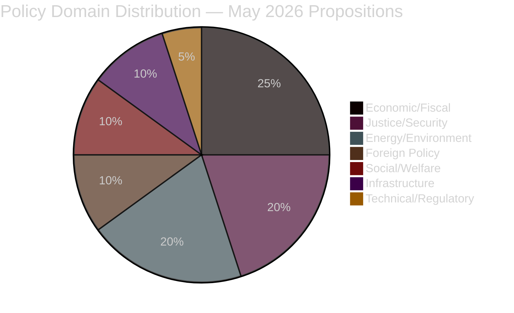

# Political Classification Results — Month Ahead May 2026

**Date**: 2026-04-25 | **Author**: James Pether Sörling

## 7-Dimension Classification Framework

### Dimension 1: Policy Domain
- **Primary**: Economic/Fiscal Policy (HD03100, HD03236, HD0399, HD03253)
- **Secondary**: Criminal Justice (HD03246, HD03237, HD03252)
- **Tertiary**: Energy/Environment (HD03240, HD03238, HD03239, HD03242)
- **Quaternary**: Foreign/Security Policy (HD03231, HD03232)
- **Quinary**: Social/Welfare (HD03245, HD03244)

### Dimension 2: Political Alignment
| Block | Propositions Favoured | Opposition Focus |
|-------|----------------------|-----------------|
| M/KD/L (Alliansen) | Justice reform, deregulation (HD03242), fiscal framework | Fiscal sufficiency questions |
| SD | Fuel relief (HD03236), justice (HD03246, HD03237), prison restrictions (HD03252) | Any dilution of criminal justice |
| S | Critiques inadequacy of relief; demands more welfare spending | HD03236 (not enough), HD03242 (too permissive) |
| MP | Energy support policies (HD03239, HD03240 conditionally) | HD03242 (forestry), HD03238 (too fast) |
| V | All relief inadequate; demand wealth redistribution | HD03252, HD03246 (rights concerns) |
| C | Support deregulation (HD03242), rural infrastructure | Mixed on justice |

### Dimension 3: Constitutional/Legal Sensitivity
- **High**: HD03246 (juvenile rights, ECHR Art. 6), HD03252 (welfare state principles)
- **Medium**: HD03238 (administrative law restructuring), HD03240 (electricity market regulation)
- **Low**: HD03231, HD03232 (treaty accession, straightforward ratification)

### Dimension 4: EU/International Compliance
- HD03253 (EU Banking Package): mandatory EU transposition
- HD03244 (Interoperability): EU Data Act compliance
- HD03238 (Environmental review): EU EIA Directive implications
- HD03231, HD03232: UN/EU rule-of-law architecture

### Dimension 5: Electoral Salience (5 months to election)
- **Maximum salience**: HD03236 (fuel/energy cost), HD03100 (economic direction), HD03237 (police), HD03246 (crime)
- **Moderate salience**: HD03239 (rural energy), HD03238 (permitting speed), HD03242 (forestry)
- **Low salience**: HD03253, HD03244, HD03256 (technical)

### Dimension 6: Implementation Complexity
- **Complex (18+ months)**: HD03238 (new authority establishment), HD03240 (electricity system overhaul)
- **Medium (6–18 months)**: HD03237 (education funding system), HD03239 (revenue distribution mechanism)
- **Simple (<6 months)**: HD03236 (tax change), HD03252 (legal restriction), HD03231/232 (treaty ratification)

### Dimension 7: Data Classification (GDPR/ISMS)
- All documents: PUBLIC data [PUBLIC classification]
- Source: data.riksdagen.se (Offentlighetsprincipen applies)
- GDPR basis: Art. 9(2)(e) publicly made; Art. 9(2)(g) substantial public interest
- No DPIA required; no personal data processed

## Priority Tiers

| Tier | Documents | Monitoring frequency |
|------|-----------|----------------------|
| P0 — Critical | HD03100, HD03236 | Daily monitoring |
| P1 — High | HD03240, HD03246, HD03237, HD03238 | Weekly monitoring |
| P2 — Significant | HD03231, HD03232, HD03239, HD03242, HD0399 | Bi-weekly |
| P3 — Standard | All others | Monthly |

