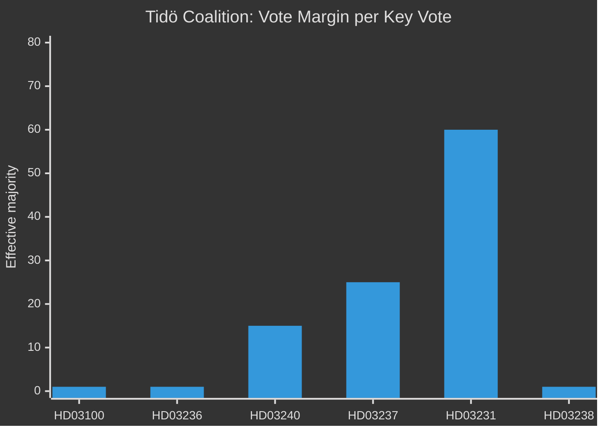

# Coalition Mathematics — Sweden Month Ahead: May 2026

**Date**: 2026-04-25 | **Riksdag**: 349 seats | **Majority threshold**: 175

## Current Tidö Vote Distribution (2022 mandate)

| Party | Seats | Coalition role |
|---|---|---|
| M | 68 | Core — PM |
| SD | 73 | Support — budget negotiations |
| KD | 19 | Core |
| L | 16 | Core |
| **Tidö total** | **176** | 1 seat majority |

## May 2026 Legislative Votes — Expected Ja/Nej Distribution

| Proposition | M | SD | KD | L | S | V | MP | C | Expected outcome |
|---|---|---|---|---|---|---|---|---|---|
| HD03100 Vårpropositionen | Ja | Ja | Ja | Ja | Nej | Nej | Nej | Abstains | **Passes** (176 Ja) |
| HD03236 Emergency budget | Ja | Ja | Ja | Ja | Nej | Nej | Nej | Abstains | **Passes** (176 Ja) |
| HD03240 Electricity | Ja | Ja | Ja | Ja | Nej | Nej | Ja | Ja | **Passes** (≥190 Ja) |
| HD03239 Wind revenue | Ja | Ja | Ja | Ja | Abstains | Nej | Ja | Ja | **Passes** (≥185 Ja) |
| HD03237 Police education | Ja | Ja | Ja | Ja | Ja | Ja | Abstains | Abstains | **Passes** (≥200 Ja) |
| HD03246 Juvenile justice | Ja | Ja | Ja | Ja | Nej | Nej | Nej | Nej | **Passes** (176 Ja) |
| HD03231 Ukraine tribunal | Ja | Ja | Ja | Ja | Ja | Ja | Ja | Ja | **Near-unanimous** |
| HD03238 Env authority | Ja | Ja | Ja | Ja | Nej | Nej | Nej | Nej | **Passes** (176 Ja) |

*Note: Seat counts are 2022 election values. Frånvarande/abstention patterns typical; effective majority may differ. C party position on HD03239 (wind revenue) is assumed supportive based on rural energy interests but not formally confirmed.*

## Threshold Vulnerability Analysis

**Critical observation**: Four of the eight key May votes have a projected margin of just 1 seat (176 seats = threshold 175 + 1). A single MP absence or SD rebellion on any of these votes creates a forced revote. This is the primary legislative risk for May 2026.
