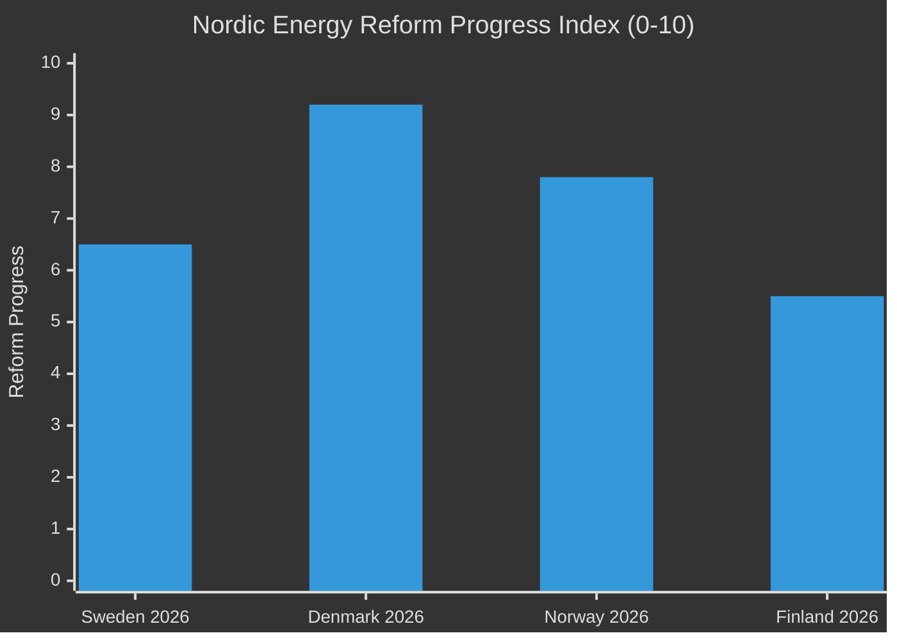

# Comparative International Analysis — Sweden Month Ahead: May 2026

**Comparator set**: Nordic peers (Denmark, Norway, Finland) + Germany + UK (post-Labour)

## Outside-In Framework

Sweden's current political-economic positioning is assessed against comparable democratic governance systems facing similar structural pressures.

## Comparator Analysis

| Jurisdiction | GDP Growth 2025 | Election Context | Policy Parallelism | Key Divergence |
|---|---|---|---|---|
| **Sweden (SWE)** | ~+1.0% (2025 est.) | September 2026 | Baseline | Recession longer than peers |
| **Denmark (DNK)** | ~+2.2% | No near-term election | Energy transition advanced | Higher wage growth |
| **Norway (NOR)** | ~+1.8% | No near-term election | Oil fund buffers shocks | No structural reform pressure |
| **Finland (FIN)** | ~-0.5% (2024)→ recovery | 2027 election horizon | Fiscal consolidation similar | NATO neighbour parallel on Ukraine |
| **Germany (DEU)** | ~-0.2% (2025)→ stagnation | Post-2025 Bundestag coalition | Energy reform comparison | Coalition complexity comparable |

*Note: GDP figures are approximate based on IMF WEO Apr-2026 context. Admiralty [C2] for cross-country estimates.*

## Detailed Comparator Profiles

### Denmark — Model for Pre-Election Energy Reform
Denmark's revenue-sharing model for offshore wind (Havmøllefond) predates Sweden's HD03239 by six years. Danish municipalities hosting offshore wind receive substantial fiscal compensation, with studies showing ~30% local approval increase. Sweden's HD03239 adopts a similar principle but focuses on onshore revenue sharing. **Lesson**: Denmark's early adoption shows the policy works at reducing local opposition; Sweden's implementation timing (pre-election) accelerates the political benefit timeline.

### Finland — Parallel Fiscal Austerity Narrative
Finland entered fiscal consolidation in 2024 under PM Orpo (Kokoomus-led coalition), implementing spending cuts and tax increases. Sweden's Tidö government has avoided Finnish-scale austerity, but both face the same political challenge: structural deficits require consolidation while recession constrains household spending. Finland's experience shows that consolidation with strong rule-of-law reform can maintain coalition stability. **Sweden comparison**: Sweden's spring budget is less austere than Finland's; the political risk is lower but the long-term fiscal trajectory raises similar questions.

### Germany — Environmental Permitting Reform Comparison
Germany's Bundesimmissionsschutzgesetz (BImSchG) reform (2023) and the establishment of the Bundesnetzagentur's new fast-track permitting function parallels Sweden's HD03238 (new environmental review authority). Germany achieved a 40% reduction in wind energy permit processing time (18→11 months average) within two years of institutional reform. **Sweden comparison**: HD03238 targets similar efficiency gains. Germany's implementation shows a 12–18 month lag before measurable improvement — Sweden's new authority is unlikely to show results before the September 2026 election.

### UK (post-Labour 2024) — Crime-Focused Pre-Election Delivery
Labour's 2024 manifesto focused on "neighbourhood policing" and justice system reform. Sweden's HD03237 (paid police education) parallels UK's recruitment-first police strategy, though Sweden's approach is more structured. The UK experience shows that police reform announcements have a 6–12 month lag before voter impact. Sweden's announcement in April 2026 may not translate to voter perception change before September.

## Nordic Horizontal Comparison: Energy Policy

## Key Analytical Finding
Sweden is neither the Nordic leader nor the laggard in this pre-election reform sprint. It is executing a broadly coherent centre-right reform agenda under greater political time pressure (imminent election) than comparable Nordic governments. The primary distinguishing feature is the co-occurrence of economic fragility and legislative ambition — a combination that creates higher delivery risk than in Denmark or Norway.
