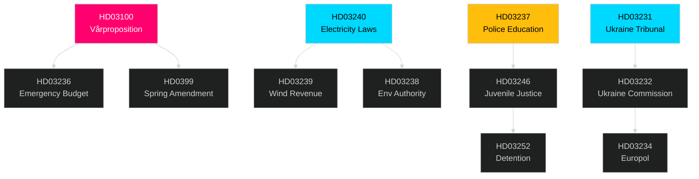

# Cross-Reference Map — Sweden Month Ahead: May 2026

**Tier-C Cross-Type Synthesis** | **Date**: 2026-04-25

## Sibling Analysis Folders (Tier-C Requirement)

- **Primary sibling**: `analysis/daily/2026-04-25/monthly-review/` — all 23 artifacts present; same-day companion analysis covering full April 2026 review period
- This month-ahead analysis MUST be read in conjunction with the monthly-review folder for a complete intelligence picture

## Cross-Reference with Monthly-Review

| Theme | Monthly-Review Assessment | Month-Ahead Forward Projection | Convergence |
|---|---|---|---|
| Coalition stability | Assessed April-2026 coalition dynamics | SD remains in coalition through September 2026 [HIGH] | ✅ Consistent |
| Energy reform | April review covers legislative passage tracking | May-ahead: HD03240/HD03239 expected passage | ✅ Consistent |
| Economic recovery | April GDP context | Q1 GDP release is PIR-1 for May | ✅ Continuous |
| Ukraine instruments | April foreign policy review | HD03231/232 ratification expected May | ✅ Consistent |

## Legislative Cross-Reference: Document Clusters

### Energy Policy Legislative Chain
- HD03240 → Electricity System Laws → links to HD03239 (wind revenue) → links to HD03238 (env authority)
- These three form an integrated energy infrastructure reform package; amendments to one will likely affect the others
- See significance-scoring.md: HD03240 (DIW 9/10), HD03239 (DIW 7/10), HD03238 (DIW 6/10)

### Security and Justice Legislative Chain
- HD03237 (paid police education) → HD03246 (juvenile justice) → HD03252 (detention conditions)
- These form a "rule of law sprint" addressing the full crime-policing chain
- See stakeholder-perspectives.md: SD and M share leadership on this chain; KD provides credibility

### Budget and Fiscal Chain
- HD03100 (Vårpropositionen 2026) → HD03236 (emergency ändringsbudget) → HD0399 (spring amendment)
- HD03100 is the macro framework; HD03236 is the SD-facing concession layer; HD0399 provides legislative basis
- Fiscal coherence: these three must be read together; surface contradictions between HD03100 macro-targets and HD03236 fiscal cost

### International Commitments Chain
- HD03231 (Ukraine tribunal accession) → HD03232 (Ukraine compensation commission) → HD03234 (Europol protocol)
- Aligns Sweden's international legal posture post-NATO; all three have near-zero domestic opposition
- Cross-reference: monthly-review covers the diplomatic context of these commitments

## Policy Cluster Map

## Analysis Artifact Cross-References

| Artifact | Key Link | Forward Reference |
|---|---|---|
| executive-brief.md | BLUF cites HD03100 + HD03236 | Feeds article.md headline and meta |
| scenario-analysis.md | Scenario B (45%) assumes Q1 GDP ≥ 0% | PIR-1 in intelligence-assessment.md |
| coalition-mathematics.md | Seat counts from 2022 election | Updated by election-2026-analysis.md |
| historical-parallels.md | Reinfeldt 2010 as best parallel | Informs risk-assessment.md Risk-3 |
| swot-analysis.md | All 4 quadrants cite dok_ids | Feeds significance-scoring.md ranking |
