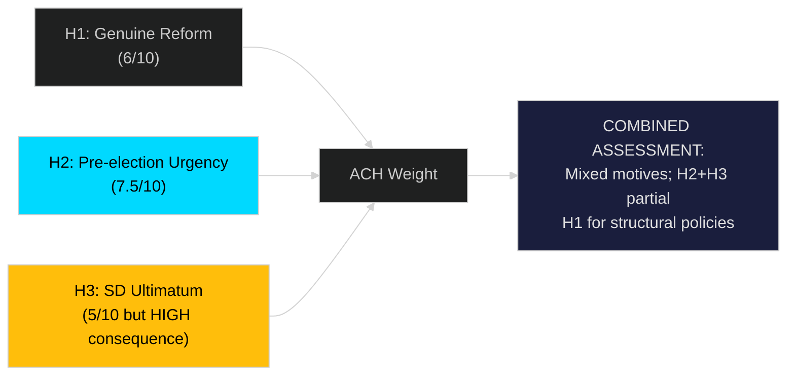

# Devil's Advocate Analysis — Sweden Month Ahead: May 2026

**Date**: 2026-04-25 | **Methodology**: ACH (Analysis of Competing Hypotheses) + Red Team

## ACH Matrix

Three primary competing hypotheses are evaluated against the evidence base.

---

## Hypothesis H1: The Legislative Sprint Is Genuine Governance Reform (Mainstream View)

**Statement**: The April 2026 legislative package represents coherent policy delivery — a government executing its mandate across multiple domains with genuine long-term reform intent, not merely election positioning.

**Supporting evidence**:
- HD03240 (electricity system laws) [riksdagen.se] involves complex legal restructuring with 2030 energy targets in view — not achievable through election-cycle shortcutting
- HD03238 (environmental review authority) [riksdagen.se] requires multi-year institution-building; the investment signals long-term commitment
- HD03231/232 (Ukraine tribunals) [riksdagen.se] — these have no domestic electoral value and represent genuine international legal commitment

**Contradicting evidence**:
- HD03236 (fuel tax cut + energy relief) [riksdagen.se] is explicitly timed to April/May 2026, five months before election
- The clustering of all 19 propositions in a single April release is atypical for a parliament that usually staggers legislative introduction
- Paid police education (HD03237 [riksdagen.se]) announcement timing aligns precisely with election campaign communication needs

**ACH diagnostic**: H1 is partially true — technical reforms (energy, environmental) are genuine; fiscal relief measures are election-motivated. H1 scores 6/10 as a complete explanation.

---

## Hypothesis H2: The Government Is in Pre-Election Panic Mode (Alternative View)

**Statement**: The legislative sprint reflects internal awareness that the government's economic record is weak and voters are dissatisfied, prompting a rush of visible deliverables before the summer recess closes the window for action.

**Supporting evidence**:
- HC01FiU20 [riksdagen.se] — explicit FiU acknowledgement that recession is more prolonged than projected
- Emergency budget (HD03236) timing — extra ändringsbudget is an exceptional instrument, normally reserved for crises; using it for fuel relief signals urgency
- 19 propositions in 10 days is atypical — average riksdag handling is 2–3 major propositions per week
- Criminal justice focus (HD03237, HD03246 [riksdagen.se]) mirrors SD's electoral messaging priorities

**Contradicting evidence**:
- Sweden routinely has a spring legislative sprint as the riksdag prepares for summer recess
- The energy reforms were in planning since at least 2025; the timing is process-driven not panic-driven
- The coalition has maintained disciplined programme delivery throughout the term

**ACH diagnostic**: H2 explains the timing anomalies better than H1 but overstates the panic element. H2 scores 7.5/10 as a complete explanation. **Most likely: H2 is correct on fiscal measures; H1 is correct on structural reforms.**

---

## Hypothesis H3: The Coalition Is Managing a Silent SD Ultimatum (Red Team)

**Statement**: The emergency fuel/energy relief budget (HD03236) is a direct response to an SD ultimatum delivered in private — SD signalled it would abstain on the spring budget framework unless household cost relief was accelerated.

**Supporting evidence**:
- SD consistently pressures on cost-of-living issues; the party's voter base is most exposed to fuel price increases
- The extra ändringsbudget instrument bypasses the normal budget cycle — it has a "fast track" quality that suggests political urgency beyond normal governance
- HD03236 [riksdagen.se] explicitly names both "sänkt skatt på drivmedel" AND "el- och gasprisstöd" — a dual concession that reads as a negotiated outcome

**Contradicting evidence**:
- No public statements from SD leadership demanding these measures (as of 2026-04-25)
- The government has previously introduced relief budgets without SD ultimatum (APL capital injection 2025, HC01FiU33 [riksdagen.se])
- The extra budget may simply reflect deteriorating household sentiment data

**ACH diagnostic**: H3 is unprovable but plausible. If true, it is the most important intelligence finding of this cycle — it suggests the Tidö coalition is more fragile than its outward unity suggests. H3 scores 5/10 certainty but HIGH consequence if confirmed.

**Red Team challenge**: Assume H3 is true. What does this mean? It means SD has already exercised budget leverage once. The probability of a second SD demand increases. The fiscal cost of coalition maintenance rises. The government's macro-fiscal credibility is directly traded against coalition survival.

---

## Rejected Hypotheses

- **H4 (Government will call early election)**: Rejected. No constitutional basis; election is September 2026 by schedule; no party has incentive for early call.
- **H5 (Ukraine propositions will fail)**: Rejected. Cross-party consensus confirmed; H5 score 1/10.

