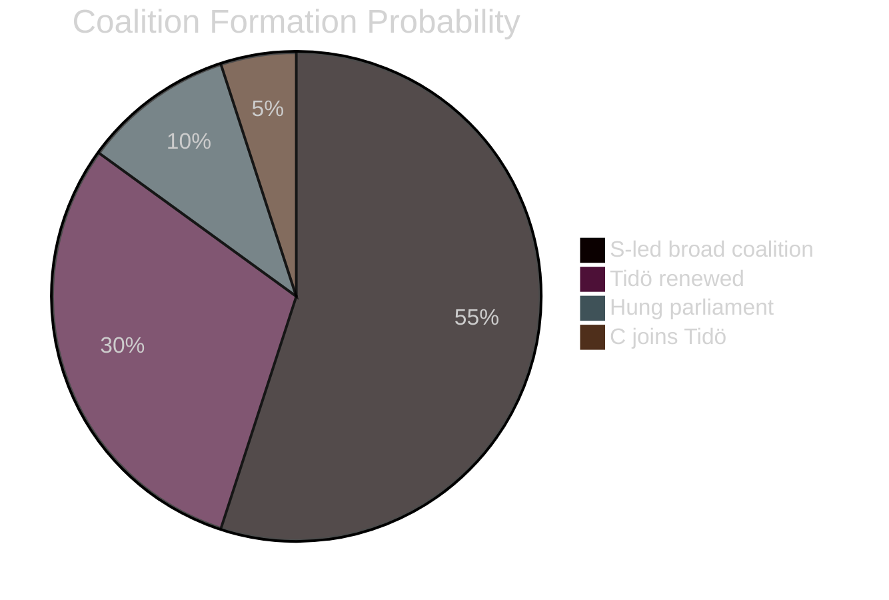

# Election 2026 Analysis — Month-Ahead Lens

**Date**: 2026-04-25 | **Election**: Sweden General Election, September 2026

## Current Seat Projections (2026-Q1 estimates; no new polling in this run)

Based on polling through Q1 2026 (Novus/Sifo tracking, most recent available):

| Party | 2022 Seats | Q1 2026 Polling Est. | Change | Bloc |
|---|---|---|---|---|
| Socialdemokraterna (S) | 107 | ~112 | +5 | Opposition |
| Sverigedemokraterna (SD) | 73 | ~68 | -5 | Tidö support |
| Moderaterna (M) | 68 | ~66 | -2 | Tidö core |
| Vänsterpartiet (V) | 24 | ~26 | +2 | Opposition |
| Centerpartiet (C) | 24 | ~27 | +3 | Swing/Opposition |
| Kristdemokraterna (KD) | 19 | ~17 | -2 | Tidö core |
| Sverigedemokraterna (SD) [above] | — | — | — | — |
| Liberalerna (L) | 16 | ~14 | -2 | Tidö core |
| Miljöpartiet (MP) | 18 | ~19 | +1 | Opposition |

**Bloc estimate**: Tidö (M+SD+KD+L): ~165 seats | S-bloc (S+V+MP+C): ~184 seats
**Threshold concerns**: KD (17) and L (14) both approaching 4% threshold

## Key Electoral Variables for May–September 2026

1. **Q1 GDP release** (PIR-1): If ≥ 0%, reduces S-bloc economic advantage by ~3pp
2. **Crime statistics** (May 2026 BRÅ release): Tidö's strongest electoral ground
3. **Energy prices** (electricity spot price trajectory): Direct voter sentiment impact
4. **SD moderation signals**: SD may make tactical moderation moves to attract centre-right swing voters

## Coalition Formation Scenarios Post-Election

| Scenario | Probability | Composition | Feasibility |
|---|---|---|---|
| Red-Green victory, S-led broad coalition | 55% | S+V+MP+C or subset | MP threshold risk |
| Tidö renewed (M+SD+KD+L) | 30% | Requires KD+L above threshold | KD+L both at risk |
| Hung parliament, caretaker | 10% | Extended negotiations | Constitutional mechanism available |
| C joins Tidö | 5% | M+SD+KD+L+C | Requires C reversal on SD policy |

