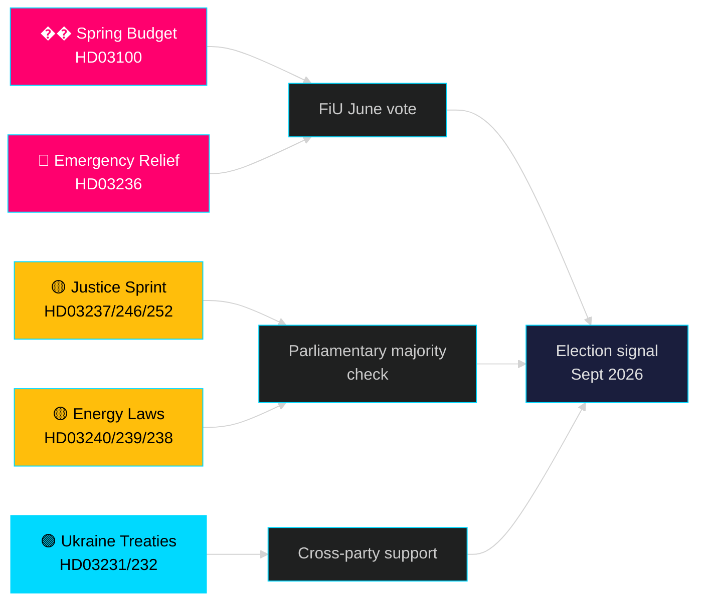

# Month Ahead — May 2026: Sweden at the Pre-Election Inflection Point

**Author**: James Pether Sörling | **Classification**: PUBLIC | **Date**: 2026-04-25 | **Confidence**: HIGH

## 🎯 BLUF

Sweden enters May 2026 with the Tidö government deploying its largest pre-election legislative package: the 2026 Spring Budget (HD03100) projecting continued but slow economic recovery, an emergency fuel and energy cost relief (HD03236), and a 19-proposition legislative sprint across justice, energy, environment, and foreign policy. With elections exactly five months away (September 2026), the political risk is firmly centred on economic sentiment — whether household cost relief arrives in time to shift voter preferences — and on the government's credibility on rule-of-law reforms that have been central to the Tidö coalition's mandate since 2022.

## 🧭 3 Decisions This Brief Supports

1. **Economic risk assessment**: Should stakeholders price in accelerated political instability risk before the September 2026 election given the extended recession and the emergency relief budget?
2. **Legislative pipeline tracking**: Which of the 19 current propositions carry the highest risk of opposition delay or committee blockage before the summer recess (June 2026)?
3. **Coalition stability**: Does the fuel-tax cut (HD03236) signal SD pressure on the government, and how does that shift coalition mathematics heading into election season?

## 60-Second Intelligence Read

- 🔴 **Vårproposition 2026 (HD03100)** — Spring budget framework projects slow recovery; lågkonjunktur persists longer than earlier forecast. Government targets growth, welfare, security. FiU scrutiny June.
- 🔴 **Emergency fuel+energy relief (HD03236)** — Sänkt skatt på drivmedel + el/gasprisstöd; election-cycle fiscal signal. Cost estimated at several billion SEK.
- 🟡 **Justice sprint**: Paid police education (HD03237), tougher juvenile rules (HD03246), prisoner social insurance restriction (HD03252) — M/SD core mandate delivery.
- 🟡 **Energy transformation**: New electricity system laws (HD03240), wind power revenue to municipalities (HD03239), new environmental review authority (HD03238).
- 🟢 **Ukraine accountability**: Sweden joins aggression tribunal (HD03231) and damages commission (HD03232) — foreign policy cohesion across parties.
- 🔵 **Forestry deregulation (HD03242)** — contentious Alliansen/landsbygd vote; MP/S/V opposed.

## Top Forward Trigger for May

> **Trigger**: Finance Committee (FiU) vote on Vårproposition 2026 (HD03100) and extra ändringsbudget (HD03236) — expected late May / early June. A negative committee opinion or SD abstention on the fiscal framework would be the single most significant political event before the summer recess.

## Confidence Assessment

**HIGH** [B2] — Based on 20 verified government propositions and skrivelser from data.riksdagen.se, riksmöte 2025/26.

