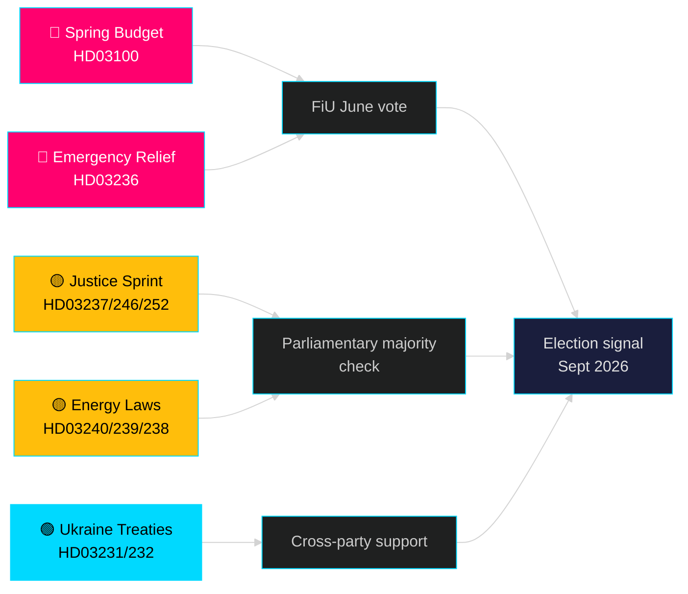

<!-- dir: rtl -->
# الشهر القادم — مايو 2026: السويد عند نقطة الانعطاف قبل الانتخابات

**المؤلف**: James Pether Sörling | **التصنيف**: عام | **التاريخ**: 2026-04-25 | **مستوى الثقة**: HIGH

## 🎯 الخلاصة

تدخل السويد شهر مايو 2026 وحكومة تيدو تُطلق أكبر حزمة تشريعية لها قبل الانتخابات: ميزانية الربيع 2026 (HD03100) التي تتوقع تعافياً اقتصادياً مستمراً لكن بطيئاً، وحزمة طارئة لخفض تكاليف الوقود والطاقة (HD03236)، وسباق تشريعي يضم 19 مقترحاً في مجالات العدالة والطاقة والبيئة والسياسة الخارجية. مع بقاء خمسة أشهر بالضبط حتى الانتخابات (سبتمبر 2026)، تتمحور المخاطر السياسية بشكل حاسم حول المشاعر الاقتصادية — هل ستصل تخفيضات التكاليف للأسر في الوقت المناسب لتؤثر على تفضيلات الناخبين — وحول مصداقية الحكومة في إصلاحات سيادة القانون التي تشكل جوهر ولاية تحالف تيدو منذ عام 2022.

## 🧭 3 قرارات يدعمها هذا الإحاطة

1. **تقييم المخاطر الاقتصادية**: هل ينبغي للفاعلين تسعير مخاطر عدم الاستقرار السياسي المتصاعدة قبيل انتخابات سبتمبر 2026، في ضوء الركود الممتد وحزمة الدعم الطارئة؟
2. **تتبع مسار التشريع**: أيٌّ من المقترحات التشريعية الـ19 الجارية تحمل أعلى مخاطر التأخير بسبب المعارضة أو الإعاقة في اللجنة قبل العطلة الصيفية (يونيو 2026)؟
3. **استقرار الائتلاف**: هل تُشير تخفيضات الضريبة على الوقود (HD03236) إلى ضغط حزب SD على الحكومة، وكيف يُغيّر ذلك حسابات الائتلاف في الفترة الانتخابية؟

## القراءة الاستخباراتية في 60 ثانية

- 🔴 **ميزانية الربيع 2026 (HD03100)** — الإطار الربيعي للميزانية يتوقع تعافياً بطيئاً؛ الركود يستمر أطول من التوقعات السابقة. تستهدف الحكومة النمو والرفاه والأمن. مراجعة FiU في يونيو.
- 🔴 **الإغاثة الطارئة للوقود والطاقة (HD03236)** — تخفيض ضريبة الوقود + دعم أسعار الكهرباء/الغاز؛ إشارة دورة انتخابية على صعيد الميزانية. تُقدَّر التكاليف بمليارات SEK.
- 🟡 **سباق العدالة**: تدريب شرطي مدفوع الأجر (HD03237)، قواعد الشباب الأكثر صرامة (HD03246)، حظر التأمين الاجتماعي للمحتجزين (HD03252) — تسليمات التفويض الأساسي لـ M/SD.
- 🟡 **التحول في الطاقة**: قانون النظام الكهربائي الجديد (HD03240)، عائدات طاقة الرياح للبلديات (HD03239)، سلطة تقييم البيئة الجديدة (HD03238).
- 🟢 **المساءلة الأوكرانية**: تنضم السويد إلى محكمة العدوان (HD03231) ولجنة التعويضات (HD03232) — توافق خارج الأحزاب في السياسة الخارجية.
- 🔵 **إلغاء تنظيم الغابات (HD03242)** — تصويت مثير للجدل بين التحالف والريف؛ معارضة MP/S/V.

## أهم إشارة استشرافية لمايو

> **المحفز**: تصويت لجنة المالية (FiU) على ميزانية الربيع 2026 (HD03100) والميزانية المعدّلة التكميلية (HD03236) — متوقع أواخر مايو / مطلع يونيو. سيكون تقرير لجنة سلبي أو حق نقض SD على السياسة الضريبية الحدث الأكثر أهمية سياسية قبل العطلة الصيفية.

## بيان الثقة

**HIGH** [B2] — مستند إلى 20 مقترحاً حكومياً ومراسلات موثقة من data.riksdagen.se، riksmöte 2025/26.

<!-- source-sha: 91eb3cb6cf35873538b354461078df4509cf0012 -->
