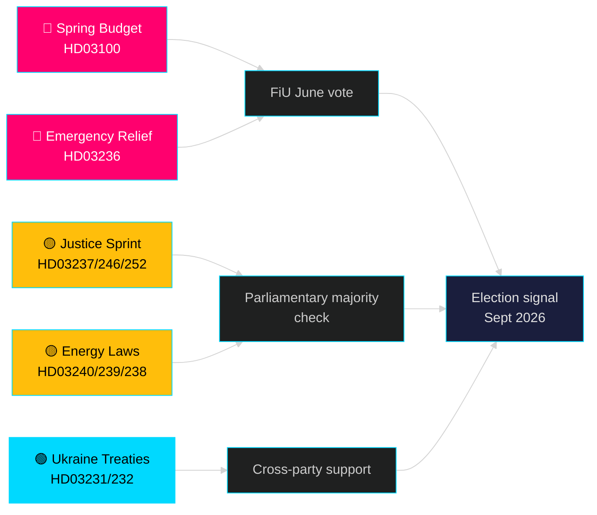

# Måneden forude — maj 2026: Sverige ved pre-valgets vendepunkt

**Forfatter**: James Pether Sörling | **Klassifikation**: PUBLIC | **Dato**: 2026-04-25 | **Konfidensniveau**: HIGH

## 🎯 Konklusion

Sverige træder ind i maj 2026 med Tidö-regeringen, der rullet det største præ-valgspakke ud: 2026-forårsprogrammet (HD03100), der forudsiger fortsat men langsom økonomisk genopretning, en akut pakke til reduktion af brændstof- og energiomkostninger (HD03236) og et lovgivningssprint bestående af 19 propositioner inden for retfærdighed, energi, miljø og udenrigspolitik. Med præcis fem måneder til valget (september 2026) er den politiske risiko bestemt centreret om det økonomiske sentiment — om husholdningers omkostningsreduktioner ankommer tidsnok til at påvirke vælgerpræferencer — og om regeringens troværdighed i retsstatsreformer, der har stået centralt for Tidö-koalitionens mandat siden 2022.

## 🧭 3 beslutninger dette briefing understøtter

1. **Vurdering af økonomisk risiko**: Bør aktørerne indprise øget politisk ustabilitetsrisiko op til september 2026-valget i lyset af den forlængede recession og den akutte støttepakke?
2. **Sporing af lovgivningspipeline**: Hvilke af de 19 nuværende propositioner bærer den højeste risiko for oppositionsblokering eller udvalgsblokering inden sommerferien (juni 2026)?
3. **Koalitionsstabilitet**: Signalerer brændstofafgiftssænkningerne (HD03236) SD's pres på regeringen, og hvordan ændrer det koalitionsmatematikken op til valgkampagnen?

## 60-sekunders efterretningslæsning

- 🔴 **Forårsproposition 2026 (HD03100)** — Forårsbudgetramme projicerer langsom genopretning; recessionen varer længere end den tidligere prognose. Regeringen sigter mod vækst, velfærd, sikkerhed. FiU-gennemgang i juni.
- 🔴 **Akut brændstof- og energihjælp (HD03236)** — Reduceret brændstofafgift + el-/gasprisstøtte; valcyklussignal på budgetsiden. Omkostningerne anslås til adskillige milliarder SEK.
- 🟡 **Retfærdighedssprint**: Betalt politiuddannelse (HD03237), strengere ungdomsregler (HD03246), forbud mod socialforsikring for indsatte (HD03252) — kerneleverancer fra M/SD's mandat.
- 🟡 **Energiomstilling**: Ny lov om elsystemet (HD03240), vindkraftindtægter til kommuner (HD03239), ny miljøvurderingsmyndighed (HD03238).
- 🟢 **Ukrainas ansvarlighed**: Sverige tilslutter sig aggressionstribunal (HD03231) og skadeserstatningskommission (HD03232) — tværpolitisk enighed om udenrigspolitikken.
- 🔵 **Skovbrugsderegulering (HD03242)** — omstridt Alliance/landdistriktsafstemning; MP/S/V-modstand.

## Vigtigste fremadrettede signal for maj

> **Udløser**: Finansudvalgets (FiU) afstemning om Forårsproposition 2026 (HD03100) og tillægsændringsbudget (HD03236) — forventes sent i maj / tidlig juni. En negativ udvalgsudtalelse eller SD's nedlæggelse af veto mod skattepolitikken ville udgøre den mest politisk betydningsfulde enkeltbegivenhed inden sommerferien.

## Konfidenserklæring

**HIGH** [B2] — Baseret på 20 verificerede regeringspropositioner og skrivelser fra data.riksdagen.se, riksmöte 2025/26.

<!-- source-sha: 91eb3cb6cf35873538b354461078df4509cf0012 -->
