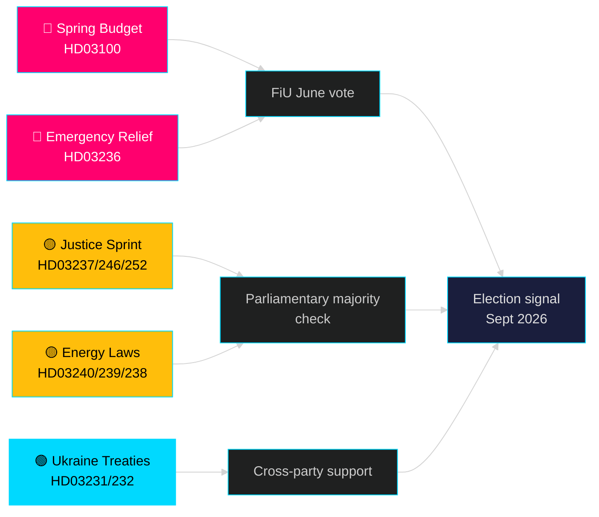

# Der nächste Monat — Mai 2026: Schweden am Wendepunkt vor der Wahl

**Autor**: James Pether Sörling | **Klassifikation**: PUBLIC | **Datum**: 2026-04-25 | **Konfidenzniveau**: HIGH

## 🎯 Fazit

Schweden tritt in den Mai 2026 ein, während die Tidö-Regierung ihr größtes Gesetzgebungspaket vor der Wahl einführt: das Frühjahrsbudget 2026 (HD03100), das eine anhaltende, aber langsame Wirtschaftserholung prognostiziert, ein Notfallpaket zur Senkung der Kraftstoff- und Energiekosten (HD03236) sowie einen Gesetzgebungs-Sprint mit 19 Vorlagen in den Bereichen Justiz, Energie, Umwelt und Außenpolitik. Mit genau fünf Monaten bis zur Wahl (September 2026) konzentriert sich das politische Risiko eindeutig auf die wirtschaftliche Stimmung — ob die Kostensenkungen für Haushalte rechtzeitig ankommen, um die Wählervorlieben zu beeinflussen — und auf die Glaubwürdigkeit der Regierung bei Rechtsstaatsreformen, die seit 2022 im Mittelpunkt des Mandats der Tidö-Koalition stehen.

## 🧭 3 Entscheidungen, die dieser Bericht unterstützt

1. **Bewertung des wirtschaftlichen Risikos**: Sollten Akteure erhöhtes politisches Instabilitätsrisiko vor der Wahl im September 2026 einpreisen, angesichts der verlängerten Rezession und des Notfallhilfspakets?
2. **Verfolgung der Gesetzgebungs-Pipeline**: Welche der 19 aktuellen Gesetzesvorlagen tragen das größte Risiko einer Verzögerung durch die Opposition oder einer Blockade im Ausschuss vor der Sommerpause (Juni 2026)?
3. **Koalitionsstabilität**: Signalisieren die Kraftstoffsteuersenkungen (HD03236) SD-Druck auf die Regierung, und wie verändert das die Koalitionsarithmetik im Vorfeld der Wahlkampagne?

## 60-Sekunden-Nachrichtenüberblick

- 🔴 **Frühjahrshaushalt 2026 (HD03100)** — Frühjahrsbudgetrahmen prognostiziert langsame Erholung; Rezession dauert länger als frühere Prognose. Regierung strebt Wachstum, Wohlfahrt, Sicherheit an. FiU-Prüfung im Juni.
- 🔴 **Notfall-Kraftstoff- und Energiehilfe (HD03236)** — Gesenkte Kraftstoffsteuer + Strom-/Gaspreisunterstützung; Wahlzyklussignal auf der Budgetseite. Kosten werden auf mehrere Milliarden SEK geschätzt.
- 🟡 **Justiz-Sprint**: Bezahlte Polizeiausbildung (HD03237), strengere Jugendregeln (HD03246), Verbot der Sozialversicherung für Inhaftierte (HD03252) — Kernmandatlieferungen von M/SD.
- 🟡 **Energiewende**: Neues Stromgesetz (HD03240), Windkrafteinnahmen für Gemeinden (HD03239), neue Umweltprüfungsbehörde (HD03238).
- 🟢 **Ukrainische Rechenschaftspflicht**: Schweden schließt sich Aggressionsgerichtshof (HD03231) und Schadenskommission (HD03232) an — überparteilicher außenpolitischer Konsens.
- 🔵 **Forstwirtschafts-Deregulierung (HD03242)** — umstrittene Allianz-/Landstimme; MP/S/V-Widerstand.

## Wichtigstes Vorwärtssignal für Mai

> **Auslöser**: Abstimmung des Finanzausschusses (FiU) über Frühjahrshaushalt 2026 (HD03100) und ergänzenden Änderungshaushalt (HD03236) — erwartet Ende Mai / Anfang Juni. Eine negative Ausschussstellungnahme oder ein SD-Veto zur Steuerpolitik wäre das politisch bedeutsamste Einzelereignis vor der Sommerpause.

## Konfidenzaussage

**HIGH** [B2] — Basierend auf 20 verifizierten Regierungsvorlagen und Schreiben von data.riksdagen.se, riksmöte 2025/26.

<!-- source-sha: 91eb3cb6cf35873538b354461078df4509cf0012 -->
