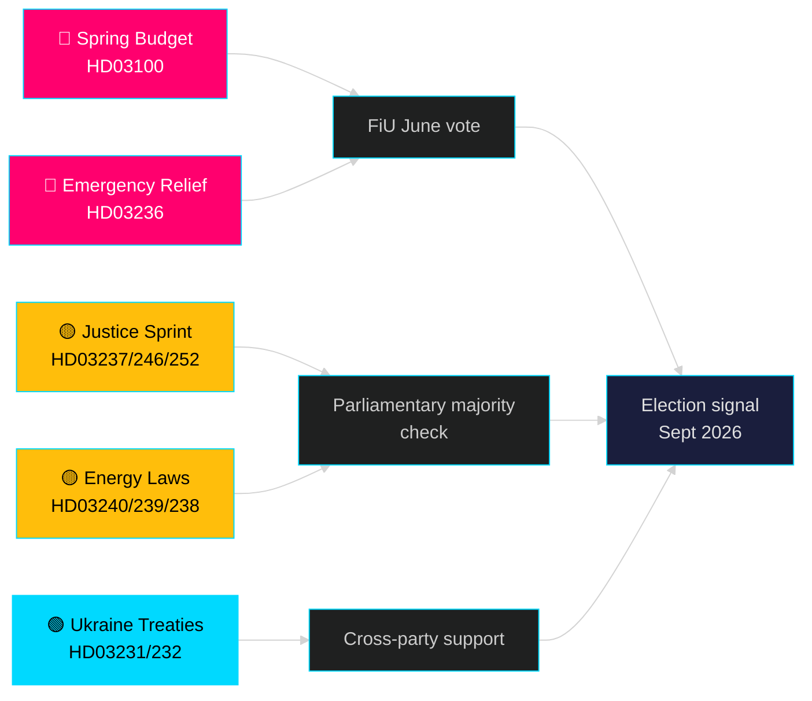

# El mes que viene — mayo 2026: Suecia en el punto de inflexión preelectoral

**Autor**: James Pether Sörling | **Clasificación**: PUBLIC | **Fecha**: 2026-04-25 | **Nivel de confianza**: HIGH

## 🎯 Conclusión

Suecia entra en mayo de 2026 con el gobierno Tidö que despliega su mayor paquete legislativo preelectoral: el presupuesto de primavera de 2026 (HD03100) que proyecta una recuperación económica continua pero lenta, un paquete de emergencia de reducción de costes de combustible y energía (HD03236) y un sprint legislativo de 19 proposiciones en los ámbitos de justicia, energía, medio ambiente y política exterior. Con exactamente cinco meses hasta las elecciones (septiembre de 2026), el riesgo político está definitivamente centrado en el sentimiento económico —si las reducciones de costes para los hogares llegan a tiempo para influir en las preferencias de los votantes— y en la credibilidad del gobierno en las reformas del Estado de Derecho que han estado en el centro del mandato de la coalición Tidö desde 2022.

## 🧭 3 decisiones que apoya este informe

1. **Evaluación del riesgo económico**: ¿Deberían los actores descontar un mayor riesgo de inestabilidad política de cara a las elecciones de septiembre de 2026, teniendo en cuenta la prolongada recesión y el paquete de ayuda de emergencia?
2. **Seguimiento del pipeline legislativo**: ¿Cuáles de las 19 proposiciones en curso llevan el mayor riesgo de retraso por parte de la oposición o bloqueo en comisión antes de las vacaciones de verano (junio de 2026)?
3. **Estabilidad de la coalición**: ¿Las rebajas del impuesto sobre los combustibles (HD03236) señalan presión del SD sobre el gobierno, y cómo cambia eso la aritmética de la coalición de cara a la campaña electoral?

## Lectura de inteligencia en 60 segundos

- 🔴 **Presupuesto de primavera 2026 (HD03100)** — El marco presupuestario de primavera proyecta una recuperación lenta; la recesión dura más que la previsión anterior. El gobierno apunta a crecimiento, bienestar, seguridad. Revisión FiU en junio.
- 🔴 **Ayuda de emergencia combustible y energía (HD03236)** — Impuesto reducido sobre combustibles + apoyo al precio de electricidad/gas; señal de ciclo electoral en el lado presupuestario. El coste se estima en varios miles de millones de SEK.
- 🟡 **Sprint justicia**: Formación policial remunerada (HD03237), reglas juveniles más estrictas (HD03246), prohibición del seguro social para reclusos (HD03252) — entregas del mandato central de M/SD.
- 🟡 **Transición energética**: Nueva ley del sistema eléctrico (HD03240), ingresos de la energía eólica para municipios (HD03239), nueva autoridad de evaluación ambiental (HD03238).
- 🟢 **Responsabilidad de Ucrania**: Suecia se une al tribunal de agresión (HD03231) y a la comisión de daños (HD03232) — consenso multipartidista en política exterior.
- 🔵 **Desregulación forestal (HD03242)** — voto controvertido Alianza/rural; oposición de MP/S/V.

## Principal señal prospectiva para mayo

> **Detonante**: Votación de la comisión de finanzas (FiU) sobre el presupuesto de primavera de 2026 (HD03100) y el presupuesto rectificativo suplementario (HD03236) — se espera a finales de mayo / principios de junio. Un informe negativo de la comisión o un veto del SD sobre la política fiscal sería el evento políticamente más significativo antes de las vacaciones de verano.

## Declaración de confianza

**HIGH** [B2] — Basado en 20 proposiciones gubernamentales y comunicaciones verificadas de data.riksdagen.se, riksmöte 2025/26.

<!-- source-sha: 91eb3cb6cf35873538b354461078df4509cf0012 -->
