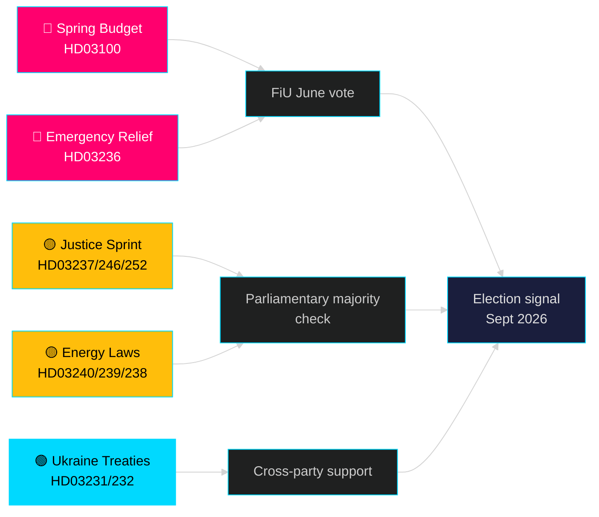

# Kuukausi edessä — toukokuu 2026: Ruotsi esivaalikäännekohdassa

**Tekijä**: James Pether Sörling | **Luokittelu**: PUBLIC | **Päiväys**: 2026-04-25 | **Luottamustaso**: HIGH

## 🎯 Johtopäätös

Ruotsi astuu toukokuuhun 2026 Tidö-hallituksen rullatessa ulos suurimman esivaalilainsäädäntöpakettinsa: vuoden 2026 kevätbudjetti (HD03100), joka ennustaa jatkuvaa mutta hidasta talouden elpymistä, kiireellinen polttoaine- ja energiakustannusten vähentämispaketti (HD03236) sekä 19 esityksen lainsäädäntösprint oikeuden, energian, ympäristön ja ulkopolitiikan alalla. Vaaleihin on täsmälleen viisi kuukautta (syyskuu 2026), ja poliittinen riski on selkeästi keskittynyt taloudelliseen mielialaan — saapuvatko kotitalouksien kustannussäästöt ajoissa vaikuttaakseen äänestäjien preferensseihin — sekä hallituksen uskottavuuteen oikeusvaltiouudistuksissa, jotka ovat olleet Tidö-koalition mandaatin ytimessä vuodesta 2022.

## 🧭 3 päätöstä, joita tämä tiedote tukee

1. **Taloudellisen riskin arviointi**: Pitäisikö toimijoiden hinnoitella lisääntynyt poliittisen epävakauden riski syyskuun 2026 vaaleita ennakoivasti ottaen huomioon pitkittynyt taantuma ja kiireellinen tukipaketti?
2. **Lainsäädäntöputken seuranta**: Mitkä 19 käynnissä olevasta esityksestä kantavat suurimman riskin opposition viivästyttämisestä tai valiokuntaestosta ennen kesälomaa (kesäkuu 2026)?
3. **Koalition vakaus**: Merkitseekö polttoaineveroleikkaukset (HD03236) SD:n painostusta hallitukseen, ja miten se muuttaa koalitiolaskelmia vaaleissa?

## 60 sekunnin tiedustelutiivistelmä

- 🔴 **Kevätbudjetti 2026 (HD03100)** — Kevätbudsjetin kehys ennustaa hidasta elpymistä; taantuma kestää pidempään kuin aiempi ennuste. Hallitus tähtää kasvuun, hyvinvointiin, turvallisuuteen. FiU:n käsittely kesäkuussa.
- 🔴 **Kiireellinen polttoaine- ja energiatuki (HD03236)** — Alennettu polttoaineverо + sähkö-/kaasuhintatuki; vaalikierrossignaali budjettipuolella. Kustannuksiksi arvioidaan useita miljardeja SEK.
- 🟡 **Oikeussprint**: Palkattu poliisikoulutus (HD03237), tiukemmat nuorisosäännöt (HD03246), kielto sosiaaliturvan maksamisesta vangeille (HD03252) — M/SD:n ydinmandaattilunastukset.
- 🟡 **Energiamurros**: Uusi sähköjärjestelmälaki (HD03240), tuulivoimatulot kunnille (HD03239), uusi ympäristöarviointiviranomainen (HD03238).
- 🟢 **Ukrainan vastuuvelvollisuus**: Ruotsi liittyy aggressiotuomioistuimeen (HD03231) ja vahingonkorvauskomissioon (HD03232) — puolueiden välinen yhteisymmärrys ulkopolitiikassa.
- 🔵 **Metsätalouden sääntelyn purku (HD03242)** — kiistanalainen Allianssi/maaseutuäänestys; MP/S/V-vastustus.

## Tärkein eteenpäin suuntautuva signaali toukokuulle

> **Laukaisin**: Valtiovarainvaliokunnan (FiU) äänestys kevätbudjetista 2026 (HD03100) ja lisämuutosbudjetista (HD03236) — odotetaan toukokuun lopussa / kesäkuun alussa. Kielteinen valiokuntamietintö tai SD:n veto veropolitiikassa olisi yksittäinen poliittisesti merkittävin tapahtuma ennen kesälomaa.

## Luottamuslausunto

**HIGH** [B2] — Perustuu 20 varmennettuun hallituksen esitykseen ja kirjelmään data.riksdagen.se:stä, riksmöte 2025/26.

<!-- source-sha: 91eb3cb6cf35873538b354461078df4509cf0012 -->
