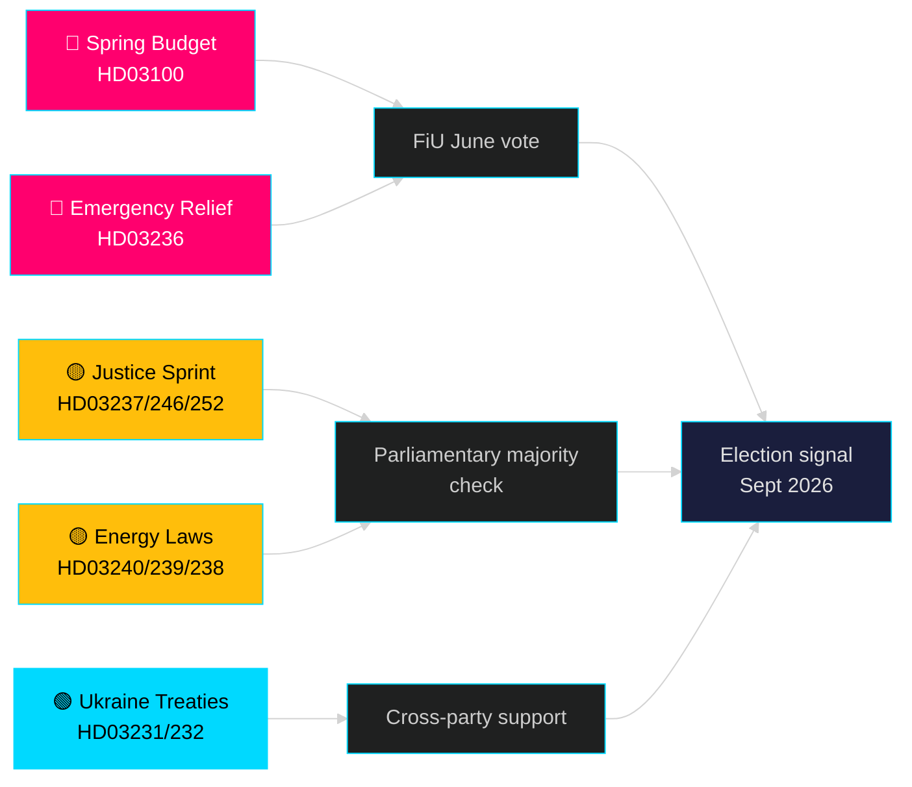

# Le mois à venir — mai 2026 : La Suède au point d'inflexion pré-électoral

**Auteur** : James Pether Sörling | **Classification** : PUBLIC | **Date** : 2026-04-25 | **Niveau de confiance** : HIGH

## 🎯 Conclusion

La Suède entre en mai 2026 avec le gouvernement Tidö qui déploie son plus grand paquet législatif pré-électoral : le budget de printemps 2026 (HD03100) projetant une reprise économique continue mais lente, un paquet d'urgence de réduction des coûts de carburant et d'énergie (HD03236) et un sprint législatif de 19 propositions dans les domaines de la justice, de l'énergie, de l'environnement et de la politique étrangère. Avec exactement cinq mois jusqu'aux élections (septembre 2026), le risque politique est résolument centré sur le sentiment économique — si les réductions de coûts pour les ménages arrivent à temps pour influencer les préférences des électeurs — et sur la crédibilité du gouvernement dans les réformes de l'État de droit qui sont au cœur du mandat de la coalition Tidö depuis 2022.

## 🧭 3 décisions que ce briefing soutient

1. **Évaluation du risque économique** : Les acteurs devraient-ils intégrer un risque accru d'instabilité politique avant les élections de septembre 2026, compte tenu de la récession prolongée et du paquet d'aide d'urgence ?
2. **Suivi du pipeline législatif** : Lesquelles des 19 propositions actuelles portent le plus grand risque de délai dû à l'opposition ou de blocage en commission avant les vacances d'été (juin 2026) ?
3. **Stabilité de la coalition** : Les baisses des taxes sur les carburants (HD03236) signalent-elles une pression du SD sur le gouvernement, et comment cela modifie-t-il l'arithmétique de la coalition en vue de la campagne électorale ?

## Lecture du renseignement en 60 secondes

- 🔴 **Budget de printemps 2026 (HD03100)** — Le cadre budgétaire de printemps projette une reprise lente ; la récession dure plus longtemps que la prévision précédente. Le gouvernement vise la croissance, le bien-être, la sécurité. Examen FiU en juin.
- 🔴 **Aide d'urgence carburant et énergie (HD03236)** — Taxe sur les carburants réduite + soutien aux prix de l'électricité/gaz ; signal de cycle électoral côté budgétaire. Le coût est estimé à plusieurs milliards de SEK.
- 🟡 **Sprint justice** : Formation policière rémunérée (HD03237), règles de jeunesse plus strictes (HD03246), interdiction de l'assurance sociale pour les détenus (HD03252) — livraisons du mandat central de M/SD.
- 🟡 **Transition énergétique** : Nouvelle loi sur le système électrique (HD03240), revenus de l'énergie éolienne pour les communes (HD03239), nouvelle autorité d'évaluation environnementale (HD03238).
- 🟢 **Responsabilisation de l'Ukraine** : La Suède rejoint le tribunal d'agression (HD03231) et la commission d'indemnisation (HD03232) — consensus inter-partis en politique étrangère.
- 🔵 **Déréglementation forestière (HD03242)** — vote Alliance/rural controversé ; opposition MP/S/V.

## Principal signal prospectif pour mai

> **Déclencheur** : Vote de la commission des finances (FiU) sur le budget de printemps 2026 (HD03100) et le budget rectificatif supplémentaire (HD03236) — attendu fin mai / début juin. Un rapport de commission négatif ou un veto du SD sur la politique fiscale serait l'événement politiquement le plus significatif avant les vacances d'été.

## Déclaration de confiance

**HIGH** [B2] — Basé sur 20 propositions gouvernementales et communications vérifiées de data.riksdagen.se, riksmöte 2025/26.

<!-- source-sha: 91eb3cb6cf35873538b354461078df4509cf0012 -->
