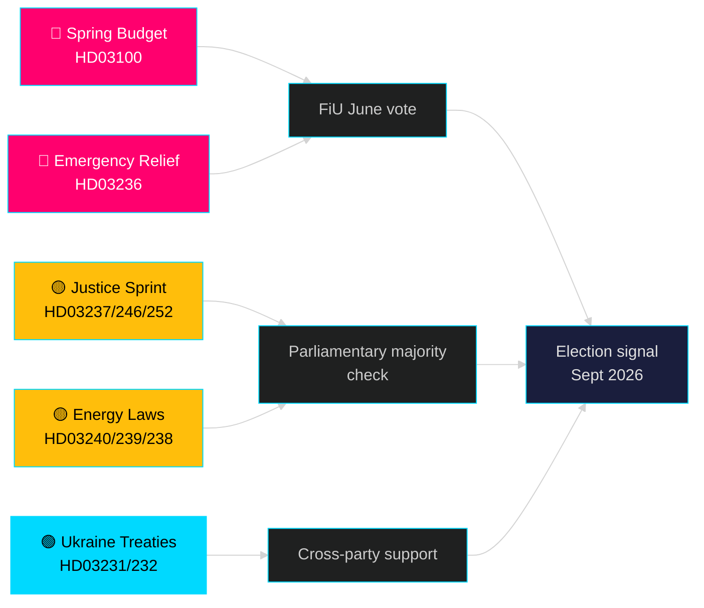

<!-- dir: rtl -->
# החודש הקרוב — מאי 2026: שוודיה בנקודת מפנה טרום-בחירות

**מחבר**: James Pether Sörling | **סיווג**: ציבורי | **תאריך**: 2026-04-25 | **רמת ביטחון**: HIGH

## 🎯 מסקנה

שוודיה נכנסת למאי 2026 כאשר ממשלת טידו מציגה את חבילת החקיקה הגדולה ביותר שלה לפני הבחירות: תקציב האביב 2026 (HD03100) המתחזה להתאוששות כלכלית מתמשכת אך איטית, חבילת חירום לצמצום עלויות הדלק והאנרגיה (HD03236) ומרוץ חקיקתי של 19 הצעות בתחומי המשפט, האנרגיה, הסביבה והמדיניות החוץ. עם בדיוק חמישה חודשים עד הבחירות (ספטמבר 2026), הסיכון הפוליטי ממוקד בבירור סביב הסנטימנט הכלכלי — האם הפחתות העלויות לבתי האב יגיעו בזמן להשפיע על העדפות הבוחרים — ועל אמינות הממשלה ברפורמות שלטון החוק שעמדו במרכז מנדט קואליציית טידו מאז 2022.

## 🧭 3 החלטות שסיכום זה תומך בהן

1. **הערכת סיכון כלכלי**: האם על הגורמים לתמחר סיכון מוגבר לאי-יציבות פוליטית לפני בחירות ספטמבר 2026, לאור המיתון המתמשך וחבילת הסיוע החירומית?
2. **מעקב אחר צינור החקיקה**: אילו מבין 19 ההצעות הנוכחיות נושאות את הסיכון הגבוה ביותר לעיכוב על ידי האופוזיציה או חסימה בוועדה לפני חופשת הקיץ (יוני 2026)?
3. **יציבות הקואליציה**: האם הפחתות מס הדלק (HD03236) מאותתות על לחץ SD על הממשלה, וכיצד זה משנה את אריתמטיקת הקואליציה לקראת הקמפיין הבחירותי?

## קריאת מודיעין של 60 שניות

- 🔴 **תקציב האביב 2026 (HD03100)** — מסגרת תקציב האביב מתחזה להתאוששות איטית; המיתון נמשך יותר מהתחזית הקודמת. הממשלה מכוונת לצמיחה, רווחה, ביטחון. סקירת FiU ביוני.
- 🔴 **סיוע חירום לדלק ואנרגיה (HD03236)** — הפחתת מס דלק + תמיכה במחיר חשמל/גז; אות מחזור בחירות בצד התקציב. העלות מוערכת במיליארדים SEK.
- 🟡 **מרוץ משפטי**: הכשרת משטרה בתשלום (HD03237), כללי נוער מחמירים יותר (HD03246), איסור ביטוח סוציאלי לכלואים (HD03252) — מסירות מנדט הליבה של M/SD.
- 🟡 **מעבר אנרגטי**: חוק מערכת חשמל חדש (HD03240), הכנסות אנרגיית רוח לעיריות (HD03239), רשות הערכת סביבה חדשה (HD03238).
- 🟢 **אחריות אוקראינה**: שוודיה מצטרפת לבית דין לתוקפנות (HD03231) ולוועדת פיצויים (HD03232) — קונצנזוס בין-מפלגתי בפוליטיקה חוץ.
- 🔵 **ביטול רגולציה ביערות (HD03242)** — הצבעה שנויה במחלוקת של ברית/כפרית; התנגדות MP/S/V.

## אות מרכזי מבט-קדימה למאי

> **טריגר**: הצבעת ועדת האוצר (FiU) על תקציב האביב 2026 (HD03100) ותקציב תיקוני משלים (HD03236) — צפויה בסוף מאי / תחילת יוני. דו"ח ועדה שלילי או וטו SD על מדיניות המס יהיה האירוע הבעל משמעות פוליטית הגבוהה ביותר לפני חופשת הקיץ.

## הצהרת ביטחון

**HIGH** [B2] — מבוסס על 20 הצעות ממשלה ומסמכים מאומתים מ-data.riksdagen.se, riksmöte 2025/26.

<!-- source-sha: 91eb3cb6cf35873538b354461078df4509cf0012 -->
