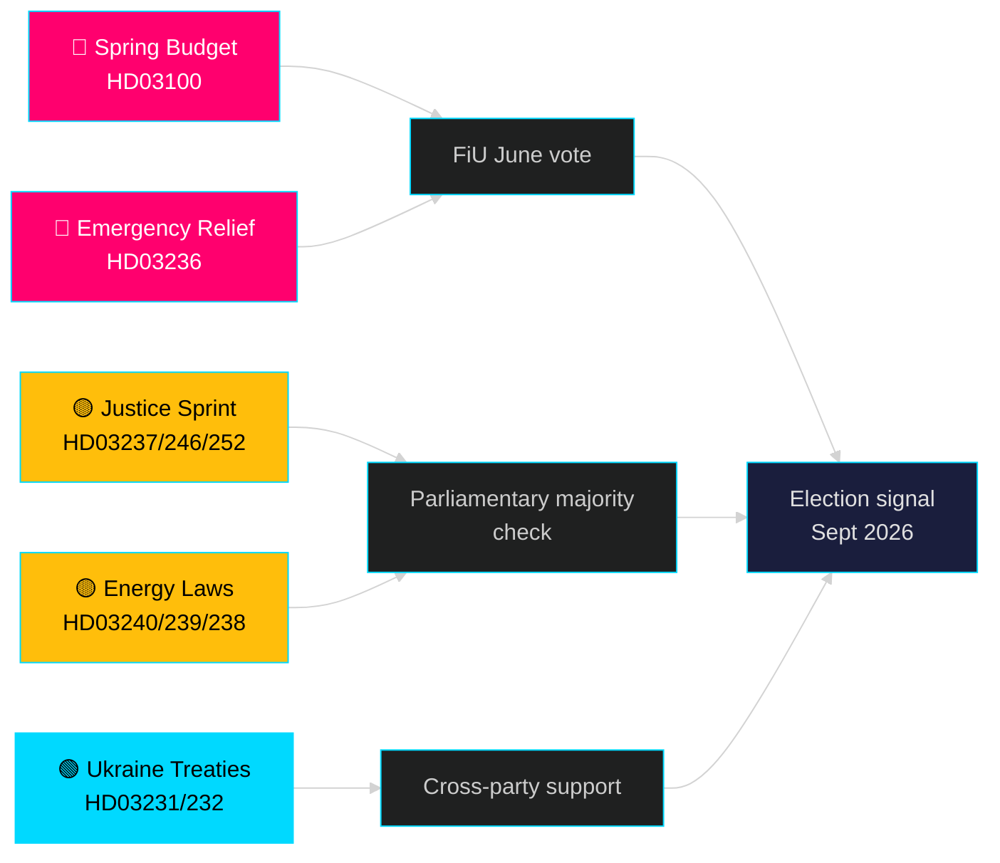

# 翌月展望 — 2026年5月：スウェーデン、選挙前の転換点に立つ

**著者**: James Pether Sörling | **分類**: 公開 | **日付**: 2026-04-25 | **信頼レベル**: HIGH

## 🎯 結論

スウェーデンは2026年5月に突入する。Tidö政権が最大の選挙前立法パッケージを展開している：2026年春季予算（HD03100）は継続的だが緩慢な経済回復を予測し、燃料・エネルギーコスト削減緊急パッケージ（HD03236）と司法・エネルギー・環境・外交の分野における19提案の立法スプリントも実施中だ。選挙まで正確に5ヶ月（2026年9月）を残し、政治的リスクは経済センチメントに確実に集中している——家計のコスト削減が有権者の選好を変えるのに間に合うかどうか——そして、2022年以来Tidö連立政権の中核を担ってきた法の支配改革における政府の信頼性にも。

## 🧭 このブリーフィングが支持する3つの判断

1. **経済リスク評価**: 長引く景気後退と緊急支援パッケージを踏まえ、2026年9月選挙に向けて政治的不安定リスクの高まりをアクターは織り込むべきか？
2. **立法パイプラインの追跡**: 現在の19の提案のうち、夏季休暇（2026年6月）前に野党による遅延や委員会封鎖のリスクが最も高いのはどれか？
3. **連立の安定性**: 燃料税引き下げ（HD03236）はSD（スウェーデン民主党）の政府への圧力を示しているか？そしてそれは選挙キャンペーンに向けた連立の算術をどう変えるか？

## 60秒インテリジェンス読解

- 🔴 **2026年春季予算（HD03100）** — 春季予算枠組みは緩慢な回復を予測；景気後退は以前の予測より長引く。政府は成長・福祉・安全を目指す。6月にFiUが審査。
- 🔴 **燃料・エネルギー緊急支援（HD03236）** — 燃料税引き下げ＋電力/ガス価格支援；予算サイドの選挙サイクルシグナル。費用は数十億SEK規模と推算。
- 🟡 **司法スプリント**: 有給警察訓練（HD03237）、若者規則の厳格化（HD03246）、受刑者への社会保険禁止（HD03252）——M/SDのコアマンデート実施。
- 🟡 **エネルギー転換**: 新電力システム法（HD03240）、自治体への風力発電収益（HD03239）、新環境評価機関（HD03238）。
- 🟢 **ウクライナへの説明責任**: スウェーデンが侵略罪法廷（HD03231）と損害賠償委員会（HD03232）に参加——外交政策での超党派的支持。
- 🔵 **林業規制緩和（HD03242）** ——アライアンス/農村票での論争；MP/S/Vの反対。

## 5月の最重要前向きシグナル

> **トリガー**: 財政委員会（FiU）による2026年春季予算（HD03100）と追加補正予算（HD03236）の採決——5月末〜6月初旬を予定。委員会の否定的報告またはSDによる税政策への拒否権は、夏季休暇前の最も重要な政治的単一事象となる。

## 信頼性声明

**HIGH** [B2] — data.riksdagen.seから20の検証済み政府提案と文書に基づく。riksmöte 2025/26。

<!-- source-sha: 91eb3cb6cf35873538b354461078df4509cf0012 -->
