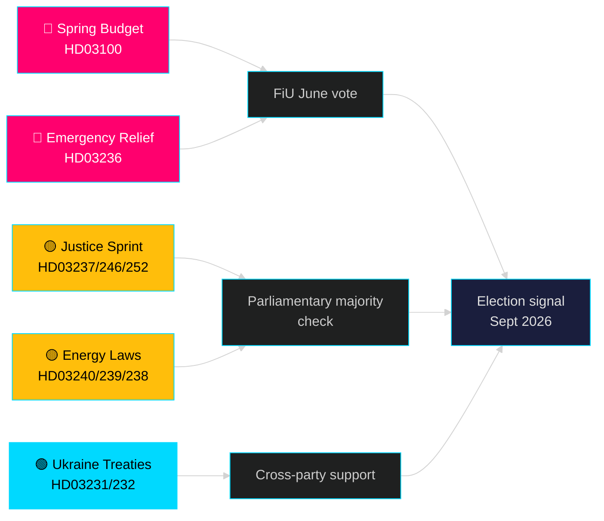

# 다음 달 — 2026년 5월: 스웨덴, 선거 전 변곡점에 서다

**저자**: James Pether Sörling | **분류**: 공개 | **날짜**: 2026-04-25 | **신뢰 수준**: HIGH

## 🎯 결론

스웨덴은 2026년 5월에 접어들며 티도 정부가 최대 규모의 선거 전 입법 패키지를 전개하고 있다: 지속적이지만 완만한 경제 회복을 전망하는 2026 봄 예산(HD03100), 연료 및 에너지 비용 절감 긴급 패키지(HD03236), 그리고 사법·에너지·환경·외교 분야의 19개 법안 입법 스프린트. 선거까지 정확히 5개월(2026년 9월)이 남은 시점에서 정치적 위험은 확실히 경제적 심리에 집중되어 있다——가계 비용 절감이 유권자 선호에 영향을 미칠 만큼 적시에 도착할 것인가——그리고 2022년 이후 티도 연립의 핵심 의제를 구성해온 법치 개혁에서 정부의 신뢰성에도 집중되어 있다.

## 🧭 이 브리핑이 지원하는 3가지 결정

1. **경제적 위험 평가**: 장기화된 침체와 긴급 지원 패키지를 감안할 때, 2026년 9월 선거를 앞두고 행위자들이 증가된 정치적 불안정 위험을 가격에 반영해야 하는가?
2. **입법 파이프라인 추적**: 현재 19개 법안 중 여름 휴가(2026년 6월) 전에 야당의 지연이나 위원회 봉쇄 위험이 가장 높은 것은 무엇인가?
3. **연립 안정성**: 연료세 삭감(HD03236)은 정부에 대한 SD의 압력을 나타내는가, 그리고 이것이 선거 캠페인을 향한 연립 산술을 어떻게 변화시키는가?

## 60초 정보 브리핑

- 🔴 **2026 봄 예산(HD03100)** — 봄 예산 프레임워크는 완만한 회복을 전망; 침체가 이전 예측보다 더 오래 지속. 정부는 성장·복지·안보를 지향. 6월에 FiU 검토.
- 🔴 **연료 및 에너지 긴급 지원(HD03236)** — 연료세 인하 + 전기/가스 가격 지원; 예산 측면의 선거 주기 신호. 비용은 수십억 SEK로 추산.
- 🟡 **사법 스프린트**: 유급 경찰 훈련(HD03237), 청소년 규정 강화(HD03246), 수감자 사회보험 금지(HD03252) — M/SD 핵심 공약 이행.
- 🟡 **에너지 전환**: 새로운 전력 시스템법(HD03240), 지방자치단체 풍력 수익(HD03239), 새로운 환경 평가 기관(HD03238).
- 🟢 **우크라이나 책임**: 스웨덴이 침략 재판소(HD03231) 및 손해배상위원회(HD03232)에 참여 — 외교 정책에 관한 초당적 합의.
- 🔵 **삼림 규제 완화(HD03242)** — 연합/농촌 투표 논란; MP/S/V 반대.

## 5월 주요 전망 신호

> **트리거**: 재정위원회(FiU)의 2026 봄 예산(HD03100) 및 추가 수정 예산(HD03236) 투표 — 5월 말/6월 초 예정. 부정적인 위원회 보고서나 세금 정책에 대한 SD의 거부권은 여름 휴가 전 가장 정치적으로 중요한 단일 사건이 될 것이다.

## 신뢰성 선언

**HIGH** [B2] — data.riksdagen.se에서 20개의 검증된 정부 법안 및 서신 기반. riksmöte 2025/26.

<!-- source-sha: 91eb3cb6cf35873538b354461078df4509cf0012 -->
