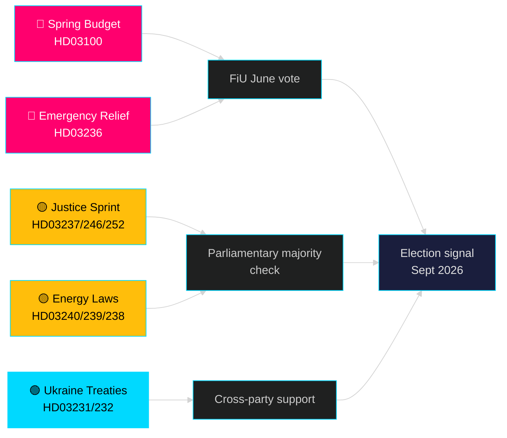

# De komende maand — mei 2026: Zweden op het pre-electorale inflectiepunt

**Auteur**: James Pether Sörling | **Classificatie**: PUBLIC | **Datum**: 2026-04-25 | **Betrouwbaarheidsniveau**: HIGH

## 🎯 Conclusie

Zweden treedt mei 2026 in terwijl de Tidö-regering haar grootste pre-verkiezingswetgevingspakket uitrolt: het voorjaarssbudget 2026 (HD03100) dat aanhoudend maar langzaam economisch herstel projecteert, een noodpakket voor brandstof- en energiekostenreductie (HD03236) en een wetgevingssprint van 19 proposities op het gebied van justitie, energie, milieu en buitenlands beleid. Met exact vijf maanden tot de verkiezingen (september 2026) is het politieke risico definitief gecentreerd op het economisch sentiment — of kostenverlagingen voor huishoudens op tijd aankomen om kiezersvoorkeuren te beïnvloeden — en op de geloofwaardigheid van de regering bij rechtsstaatvormingen die het kernmandaat van de Tidö-coalitie vormen sinds 2022.

## 🧭 3 beslissingen die dit briefing ondersteunt

1. **Beoordeling van economisch risico**: Moeten actoren verhoogd politiek instabiliteitsrisico inprijzen voor de verkiezingen van september 2026, gezien de verlengde recessie en het noodhulppakket?
2. **Bijhouden van de wetgevingspijplijn**: Welke van de 19 lopende proposities dragen het grootste risico van oppositionele vertraging of commissieblokkering voor de zomervakantie (juni 2026)?
3. **Coalitie-stabiliteit**: Signaleren de brandstofbelastingverlagingen (HD03236) SD-druk op de regering, en hoe verandert dat de coalitie-aritmetica richting de verkiezingscampagne?

## 60-seconden inlichtingenoverzicht

- 🔴 **Voorjaarsbudget 2026 (HD03100)** — Het voorjaarsbudgetkader projecteert langzaam herstel; recessie duurt langer dan eerdere prognose. Regering streeft naar groei, welzijn, veiligheid. FiU-evaluatie in juni.
- 🔴 **Noodhulp brandstof en energie (HD03236)** — Verlaagde brandstofbelasting + ondersteuning elektriciteits-/gasprijzen; verkiezingscyclussignaal aan budgetzijde. Kosten geraamd op meerdere miljarden SEK.
- 🟡 **Justitie-sprint**: Betaalde politieopleiding (HD03237), strengere jeugdregels (HD03246), verbod op sociale zekerheid voor gedetineerden (HD03252) — kernmandaatuitvoering van M/SD.
- 🟡 **Energietransitie**: Nieuwe wet elektriciteitsysteem (HD03240), windenergie-inkomsten voor gemeenten (HD03239), nieuwe milieu-evaluatieautoriteit (HD03238).
- 🟢 **Oekraïense aansprakelijkheid**: Zweden sluit zich aan bij aggressietribunaal (HD03231) en schadevergoedingscommissie (HD03232) — multipartij buitenlands beleid consensus.
- 🔵 **Bosbouwderegulering (HD03242)** — omstreden Alliantie/landelijk stemming; MP/S/V-weerstand.

## Belangrijkste vooruitzichtssignaal voor mei

> **Trigger**: Stemming van de financiëncommissie (FiU) over het Voorjaarsbudget 2026 (HD03100) en aanvullend wijzigingsbudget (HD03236) — verwacht laat mei / vroeg juni. Een negatief commissierapport of een SD-veto over belastingbeleid zou de politiek meest significante gebeurtenis zijn voor de zomervakantie.

## Betrouwbaarheidsverklaring

**HIGH** [B2] — Gebaseerd op 20 geverifieerde regeringsproposities en communicaties van data.riksdagen.se, riksmöte 2025/26.

<!-- source-sha: 91eb3cb6cf35873538b354461078df4509cf0012 -->
